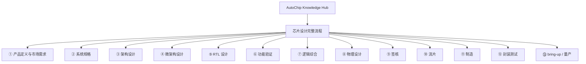

# AutoChip Knowledge Hub

AutoChip Knowledge Hub 是 AutoChip 项目的学习资料与新人入门中心。这个仓库用于集中存放项目成员需要学习的知识材料，尤其是那些可以直接通过浏览器打开的网页型学习文档。

仓库的核心目标很简单：**让新加入 AutoChip 的成员拿到一个链接，就能系统地学习项目相关的基础知识、工程流程和背景概念。**

当前已经发布的学习页面：

| 学习模块 | 网页入口 | 适合对象 |
| --- | --- | --- |
| 芯片设计完整流程 | [打开网页](https://autochip-lab.github.io/Knowledge-Hub/chip-design-flow/) | 对芯片设计流程还不熟悉、需要建立完整工程地图的新成员 |

仓库地址：

```text
https://github.com/AutoChip-Lab/Knowledge-Hub
```

## 项目定位

AutoChip 关注的是 **Agentic AI for End-to-End Chip Design**，也就是用多个专门化的 AI Agent 参与芯片设计全流程。

在长期设想中，AutoChip 会覆盖芯片设计中的多个环节，例如：

- 架构探索与设计空间分析
- RTL 生成、修复与模块集成
- 功能验证、测试平台生成与 bug 定位
- 逻辑综合与综合后优化
- 物理设计、PPA 分析与后端流程自动化
- benchmark、数据集与评测体系
- agent 系统的记忆管理、工具调用、任务规划与协同机制

Knowledge Hub 是这个体系中的“学习入口层”。它不直接承载核心代码，而是帮助成员先建立共识：

- 芯片设计到底有哪些阶段
- 每个阶段解决什么问题、产出什么东西
- 哪些知识是设计 Agent 时必须理解的
- AutoChip 后续每个 Agent 会落在全流程中的哪个位置
- 新成员应该从哪里开始读、如何逐步补齐背景知识

## 当前知识地图



## 仓库结构

```text
Knowledge-Hub/
  README.md
  docs/
    .nojekyll
    chip-design-flow/
      index.html
      content.js
      cases.js
      secmaps.js
      assets/
        marked.min.js
      01-产品定义与市场需求.md
      02-系统规格.md
      ...
      13-bring-up量产.md
      build.py
      assemble_cases.py
      cases_frag/
      wf_cases*.js
```

## 目录说明

### `docs/`

`docs/` 是 GitHub Pages 的发布目录。

如果仓库的 GitHub Pages 设置为：

```text
Branch: main
Folder: /docs
```

那么 GitHub 会把 `docs/` 作为网站根目录发布。也就是说：

```text
docs/
```

对应网页根入口：

```text
https://autochip-lab.github.io/Knowledge-Hub/
```

后续每一个新的学习模块都可以放在 `docs/` 下的独立文件夹中。只要该文件夹里有 `index.html`，就可以通过浏览器链接直接访问。

### `docs/.nojekyll`

`.nojekyll` 用来告诉 GitHub Pages：这个仓库是普通静态网页，不需要经过 Jekyll 处理。

这样可以减少静态资源路径、自动生成文件、下划线目录等方面的潜在问题。对于这类直接发布 HTML / CSS / JavaScript 的资料型网站，保留 `.nojekyll` 是比较稳妥的做法。

### `docs/chip-design-flow/`

这是当前已经完成并发布的第一个学习模块：**芯片设计完整流程**。

网页入口：

```text
https://autochip-lab.github.io/Knowledge-Hub/chip-design-flow/
```

这个模块用交互式网页的形式讲解一颗芯片从想法到量产的大致流程：

```text
产品定义
  -> 系统规格
  -> 架构设计
  -> 微架构设计
  -> RTL 设计
  -> 功能验证
  -> 逻辑综合
  -> 物理设计
  -> 签核
  -> 流片
  -> 制造
  -> 封装测试
  -> bring-up / 量产
```

这个模块的作用不是把每个环节都讲成专家级教程，而是帮助新成员先建立一张全局地图。理解这张地图之后，后续再看 AutoChip 的 architecture agent、verification agent、RTL agent、physical-design agent，会更容易知道每个 agent 在全流程中的位置和价值。

## `chip-design-flow` 文件说明

### 网页运行必需文件

这些文件是浏览器打开网页时真正需要加载的运行文件：

| 文件 | 作用 |
| --- | --- |
| `index.html` | 网页主入口，包含页面结构、样式、导航逻辑和交互逻辑。 |
| `content.js` | 由 Markdown 章节生成的内容数据，网页通过它加载正文。 |
| `cases.js` | 交互案例数据，包含案例图、案例说明和分步展示信息。 |
| `secmaps.js` | 各章节核心内容之间的流程关系图数据。 |
| `assets/marked.min.js` | 浏览器端 Markdown 渲染库，用于把章节内容转成 HTML。 |

最小可运行结构如下：

```text
docs/chip-design-flow/
  index.html
  content.js
  cases.js
  secmaps.js
  assets/
    marked.min.js
```

如果只是想让网页能被别人访问，至少要保证这些文件在同一个模块目录中，并且路径关系不被破坏。

### 章节源文件

这些 Markdown 文件是芯片设计流程学习模块的源内容：

| 文件 | 内容主题 |
| --- | --- |
| `01-产品定义与市场需求.md` | 芯片立项前的产品定义、市场需求、目标客户和商业判断 |
| `02-系统规格.md` | 如何把产品目标翻译成工程可执行的系统规格 |
| `03-架构设计.md` | 芯片架构层面的模块划分、数据流、存储层次和系统权衡 |
| `04-微架构设计.md` | 将架构细化为流水线、状态机、缓冲、控制逻辑等可实现结构 |
| `05-RTL设计.md` | 使用硬件描述语言实现可综合 RTL 的基本思路 |
| `06-功能验证.md` | 验证芯片功能正确性的流程、方法和常见验证对象 |
| `07-逻辑综合.md` | 将 RTL 转换为门级网表并进行时序、面积、功耗优化 |
| `08-物理设计.md` | floorplan、placement、CTS、routing 等后端实现步骤 |
| `09-签核.md` | STA、功耗、EM/IR、物理验证、等价性检查等 tape-out 前检查 |
| `10-流片.md` | tape-out 前后的交付物、掩模、制造准备和工程风险 |
| `11-制造.md` | 晶圆制造流程及其与设计、良率、工艺节点之间的关系 |
| `12-封装测试.md` | 封装、晶圆测试、成品测试、binning 与可靠性筛选 |
| `13-bring-up量产.md` | 回片点亮、硅验证、软件 bring-up、良率爬坡和量产交付 |

这些文件适合做内容维护。如果要修改网页正文，通常应该先改 Markdown 源文件，再重新生成对应的 JavaScript 数据文件。

### 构建与生成文件

这些文件用于把源内容整理成网页可以直接加载的数据：

| 文件或目录 | 作用 |
| --- | --- |
| `build.py` | 从 Markdown 章节生成 `content.js`。 |
| `assemble_cases.py` | 将 `cases_frag/` 中的案例片段合并为 `cases.js`。 |
| `cases_frag/` | 交互案例的源数据片段。 |
| `wf_cases*.js` | 用于组织或生成案例内容的辅助脚本。 |

这些文件不一定是网页运行时直接加载的文件，但对长期维护很重要。保留它们可以让后续成员继续扩展内容，而不是只能修改已经生成好的 `content.js` 和 `cases.js`。

## 新成员建议阅读方式

建议按下面顺序使用当前模块：


如果你后续要做某个具体 Agent，可以重点关注对应流程段：

| 未来 Agent 方向 | 建议重点阅读 |
| --- | --- |
| Architecture Agent | ① 产品定义、② 系统规格、③ 架构设计、④ 微架构设计 |
| RTL Agent | ③ 架构设计、④ 微架构设计、⑤ RTL 设计 |
| Verification Agent | ② 系统规格、⑤ RTL 设计、⑥ 功能验证 |
| Synthesis / Backend Agent | ⑤ RTL 设计、⑦ 逻辑综合、⑧ 物理设计、⑨ 签核 |
| Tapeout / Bring-up Assistant | ⑨ 签核、⑩ 流片、⑪ 制造、⑫ 封装测试、⑬ bring-up / 量产 |

## 如何添加新的学习模块

后续如果要加入新的网页型资料，建议每个主题一个独立目录：

```text
docs/
  new-learning-topic/
    index.html
    assets/
    ...
```

对应访问链接会是：

```text
https://autochip-lab.github.io/Knowledge-Hub/new-learning-topic/
```

新增模块时建议遵守：

- 每个模块独立成文件夹。
- 每个模块的入口文件命名为 `index.html`。
- 模块内 CSS、JavaScript、图片、字体等资源尽量使用相对路径。
- 如果有源文件和生成文件，尽量在目录说明中写清楚。
- 新模块发布后，及时更新本 README。

## 当前状态

当前仓库已经包含并发布：

```text
docs/chip-design-flow/
```

其他学习模块暂未加入，因此 README 目前只列出这个已存在的模块。
