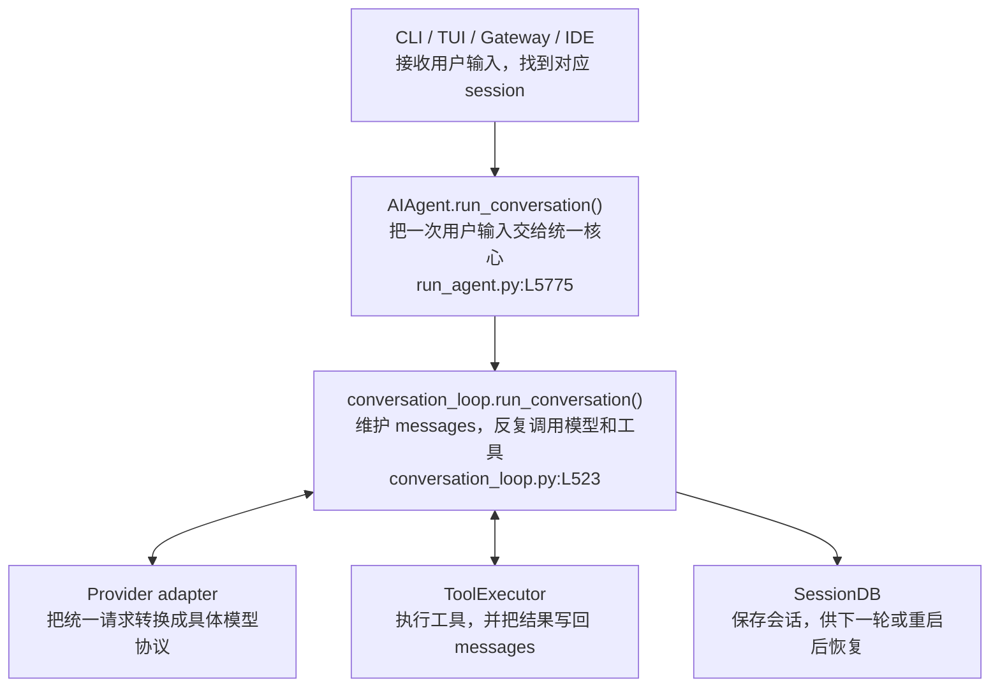

# Hermes 的核心到底是什么

先说结论：Hermes 的核心就是一个共享的 `AIAgent`，里面最重要的是 `run_conversation()` 模型—工具循环。

CLI、TUI、消息平台和 IDE 看起来是不同产品，但它们主要负责接收输入和展示结果。真正决定“这轮对话怎么跑”的，仍然是同一个 Agent core。

## 1. 一条最简单的调用链



不管输入来自哪里，进入 `run_conversation()` 之后，核心数据流基本相同：

```text
用户输入 + 旧会话
  → messages
  → 调用模型
  → 模型返回文本或 tool_calls
  → 执行工具并把结果追加到 messages
  → 再次调用模型
  → 得到最终回复并保存会话
```

第 2 章会沿着源码详细展开这条 loop。

## 2. 五部分各自负责什么

| 部分 | 主要职责 | 不负责什么 |
|---|---|---|
| 入口 | 接收消息、鉴权、选择 session、展示流式结果 | 不重新实现 Agent loop |
| `AIAgent` | 保存配置和运行状态，提供 `run_conversation()` | 不直接实现所有外部能力 |
| Conversation loop | 组装 context、调用模型、执行工具、控制预算和压缩 | 不关心 Telegram 或 TUI 怎样显示 |
| Tools / MCP / Plugins | 读文件、跑命令、浏览网页、连接外部系统 | 不拥有主会话流程 |
| SessionDB / Memory / Skills | 保存会话、长期事实和可复用流程 | 不代替当前 `messages` 做实时推理 |

整体结构就是：中间是一条稳定的 Agent 运行链，上面接不同入口，下面接不同模型、工具和状态系统。

## 3. Core 里面真正统一的东西

### 统一 `messages`

模型看到的 user、assistant、tool call 和 tool result，最终都围绕同一份 `messages` 变化。不同入口不维护各自的对话格式。

### 统一模型—工具循环

模型要么返回最终文本，要么请求工具。工具结果写回 `messages` 后，继续调用模型。CLI 和 Gateway 不需要各写一套循环。

### 统一运行控制

以下行为也放在同一条 core loop 中：

- 最大迭代次数和共享预算；
- 用户中断；
- context compression；
- provider fallback；
- turn 结束后的持久化和 background review。

## 4. 为什么说 Core 比较轻

Core 主要做编排，不负责实现所有能力：

```text
Core 决定：
  现在该把哪些 messages 发给模型？
  模型要调用哪个工具？
  工具结果怎样回到下一轮？
  什么时候结束、压缩或持久化？

边缘模块负责：
  Telegram 消息怎样收发？
  Anthropic/OpenAI 请求怎样编码？
  浏览器、终端、MCP 工具怎样执行？
  Memory 和 Skills 怎样落盘？
```

因此可以把 Hermes 理解成：一个不大的 Agent loop，加上一组围绕真实模型和真实运行环境积累的规则与扩展。复杂度很高，但多数复杂度位于 provider、工具、入口和状态边界，不需要全部塞进 core abstraction。

## 5. 为什么新能力通常放在边缘

每增加一个 core tool，它的 schema 都可能跟随每次模型请求，占用 context 并影响 prompt cache。Hermes 因此优先选择：

```text
扩展现有工具
  → CLI command + Skill
  → 按配置启用的工具
  → Plugin / MCP
  → 最后才考虑新增 core tool
```

这样可以让入口、模型和能力不断增加，同时保持 `run_conversation()` 这条主链相对稳定。

## 6. 后面四章分别讲什么

- **第 2 章，执行闭环：** `messages` 怎样一步步变成模型请求，工具结果怎样写回来。
- **第 3 章，Memory 与自改进：** 前台和后台 Agent 怎样通过工具更新长期知识。
- **第 4 章，工具与子代理：** 什么时候直接调用工具，什么时候运行代码或创建 Child Agent。
- **第 5 章，会话存储：** `messages` 怎样增量写入 SessionDB，压缩后的历史怎样恢复和搜索。

一句话记住第一章：

> 多个入口共享一个 `AIAgent`；`run_conversation()` 负责循环，模型、工具和状态能力都挂在这条循环的边缘。
