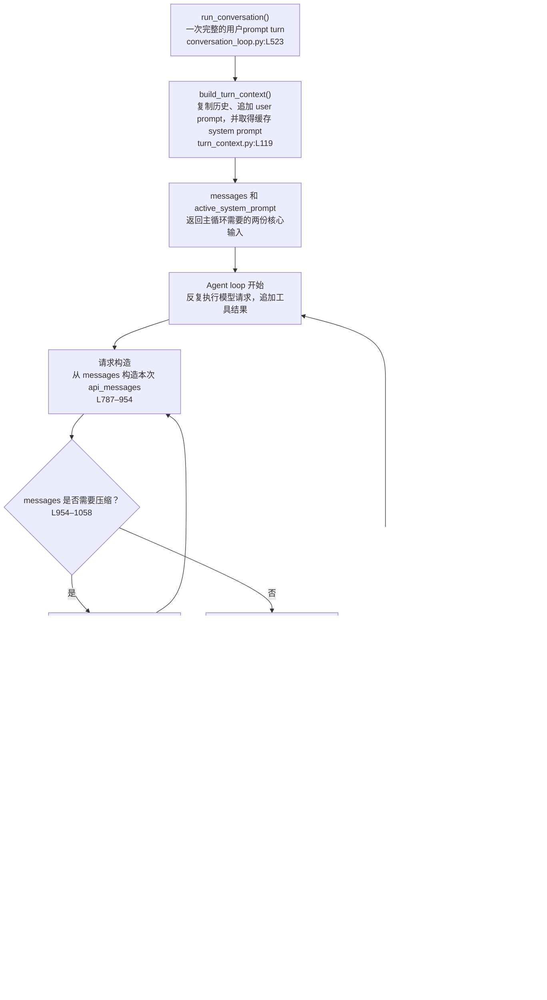
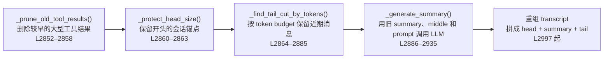

# `run_conversation()`：一次 turn 怎样完成

Hermes core 的主干很短：准备本轮 context，循环调用模型和工具，最后收尾。教学时始终区分三份数据：

| 数据 | 含义 | 是否持久化 |
|---|---|---|
| `messages` | 当前会话的 canonical transcript，loop 的核心状态 | 是 |
| `active_system_prompt` | 当前 session 冻结的 system prompt | 随 session 保存 |
| `api_messages` | 某一次模型请求从前两者投影出的临时副本 | 否 |

## 1. 总流程



真正推动循环的只有 `messages`：模型输出和工具结果不断追加进去，下一轮再据此重建请求。

## 2. `build_turn_context()` 做什么

入口在 `agent/conversation_loop.py:L592–622`，实现位于 `agent/turn_context.py:L119–562`。与 context 直接相关的工作是：

```text
conversation_history
  → 浅复制成 messages                         L271–272
  → 恢复 todo 和周期计数                      L274–314
  → 追加本轮 user message                     L316–320
  → 恢复或首次构建 _cached_system_prompt       L329–333
  → 提前持久化 inbound user                    L335–347
  → 必要时执行 turn 开始前的 preflight 压缩    L350–460
  → 取得 plugin context / external recall
  → 返回 TurnContext                          L553–562
```

所以它不是直接返回“最终 API 请求”，而是返回 loop 的工作状态：`messages`、`active_system_prompt`、当前 user 的位置，以及只供本轮请求使用的动态 context。

## 3. `messages` 怎样变成模型请求

每次 loop 都重新投影，核心代码在 `agent/conversation_loop.py:L787–954`：

```text
messages
  → 逐条 copy 为 api_messages
  → 仅在当前 user 副本追加 external memory / plugin context
  → 前置 active_system_prompt + ephemeral_system_prompt
  → 插入可选 prefill
  → 与 tools 一起形成最终请求
```

关键边界是：动态 recall 和 plugin context 只进入 `api_messages`，不改用户原话，也不写进 SessionDB；system prompt 通常也不在 `messages` 中，而是在每次请求前临时加到最前面。

## 4. 三个压缩检查点

为了避免一轮内新增的大型 tool result 撑爆 context，压缩不是只检查一次：

1. **Turn 开始前**：`turn_context.py:L350–460`，检查“历史 + 新 user + system + tools”。
2. **API 请求前**：`conversation_loop.py:L954–1058`，检查刚拼好的完整请求；压缩后丢弃这份 `api_messages`，从新 `messages` 重建。
3. **工具执行后**：`conversation_loop.py:L4733–4778`，结合 provider 报告的真实 prompt tokens 再检查。

API 的 context-overflow 恢复也可能触发压缩，但属于异常恢复，不是理解主循环所必需的分支。

### 压缩调用链

```text
AIAgent._compress_context()                    run_agent.py:L5608
  → conversation_compression.compress_context()  conversation_compression.py:L435
  → agent.context_compressor.compress()          conversation_compression.py:L638
  → ContextCompressor.compress()                  context_compressor.py:L2793
```

传入底层算法的核心参数是：

```python
compress(
    messages,
    current_tokens=approx_tokens,
    focus_topic=focus_topic,
    force=force,
)
```

### 五阶段算法



已有 handoff summary 时，它会和本次新增的中间段一起进入同一次总结请求，形成迭代更新。压缩结果会真正替换 `messages`，随后同步 SessionDB，并重建本次请求；它不是只缩短临时的 `api_messages`。

## 5. 模型结果怎样回到 `messages`

模型返回 tool calls 时：

```text
assistant(tool_calls) → messages               conversation_loop.py:L4660
先增量持久化 tool-call block                   L4662–4667
agent._execute_tool_calls(...)                  L4688
tool results → 同一个 messages                  tool_executor.py:L918–962
必要时压缩                                     L4733–4778
continue agent loop                             L4780–4784
```

模型没有调用工具时，最终 assistant message 写入 `messages`，然后 `break`：`agent/conversation_loop.py:L4786–5234`。

## 6. `finalize_turn()`

所有 loop 出口汇入 `agent/turn_finalizer.py:L30`。核心职责是：

- 清理临时恢复消息，保证 transcript 以合法 assistant turn 结束；
- 把最终 `messages` 持久化到 SessionDB；
- 生成包含 `final_response`、`messages`、usage 和 session 信息的返回值；
- 同步 external memory，并在满足条件时启动第 3 章的后台 review。

最终的数据闭环是：

```text
本轮 result["messages"]
  → SessionDB / 调用方保存
  → 下一轮 conversation_history
  → build_turn_context()
  → 新的 messages
```
