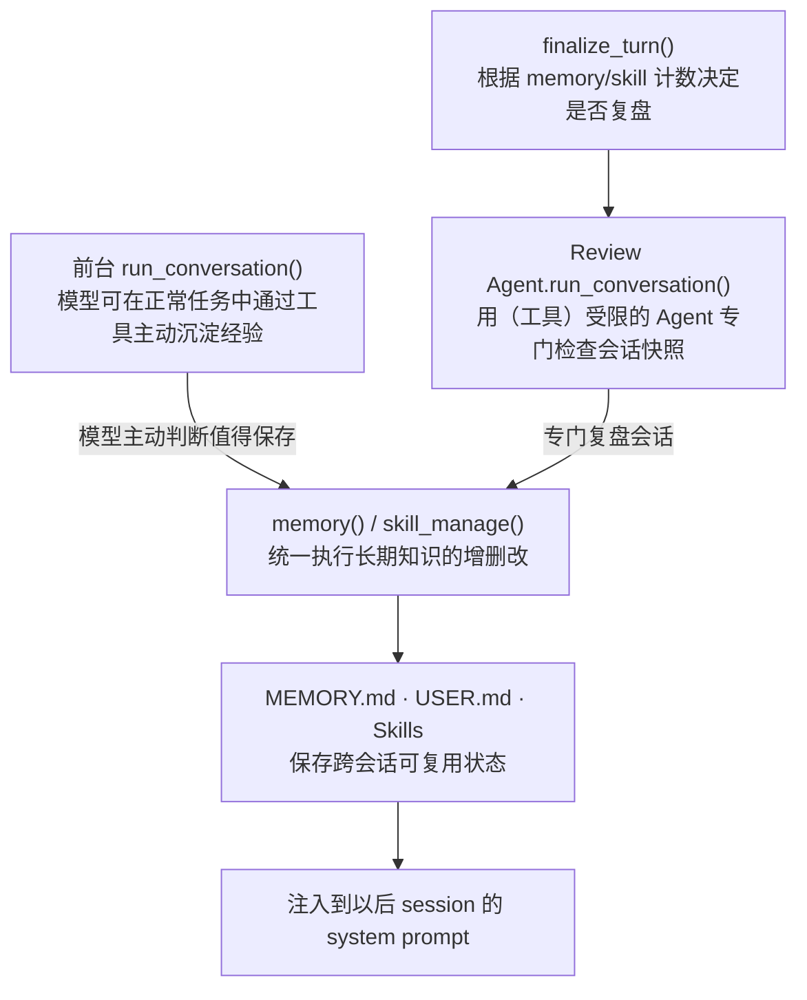
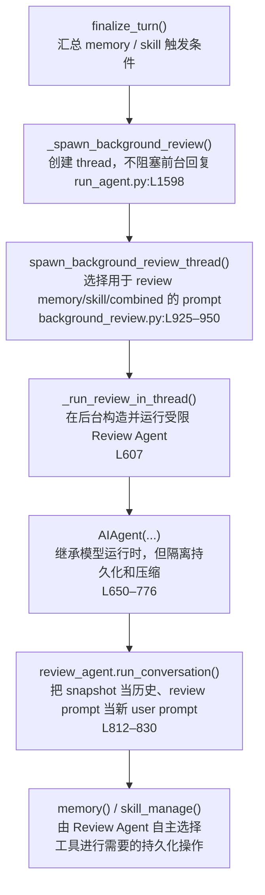

# Memory 与 Skill 怎样自我更新

Hermes 的自改进不是另一套运行时。它只是周期性启动一个受限的 `AIAgent`，重放会话并让它通过普通工具整理 Memory 或 Skills。

## 1. 两种写入路径



无论前台还是后台，最终都必须调用工具；review 代码不会绕过工具直接改文件。

## 2. 两个周期触发器

### Memory：按用户 turn 计数

`build_turn_context()` 每接收一次用户 turn，就递增 `_turns_since_memory`。达到 `_memory_nudge_interval` 后设置 `should_review_memory=True`，并把计数清零：`agent/turn_context.py:L278–314`。

### Skill：按 Agent loop iteration 计数

每进入一次模型循环，`_iters_since_skill` 加一：`agent/conversation_loop.py:L680–684`。它统计的是 API/Agent iteration，不严格等于实际 tool call 数。`finalize_turn()` 在达到 `_skill_nudge_interval` 且 `skill_manage` 可用时设置 skill review：`agent/turn_finalizer.py:L454–460`。

最后只有在本轮存在最终回复、没有中断，并且至少一个 trigger 成立时，才启动后台 review：`agent/turn_finalizer.py:L470–480`。

## 3. Background Review 主链



`_run_review_in_thread()` 的输入只有父 Agent、`messages_snapshot` 和选好的 prompt。它的核心步骤是：

1. 继承父 Agent 当前的 provider、model、credentials 和 toolset 配置；
2. 创建 `max_iterations=16` 的新 `AIAgent`；
3. 绑定父 Agent 的内建 `MemoryStore`；
4. 用线程级白名单把实际执行权限限制为 memory/skill 工具；
5. 把父会话 snapshot 作为 `conversation_history`，把 review prompt 作为新的 user message，再次调用 `run_conversation()`；
6. 扫描本次新增的成功 tool results，向前台汇报做了哪些更新。

同模型时使用完整 snapshot 和父 Agent 的 cached system prompt，以复用 prompt cache；配置了不同的 background-review 模型时，旧历史会先变成 digest，再交给新模型：`agent/background_review.py:L734–819`。

## 4. 为什么 review 不会污染主会话

Review Agent 复用核心，但隔离生命周期：

| 设置 | 作用 | 源码 |
|---|---|---|
| `skip_memory=True` | 不把 review prompt 写入外部 memory provider | `background_review.py:L665–697` |
| `_persist_disabled=True` | 不把 review 对话写入父 SessionDB | `L712–725` |
| nudge interval = 0 | 不递归触发另一个 review | `L707–711` |
| `compression_enabled=False` | 不与父会话争抢压缩和 session rotation | `L766–776` |
| thread tool whitelist | 只允许 memory/skill 工具真正执行 | `L778–830` |

因此，review 的自然语言对话不会并回主 `messages`；只有工具造成的持久状态变化会留下来。

## 5. Memory 怎样写入和再次注入

前台 Agent 和 Review Agent 最终汇合到同一个入口：`tools/memory_tool.py:L959–1034`。

```text
memory(add / replace / remove / batch)
  → MemoryStore
  → $HERMES_HOME/memories/MEMORY.md 或 USER.md
```

- `MEMORY.md`：项目、环境、工具和长期经验。
- `USER.md`：用户偏好、习惯和稳定工作方式。

Agent 初始化时，`MemoryStore.load_from_disk()` 读取文件并生成用于 system prompt 的冻结 snapshot：`tools/memory_tool.py:L169–204`。构造 system prompt 时将它注入 memory/user 区域：`agent/system_prompt.py:L450–482`。

```text
MEMORY.md / USER.md
  → fresh AIAgent / 新 session 加载
  → frozen memory snapshot
  → build_system_prompt()
  → _cached_system_prompt
  → 后续模型请求
```

当前 session 内调用 memory 工具会立即更新文件和 live entries，但不会修改已经冻结的 snapshot，也不会改写本轮 `_cached_system_prompt`。新记忆通常从未来的新 session/fresh Agent 开始进入 system prompt。这是为了保持 prompt cache 前缀稳定。

外部 memory provider 是另一条链：每个 turn 开始时 recall，并只注入当前 `api_messages` 的 user 副本；turn 结束后同步完整 user/assistant turn。核心锚点分别是 `agent/turn_context.py:L536–551`、`agent/conversation_loop.py:L787–808` 和 `agent/turn_finalizer.py:L462–468`。

## 6. Skill 怎样写入和生效

前台或 Review Agent 调用 `skill_manage` 创建、修改或归档 agent-created skills。工具完成文件写入并使技能索引缓存失效；以后构造 system prompt 时只放入 skill 的名称和描述，模型真正需要时再通过 `skills_list()` / `skill_view()` 加载完整 `SKILL.md`。

```text
skill_manage
  → skill files
  → skill index cache 失效
  → 未来 system prompt 出现 skill 索引
  → 按需加载完整 SKILL.md
```

周期触发的 background review 负责从近期对话中提炼或修正 skill；独立 curator 负责更长期的技能治理。`agent/curator.py:L1480` 的 `run_curator_review()` 默认执行确定性审计；只有配置 `curator.consolidate: true` 或显式传入 `--consolidate`，才启动 LLM consolidation，把相关 skills 合并为 umbrella skill。

## 7. 一句话总结

```text
前台任务或周期 review 发现可复用经验
  → 仍通过 memory / skill_manage 工具写盘
  → 不改当前会话的 cached system prompt
  → 在未来 session 的 system prompt 或按需 skill 加载中生效
```
