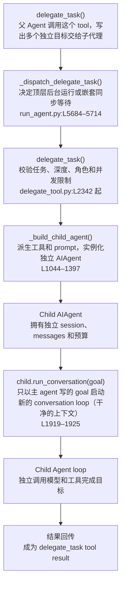

# 工具、代码与子代理

Hermes 有三种主要执行方式。区别不在“能力强弱”，而在工作由谁编排、多少中间结果进入主会话。

| 方式 | 谁编排步骤 | 主 `messages` 看到什么 | 适合场景 |
|---|---|---|---|
| 直接工具 | 主 Agent | 每次 tool call 和 result | 单次读取、命令、搜索、写文件 |
| `execute_code` | 一段 Python 代码 | 最终 stdout、状态和错误 | 确定性的循环、过滤、批处理 |
| `delegate_task` | 独立子 Agent | dispatch handle 和最终总结 | 可拆分的研究、审查、调试 |

Cron 和后台 terminal 用于定时或长时间运行，不属于子代理机制。

## 1. 直接工具

直接工具沿用第 2 章的闭环：

```text
模型返回 tool_calls
  → assistant(tool_calls) 写入 messages
  → ToolExecutor 调用工具
  → tool results 写入 messages
  → 下一轮模型请求
```

入口是 `agent/conversation_loop.py:L4660–4688`，结果回填在 `agent/tool_executor.py:L918–962`。这种方式最透明，但每个中间结果都会占用主会话 context。

## 2. `execute_code`

`execute_code` 让模型生成一段 Python，用 Hermes RPC 在脚本内部调用已有工具：`tools/code_execution_tool.py:L1115–1170`。

```text
主 Agent
  → execute_code(python script)
  → script 内循环调用多个 Hermes tools
  → 只把有界 stdout / 状态 / 错误返回主 messages
```

它适合“不需要模型逐步判断”的机械流程，例如批量读取、过滤结果再统一处理。若每一步都需要根据语义重新决策，应使用直接工具或子代理。

## 3. `delegate_task` 的核心链路



### 顶层与嵌套委派

`AIAgent._dispatch_delegate_task()` 决定运行方式：`run_agent.py:L5684–5714`。

- 顶层 Agent 发起的委派强制后台运行，模型不能自行要求同步等待。
- orchestrator 子代理发起的委派保持同步，因为它必须拿到 workers 的结果，才能给父 Agent 汇总。

single 和 batch 都走同一入口；batch 只是在受控线程池中并行运行多个 child：`tools/delegate_tool.py:L2342–2554`。

## 4. Child Agent 怎样构造

核心函数是 `tools/delegate_tool.py:L1044–1397` 的 `_build_child_agent()`。

```text
goal + context
  → 构造 child system prompt
父 Agent 的运行配置
  → 派生 model / provider / credentials / tools
new AIAgent(...)
  → 独立 session、独立预算、独立 conversation loop
```

| 项目 | Child 的行为 | 源码 |
|---|---|---|
| `goal` | 进入 child prompt，并作为第一条 user message | `L1144–1152, L1921–1925` |
| `context` | 进入 child prompt | `L1144–1152` |
| 父会话历史 | **不复制** | `L1921–1925` 没有传 `conversation_history` |
| 模型与凭证 | 默认继承父 Agent，也可由可信配置改路由 | `L1196–1214` |
| 工具 | 从父 Agent 的有效工具集派生，不能凭空扩权 | `L1100–1142` |
| session | 新 session，同时记录 `parent_session_id` | `L1301–1354` |
| 预算 | 每个 child 创建新的 iteration budget | `L1178–1181, L1309–1331` |
| Memory/context files | 不重新加载，由 `goal/context` 显式提供背景 | `L1316–1321` |

最重要的结论是：子代理看不到父 Agent 的 `messages`。父 Agent 必须把路径、错误、已尝试方案、约束和验收标准写进 `goal/context`。

## 5. Leaf 与 Orchestrator

默认 child 是 `leaf`。构造时会移除以下高风险或不适合独立 worker 的能力：

```text
delegate_task · clarify · memory · send_message · execute_code · cronjob
```

阻止列表在 `tools/delegate_tool.py:L44–54`，角色和工具继承在 `L1078–1142`。

`role="orchestrator"` 只有在配置允许、并且没有达到 `max_spawn_depth` 时才保留 `delegate_task`。默认最大深度是 1，因此通常只有：

```text
Parent Agent
  └─ Leaf Child
```

开启更深层级后才可能出现：

```text
Parent Agent
  └─ Orchestrator Child
       └─ Worker Child
```

## 6. 结果怎样回到父会话

### 同步路径

orchestrator child 等待 worker 完成。worker 的汇总作为 `delegate_task` tool result 写入 orchestrator 自己的 `messages`，然后 orchestrator 继续 loop 并生成最终总结。

### 后台路径

顶层 Agent 先得到 dispatched handle，当前 tool loop 不必等待。child 完成后，结果写入共享 completion queue：`tools/async_delegation.py:L249–319`。CLI、Gateway 或 TUI 再按原 session 把完成事件投递为一个新的 turn。

```text
父 turn：delegate_task → dispatched handle → 继续/结束

child 完成
  → completion_queue
  → 原 session 的新 turn
  → 父 Agent 阅读结果并继续处理
```

结果不会插入已经结束的旧 `messages` 中。这样可以保持严格的消息角色顺序，也不会改写已经缓存的历史前缀。

## 7. 怎样选择

```text
一次简单动作                    → 直接工具
确定性的循环、过滤、批处理       → execute_code
需要独立推理且上下文可以明确描述 → delegate_task
需要定时执行                    → Cron
需要等待长时间 shell 进程        → terminal(background=True)
```

子代理的总结仍是模型输出。涉及文件、外部资源或其他副作用时，父 Agent 应通过文件回读、状态查询、URL 或资源 ID 再次验证。
