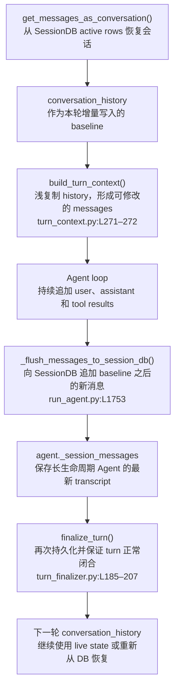
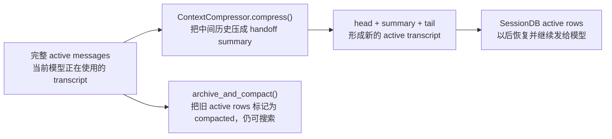

# 会话怎样持久化和搜索

Hermes 把交互会话写入 `$HERMES_HOME/state.db`。理解这一章只需要区分三份内存状态和一份持久状态。

| 状态 | 含义 |
|---|---|
| `conversation_history` | 本轮开始时已有的历史，也是增量写入的 baseline |
| `messages` | 本轮 loop 正在修改的 canonical transcript |
| `agent._session_messages` | 长生命周期 Agent 保存的最新 `messages` |
| SessionDB | 跨进程、跨重启保存的 durable rows |

## 1. SessionDB 存什么

核心表定义在 `hermes_state.py:L730–870`：

```text
state.db
├── sessions              session 元数据、system prompt、模型、用量和状态
├── messages              user / assistant / tool、reasoning、tool calls/results
├── messages_fts          普通全文索引
├── messages_fts_trigram  中文和子串搜索索引
├── gateway_routing       消息平台到 session 的路由
└── compression_locks     跨进程压缩锁
```

它会保存完整的会话消息，但“完整”不等于所有消息都继续发给模型。每条 message 可以是 active、compacted 或 inactive；正常恢复只读取 active rows，压缩过的旧 rows 仍可留在数据库中供搜索。

## 2. 一次 turn 怎样写入



关键变化是：

```text
conversation_history = [旧 active messages]

messages = list(conversation_history)
messages += current user
messages += assistant(tool_calls)
messages += tool results
messages += final assistant

agent._session_messages = messages
SessionDB += 尚未写入的新 messages
```

`_flush_messages_to_session_db()` 位于 `run_agent.py:L1753–1910`。它使用 `conversation_history` baseline 和 message 上的持久化标记，只追加新增部分，不在每次 tool call 后重写整段历史。

Turn 开始时也会提前保存 inbound user：`agent/turn_context.py:L335–347`。因此即使进程在工具执行中途退出，用户输入和已经发生的 tool-call block 仍有机会恢复。

## 3. 下一轮从哪里恢复

SessionDB 的恢复入口是 `hermes_state.py:L4084–4191` 的 `get_messages_as_conversation()`。它把 active message rows 还原成模型可消费的字典，包括 reasoning 和 tool-call/result 关系。

```text
同一个长生命周期 Agent
  → 优先继续使用 agent._session_messages

进程重启 / resume
  → SessionDB.get_messages_as_conversation()
  → conversation_history
  → build_turn_context()
  → messages
```

session row 中保存的 system prompt 也会原样恢复，而不是根据当前文件和 Memory 重新构造。这保证 resumed session 的 prompt-cache 前缀保持稳定。

## 4. 压缩后数据库发生什么

默认使用原位压缩。核心事务是 `hermes_state.py:L3694–3744` 的 `archive_and_compact()`：

```text
压缩前 active rows
  → active=0, compacted=1

head + handoff summary + recent tail
  → 写成新的 active rows

conversation_history
  → 重设为 compressed messages baseline
```



因此两件事可以同时成立：

- 模型以后只看到压缩后的 active transcript；
- 被压缩掉的旧消息仍保存在数据库中，并可通过搜索找回。

## 5. `session_search` 怎样工作

工具入口是 `tools/session_search_tool.py:L619`，底层查询是 `hermes_state.py:L4512` 的 `search_messages()`。

```text
session_search(query)
  → messages_fts 做词项搜索
  → messages_fts_trigram 补充中文和子串匹配
  → 返回 session、message id、时间和命中片段
```

搜索直接针对存储消息，不先让 LLM 总结。默认会包含 compacted rows，因此 context compression 不会让历史从搜索结果中消失；普通 rewind/undo 产生的 inactive、非 compacted rows 默认不返回。

`session_search` 还支持：

- 列出最近 session；
- 读取指定 session 的 head/tail；
- 围绕某个 message id 查看上下文窗口；
- 在指定 profile 的 state.db 中搜索。

## 6. 并发写入

SessionDB 使用 SQLite WAL，并在写事务中使用 `BEGIN IMMEDIATE` 与短暂 jitter retry：`hermes_state.py:L1142–1194`。这解决 CLI、Gateway、后台 review 或子代理同时访问状态库时的常见锁竞争。

## 7. 一句话总结

```text
messages 是当前工作的会话事实
  → 增量写入 SessionDB
  → active rows 用于恢复模型上下文
  → compacted rows 保留完整历史并继续支持搜索
```
