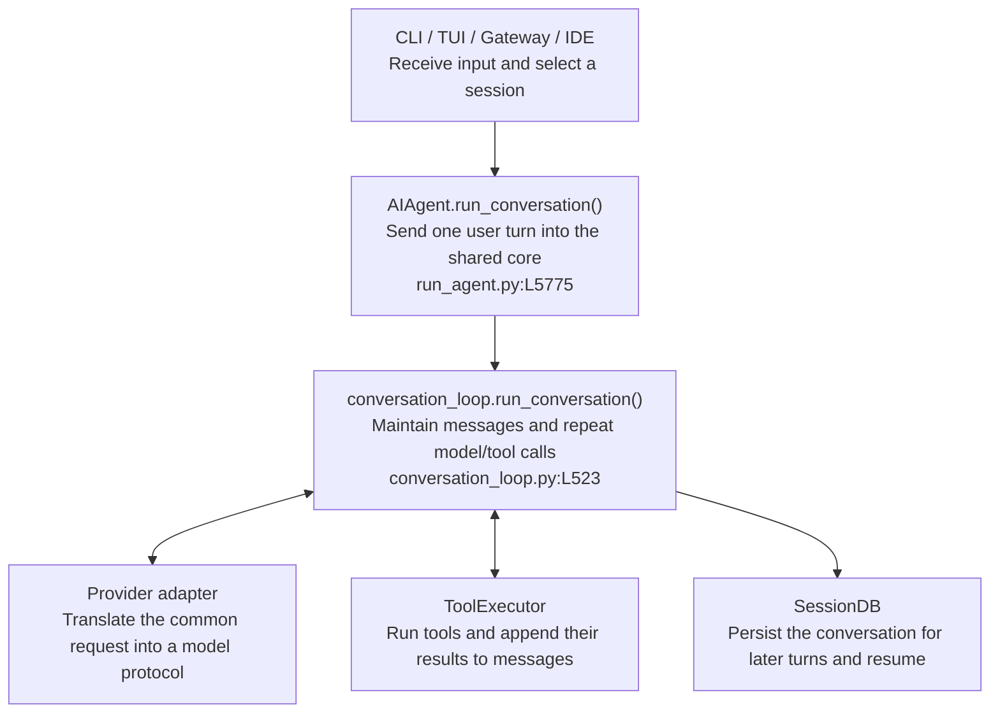

# What Is the Hermes Core?

The short answer: Hermes has one shared `AIAgent`. Its most important mechanism is the model–tool loop in `run_conversation()`.

CLI, TUI, messaging platforms, and IDE integrations look like different products, but they mainly receive input and present results. The same agent core decides how each turn runs.

## 1. The simplest call chain



Regardless of the entry point, the central data flow is the same:

```text
user input + previous conversation
  → messages
  → call the model
  → receive text or tool_calls
  → execute tools and append results to messages
  → call the model again
  → return the final answer and persist the session
```

Chapter 2 follows this loop line by line.

## 2. Responsibilities of the five parts

| Part | Owns | Does not own |
|---|---|---|
| Entry point | Input, authorization, session selection, streaming UI | A separate agent loop |
| `AIAgent` | Configuration, runtime state, and `run_conversation()` | Every external capability |
| Conversation loop | Context, model calls, tools, budgets, compression | Telegram or TUI rendering |
| Tools / MCP / Plugins | Files, commands, browser, external systems | The primary conversation |
| SessionDB / Memory / Skills | Sessions, durable facts, reusable procedures | Live reasoning over `messages` |

The architecture has one stable agent path in the middle, with many entry points above it and many models, tools, and state systems below it.

## 3. What the core standardizes

### One `messages` representation

User messages, assistant replies, tool calls, and tool results all evolve around the same `messages` list. Entry points do not maintain separate conversation formats.

### One model–tool loop

The model either returns final text or requests tools. Tool results are appended to `messages`, then the model runs again. CLI and Gateway do not implement separate loops.

### One runtime control path

The same core loop owns iteration budgets, interrupts, context compression, provider fallback, persistence, and post-turn background review.

## 4. Why the core stays relatively small

The core orchestrates; edge modules implement capabilities.

```text
Core decides:
  Which messages should the model see now?
  Which tool did the model request?
  How does the result enter the next iteration?
  When should the turn stop, compress, or persist?

Edge modules decide:
  How does Telegram send a message?
  How is an Anthropic or OpenAI request encoded?
  How do browser, terminal, and MCP tools execute?
  How are Memory and Skills written to disk?
```

Hermes is therefore a compact agent loop surrounded by practical rules and extensions for real providers and real environments.

## 5. Why new capabilities usually live at the edge

Every core tool schema can be sent on every model call, consuming context and affecting prompt caching. Hermes therefore prefers this order:

```text
extend an existing tool
  → CLI command + Skill
  → configuration-gated tool
  → Plugin / MCP
  → new core tool only as a last resort
```

## 6. What the remaining chapters cover

- **Chapter 2 — Execution Loop:** how `messages` becomes a request and receives tool results.
- **Chapter 3 — Memory and Self-Improvement:** how foreground and review agents update durable knowledge.
- **Chapter 4 — Tools and Subagents:** when to call a tool, execute code, or create a child agent.
- **Chapter 5 — Session Storage:** how messages reach SessionDB and remain searchable after compression.

> Multiple entry points share one `AIAgent`; `run_conversation()` owns the loop, while model, tool, and state capabilities remain at its edges.
