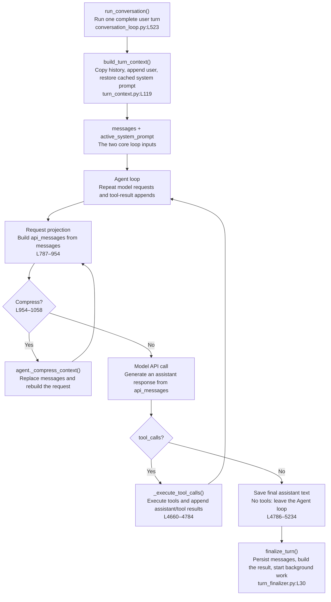
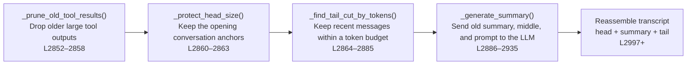

# `run_conversation()`: How One Turn Runs

The Hermes core prepares context, loops over model and tool calls, then finalizes the turn. Keep three data structures separate:

| Data | Meaning | Persisted? |
|---|---|---|
| `messages` | Canonical transcript and main loop state | Yes |
| `active_system_prompt` | System prompt frozen for this session | With the session |
| `api_messages` | Temporary projection for one model request | No |

## 1. Main flow



Only `messages` drives the loop: model output and tool results are appended, then the next request is rebuilt from that updated history.

## 2. What `build_turn_context()` does

Called at `agent/conversation_loop.py:L592–622`, implemented at `agent/turn_context.py:L119–562`:

```text
conversation_history
  → shallow-copy into messages                    L271–272
  → restore todo and periodic counters             L274–314
  → append the current user message                L316–320
  → restore/build _cached_system_prompt             L329–333
  → persist inbound user early                     L335–347
  → run preflight compression when needed          L350–460
  → fetch plugin context / external memory recall
  → return TurnContext                             L553–562
```

It returns loop state, not the final provider request.

## 3. How `messages` becomes a request

Each loop iteration projects the request again (`agent/conversation_loop.py:L787–954`):

```text
messages
  → copy each row into api_messages
  → append external memory/plugin context only to the current user copy
  → prepend active_system_prompt + ephemeral_system_prompt
  → insert optional prefill
  → send together with tools
```

Dynamic recall and plugin context do not mutate the user's stored message. The system prompt is normally prepended at request time rather than stored in `messages`.

## 4. Three compression checks

1. **At turn start:** `turn_context.py:L350–460`.
2. **Before an API request:** `conversation_loop.py:L954–1058`; compressed `messages` replaces the temporary request.
3. **After tool execution:** `conversation_loop.py:L4733–4778`, using real provider prompt usage when available.

### Compression call chain

```text
AIAgent._compress_context()                       run_agent.py:L5608
  → conversation_compression.compress_context()  conversation_compression.py:L435
  → agent.context_compressor.compress()           conversation_compression.py:L638
  → ContextCompressor.compress()                  context_compressor.py:L2793
```

### Five-stage algorithm



An existing handoff summary is updated in the same summary request. The result replaces canonical `messages`; compression is not limited to a temporary API copy.

## 5. How model results return to `messages`

With tool calls:

```text
assistant(tool_calls) → messages                conversation_loop.py:L4660
persist the tool-call block before side effects  L4662–4667
agent._execute_tool_calls(...)                   L4688
tool results → the same messages                 tool_executor.py:L918–962
optional compression                             L4733–4778
continue the Agent loop                          L4780–4784
```

Without tool calls, the final assistant message is appended and the loop exits at `L4786–5234`.

## 6. `finalize_turn()`

All exits converge at `agent/turn_finalizer.py:L30`. It closes a valid transcript, persists `messages`, builds the result dictionary, syncs external memory, and may launch the Chapter 3 background review.

```text
result["messages"]
  → caller / SessionDB
  → next conversation_history
  → build_turn_context()
  → new messages
```
