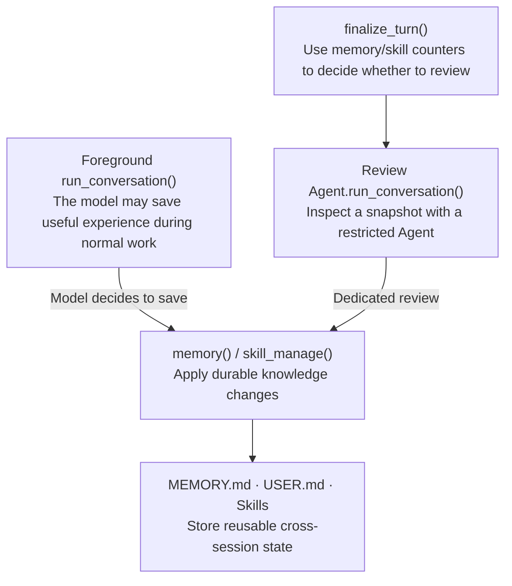
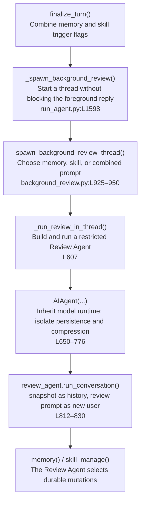

# How Memory and Skills Improve Themselves

Self-improvement is not a separate runtime. Hermes periodically starts a restricted `AIAgent`, replays the conversation, and lets that agent organize Memory or Skills through normal tools.

## 1. Two write paths



Both paths must use tools. Review code does not edit these files directly.

## 2. Two periodic triggers

### Memory counts user turns

`build_turn_context()` increments `_turns_since_memory`. At `_memory_nudge_interval`, it sets `should_review_memory=True` and resets the counter (`agent/turn_context.py:L278–314`).

### Skills count Agent-loop iterations

Every model-loop iteration increments `_iters_since_skill` (`agent/conversation_loop.py:L680–684`). This is an API/Agent iteration count, not exactly a tool-call count. `finalize_turn()` triggers a review when the interval is reached and `skill_manage` is available (`agent/turn_finalizer.py:L454–460`).

A background review starts only when the turn has a final response, was not interrupted, and at least one trigger fired (`L470–480`).

## 3. Background Review chain



`_run_review_in_thread()` inherits the live provider, model, credentials, and toolset configuration; creates a new `AIAgent(max_iterations=16)`; binds the parent's built-in `MemoryStore`; restricts dispatch to memory/skill tools; then runs `run_conversation()` over the snapshot.

The same model reuses the full snapshot and cached system prompt. A separately configured review model receives a digest of older history (`agent/background_review.py:L734–819`).

## 4. Why review does not contaminate the main session

| Setting | Purpose | Source |
|---|---|---|
| `skip_memory=True` | Do not ingest review prompts into external memory providers | `background_review.py:L665–697` |
| `_persist_disabled=True` | Do not write review dialogue into the parent SessionDB | `L712–725` |
| nudge intervals = 0 | Prevent recursive reviews | `L707–711` |
| `compression_enabled=False` | Avoid compression/session-rotation races | `L766–776` |
| thread tool whitelist | Execute only memory/skill tools | `L778–830` |

Review dialogue never merges into the main `messages`; only tool-driven durable changes survive.

## 5. How Memory is written and injected

Foreground and Review agents share `tools/memory_tool.py:L959–1034`:

```text
memory(add / replace / remove / batch)
  → MemoryStore
  → $HERMES_HOME/memories/MEMORY.md or USER.md
```

`MEMORY.md` stores project, environment, tool, and durable operational facts. `USER.md` stores user preferences and stable working habits.

At Agent initialization, `MemoryStore.load_from_disk()` creates a frozen system-prompt snapshot (`tools/memory_tool.py:L169–204`), injected at `agent/system_prompt.py:L450–482`:

```text
MEMORY.md / USER.md
  → fresh AIAgent / new session
  → frozen memory snapshot
  → build_system_prompt()
  → _cached_system_prompt
```

A write updates disk and live entries immediately, but not the current session's frozen snapshot or cached system prompt. New memory normally enters a future fresh session, preserving the prompt-cache prefix.

External memory providers are separate: recall occurs at turn start and is injected only into the current `api_messages` user copy; completed user/assistant turns sync at turn end.

## 6. How Skills are written and loaded

Foreground or Review agents use `skill_manage` to create, modify, or archive agent-created skills. The system prompt contains only the skill name and description; full `SKILL.md` content is loaded on demand through `skills_list()` / `skill_view()`.

```text
skill_manage
  → skill files
  → invalidate skill index cache
  → future system prompt contains the skill index
  → load full SKILL.md only when needed
```

Background review extracts skills from recent conversations. The separate curator performs longer-term governance. `run_curator_review()` (`agent/curator.py:L1480`) performs deterministic auditing by default; LLM umbrella consolidation requires `curator.consolidate: true` or `--consolidate`.

## 7. Summary

```text
foreground work or periodic review finds reusable experience
  → memory / skill_manage writes it to disk
  → current cached system prompt remains unchanged
  → future sessions or on-demand skill loading make it available
```
