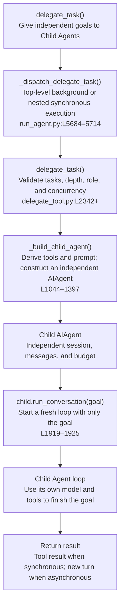

# Tools, Code, and Subagents

Hermes has three main execution styles. The difference is who orchestrates the steps and how much intermediate data enters the main conversation.

| Style | Orchestrator | What main `messages` receives | Best for |
|---|---|---|---|
| Direct tools | Main Agent | Every call and result | One read, command, search, or write |
| `execute_code` | Python program | Bounded stdout, status, errors | Deterministic loops and batch processing |
| `delegate_task` | Independent Child Agent | Dispatch handle and final summary | Separable research, review, debugging |

Cron and background terminal processes handle scheduled or long-running work; they are not subagents.

## 1. Direct tools

Direct tools use the Chapter 2 loop:

```text
model returns tool_calls
  → assistant(tool_calls) enters messages
  → ToolExecutor runs the tool
  → tool results enter messages
  → next model request
```

The path starts at `agent/conversation_loop.py:L4660–4688`; results are appended at `agent/tool_executor.py:L918–962`. It is transparent, but every intermediate result consumes main-context space.

## 2. `execute_code`

`execute_code` runs model-authored Python that invokes existing Hermes tools through RPC (`tools/code_execution_tool.py:L1115–1170`).

```text
main Agent
  → execute_code(Python script)
  → script loops over Hermes tools internally
  → bounded stdout / status / errors return to main messages
```

Use it when the intermediate decisions are mechanical. Use direct tools or subagents when each step requires new semantic judgment.

## 3. Core `delegate_task` chain



### Top-level and nested delegation

`AIAgent._dispatch_delegate_task()` (`run_agent.py:L5684–5714`) forces top-level delegation into the background. An orchestrator child delegates synchronously because it needs worker results before composing its summary.

Single and batch forms share the same entry point; batch runs children in a bounded thread pool (`tools/delegate_tool.py:L2342–2554`).

## 4. How a Child Agent is constructed

`_build_child_agent()` lives at `tools/delegate_tool.py:L1044–1397`.

| Item | Child behavior | Source |
|---|---|---|
| `goal` | Enters child prompt and becomes the first user message | `L1144–1152, L1921–1925` |
| `context` | Enters child prompt | `L1144–1152` |
| Parent transcript | **Not copied** | `L1921–1925` passes no `conversation_history` |
| Model/credentials | Inherit by default; trusted config may reroute | `L1196–1214` |
| Tools | Derived from the parent's effective tools; cannot gain privileges | `L1100–1142` |
| Session | New session with `parent_session_id` | `L1301–1354` |
| Budget | Fresh iteration budget per child | `L1178–1181, L1309–1331` |
| Memory/context files | Not reloaded; required background must be explicit | `L1316–1321` |

The child cannot see the parent's `messages`. Paths, errors, prior attempts, constraints, and acceptance criteria must be included in `goal/context`.

## 5. Leaf and Orchestrator

A child is a `leaf` by default. Construction removes `delegate_task`, `clarify`, `memory`, `send_message`, `execute_code`, and `cronjob` (`tools/delegate_tool.py:L44–54`).

`role="orchestrator"` keeps delegation only when configuration and `max_spawn_depth` allow it. The default maximum depth is 1:

```text
Parent Agent
  └─ Leaf Child
```

With deeper delegation enabled:

```text
Parent Agent
  └─ Orchestrator Child
       └─ Worker Child
```

## 6. How results return

For synchronous nested delegation, the worker summary becomes a `delegate_task` tool result in the orchestrator's `messages`.

For top-level background delegation, the parent first receives a dispatch handle. Completion enters the shared queue (`tools/async_delegation.py:L249–319`) and the host delivers it to the original session as a new turn.

```text
parent turn: delegate_task → dispatch handle → continue/end

child completes
  → completion_queue
  → new turn in the original session
  → parent Agent reads and acts on the result
```

The result is never inserted into an already-finished old transcript, preserving role order and the cached prefix.

## 7. Choosing a path

```text
one simple action                       → direct tool
deterministic loop/filter/batch         → execute_code
independent reasoning with clear input  → delegate_task
scheduled execution                     → Cron
long-running shell process              → terminal(background=True)
```

Subagent summaries are still model output. Verify file changes and external side effects through reads, status queries, URLs, or resource IDs.
