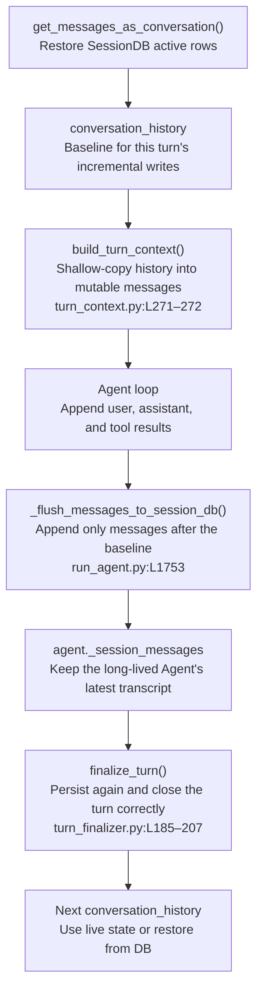
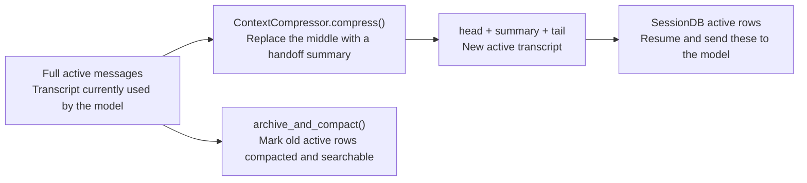

# How Sessions Are Persisted and Searched

Interactive sessions are stored in `$HERMES_HOME/state.db`. Four states matter:

| State | Meaning |
|---|---|
| `conversation_history` | History at turn start and baseline for incremental writes |
| `messages` | Canonical transcript being modified by the current loop |
| `agent._session_messages` | Latest `messages` retained by a long-lived Agent |
| SessionDB | Durable rows across processes and restarts |

## 1. What SessionDB stores

Core tables are defined at `hermes_state.py:L730–870`:

```text
state.db
├── sessions              metadata, system prompt, model, usage, status
├── messages              user/assistant/tool, reasoning, calls/results
├── messages_fts          regular full-text index
├── messages_fts_trigram  CJK and substring index
├── gateway_routing       platform-to-session routing
└── compression_locks     cross-process compression locks
```

The database keeps the full conversation, but not every row remains model context. Messages can be active, compacted, or inactive. Resume loads active rows; compacted history remains searchable.

## 2. How one turn is written



```text
conversation_history = [old active messages]
messages = list(conversation_history)
messages += current user
messages += assistant(tool_calls)
messages += tool results
messages += final assistant

agent._session_messages = messages
SessionDB += messages not written yet
```

`_flush_messages_to_session_db()` (`run_agent.py:L1753–1910`) uses the baseline and persistence markers to append only new rows. The inbound user is also persisted early (`agent/turn_context.py:L335–347`) for crash recovery.

## 3. Where the next turn resumes

`get_messages_as_conversation()` (`hermes_state.py:L4084–4191`) reconstructs active rows, including reasoning and tool-call/result relationships.

```text
same long-lived Agent
  → continue from agent._session_messages

restart / resume
  → SessionDB.get_messages_as_conversation()
  → conversation_history
  → build_turn_context()
  → messages
```

The stored system prompt is restored verbatim rather than rebuilt, preserving the cached prefix.

## 4. What compression changes in the database

In-place compaction uses `archive_and_compact()` at `hermes_state.py:L3694–3744`:

```text
old active rows → active=0, compacted=1
head + handoff summary + recent tail → new active rows
conversation_history → compressed messages baseline
```



The model sees only the compressed active transcript, while older rows stay in the database for search.

## 5. How `session_search` works

The tool entry is `tools/session_search_tool.py:L619`; the database query is `hermes_state.py:L4512`.

```text
session_search(query)
  → messages_fts for token search
  → messages_fts_trigram for CJK and substrings
  → session, message id, timestamp, matching snippet
```

Search runs over stored messages without an LLM summary. Compacted rows are included by default; inactive non-compacted rewind/undo rows are excluded.

The tool can also list recent sessions, read a session's head/tail, inspect a window around a message id, and search another profile's database.

## 6. Concurrent writes

SessionDB uses SQLite WAL plus `BEGIN IMMEDIATE` and short jittered retries (`hermes_state.py:L1142–1194`) to handle common contention among CLI, Gateway, review, and subagent activity.

## 7. Summary

```text
messages is the current conversation truth
  → incrementally persisted to SessionDB
  → active rows restore model context
  → compacted rows preserve searchable history
```
