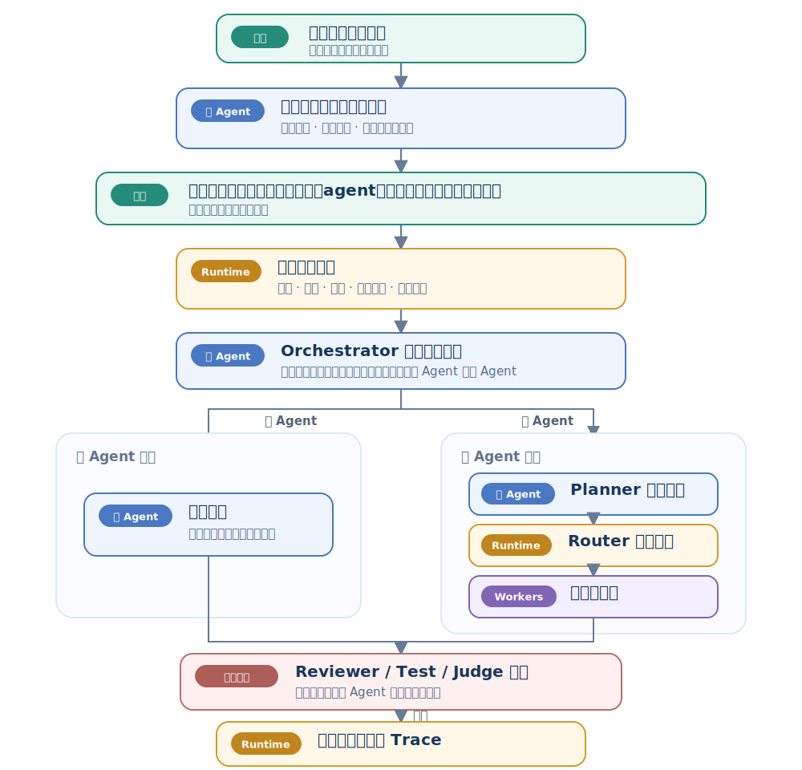
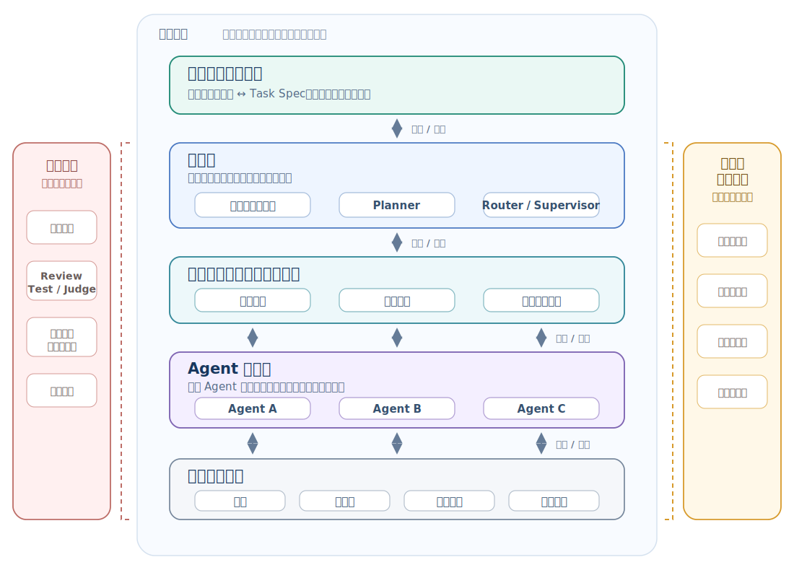

# Multi-Agent Knowledge · 第 ① 步：全景与定义

> 多智能体不是“多开几个聊天窗口”。它是一种把任务、角色、通信、环境、状态和评审组织起来的系统设计方法。


## 1. Agent 与多智能体系统核心术语

本章第一次遇到下面这些英文时，先按这个中文含义理解；后文再展开它们的特性和工程做法。

| 英文术语 | 中文说法 | 先记住的含义 |
|---|---|---|
| Agent | 智能体 | 能根据目标、环境观察和可用工具选择行动的运行单元。 |
| Multi-Agent System / MAS | 多智能体系统 | 多个智能体通过通信或共享环境协作完成任务的系统。 |
| Environment / State | 环境 / 状态 | 多个 Agent 共同作用的外部事实与任务进度。 |
| Observation | 观察 | 某个 Agent 实际能看到的局部状态。 |
| Coordination | 协调 | 让相互依赖的行动按约束形成可接受结果。 |
| Planner | 规划器 | 把用户目标拆成可执行步骤的人或模块。 |
| Router / Supervisor | 路由器 / 主管 | 决定任务交给谁，以及何时升级、终止或重新规划。 |


<!-- learning-path:start -->
<div class="learning-path">
<div class="learning-path-title">本章怎么学</div>
<div class="learning-path-step"><span>1</span><div>先掌握核心术语、Agent 定义和多 Agent 的适用条件（第 1～4 节）。</div></div>
<div class="learning-path-step"><span>2</span><div>再理解多智能体系统的构成、分层架构和协作拓扑（第 5～7 节）。</div></div>
<div class="learning-path-step"><span>3</span><div>最后比较 LLM 多智能体与传统 MAS，并用最小消息示例串起全书路线（第 8～10 节）。</div></div>
</div>
<!-- learning-path:end -->

---

## 2. 多智能体系统定义、选型与架构学习目标

目标是建立一个稳定词汇表：
- 什么叫 Agent。
- 什么叫 Multi-Agent System。
- 什么时候需要多 Agent。
- 多 Agent 相比单 Agent 增加了哪些组织机制。
- 链式、主管制、层级、黑板、辩论和市场拓扑分别在改变什么。
- 为什么 LLM 出现后，多智能体又变成热门方向。

---

## 3. Agent 的最小定义


先用一个足够小、后面还能继续扩展的定义来理解：

> Agent 是一个能在环境中根据目标选择行动，并根据观察结果更新后续行为的计算实体。

在 LLM 场景里，Agent 通常包含：

| 部件 | 作用 |
|---|---|
| 角色说明 | 决定它从什么角度看任务 |
| 目标 | 决定它要优化什么 |
| 工具 | 决定它能对外部世界做什么 |
| 记忆 | 决定它能带着哪些历史继续行动 |
| 策略 | 决定它如何计划、调用工具、停止或求助 |
| 观测 | 工具结果、环境状态、其他 Agent 消息 |

一个单 Agent 通常是：

<div class="concept-card">
<div class="concept-line">LLM + instructions + tools + memory + loop</div>
</div>

一个最小 Python 表示：

```python
from dataclasses import dataclass, field
from typing import Callable, Any

Tool = Callable[[dict], str]

@dataclass
class AgentSpec:
    name: str
    role: str
    goal: str
    tools: dict[str, Tool] = field(default_factory=dict)
    memory: list[str] = field(default_factory=list)

    def system_prompt(self) -> str:
        return f"""
You are {self.name}.
Role: {self.role}
Goal: {self.goal}
Available tools: {', '.join(self.tools) or 'none'}
Memory:
{chr(10).join('- ' + m for m in self.memory[-5:])}
""".strip()
```

<div class="code-explanation">
<div class="code-explanation-title">Python 代码说明</div>
<p><strong>用途：</strong>用 <code>AgentSpec</code> 把智能体的名称、角色、目标、工具和记忆收拢成一个可版本化对象。<strong>执行过程：</strong><code>system_prompt()</code> 读取这些字段，只取最近五条记忆并拼成系统提示。<strong>关键点：</strong>这只是规格层，真正的模型调用、权限校验和循环控制仍要由运行时实现。</p>
</div>


这段代码还不是完整 Agent，但它已经表达出“角色、目标、工具、记忆”四个核心维度。

---

## 4. 多 Agent 的适用条件


先把单 Agent 作为默认基线。只有任务确实需要能力分工、并行工作、独立评审或权限隔离时，才值得增加多个 Agent。

适合：
- 任务天然有多个专业视角，比如“需求、架构、编码、测试、安全评审”。
- 需要多候选方案和评审，比如设计评审、研究综述、策略选择。
- 长流程需要阶段门控，比如软件开发、数据分析、合同审阅。
- 工具权限需要分离，比如只有执行 Agent 能跑命令，评审 Agent 只能读结果。
- 需要可解释的组织过程，比如希望看到每个角色做了什么。

不适合：
- 任务很短，单次问答就能完成。
- 只是为了“看起来高级”而拆多个角色。
- 没有明确的停止条件。
- 没有日志和评测，无法判断多 Agent 是否真的更好。
- 每个 Agent 都用相同提示词、相同工具、相同上下文，只是名字不同。

一个简单判断函数：

```python
def should_use_multi_agent(task: dict) -> bool:
    signals = 0
    signals += task.get("requires_multiple_expertise", False)
    signals += task.get("needs_independent_review", False)
    signals += task.get("long_horizon_steps", 0) >= 5
    signals += task.get("tool_risk_level", "low") in {"medium", "high"}
    signals += task.get("needs_parallel_research", False)
    return signals >= 2
```

<div class="code-explanation">
<div class="code-explanation-title">Python 代码说明</div>
<p><strong>用途：</strong>用五个任务信号粗略判断是否值得引入多智能体。<strong>执行过程：</strong>布尔条件在 Python 中按 0 或 1 累加，长流程和中高风险也各贡献一个信号；达到两个信号才返回 <code>True</code>。<strong>关键点：</strong>阈值是教学示例，生产系统应根据真实成功率、成本和延迟数据校准。</p>
</div>

判断标准不是“能不能拆出多个角色”，而是“拆分以后是否能在质量、速度、隔离或可审计性上获得可测量收益”。如果无法说出收益来自哪里，应继续使用单 Agent。

---

## 5. 多智能体系统的构成要素


Multi-Agent System，简称 MAS，可以这样理解：

> MAS 是由多个部分自治的 Agent 组成的系统，它们通过通信或共享环境协同完成任务。

它比单 Agent 多出来的东西：

| 新问题 | 例子 |
|---|---|
| 协作拓扑 | 谁先说话、谁能调用谁、谁有最终裁决权 |
| 通信协议 | 消息格式、轮次、状态、引用、失败重试 |
| 任务分配 | Planner 如何把任务拆给不同角色 |
| 冲突解决 | 两个专家给出不同结论时怎么办 |
| 共享状态 | 哪些中间结果所有人都能看 |
| 成本控制 | 多 Agent 会放大 token、工具调用和延迟 |
| 安全边界 | 每个 Agent 的权限是否不同 |

一个多智能体系统是：

<div class="concept-card">
<div class="concept-line">multi-agent (LLM + role-specific instructions + tools + memory + loop) + orchestrator + state managing + message passing</div>
</div>

---

## 6. 多智能体系统的分层架构


<div class="concept-card">
<div class="concept-line">人类提出目标（User goal）</div>
<div class="concept-line">  → 主 Agent 澄清目标并起草任务规格（Task spec）</div>
<div class="concept-line">  → 人类确认关键边界和成功标准</div>
<div class="concept-line">  → 运行时策略（Runtime policy）检查预算、风险、权限和审批要求</div>
<div class="concept-line">  → 主 Agent / Orchestrator 选择单 Agent 或多 Agent 执行方式</div>
<div class="concept-line">  → 多 Agent 模式下由 Planner 拆分、Router 分配、Worker Agents 执行</div>
<div class="concept-line">  → Reviewer / Test / Judge 验收，不通过则退回主 Agent 调整</div>
<div class="concept-line">  → Runtime 交付最终结果并保存轨迹记录（Trace）</div>
</div>

### 6.1 多智能体系统的端到端执行流程

这张图不仅展示处理顺序，还明确每一步由谁负责。人类决定目标并确认关键约束；主 Agent 理解、规划和选择执行方式；确定性 Runtime 执行策略门禁与路由规则；Worker Agents 产生产物；独立的质量角色负责验收。



读图时重点看：“主 Agent 做判断”和“Runtime 执行规则”是两件事。主 Agent 可以提出任务规格、计划和协作方式，但预算上限、权限检查、审批要求、实际路由和轨迹写入应由可测试的运行时机制强制执行。

一个单 Agent 通常是：

<div class="concept-card">
<div class="concept-line">LLM + instructions + tools + memory + loop</div>
</div>

一个多智能体系统是：

<div class="concept-card">
<div class="concept-line">multi-agent (LLM + role-specific instructions + tools + memory + loop) + orchestrator + state managing + message passing</div>
</div>

### 6.2 多智能体系统的层级结构

这里展示的是系统的**分层架构**，不是一次运行必须依次经过的串行步骤。上下位置表示抽象层次和依赖关系：控制面通过协作底座调度多个 Agent，Agent 在执行过程中反复读取状态、发送消息和调用工具；质量保障、治理与可观测性同时作用于多个层次。



读图时重点看：控制面决定“谁做什么”，通信与共享状态层承载“怎样交换信息”，多个 Agent 在执行面并行工作，工具资源层提供真实行动能力。层间使用双向箭头，因为调度、执行、观察和反馈会在一次运行中循环多次；左右两栏则表示质量和治理不是末尾步骤，而是跨层约束。

<div class="concept-card">
<div class="concept-line">多个 Agent + 通信协议 + 协作拓扑 + 共享状态 + 决策机制 + 治理边界</div>
</div>

论文和项目锚点：
- 传统 MAS 教材：[Multiagent Systems: Algorithmic, Game-Theoretic, and Logical Foundations](https://www.masfoundations.org/)
- LLM-MAS 综述：[A Survey on LLM-based Multi-Agent System](https://arxiv.org/abs/2412.17481)
- 通信型 Agent：[CAMEL](https://arxiv.org/abs/2303.17760)
- 软件开发团队：[ChatDev](https://arxiv.org/abs/2307.07924)
- SOP 型协作：[MetaGPT](https://arxiv.org/abs/2308.00352)
- 对话编排框架：[AutoGen](https://arxiv.org/abs/2308.08155)

---

## 7. 多 Agent 团队的协作拓扑


**拓扑（Topology）**描述 Agent 之间的连接和控制关系。它不只是“谁和谁能聊天”，还决定四件事：

1. **任务怎样流动**：任务按固定顺序传递，还是由主管动态分派？
2. **信息怎样可见**：角色只看到上一步输出，还是共同读写共享状态？
3. **决策权在哪里**：由单一主管、逐级负责人、市场规则，还是独立裁判做最终决定？
4. **失败怎样返回**：错误回到上一步、回到主管、写入黑板，还是进入下一轮辩论？

因此，Agent 数量相同并不代表系统行为相同。三个 Agent 可以排成流水线，也可以围绕一个主管工作，还可以同时读写同一个共享工作区；这些系统的延迟、成本、错误传播和责任边界都会不同。

先对六种常见形状建立直觉：

| 拓扑 | 基本组织方式 | 适合的任务特征 | 主要风险 |
|---|---|---|---|
| 链式 / Pipeline | 产物按固定顺序交给下一个角色 | 步骤稳定、前后依赖明确 | 上游错误会沿链传播 |
| 主管制 / Supervisor | 主管集中分派、收集并整合结果 | 子任务可并行，但需要统一决策 | 主管成为瓶颈或单点故障 |
| 层级 / Hierarchy | 总负责人通过多个子团队负责人管理成员 | 任务规模大、团队需要分层 | 层级间可能丢失信息 |
| 黑板 / Blackboard | 多个 Agent 读写同一个共享状态 | 证据和中间状态需要持续汇总 | 需要版本、权限和冲突治理 |
| 辩论 / Debate | 多个观点经过若干轮互相响应，再由裁判决策 | 高风险判断、互斥方案比较 | 通信成本高，可能重复空转 |
| 市场 / Market | 候选 Agent 按能力、成本或负载竞标任务 | 候选角色多、任务需要动态分配 | 评分和授权规则难设计 |

选择拓扑时，不要先问“哪个框架最流行”，而要先看任务结构：

- 固定步骤多，优先从链式开始。
- 子任务可并行且需要统一整合，考虑主管制。
- 团队规模较大并包含多个子团队，考虑层级结构。
- 多个角色必须持续共享证据和进度，考虑黑板。
- 结论风险高，需要主动暴露反例，加入辩论和独立裁判。
- 任务和负载变化大，需要动态选人，考虑市场机制。

真实系统经常组合拓扑。例如，主管可以把任务分给三个并行子团队，子团队内部使用链式流程，所有团队再通过黑板共享证据，只在关键决策点启动辩论。第四章会分别画出这些拓扑，并进一步讨论成本、失败模式、状态治理和选择方法。

阅读后续拓扑图时，始终检查四个问题：**谁能把什么信息发给谁、谁能修改共享状态、谁能驳回或终止、谁对最终结果负责**。如果图里只有角色名称和连线，却没有这些规则，它还不是可执行的系统设计。

---

## 8. LLM 多智能体与传统 MAS 的差异


传统 MAS 常关注：
- 分布式决策。
- 拍卖和协商。
- 形式化协议。
- 多机器人控制。
- 多智能体强化学习。

LLM-MAS 更关注：
- 角色提示词。
- 自然语言通信。
- 工具调用。
- 任务分解和自我修正。
- 上下文窗口与记忆压缩。
- 评审、辩论、投票和裁判。
- 可观测性与生产安全。

最大的变化是：**通信语言从严格协议变成了自然语言 + 结构化 JSON 的混合体。**

这让系统更容易搭起来，也更容易失控。因此工程上要用 schema、状态机、测试和日志重新把边界收紧。

---

## 9. 最小多 Agent 消息协作示例


下面不是调用真实 LLM，而是演示系统结构。

```python
from dataclasses import dataclass

@dataclass
class Message:
    sender: str
    receiver: str
    kind: str
    content: str

class EchoAgent:
    def __init__(self, name: str, role: str):
        self.name = name
        self.role = role

    def handle(self, msg: Message) -> Message:
        return Message(
            sender=self.name,
            receiver="supervisor",
            kind="result",
            content=f"[{self.role}] received: {msg.content}",
        )

agents = {
    "researcher": EchoAgent("researcher", "collect evidence"),
    "critic": EchoAgent("critic", "find risks"),
}

task = Message("user", "researcher", "task", "比较 AutoGen 和 MetaGPT")
research_result = agents["researcher"].handle(task)
critic_result = agents["critic"].handle(
    Message("supervisor", "critic", "review", research_result.content)
)

print(research_result)
print(critic_result)
```

<div class="code-explanation">
<div class="code-explanation-title">Python 代码说明</div>
<p><strong>用途：</strong>用不依赖真实大模型的最小程序展示“研究者产出、主管转交、批评者评审”的协作结构。<strong>执行过程：</strong><code>Message</code> 保存发送方、接收方、类型和正文，两个 <code>EchoAgent</code> 依次处理任务与评审消息。<strong>关键点：</strong>示例重点是职责和消息边界，不是模型能力；真实系统还需加入路由、校验、日志和失败处理。</p>
</div>


这个例子展示了三件事：
- Agent 不一定互相直接通信，可以通过 supervisor。
- 消息有 sender、receiver、kind、content。
- “研究”和“评审”是不同职责，不只是两个模型调用。

---

## 10. 全书学习路径与章节关系

前面九节已经回答了“什么是 Agent、何时需要多 Agent，以及团队怎样运行”。下面把这些概念放回全书，说明后续章节为什么按角色、任务、拓扑、协议、治理和案例的顺序展开。


<div class="concept-card">
<div class="concept-line">单 Agent、多 Agent 使用标准与拓扑直觉</div>
<div class="concept-line">  → 角色与团队设计</div>
<div class="concept-line">  → 任务分解与规划</div>
<div class="concept-line">  → 协作拓扑与通信协议</div>
<div class="concept-line">  → 路由与交接</div>
<div class="concept-line">  → Blackboard 与 Debate 拓扑专题</div>
<div class="concept-line">  → 观测、评测、安全与生产化</div>
<div class="concept-line">  → 两个真实团队案例</div>
<div class="concept-line">  → 多智能体框架与论文图谱</div>
</div>

这条路线按依赖关系组织：角色和任务先明确，拓扑与协议才有具体承载对象；运行结构确定以后，路由、观测和安全才能被测试；最后再用案例与框架对照验证这些设计。已有基础的读者可以按问题跳读，但不应跳过前置契约。

---

<!-- chapter-check:start -->
## 11. 多智能体系统定义与架构自检
<div class="chapter-check">
<div class="chapter-check-title">不看正文，尝试回答</div>
<ul>
<li>能否用自己的话区分普通模型调用、Agent 和多智能体系统？</li>
<li>能否给一个任务列出采用或不采用多 Agent 的两个证据？</li>
<li>能否说明拓扑会怎样改变信息流、共享状态和最终决策权？</li>
<li>能否根据固定步骤、集中调度、共享证据或高风险决策选择一种基本拓扑？</li>
<li>能否指出最小示例中任务、消息、角色和评审分别在哪里？</li>
</ul>
</div>
<!-- chapter-check:end -->

---

## 12. 本章总结：定义、架构与适用边界

多智能体系统的本质不是“数量多”，而是**把复杂任务变成可分工、可通信、可评审、可追踪的组织过程**。

下一章看 **② 角色与团队设计**：把任务目标、能力边界、工具权限和协作责任落实成职责互补的团队。
