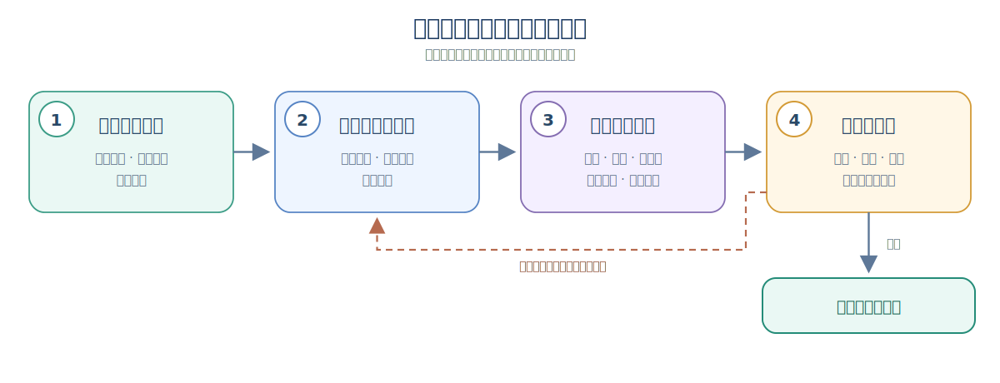
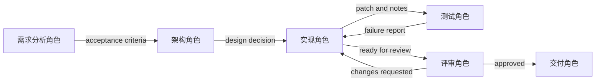

# Multi-Agent Knowledge · 第 ② 步：角色与团队设计

> 角色不是人格扮演，而是职责、权限、输入、输出和评审标准的组合。


## 1. 角色与团队设计核心术语

本章第一次遇到下面这些英文时，先按这个中文含义理解；后文再展开它们的特性和工程做法。

| 英文术语 | 中文说法 | 先记住的含义 |
|---|---|---|
| Role | 角色 | 智能体在团队中的职责边界和行为身份。 |
| Mission | 使命 | 角色存在的主要目的。 |
| Non-goals | 非目标 | 明确规定该角色不应该做的事情。 |
| Capability matrix | 能力矩阵 | 用表格说明角色、能力、工具和输出之间的关系。 |


<!-- learning-path:start -->
<div class="learning-path">
<div class="learning-path-title">本章怎么学</div>
<div class="learning-path-step"><span>1</span><div>先用职责、输入和输出矩阵建立角色结构，再从能力需求划分角色边界（第 1～3 节）。</div></div>
<div class="learning-path-step"><span>2</span><div>再定义角色规格、结构化输出、角色数量、能力覆盖和 Prompt 标准（第 4～8 节）。</div></div>
<div class="learning-path-step"><span>3</span><div>最后检查交互协议与团队反模式，并选择适合具体任务的角色模板（第 9～11 节）。</div></div>
</div>
<!-- learning-path:end -->

---

## 2. 角色设计的职责、输入与输出矩阵

角色矩阵是本章的总索引。它把一个角色拆成使命、职责、非目标、能力、工具权限和输出契约，后续每一节都会落实其中一项。


<div class="concept-card">
<div class="concept-line">角色（Role）</div>
<div class="concept-line">  → 使命（Mission）说明角色为什么存在</div>
<div class="concept-line">  → 职责（Responsibilities）说明它必须完成什么</div>
<div class="concept-line">  → 非目标（Non-goals）说明它不该碰什么</div>
<div class="concept-line">  → 能力（Capabilities）说明它擅长哪些任务</div>
<div class="concept-line">  → 工具权限（Tool permissions）说明它能调用哪些工具</div>
<div class="concept-line">  → 输出契约（Output contract）说明下游如何使用它的产物</div>
</div>

项目锚点：
- CAMEL 使用 role-playing 推动自主合作：[CAMEL](https://arxiv.org/abs/2303.17760)
- ChatDev 把开发组织拆成 CEO、CTO、Programmer、Reviewer 等角色：[ChatDev](https://arxiv.org/abs/2307.07924)
- CrewAI 的 Agent、Task、Crew 是角色化协作的工程实现：[CrewAI Docs](https://docs.crewai.com/en/concepts/crews)

矩阵只说明“一个完整角色需要哪些字段”，还没有回答怎样从任务得到这些角色。下一节从业务所需能力出发，依次完成分组、角色规格和团队校验。

---

## 3. 从能力需求到角色边界的设计流程


角色不是“给模型起一个职业名”。角色设计要回答四个问题：它负责什么、不负责什么、能看什么、能做什么。只有这四个问题清楚，团队才不会互相覆盖。

先用一张四步图抓住主线，再在图后展开每一步的判断细节：

### 3.1 从能力需求到角色定义

这张图只保留角色设计的四个关键状态：能力清单、能力分组、角色规格和团队校验。校验通过才形成团队角色表；不通过就返回第二步重新分组。



读图时重点看：这不是一次性的直线流程。第四步发现缺口、重叠、越权或交接问题时，必须返回第二步调整能力分组，而不是只修改角色名称。

#### 3.1.1 角色设计流程的四个步骤

1. **从业务目标、成功标准和风险约束中列出所需能力。** 先拆出任务步骤和所需知识，再补上工具、数据、运行环境、审批与独立评审能力。这里的输出是一份完整能力清单，还不是角色名单。
2. **按能力耦合度、职责冲突和权限风险决定合并或拆分。** 上下文相同、协作紧密、风险较低且不要求独立复核的能力，可以合并给同一角色；实现与评审存在利益冲突、工具或数据权限风险较高、需要独立观点或并行候选的能力，应拆给不同角色。这一步输出一组角色候选。
3. **为每个角色候选补齐边界规格。** `mission` 和成功条件说明角色为何存在；`responsibilities` 说明必须完成什么；`non-goals` 明确不能接管什么；输入输出契约规定它消费和交付哪些产物；工具权限则按最小权限原则配置。缺少其中任何一项，角色都还只是职业名称。
4. **在团队层检查角色组合能否闭环。** 依次检查所需能力是否完整覆盖、职责是否重复或冲突、权限是否越界，以及上游产物是否有明确下游能够消费。全部通过才形成团队角色表；发现能力缺口、职责重叠、越权或不可消费的交接产物，就返回第二步重新合并或拆分。

能力与角色不是一一对应关系。多个强耦合、低风险能力可以由同一角色承担；需要独立评审、存在利益冲突或拥有高风险权限的能力应拆到不同角色。这里判断的不是“角色名字是否齐全”，而是整支团队是否能在职责、权限和产物上形成闭环。

为了避免角色名称先入为主，应先列出任务所需能力，再判断哪些能力需要独立角色：

| 能力 | 是否需要独立角色 | 原因 |
|---|---|---|
| 需求澄清 | 需要 | 决定任务范围，影响后续所有步骤 |
| 资料检索 | 需要 | 需要引用和来源管理 |
| 方案设计 | 需要 | 需要权衡结构和约束 |
| 代码实现 | 需要 | 需要写权限和测试反馈 |
| 安全评审 | 通常需要 | 应与实现者分离 |
| 最终写作 | 视情况 | 如果产物是报告或文档，需要统一表达 |

然后再把能力映射成角色：

### 3.2 角色之间的交接关系

这张图对应角色映射段落，说明每个角色输出如何成为下游输入。




读图时重点看：角色边界是否清楚，要看交接物是否清楚。


<div class="concept-card">
<div class="concept-line">RequirementAnalyst</div>
<div class="concept-line">  -&gt; 输出 acceptance criteria</div>
<div class="concept-line"></div>
<div class="concept-line">Researcher</div>
<div class="concept-line">  -&gt; 输出 evidence table</div>
<div class="concept-line"></div>
<div class="concept-line">Architect</div>
<div class="concept-line">  -&gt; 输出 design decision record</div>
<div class="concept-line"></div>
<div class="concept-line">Developer</div>
<div class="concept-line">  -&gt; 输出 patch / implementation notes</div>
<div class="concept-line"></div>
<div class="concept-line">Reviewer</div>
<div class="concept-line">  -&gt; 输出 blocking findings / approval</div>
</div>

一个常见坏设计是“所有角色都能做所有事”。比如 Researcher 也能写最终结论，Reviewer 也能改代码，Developer 也能批准自己提交。这样短期看起来方便，长期会失去制衡。

好的角色边界要写成可测试规则：

<div class="concept-card">
<div class="concept-line">Reviewer 可以：</div>
<div class="concept-line">- 读取 diff</div>
<div class="concept-line">- 运行测试</div>
<div class="concept-line">- 给出 approval / changes_requested</div>
<div class="concept-line"></div>
<div class="concept-line">Reviewer 不可以：</div>
<div class="concept-line">- 直接修改实现</div>
<div class="concept-line">- 忽略失败测试</div>
<div class="concept-line">- 在没有证据时批准</div>
</div>

设计角色时，先把每个角色写成下面的“三段式”：

1. Mission：为什么存在。
2. Inputs/Outputs：输入和输出是什么。
3. Permissions：能用哪些工具，不能用哪些工具。

如果一个角色说不清输出，它就不是角色，只是一个聊天人格。

---

## 4. 角色职责与输出规格模板

上一节得到的是角色候选和交接关系，本节把其中一个候选写成可审查的角色规格。规格必须同时约束职责、非目标、输入、输出、工具和记忆范围，不能只描述角色“擅长什么”。

下面以安全评审角色为例。阅读时应检查每项职责是否有对应输入和工具，每项非目标是否真的限制了越权行为。


```yaml
name: SecurityReviewer
mission: 找出设计和代码中的安全风险
responsibilities:
  - 检查认证、授权、日志、输入校验
  - 给出 severity 和可执行修复建议
  - 明确是否阻塞发布
non_goals:
  - 不负责实现功能
  - 不负责重写产品需求
input_contract:
  - design_doc
  - patch_summary
  - test_report
output_contract:
  schema: SecurityReviewResult
tools:
  - read_file
  - grep
  - dependency_scan
memory_scope:
  - project_security_policy
  - previous_incidents
```

<div class="code-explanation">
<div class="code-explanation-title">YAML 配置说明</div>
<p><strong>用途：</strong>用 YAML 完整描述安全评审角色，而不只给一个角色名。<strong>执行过程：</strong>配置分别声明使命、职责、非目标、输入输出契约、工具和可读记忆范围。<strong>关键点：</strong>职责和权限相互印证：评审者能读和扫描，但不负责实现，也不能自行批准发布。</p>
</div>

这份 YAML 解决“角色边界怎样被人和配置系统读取”，但还不能保证模型输出可被程序可靠消费。下一节把 <code>output_contract</code> 落成可校验的数据模型。


---

## 5. 使用 Pydantic 定义角色输出契约


如果安全评审 Agent 只返回“整体没问题，但有一个高风险漏洞”，下游程序很难可靠地判断是否可以发布：它必须再次理解这句话，而且可能忽略前后矛盾。

更稳妥的做法是先约定一张“结果表单”。Pydantic 的作用，就是检查 Agent 是否按这张表单填写了结果：字段是否齐全、类型是否正确、取值是否在允许范围内。

```python
from pydantic import BaseModel, Field
from typing import Literal

class Finding(BaseModel):
    id: str
    severity: Literal["info", "low", "medium", "high", "critical"]
    title: str
    evidence: str = Field(min_length=1)
    recommendation: str = Field(min_length=1)

class SecurityReviewResult(BaseModel):
    decision: Literal["approve", "needs_changes", "reject"]
    findings: list[Finding]
    confidence: float = Field(ge=0.0, le=1.0)
```

<div class="code-explanation">
<div class="code-explanation-title">Python 代码说明</div>
<p><strong>用途：</strong>规定安全评审 Agent 必须返回哪些字段，以及每个字段允许填写什么。<strong>约束：</strong><code>Literal</code> 限定可选文字，例如严重度不能写成 <code>very_high</code>；<code>Field</code> 要求证据和建议不能为空，并把置信度限制在 0 到 1。<strong>关键点：</strong>这段代码只定义数据规则，还没有执行发布判断。</p>
</div>


Agent 的实际输出通常先被解析成一个 Python 字典。例如：

```python
raw_review = {
    "decision": "needs_changes",
    "findings": [
        {
            "id": "SEC-001",
            "severity": "high",
            "title": "管理接口缺少权限检查",
            "evidence": "普通用户可以调用 /admin/export",
            "recommendation": "在接口入口校验管理员角色",
        }
    ],
    "confidence": 0.92,
}

review = SecurityReviewResult.model_validate(raw_review)
```

<div class="code-explanation">
<div class="code-explanation-title">Python 代码说明</div>
<p><strong>输入：</strong><code>raw_review</code> 是安全评审 Agent 返回的原始结构化结果。<strong>处理过程：</strong><code>model_validate()</code> 逐项按照前面的模型检查数据；全部符合规则时，得到一个 <code>SecurityReviewResult</code> 对象。<strong>可验证输出：</strong>本例校验成功；如果把 <code>severity</code> 改成 <code>urgent</code>、漏掉 <code>evidence</code>，或把 <code>confidence</code> 改成 <code>1.5</code>，Pydantic 都会报告校验错误。</p>
</div>


通过 Pydantic 校验，只能说明“这份结果格式正确”，不能说明“它已经满足发布条件”。发布条件属于业务规则，需要由 Supervisor 另外判断：


```python
def can_ship(review: SecurityReviewResult) -> bool:
    blocking = {"high", "critical"}
    return (
        review.decision == "approve"
        and not any(f.severity in blocking for f in review.findings)
    )
```

<div class="code-explanation">
<div class="code-explanation-title">Python 代码说明</div>
<p><strong>用途：</strong>把“可以发布”的规则写成确定性代码。<strong>处理过程：</strong>程序先检查总体决定是否为 <code>approve</code>，再检查发现列表中是否存在 <code>high</code> 或 <code>critical</code> 风险；两个条件必须同时满足。<strong>可验证输出：</strong>上面的示例会返回 <code>False</code>，因为决定是 <code>needs_changes</code>，而且存在一项 <code>high</code> 风险。</p>
</div>


完整的数据流是：

<div class="concept-card">
<div class="concept-line">安全评审 Agent 生成原始结果</div>
<div class="concept-line">  → Pydantic 检查字段、类型和取值范围</div>
<div class="concept-line">  → 得到可信格式的 SecurityReviewResult</div>
<div class="concept-line">  → Supervisor 应用发布规则</div>
<div class="concept-line">  → 输出可以发布（True）或阻止发布（False）</div>
</div>

这里最重要的区别是：**Pydantic 负责“数据是否合格”，Supervisor 负责“业务上是否放行”。**


---

## 6. 角色数量与差异化原则


坏团队：
- Analyst
- Senior Analyst
- Expert Analyst
- Critical Analyst

这些角色高度重叠。

好团队：
- Researcher：找证据。
- Synthesizer：综合成结构。
- Critic：找漏洞。
- Executor：调用高风险工具。
- Judge：按 rubric 裁决。

判断角色是否值得存在：

```python
def role_is_distinct(role_a, role_b) -> bool:
    overlap = set(role_a["responsibilities"]) & set(role_b["responsibilities"])
    unique_tools = set(role_a["tools"]) ^ set(role_b["tools"])
    unique_output = role_a["output_contract"] != role_b["output_contract"]
    return len(overlap) <= 1 and (unique_tools or unique_output)
```

<div class="code-explanation">
<div class="code-explanation-title">Python 代码说明</div>
<p><strong>用途：</strong>粗略判断两个角色是否真正有差异，而不是改名复制。<strong>执行过程：</strong>函数比较职责交集、工具对称差和输出契约，职责重叠不超过一项且工具或输出至少一处不同才视为独立。<strong>关键点：</strong>这是启发式检查，语义相近但文本不同的职责仍需人工或语义模型审查。</p>
</div>


---

## 7. 团队能力覆盖矩阵


```python
roles = {
    "researcher": {
        "can_search": True,
        "can_write_files": False,
        "can_execute_code": False,
        "can_approve": False,
    },
    "developer": {
        "can_search": False,
        "can_write_files": True,
        "can_execute_code": True,
        "can_approve": False,
    },
    "reviewer": {
        "can_search": False,
        "can_write_files": False,
        "can_execute_code": True,
        "can_approve": True,
    },
}
```

<div class="code-explanation">
<div class="code-explanation-title">Python 代码说明</div>
<p><strong>用途：</strong>用能力矩阵展示研究者、开发者和评审者的权力分离。<strong>执行过程：</strong>每个角色明确是否能搜索、写文件、执行代码和批准，调度器可据此过滤动作。<strong>关键点：</strong>矩阵应转换为真正的工具授权策略，不能只作为文档存在。</p>
</div>


矩阵的意义：
- 设计权限。
- 估算风险。
- 自动路由。
- 做安全审计。

---

## 8. 角色 Prompt 的设计与评审标准

能力矩阵规定角色能做什么，Prompt 则把职责边界和输出契约带入每次执行。可用的角色 Prompt 至少应说明身份、非目标、输入、检查项、输出格式和证据不足时的处理方式。


含糊的写法：

<div class="concept-card">
<div class="concept-line">你是一个资深专家，请认真完成任务。</div>
</div>

可执行的写法：

<div class="concept-card">
<div class="concept-line">你是 SecurityReviewer。</div>
<div class="concept-line">你只做安全评审，不实现功能。</div>
<div class="concept-line"></div>
<div class="concept-line">输入：</div>
<div class="concept-line">- design_doc</div>
<div class="concept-line">- patch_summary</div>
<div class="concept-line">- test_report</div>
<div class="concept-line"></div>
<div class="concept-line">你必须检查：</div>
<div class="concept-line">1. token 或密钥是否可能被日志记录</div>
<div class="concept-line">2. 用户输入是否经过验证</div>
<div class="concept-line">3. 权限边界是否可绕过</div>
<div class="concept-line">4. 外部请求是否有超时和重试限制</div>
<div class="concept-line"></div>
<div class="concept-line">输出必须是 SecurityReviewResult JSON。</div>
<div class="concept-line">如果证据不足，把 decision 设为 needs_changes。</div>
</div>

两种写法的差别不在语气强弱，而在下游能否检查结果。明确输入、检查项和输出 Schema 后，运行时才能拒绝缺字段结果，其他角色也能稳定消费评审结论。

---

## 9. 角色之间的最小交互协议

角色规格和 Prompt 只约束单个角色；团队还需要规定产物怎样从上游进入下游。本节用统一的 <code>run()</code> 接口表示最小交互协议：上游交付结构化结果，下游只读取已声明输入，评审失败则带着发现项返回实现角色。


```python
class RoleAgent:
    def __init__(self, name, prompt, output_model):
        self.name = name
        self.prompt = prompt
        self.output_model = output_model

    def run(self, input_data: dict):
        raw = llm_json(self.prompt, input_data)
        return self.output_model.model_validate(raw)

design = architect.run({"requirements": requirements})
patch = developer.run({"design": design})
review = security_reviewer.run({"design": design, "patch": patch})

if not can_ship(review):
    patch = developer.run({"design": design, "review_findings": review.findings})
```

<div class="code-explanation">
<div class="code-explanation-title">Python 代码说明</div>
<p><strong>用途：</strong>展示角色如何用统一运行接口串成设计、实现、评审和返工闭环。<strong>执行过程：</strong><code>RoleAgent.run()</code> 调用模型并按输出模型校验，后续角色消费上游结构化结果；未通过门禁时，发现项重新交给开发者修复。<strong>关键点：</strong>真实循环还要设置最大返工次数并记录每版产物。</p>
</div>

这个闭环还应补充消息编号、产物版本、超时和最大返工次数。缺少这些限制时，即使单个角色定义正确，团队仍可能重复工作或无限往返；下一节集中列出这类团队级反模式。


---

## 10. 团队设计反模式

下面的反模式都源于前述字段或交互规则缺失。发现问题时，应回到角色矩阵、权限策略或交接契约修正，而不是继续增加角色描述。


1. **角色拟人化过度**：写一堆性格，不写输出契约。
2. **人人有所有工具**：权限失控。
3. **人人读全量上下文**：成本爆炸。
4. **没有最终负责人**：争论停不下来。
5. **只有正向角色**：没人负责反驳和测试。
6. **Reviewer 太晚出现**：最后才发现需求错了。

反模式检查用于删减和修正角色，不用于机械扩充团队。完成检查后，才能把角色组合复用到常见任务；下一节给出四种起始模板。

---

## 11. 常见任务的团队角色模板

模板只表示常见的职责顺序，不是可以直接复制的固定答案。使用前仍要按任务风险、工具权限和产物类型增删角色，并为每条箭头补上交接物。


### 11.1 研究写作团队


<div class="concept-card">
<div class="concept-line">Researcher → EvidenceCurator → Synthesizer → Critic → Editor</div>
</div>

Researcher 收集材料，EvidenceCurator 核验来源，Synthesizer 形成结构，Critic 检查论证，Editor 统一表达；高风险主题还应增加领域 Reviewer。

### 11.2 软件开发团队


<div class="concept-card">
<div class="concept-line">ProductManager → Architect → Developer → Tester → Reviewer</div>
</div>

这条链把需求、设计、实现、测试和独立评审分开；若系统允许直接部署，还需增加具备受控权限的 Operator 或人工审批。

### 11.3 数据分析团队


<div class="concept-card">
<div class="concept-line">DataProfiler → Analyst → Statistician → VisualizationDesigner → Reviewer</div>
</div>

DataProfiler 先确认数据质量，Analyst 与 Statistician 分别负责分析和统计有效性，VisualizationDesigner 负责表达，Reviewer 检查结论是否被数据支持。

### 11.4 运维响应团队


<div class="concept-card">
<div class="concept-line">Triage → LogAnalyst → Mitigator → RiskReviewer → IncidentCommander</div>
</div>

Triage 确定事件类型，LogAnalyst 定位证据，Mitigator 提出或执行缓解动作，RiskReviewer 检查副作用，IncidentCommander 负责最终决策与沟通。

---

<!-- chapter-check:start -->
## 12. 角色与团队设计自检
<div class="chapter-check">
<div class="chapter-check-title">不看正文，尝试回答</div>
<ul>
<li>能否用职责、非目标、工具和输出区分两个角色？</li>
<li>能否从能力矩阵发现权限冲突或角色缺位？</li>
<li>能否描述一次 Reviewer 驳回后产物怎样交回 Developer？</li>
</ul>
</div>
<!-- chapter-check:end -->

---

## 13. 本章总结：角色边界、能力覆盖与协作契约

角色设计要围绕**职责差异、工具权限、输入输出契约和评审标准**，而不是围绕“像不像一个人”。

下一章看 **③ 任务分解与规划**：角色边界明确后，再把目标拆成能够分配和验收的任务图。
