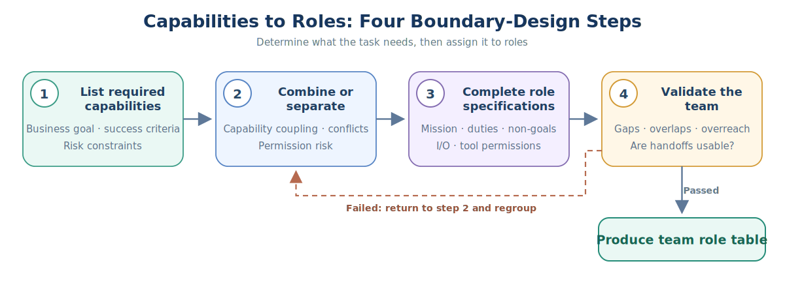
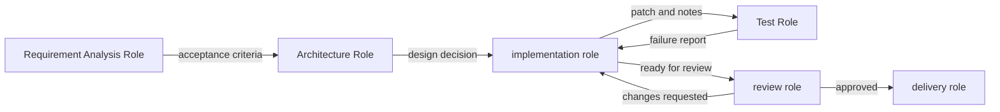

# Multi-Agent Knowledge · Step 2: Role and Team Design

> A role is not a personality play, but a combination of responsibilities, authorities, inputs, outputs and evaluation criteria.


## 1. Core terminology of role and team design

When you first encounter the terms below, use these working definitions as a quick reference; later sections cover their properties and engineering implications.

| Term | Working definition | Key idea |
|---|---|---|
| Role | Role | The agent's responsibility boundaries and behavioral identity in the team. |
| Mission | Mission | The main purpose of the character's existence. |
| Non-goals | Non-goals | Clearly state what the role should not do. |
| Capability matrix | Capability matrix | Use a table to illustrate the relationship between roles, capabilities, tools, and outputs. |


<!-- learning-path:start -->
<div class="learning-path">
<div class="learning-path-title">How to study this chapter</div>
<div class="learning-path-step"><span>1</span><div> First establish the role structure with the responsibility, input and output matrix, and then divide the role boundaries from the capability requirements (sections 1 to 3). </div></div>
<div class="learning-path-step"><span>2</span><div>Redefine role specifications, structured output, number of roles, capability coverage, and Prompt criteria (sections 4-8). </div></div>
<div class="learning-path-step"><span>3</span><div>Finally, examine interaction protocols and team anti-patterns, and select a role template appropriate for the specific task (sections 9-11). </div></div>
</div>
<!-- learning-path:end -->

---

## 2. Responsibility, input and output matrix of role design

The Character Matrix is the general index for this chapter. It breaks down a role into missions, responsibilities, non-goals, capabilities, tool permissions and output contracts, and each subsequent section will implement one of them.


<div class="concept-card">
<div class="concept-line">Role</div>
<div class="concept-line"> → Mission explains why the character exists </div>
<div class="concept-line"> → Responsibilities describe what it must accomplish </div>
<div class="concept-line"> → Non-goals describe what it should not touch </div>
<div class="concept-line"> → Capabilities describe which tasks it is good at </div>
<div class="concept-line"> → Tool permissions describe which tools it can call </div>
<div class="concept-line"> → Output contract describes how downstream uses its product </div>
</div>

Project anchor:
- CAMEL uses role-playing to promote autonomous cooperation: [CAMEL](https://arxiv.org/abs/2303.17760)
- ChatDev splits the development organization into CEO, CTO, Programmer, Reviewer and other roles: [ChatDev](https://arxiv.org/abs/2307.07924)
- CrewAI’s Agent, Task, and Crew are engineering implementations of role-based collaboration: [CrewAI Docs](https://docs.crewai.com/en/concepts/crews)

The matrix only explains "which fields are required for a complete role", but does not answer how to obtain these roles from tasks. The next section starts from the capabilities required by the business and completes grouping, role specifications and team verification in sequence.

---

## 3. Design process from capability requirements to role boundaries


Roles are not "give the model a professional name". Character design should answer four questions: what it is responsible for, what it is not responsible for, what it can see, and what it can do. Only when these four questions are clear will the team not cover each other.

First, use a four-step picture to capture the main line, and then expand the details of the judgment of each step behind the picture:

### 3.1 From capability requirements to role definition

This diagram only retains the four key states of character design: ability list, ability grouping, character specification, and team verification. The team role table will be formed only if the verification is passed; if it is not passed, return to the second step to regroup.



When reading the diagram, pay attention to this: This is not a one-time linear process. When gaps, overlaps, overreach, or handover issues are discovered in the fourth step, you must return to the second step to adjust the ability groupings instead of just modifying the role names.

#### 3.1.1 Four steps of the character design process

1. **List required capabilities from business objectives, success criteria, and risk constraints. ** First break out the task steps and required knowledge, and then add tools, data, operating environment, approval and independent review capabilities. The output here is a complete list of abilities, not yet a list of characters.
2. **Decide on merging or splitting based on capability coupling, conflict of responsibilities and authority risks. ** Capabilities that have the same context, close collaboration, low risk, and do not require independent review can be combined into the same role; capabilities that have conflicts of interest in implementation and review, have higher risks with tool or data permissions, require independent perspectives, or parallel candidates should be split into different roles. This step outputs a set of role candidates.
3. **Complete boundary specifications for each role candidate. ** `mission` and success conditions explain why the role exists; `responsibilities` explains what must be accomplished; `non-goals` specifies what cannot be taken over; the input and output contract stipulates which products it consumes and delivers; tool permissions are configured according to the principle of least privilege. Without any of these, a role is just a job title.
4. **Check whether the role combination can close the loop at the team level. ** Check in turn whether the required capabilities are fully covered, whether responsibilities are duplicated or conflicting, whether the authority is out of bounds, and whether the upstream products are clearly available for downstream consumption. The team role table will be formed only after everything has passed; if any gaps in capabilities, overlapping responsibilities, oversteps of authority or unconsumable handover products are found, return to the second step to merge or split again.

There is no one-to-one correspondence between abilities and roles. Multiple strongly coupled, low-risk capabilities can be assumed by the same role; capabilities that require independent review, have conflicts of interest, or have high-risk permissions should be split into different roles. What is judged here is not "whether the role names are complete", but whether the entire team can form a closed loop in terms of responsibilities, authority and products.

In order to avoid preconceptions about role names, you should first list the abilities required for the task, and then determine which abilities require independent roles:

| Abilities | Whether independent roles are required | Reasons |
|---|---|---|
| Requirements clarification | Needs | Determine the scope of the task, affecting all subsequent steps |
| Data retrieval | Required | Citation and source management required |
| Solution design | Needs | Need to weigh structure and constraints |
| Code implementation | Required | Requires write permission and test feedback |
| Security review | Usually required | Should be separated from the implementer |
| Final writing | As appropriate | If the product is a report or document, it needs to be expressed uniformly |

Then map the abilities to roles:

### 3.2 Handover relationship between roles

This diagram corresponds to the role mapping paragraph, illustrating how each role output becomes a downstream input.




When reading the picture, pay attention to: Whether the character boundaries are clear depends on whether the handover objects are clear.


<div class="concept-card">
<div class="concept-line">RequirementAnalyst</div>
<div class="concept-line"> -> output acceptance criteria</div>
<div class="concept-line"></div>
<div class="concept-line">Researcher</div>
<div class="concept-line"> -> output evidence table</div>
<div class="concept-line"></div>
<div class="concept-line">Architect</div>
<div class="concept-line"> -> output design decision record</div>
<div class="concept-line"></div>
<div class="concept-line">Developer</div>
<div class="concept-line"> -> output patch / implementation notes</div>
<div class="concept-line"></div>
<div class="concept-line">Reviewer</div>
<div class="concept-line"> -> output blocking findings / approval</div>
</div>

A common bad design is "all characters can do everything". For example, a Researcher can also write the final conclusion, a Reviewer can also change the code, and a Developer can also approve his or her submission. This may seem convenient in the short term, but will cause a loss of checks and balances in the long term.

Good role boundaries are written as testable rules:

<div class="concept-card">
<div class="concept-line">Reviewer can: </div>
<div class="concept-line"> - read diff</div>
<div class="concept-line"> - Run test </div>
<div class="concept-line">- gives approval / changes_requested</div>
<div class="concept-line"></div>
<div class="concept-line">Reviewer Not possible: </div>
<div class="concept-line">- Directly modify and implement </div>
<div class="concept-line"> - Ignore failed tests </div>
<div class="concept-line"> - Approve without evidence</div>
</div>

When designing characters, first write each character into the following "three paragraphs":

1. Mission: Why it exists.
2. Inputs/Outputs: What are inputs and outputs.
3. Permissions: Which tools can be used and which tools cannot be used.

If a character can't explain its output, it's not a character, just a chat personality.

---

## 4. Role responsibilities and output specification template

What was obtained in the previous section was the role candidates and handover relationships. In this section, one of the candidates is written into a reviewable role specification. The specification must also constrain responsibilities, non-goals, inputs, outputs, tools, and memory scopes; it cannot just describe what the role is "good at."

The following takes the security review role as an example. When reading, check whether each responsibility has corresponding inputs and tools, and whether each non-goal actually limits overreach.


```yaml
name: SecurityReviewer
mission: Identify security risks in design and code
responsibilities:
  - Check authentication, authorization, logs, input validation
  - Gives severity and executable repair suggestions
  - Clarify whether to block publishing
non_goals:
  - Not responsible for implementing functionality
  - Not responsible for rewriting product requirements
input_contract:
  - design_doc
  - patch_summary
  - test_report
output_contract:
  schema: SecurityReviewResult
tools:
  - read_file
  - grep
  - dependency_scan
memory_scope:
  - project_security_policy
  - previous_incidents
```

<div class="code-explanation">
<div class="code-explanation-title">YAML configuration instructions</div>
<p><strong> Purpose: </strong> Use YAML to fully describe the security review role instead of just giving a role name. <strong> Execution process: </strong> Configuration declares mission, responsibilities, non-targets, input and output contracts, tools and readable memory range respectively. <strong> Key points: </strong> Responsibilities and permissions are mutually reinforcing: reviewers can read and scan, but are not responsible for implementation, nor can they approve publication by themselves. </p>
</div>

This YAML solves "how role boundaries are read by humans and configuration systems", but it does not yet guarantee that model output can be reliably consumed by programs. The next section turns <code>output_contract</code> into a verifiable data model.


---

## 5. Use Pydantic to define role output contracts


If the Security Review Agent only returns "Overall OK, but there is a high-risk vulnerability," it's difficult for a downstream program to reliably judge whether it can be released: it has to understand this sentence again, and may ignore inconsistencies.

A safer approach is to agree on a "result form" first. The role of Pydantic is to check whether the Agent has filled in the results according to this form: whether the fields are complete, whether the type is correct, and whether the value is within the allowed range.

```python
from pydantic import BaseModel, Field
from typing import Literal

class Finding(BaseModel):
    id: str
    severity: Literal["info", "low", "medium", "high", "critical"]
    title: str
    evidence: str = Field(min_length=1)
    recommendation: str = Field(min_length=1)

class SecurityReviewResult(BaseModel):
    decision: Literal["approve", "needs_changes", "reject"]
    findings: list[Finding]
    confidence: float = Field(ge=0.0, le=1.0)
```

<div class="code-explanation">
<div class="code-explanation-title">Python code description</div>
<p><strong>Purpose: </strong> Specifies which fields the security review agent must return and what is allowed to be filled in each field. <strong> Constraints: </strong><code>Literal</code> Limit optional text, for example, severity cannot be written as <code>very_high</code>; <code>Field</code> requires that the evidence and recommendations cannot be empty and limits the confidence to 0 to 1. <strong>Key points: </strong>This code only defines data rules and has not yet performed release judgment. </p>
</div>


The actual output from the Agent is usually first parsed into a Python dictionary. For example:

```python
raw_review = {
    "decision": "needs_changes",
    "findings": [
        {
            "id": "SEC-001",
            "severity": "high",
            "title": "Management interface lacks permission check",
            "evidence": "Ordinary users can call /admin/export",
            "recommendation": "Verify administrator role at interface entry",
        }
    ],
    "confidence": 0.92,
}

review = SecurityReviewResult.model_validate(raw_review)
```

<div class="code-explanation">
<div class="code-explanation-title">Python code description</div>
<p><strong> Input: </strong><code>raw_review</code> is the raw structured result returned by the security review agent. <strong> Processing process: </strong><code>model_validate()</code> Check the data item by item according to the previous model; when all the rules are met, a <code>SecurityReviewResult</code> object is obtained. <strong> Verifiable output: </strong> This example is verified successfully; if <code>severity</code> is changed to <code>urgent</code>, it will be omitted <code>evidence</code>, or change <code>confidence</code> to <code>1.5</code>, Pydantic will report verification errors. </p>
</div>


Through Pydantic verification, it can only mean that "the format of the result is correct", but not "it has met the release conditions". Release conditions are business rules and need to be judged separately by Supervisor:


```python
def can_ship(review: SecurityReviewResult) -> bool:
    blocking = {"high", "critical"}
    return (
        review.decision == "approve"
        and not any(f.severity in blocking for f in review.findings)
    )
```

<div class="code-explanation">
<div class="code-explanation-title">Python code description</div>
<p><strong>Purpose: </strong>Write "can be released" rules into deterministic code. <strong> Processing: </strong> The program first checks whether the overall decision is <code>approve</code>, and then checks whether there is <code>high</code> in the discovery list or <code>critical</code> Risk; both conditions must be met. <strong> Verifiable output: </strong> The above example returns <code>False</code> because the decision is <code>needs_changes</code> and there is one <code>high</code> Risk. </p>
</div>


The complete data flow is:

<div class="concept-card">
<div class="concept-line"> Security Review Agent generates original results </div>
<div class="concept-line"> → Pydantic checks fields, types and value ranges </div>
<div class="concept-line"> → Get SecurityReviewResult in trusted format</div>
<div class="concept-line"> → Supervisor application publishing rule </div>
<div class="concept-line"> → The output can be published (True) or prevented from being published (False) </div>
</div>

The most important difference here is: **Pydantic is responsible for "whether the data is qualified", and Supervisor is responsible for "whether the business is released". **


---

## 6. Number of roles and principle of differentiation


Bad team:
- Analyst
- Senior Analyst
- Expert Analyst
- Critical Analyst

These roles are highly overlapping.

Good team:
- Researcher: Find evidence.
- Synthesizer: synthesize into structures.
- Critic: Find loopholes.
- Executor: Call high-risk tools.
- Judge: rule by rubric.

Determine whether a character deserves to exist:

```python
def role_is_distinct(role_a, role_b) -> bool:
    overlap = set(role_a["responsibilities"]) & set(role_b["responsibilities"])
    unique_tools = set(role_a["tools"]) ^ set(role_b["tools"])
    unique_output = role_a["output_contract"] != role_b["output_contract"]
    return len(overlap) <= 1 and (unique_tools or unique_output)
```

<div class="code-explanation">
<div class="code-explanation-title">Python code description</div>
<p><strong>Purpose: </strong>Roughly judge whether two characters are really different, rather than renaming and copying. <strong>Execution process: </strong>The function compares the intersection of responsibilities, tool symmetry difference and output contract. Only when the responsibilities overlap no more than one item and the tools or outputs are different in at least one way are they considered independent. <strong> Key points: </strong> This is a heuristic check. Responsibilities with similar semantics but different texts still need to be reviewed manually or by a semantic model. </p>
</div>


---

## 7. Team capability coverage matrix


```python
roles = {
    "researcher": {
        "can_search": True,
        "can_write_files": False,
        "can_execute_code": False,
        "can_approve": False,
    },
    "developer": {
        "can_search": False,
        "can_write_files": True,
        "can_execute_code": True,
        "can_approve": False,
    },
    "reviewer": {
        "can_search": False,
        "can_write_files": False,
        "can_execute_code": True,
        "can_approve": True,
    },
}
```

<div class="code-explanation">
<div class="code-explanation-title">Python code description</div>
<p><strong> Purpose: </strong> Use a competency matrix to demonstrate the separation of powers among researchers, developers, and reviewers. <strong>Execution process: </strong>Each role specifies whether it can search, write files, execute code and approve, and the scheduler can filter actions accordingly. <strong> Key points: </strong> The matrix should be converted into a real tool authorization policy and cannot just exist as a document. </p>
</div>


The meaning of matrix:
- Design permissions.
- Estimate risks.
- Automatic routing.
- Conduct security audits.

---

## 8. Design and review criteria for role prompts

The competency matrix specifies what a role can do, and prompts bring responsibility boundaries and output contracts into each execution. The available role prompts should at least describe the identity, non-targets, inputs, check items, output formats, and what to do if there is insufficient evidence.


Vague writing:

<div class="concept-card">
<div class="concept-line">You are a senior expert, please complete the task carefully. </div>
</div>

Executable writing:

<div class="concept-card">
<div class="concept-line">You are a SecurityReviewer. </div>
<div class="concept-line">You only do security reviews and do not implement functions. </div>
<div class="concept-line"></div>
<div class="concept-line">Input: </div>
<div class="concept-line">- design_doc</div>
<div class="concept-line">- patch_summary</div>
<div class="concept-line">- test_report</div>
<div class="concept-line"></div>
<div class="concept-line"> You must check: </div>
<div class="concept-line">1. Whether the token or key may be logged </div>
<div class="concept-line">2. Whether user input is verified </div>
<div class="concept-line">3. Whether permission boundaries can be bypassed </div>
<div class="concept-line">4. Whether there are timeout and retry restrictions for external requests</div>
<div class="concept-line"></div>
<div class="concept-line"> The output must be SecurityReviewResult JSON. </div>
<div class="concept-line">If there is insufficient evidence, set decision to needs_changes. </div>
</div>

The difference between the two writing methods is not the strength of the tone, but whether the results can be checked downstream. After the input, check items, and output schemas are clear, the runtime can reject the missing field results, and other roles can also stably consume the review conclusions.

---

## 9. Minimum interaction agreement between roles

Role specifications and prompts only constrain a single role; the team also needs to specify how the product moves from upstream to downstream. This section uses the unified <code>run()</code> interface to represent the minimum interaction protocol: the upstream delivers structured results, the downstream only reads the declared input, and if the review fails, it returns to the implementation role with the discovery items.


```python
class RoleAgent:
    def __init__(self, name, prompt, output_model):
        self.name = name
        self.prompt = prompt
        self.output_model = output_model

    def run(self, input_data: dict):
        raw = llm_json(self.prompt, input_data)
        return self.output_model.model_validate(raw)

design = architect.run({"requirements": requirements})
patch = developer.run({"design": design})
review = security_reviewer.run({"design": design, "patch": patch})

if not can_ship(review):
    patch = developer.run({"design": design, "review_findings": review.findings})
```

<div class="code-explanation">
<div class="code-explanation-title">Python code description</div>
<p><strong> Purpose: </strong> shows how roles can be strung together into a closed loop of design, implementation, review and rework using a unified runtime interface. <strong> Execution process: </strong><code>RoleAgent.run()</code> Call the model and verify it according to the output model. Subsequent roles consume the upstream structured results; when the access control is not passed, the discovered items are returned to the developer for repair. <strong>Key points: </strong>The actual cycle also requires setting the maximum number of reworks and recording each version of the product. </p>
</div>

This closed loop should also add message number, product version, timeout and maximum number of reworks. In the absence of these constraints, even if individual roles are correctly defined, teams can still duplicate work or endless round-trips; the next section focuses on these team-level anti-patterns.


---

## 10. Team Design Anti-Patterns

The following anti-patterns all result from missing fields or interaction rules mentioned above. When problems are discovered, go back to the role matrix, permissions policy, or handover contract modifications rather than continuing to add role descriptions.


1. **Excessive character anthropomorphism**: Write a bunch of characters but no output contracts.
2. **Everyone has all the tools**: Permissions are out of control.
3. **Everyone reads the full context**: Cost explosion.
4. **No ultimate person in charge**: The debate never stops.
5. **Only positive roles**: No one is responsible for refuting and testing.
6. **Reviewer appears too late**: In the end, it was discovered that the requirement was wrong.

Anti-pattern checks are for deleting and fixing characters, not for mechanically expanding the team. Only after the inspection is completed can the character combination be reused for common tasks; four starting templates are given in the next section.

---

## 11. Team role templates for common tasks

Templates only represent common sequences of responsibilities, not fixed answers that can be copied directly. Before use, you still need to add or delete roles according to task risks, tool permissions and product types, and add handovers for each arrow.


### 11.1 Research Writing Team


<div class="concept-card">
<div class="concept-line">Researcher → EvidenceCurator → Synthesizer → Critic → Editor</div>
</div>

The Researcher collects materials, the EvidenceCurator verifies the sources, the Synthesizer forms the structure, the Critic checks the arguments, and the Editor unifies expression; for high-risk topics, a field Reviewer should be added.

### 11.2 Software Development Team


<div class="concept-card">
<div class="concept-line">ProductManager → Architect → Developer → Tester → Reviewer</div>
</div>

This chain separates requirements, design, implementation, testing and independent review; if the system allows direct deployment, an Operator with controlled permissions or manual approval needs to be added.

### 11.3 Data Analysis Team


<div class="concept-card">
<div class="concept-line">DataProfiler → Analyst → Statistician → VisualizationDesigner → Reviewer</div>
</div>

DataProfiler first confirms data quality, Analyst and Statistician are responsible for analysis and statistical validity respectively, VisualizationDesigner is responsible for expression, and Reviewer checks whether the conclusion is supported by the data.

### 11.4 Operation and maintenance response team


<div class="concept-card">
<div class="concept-line">Triage → LogAnalyst → Mitigator → RiskReviewer → IncidentCommander</div>
</div>

Triage determines the event type, LogAnalyst locates evidence, Mitigator proposes or performs mitigating actions, RiskReviewer checks side effects, and IncidentCommander is responsible for final decision-making and communication.

---

<!-- chapter-check:start -->
## 12. Role and team design self-examination
<div class="chapter-check">
<div class="chapter-check-title"> Without reading the text, try to answer </div>
<ul>
<li> Can you differentiate between two roles using responsibilities, non-goals, tools and outputs? </li>
<li>Can permission conflicts or role vacancies be discovered from the competency matrix? </li>
<li> Can you describe how the product is returned to Developer after being rejected by Reviewer? </li>
</ul>
</div>
<!-- chapter-check:end -->

---

## 13. Summary of this chapter: role boundaries, capability coverage and collaboration contracts

Role design should be centered around **differences in responsibilities, tool permissions, input and output contracts, and review standards**, rather than around "does it look like the same person".

See the next chapter **③ Task decomposition and planning**: After the role boundaries are clear, then break the goals into task maps that can be assigned and accepted.
