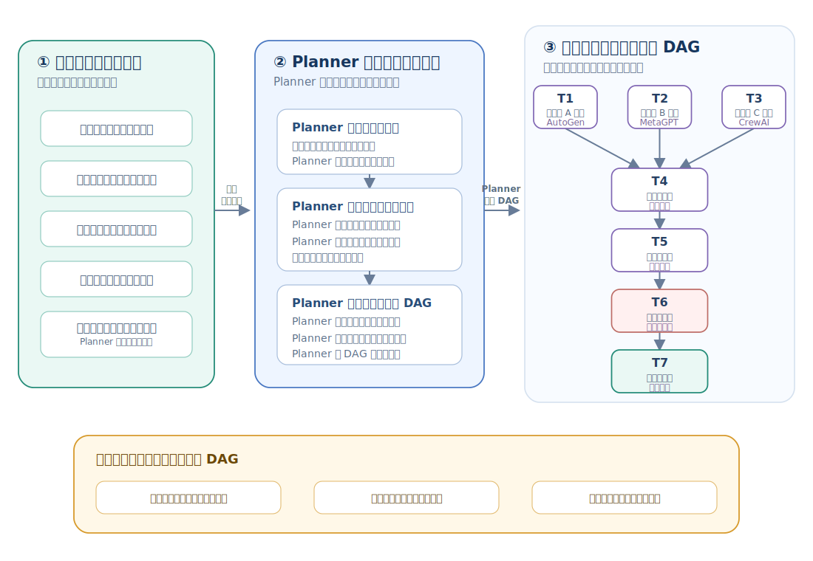
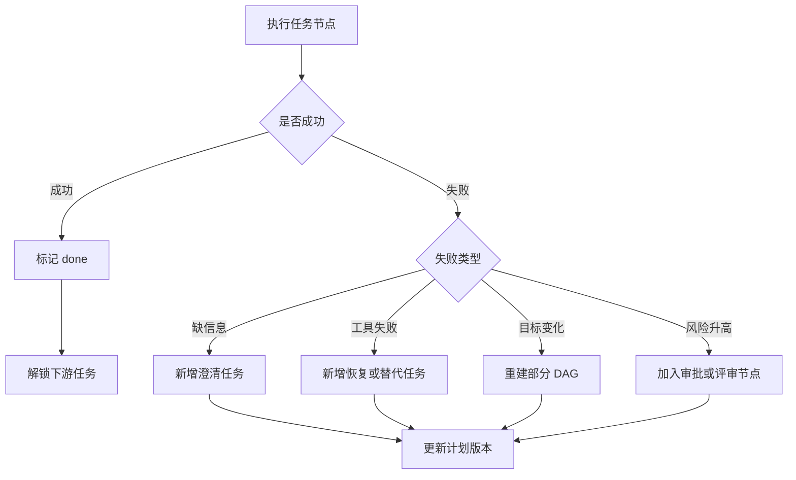

# Multi-Agent Knowledge · 第 ③ 步：任务分解与规划

> Planner 把目标转换成带负责人、依赖和验收条件的任务图，并在失败时只重排受影响的部分。

## 1. 任务分解与规划核心术语

本章第一次遇到下面这些英文时，先按这个中文含义理解；后文再展开它们的特性和工程做法。

| 英文术语 | 中文说法 | 先记住的含义 |
|---|---|---|
| Planner | 规划器 | 生成任务图、依赖关系和执行顺序的角色或模块。 |
| DAG | 有向无环图 | 用节点表示任务、箭头表示依赖且不会循环的任务结构。 |
| SOP | 标准作业流程 | 把经验流程固定成可重复执行的步骤。 |
| ToT / GoT | 思维树 / 思维图 | 分别用树和一般图组织、比较与组合多条推理路线。 |


<!-- learning-path:start -->
<div class="learning-path">
<div class="learning-path-title">本章怎么学</div>
<div class="learning-path-step"><span>1</span><div>先认识规划对象，再把用户目标转换成带依赖和验收条件的任务图（第 1～3 节）。</div></div>
<div class="learning-path-step"><span>2</span><div>再定义任务图和 Planner 输出，并学习依赖排序、SOP 与 ToT/GoT（第 4～8 节）。</div></div>
<div class="learning-path-step"><span>3</span><div>最后根据失败、假设和预算信号触发重规划，并用常见错误表检查计划（第 9～10 节）。</div></div>
</div>
<!-- learning-path:end -->

---

## 2. 从用户目标到可执行任务的规划结构

规划要先固定输入和输出，再讨论算法。输入包括目标、约束和成功标准；输出包括任务节点、依赖、负责人、验收条件以及失败后的重规划入口。


<div class="concept-card">
<div class="concept-line">目标（Goal）</div>
<div class="concept-line">  → 约束条件（Constraints）说明不能越过的边界</div>
<div class="concept-line">  → 成功标准（Success criteria）说明怎样算完成</div>
<div class="concept-line">  → 任务分解（Task decomposition）把目标拆成节点</div>
<div class="concept-line">  → 依赖图（Dependency graph / DAG）说明先后关系</div>
<div class="concept-line">  → 角色分配（Assignment）说明谁负责每个节点</div>
<div class="concept-line">  → 执行与重规划（Execution / Replanning）根据反馈调整计划</div>
</div>

引用：
- Tree of Thoughts 把推理看成可搜索的 thought tree：[ToT](https://arxiv.org/abs/2305.10601)
- Graph of Thoughts 允许思路以一般图组合、回馈和复用：[GoT](https://arxiv.org/abs/2308.09687)
- ReAct 交错推理和行动：[ReAct](https://arxiv.org/abs/2210.03629)
- MetaGPT 用 SOP 约束协作流程：[MetaGPT](https://arxiv.org/abs/2308.00352)
- ChatDev 用 chat chain 管理软件开发阶段：[ChatDev](https://arxiv.org/abs/2307.07924)

这些方法分别解决流程固化、多路线搜索和推理—行动交错，但本章会把它们统一放进“生成并维护可执行任务图”这一主线。下一节先走完一次完整规划流程，再逐项实现数据结构和调度规则。

---

## 3. 从目标到可执行任务图的完整规划流程

本节先明确一个容易混淆的边界：**Planner 不负责亲自完成所有子任务，它负责生成一组其他 Agent 能够领取、执行和验收的“工作单”**。如果 Planner 直接输出最终代码或最终报告，却没有负责人、依赖和验收条件，那仍然只是一次回答，不是多智能体规划。

Planner 的工作不是把一句话拆成几个标题，而是把目标变成可执行、可验证、可重试的任务图。一个好的计划至少包含：任务、依赖、负责人、输入、输出、验收标准和失败处理。

把它想成项目经理写给团队的一组正式工单，而不是写给自己的备忘录。每张工单必须让接收者在不重新猜测用户意图的情况下开始工作，也必须让调度器知道什么时候可以启动、让 Reviewer 知道怎样验收。

可以用下面的结构图讲：

### 3.1 从用户目标到任务 DAG

这张图把 Planner 的工作拆成三个不同对象：输入的目标与约束、构图时补充的任务契约，以及最终交给调度器的有向无环图。构图动作可以按步骤完成，但任务执行顺序必须由依赖边决定，不能继续画成一条固定流水线。



读图时重点看：T1、T2、T3 没有前置依赖，可以同时进入执行队列；T4 必须等三者全部完成。节点说明“要做什么以及怎样验收”，依赖边说明“什么时候可以开始”，二者共同构成可执行计划。

可以把构图过程压缩成四步：

1. 从用户目标中确认范围、非目标、成功标准、预算和风险边界。
2. 拆出具有独立产物的候选任务，而不是只列主题标题。
3. 为每个节点补齐 owner、inputs、outputs、acceptance 和 fallback。
4. 添加依赖边并检查缺失依赖、循环、不可达节点和可并行分支，然后才交给调度器。

先认清一个“计划节点”不可缺少的字段：

| 字段 | 作用 |
|---|---|
| `id` | 让后续消息能引用任务 |
| `objective` | 这一步要完成什么 |
| `owner` | 哪个 Agent 负责 |
| `inputs` | 需要哪些材料 |
| `outputs` | 产出什么 |
| `depends_on` | 依赖哪些任务 |
| `acceptance` | 如何判断完成 |
| `fallback` | 失败后怎么办 |

右侧示例对应“写一篇框架对比报告”：T1、T2、T3 分别收集 AutoGen、MetaGPT 和 CrewAI 的官方资料；T4 等三份资料齐备后抽取对比维度；随后 T5 生成初稿、T6 检查引用与事实、T7 输出最终建议。任务清单相同，如果没有这些依赖边，调度器就无法判断哪些任务能并行、哪些任务必须等待。

这张图揭示了 Planning（规划）和 Topology（拓扑）的关系：如果 T1/T2/T3 可以并行，就适合星型或黑板；如果必须一步接一步，就适合链式；如果每一步都需要审批，就需要 Supervisor（主管）。

规划还要处理不确定性。真实系统里，第一版计划经常错，所以 Planner 需要根据观察重规划：

### 3.2 重规划的触发路径

这张图紧贴重规划段落，展示失败后如何新增澄清、恢复、审批或替代任务。




读图时重点看：计划是可变状态，不是一次性生成的静态列表。


<div class="concept-card">
<div class="concept-line">执行 T2</div>
<div class="concept-line">  ↓</div>
<div class="concept-line">发现官方文档版本变化</div>
<div class="concept-line">  ↓</div>
<div class="concept-line">新增 T2b：核对迁移说明</div>
<div class="concept-line">  ↓</div>
<div class="concept-line">更新 T4 的输入依赖</div>
<div class="concept-line">  ↓</div>
<div class="concept-line">通知 Synthesizer 延后写初稿</div>
</div>

所以计划不是静态清单，而是系统运行中的可变状态。请亲手画一次 DAG（有向无环图），不要只写项目列表；依赖、并行和回退会在图上更直观。

---

## 4. 可执行任务图的数据结构


这一节只解决一件事：**把自然语言计划变成运行时能够读取的数据**。Planner 生成 `Plan`，调度器读取 `depends_on` 决定哪些任务可以启动，路由器读取 `owner_role` 选择接收者，Reviewer 读取 `success_check` 判断产物是否通过。

以 OAuth 案例为例，第一张工单不是“实现登录”，而是“确认需求”。它的完成证据是需求清单中没有 TBD；只有这张工单通过，架构师的设计任务才会被解锁。这样做是为了防止 Developer 在回调地址、用户合并策略还不明确时提前写代码。


```python
from pydantic import BaseModel, Field
from typing import Literal

class SubTask(BaseModel):
    id: str
    title: str
    description: str
    owner_role: str
    depends_on: list[str] = Field(default_factory=list)
    success_check: str
    risk: Literal["low", "medium", "high"] = "low"

class Plan(BaseModel):
    goal: str
    assumptions: list[str]
    subtasks: list[SubTask]
    done_definition: str
```

<div class="code-explanation">
<div class="code-explanation-title">Python 代码说明</div>
<p><strong>用途：</strong>把计划表示为带依赖、负责人、验收条件和风险的结构化对象。<strong>执行过程：</strong><code>Plan</code> 保存总目标与完成定义，每个 <code>SubTask</code> 则描述一个可分派工作单元。<strong>关键点：</strong><code>success_check</code> 使“做完”可以验证，<code>depends_on</code> 则为后续拓扑排序提供依据。</p>
</div>


代码中的类只是数据外壳，真正重要的是字段之间形成的协作关系：`id` 让消息能引用任务，`owner_role` 表示责任归属，`depends_on` 表示启动门槛，`success_check` 表示完成门槛，`risk` 决定是否插入额外评审。

下面的实例只展示前两个节点。完整计划还应继续加入实现、测试、安全评审和文档任务；不要把示例中的两项误解为完整 OAuth 开发流程。


下面把这两个节点填入前述 <code>Plan</code> 数据结构：

```python
plan = Plan(
    goal="为一个 Flask API 增加 GitHub OAuth 登录",
    assumptions=["已有用户表", "允许增加依赖"],
    subtasks=[
        SubTask(
            id="T1",
            title="确认需求",
            description="列出 OAuth 登录的回调 URL、用户字段和失败行为。",
            owner_role="product_manager",
            success_check="需求清单无 TBD。",
        ),
        SubTask(
            id="T2",
            title="设计认证流程",
            description="给出路由、session、token 存储和错误处理设计。",
            owner_role="architect",
            depends_on=["T1"],
            success_check="安全评审无 high 风险。",
            risk="medium",
        ),
    ],
    done_definition="测试通过，安全评审通过，文档更新。",
)
```

<div class="code-explanation">
<div class="code-explanation-title">Python 代码说明</div>
<p><strong>用途：</strong>用 GitHub OAuth 功能演示如何实例化一份真实计划。<strong>执行过程：</strong>T1 先消除需求中的 TBD，T2 依赖 T1 并负责认证流程设计，整体完成还要求测试、安全评审和文档更新。<strong>关键点：</strong>假设被单独记录，一旦“已有用户表”等假设失效就应触发重规划。</p>
</div>


当这份计划进入运行时后，系统的动作顺序是：先投递 T1；T1 通过验收后把产物引用写入共享状态；再把该引用作为 T2 输入；如果 T1 仍有 TBD，T2 保持阻塞而不是“先做起来再说”。这就是结构化计划与普通 TODO 的根本差别。


---

## 5. Planner Prompt 的输入约束与输出格式


Planner Prompt 是给规划角色的“岗位说明 + 输入包 + 输出表单”。它不是让模型自由讨论解决方案，而是限制模型只提交一份候选计划。运行时收到候选计划后，还要检查角色是否存在、依赖 ID 是否有效、图中是否有环、高风险任务是否安排了独立评审。

在 OAuth 案例中，输入应包含现有 Flask 项目、允许修改的目录、可用角色、测试工具、禁止读取生产密钥等约束。输出则必须是任务列表，而不是 OAuth 教程或代码实现。


<div class="concept-card">
<div class="concept-line">你是 Planner。</div>
<div class="concept-line">你的任务不是解决问题，而是把问题拆成可验证的子任务。</div>
<div class="concept-line"></div>
<div class="concept-line">输入：</div>
<div class="concept-line">- 用户目标</div>
<div class="concept-line">- 约束</div>
<div class="concept-line">- 可用 Agent</div>
<div class="concept-line">- 工具和风险等级</div>
<div class="concept-line"></div>
<div class="concept-line">输出 JSON：</div>
<div class="concept-line">{</div>
<div class="concept-line">  &quot;goal&quot;: &quot;...&quot;,</div>
<div class="concept-line">  &quot;assumptions&quot;: [],</div>
<div class="concept-line">  &quot;subtasks&quot;: [</div>
<div class="concept-line">    {</div>
<div class="concept-line">      &quot;id&quot;: &quot;T1&quot;,</div>
<div class="concept-line">      &quot;title&quot;: &quot;...&quot;,</div>
<div class="concept-line">      &quot;description&quot;: &quot;...&quot;,</div>
<div class="concept-line">      &quot;owner_role&quot;: &quot;...&quot;,</div>
<div class="concept-line">      &quot;depends_on&quot;: [],</div>
<div class="concept-line">      &quot;success_check&quot;: &quot;...&quot;,</div>
<div class="concept-line">      &quot;risk&quot;: &quot;low|medium|high&quot;</div>
<div class="concept-line">    }</div>
<div class="concept-line">  ],</div>
<div class="concept-line">  &quot;done_definition&quot;: &quot;...&quot;</div>
<div class="concept-line">}</div>
<div class="concept-line"></div>
<div class="concept-line">要求：</div>
<div class="concept-line">- 每个子任务必须有可检查的完成条件。</div>
<div class="concept-line">- 不要把同一个任务拆成多个同义步骤。</div>
<div class="concept-line">- 高风险任务必须安排 review。</div>
</div>

可以按下面的顺序使用这个模板：

1. 业务入口先提供目标、范围、成功标准和硬约束。
2. 能力注册表提供当前真正可用的角色和工具。
3. Planner 生成符合 Schema 的候选 `Plan`。
4. 确定性校验器拒绝无负责人、无验收条件、依赖不存在或存在循环的计划。
5. 只有校验通过的任务才进入执行队列。

因此，Prompt 的目的不是“让模型想得更详细”，而是让模型输出能够被下一层程序拒绝、接受和调度的结构。

---

## 6. 任务依赖排序与并行调度


Planner 输出依赖图后，执行器还不知道启动顺序。依赖排序要回答的是：哪些任务必须等待，哪些任务现在就能并行，计划中是否存在永远无法开始的循环。

例如 `T2 设计认证流程` 依赖 `T1 确认需求`，因此不能提前启动；`T3 调研 GitHub OAuth 限制` 如果只依赖公开文档，就可以与 T1 并行；`T4 实现` 同时依赖 T2 和 T3，必须等待两者都完成。

<div class="concept-card">
<div class="concept-line">可立即执行：T1 确认需求、T3 调研平台限制</div>
<div class="concept-line">等待 T1：T2 设计认证流程</div>
<div class="concept-line">等待 T2 + T3：T4 实现 OAuth</div>
<div class="concept-line">等待 T4：T5 测试、T6 安全评审</div>
</div>

拓扑排序会给出一种合法先后顺序，但不应把所有任务强制串行化。同一时刻所有依赖都已完成的节点，可以交给不同 Agent 并行处理。

```python
def topo_sort(tasks: list[SubTask]) -> list[SubTask]:
    by_id = {t.id: t for t in tasks}
    visited, temp, result = set(), set(), []

    def visit(tid: str):
        if tid in visited:
            return
        if tid in temp:
            raise ValueError(f"cycle detected at {tid}")
        temp.add(tid)
        for dep in by_id[tid].depends_on:
            visit(dep)
        temp.remove(tid)
        visited.add(tid)
        result.append(by_id[tid])

    for task in tasks:
        visit(task.id)
    return result
```

<div class="code-explanation">
<div class="code-explanation-title">Python 代码说明</div>
<p><strong>用途：</strong>按依赖关系为子任务生成合法执行顺序。<strong>执行过程：</strong>深度优先遍历先访问依赖，再把当前任务加入结果；<code>temp</code> 集合用于发现递归路径中的环。<strong>关键点：</strong>代码还应校验依赖 ID 是否存在，并在可并行任务间保留并发机会。</p>
</div>


运行前还应补两类检查：依赖的任务 ID 必须真实存在；高风险写操作即使依赖已经满足，也要等待权限或人工审批。依赖排序解决“先后关系”，不负责绕过安全门禁。


---

## 7. SOP：可复用任务流程的固化


SOP 是“标准作业程序”。它适合已经重复执行并且步骤相对稳定的工作。Planner 不需要每次从零发明“需求 → 设计 → 实现 → 测试 → 评审”，而是先加载这条流程，再根据当前任务填入具体负责人、输入和验收条件。

这意味着 SOP 和 Planner 不是二选一：SOP 提供稳定骨架，Planner 负责把当前目标映射到骨架、补充例外任务，并在环境变化时局部调整。对一个全新研究问题，没有成熟 SOP 时才需要更开放的规划。

软件开发 SOP 示例：

```yaml
name: small_feature_delivery
stages:
  - id: requirements
    owner: product_manager
    output: requirement_spec
  - id: design
    owner: architect
    input: requirement_spec
    output: design_doc
  - id: implementation
    owner: developer
    input: design_doc
    output: patch
  - id: test
    owner: tester
    input: patch
    output: test_report
  - id: review
    owner: reviewer
    input: [design_doc, patch, test_report]
    output: approval
```

<div class="code-explanation">
<div class="code-explanation-title">YAML 配置说明</div>
<p><strong>用途：</strong>用 YAML 把小功能交付的标准作业流程固化为配置。<strong>执行过程：</strong>每个阶段声明负责人、输入和输出，评审阶段同时消费设计文档、补丁和测试报告。<strong>关键点：</strong>配置描述的是契约链，运行引擎仍需负责校验产物、失败重试和阶段门控。</p>
</div>


SOP 的价值：
- 降低每次规划的不确定性。
- 让教学更清楚。
- 方便插入质量门。
- 方便回放和评测。

在 OAuth 案例中，SOP 规定必须经过需求、设计、实现、测试和评审；Planner 则决定额外加入“核对 GitHub 文档”和“迁移现有用户”两个任务。若安全评审失败，系统回到实现节点，而不是重新讨论已经确认的需求。

---

## 8. ToT 与 GoT：树式搜索和图式推理


Tree of Thoughts 适合“有多条合理路线，而且第一条路线很可能不是最好”的任务。它不适合固定流程，也不应该用于每一个普通子任务，否则多分支生成和评分会迅速放大 token 与延迟。

在多智能体系统中，可以让不同 Architect 独立提出 OAuth session 方案，再由 Security Reviewer 按安全性、改动范围和可测试性评分。保留多个候选的目的是探索真实差异，不是让同一模型换三个名字重复相同答案。

基本过程分四步：先生成候选路线，再对每条路线建立可比较状态，随后用同一个 Rubric 评分，只扩展最有希望的少数分支；达到预算或深度上限后选择一条进入正式任务图。

<div class="concept-card">
<div class="concept-line">generate candidate thoughts</div>
<div class="concept-line">  → score thoughts</div>
<div class="concept-line">  → expand promising thoughts</div>
<div class="concept-line">  → backtrack if needed</div>
</div>

简化代码：

```python
def tree_search(problem, generate, score, depth=3, width=3):
    frontier = [{"path": [], "state": problem, "score": 0.0}]
    for _ in range(depth):
        candidates = []
        for node in frontier:
            for thought in generate(node["state"], node["path"]):
                new_path = node["path"] + [thought]
                candidates.append({
                    "path": new_path,
                    "state": apply_thought(node["state"], thought),
                    "score": score(problem, new_path),
                })
        frontier = sorted(candidates, key=lambda x: x["score"], reverse=True)[:width]
    return frontier[0]
```

<div class="code-explanation">
<div class="code-explanation-title">Python 代码说明</div>
<p><strong>用途：</strong>给出 Tree of Thoughts 风格的有限宽度树搜索骨架。<strong>执行过程：</strong>每一层从当前前沿生成多个思路、应用到状态并评分，然后只保留得分最高的 <code>width</code> 个节点继续扩展。<strong>关键点：</strong>这是束搜索近似；生成器、状态转移和评分器的质量决定搜索是否真的优于单一路径。</p>
</div>


在多 Agent 中，可以让不同 Agent 生成不同分支，再由 Judge 打分。

Judge 的分数不能直接当作事实。高风险设计仍要经过测试、静态检查或人工安全评审；如果候选差异很小，应停止搜索并回退到更简单的单路线规划。

GoT（Graph of Thoughts）把树进一步放宽成一般图。除了从一个节点向下分叉，它还允许多个思路合并成一个新结论、复用先前结果，或者通过反馈边再次改进已有思路。

| 方法 | 结构特点 | 适合场景 |
|---|---|---|
| ToT | 候选从父节点分叉，按评分保留或回退 | 比较几条相对独立的方案 |
| GoT | 思路可以分叉、合并、复用和反馈 | 多份局部结果需要汇总，或中间结论会反复修订 |

例如三个 Agent 分别分析安全性、实现成本和兼容性：ToT 更像保留三条完整候选路线再选一条；GoT 可以把三者的局部结论合并成新方案，再把评审反馈连回相关节点。GoT 更灵活，但图状态、去重、停止条件和成本控制也更复杂；普通任务优先使用更简单的 ToT 或固定任务图。

这里的 GoT 是推理过程中的“思维图”，不要与前文用于调度 Agent 的任务 DAG 混为一谈。二者都使用图结构，但一个组织候选思路，另一个组织可执行任务及其依赖。

---

## 9. 重规划的触发条件与处理流程


计划不是一次性文档，但“重规划”也不等于清空进度重新生成全部任务。正确做法是先保存已经通过验收的产物，定位失败影响的节点，再只替换尚未完成或已经失效的部分，并发布新的计划版本。

OAuth 案例中，如果 GitHub 的文档显示原先选择的 token 流程已经弃用，系统应保留已经确认的业务需求，作废受影响的设计与实现任务，新增“核对迁移说明”，然后让架构师重新设计。已经完成且仍有效的需求调研不需要重复付费。

以下情况要重规划：
- 工具失败。
- 依赖任务输出不满足 success_check。
- Reviewer 给出 blocking issue。
- 新证据推翻假设。
- 成本超过预算。
- 人类改变需求。

```python
def needs_replan(state: dict) -> bool:
    return any([
        state.get("blocking_issue_count", 0) > 0,
        state.get("failed_tools", 0) >= 2,
        state.get("invalid_assumption") is True,
        state.get("cost_ratio", 0) > 0.8,
    ])
```

<div class="code-explanation">
<div class="code-explanation-title">Python 代码说明</div>
<p><strong>用途：</strong>集中定义需要放弃原计划并重新规划的触发信号。<strong>执行过程：</strong>出现阻塞问题、工具连续失败、关键假设失效或预算消耗超过八成中的任一情况，就返回 <code>True</code>。<strong>关键点：</strong>触发重规划后应保留已完成产物，避免从零开始重复付费。</p>
</div>


一次安全的重规划包含四个动作：记录触发原因；标记哪些假设或产物失效；计算受影响的下游节点；生成新版本并通知相关 owner。若只是一次可重试的网络超时，应由执行器重试，不必惊动 Planner 重建任务图。


---

## 10. 任务规划常见错误


看到计划“能生成”不等于它“能运行”。可以通过症状判断 Planner 究竟哪里出了问题：

| 症状 | 会发生什么 | 应怎样修正 |
|---|---|---|
| 拆得太细 | 每个小动作都触发一次模型调用，通信成本超过工作本身 | 合并由同一角色、同一上下文连续完成的步骤 |
| 拆得太粗 | 接收者仍要重新理解目标，无法判断交付边界 | 拆到一个角色能够独立领取并产生单一主要产物 |
| 没有成功标准 | Agent 可以自称完成，调度器却无法解锁下游 | 把测试、文件、字段或评审决定写成可检查条件 |
| 没有 review 节点 | 上游错误直接进入最终答案或生产环境 | 按风险插入独立测试、Reviewer 或人工审批 |
| 没有依赖关系 | 并行任务启动后才发现缺少输入 | 明确每个输入来自哪个任务和哪个产物版本 |
| 没有预算 | ToT、返工或动态角色无限扩张 | 设置调用、token、时间、返工次数和人工升级上限 |

最后用四个问题审查每个节点：接收者是谁？开始前需要什么？完成后交付什么？谁用什么证据判定通过？任何一个问题答不出来，这个节点就还不能进入执行队列。

---

<!-- chapter-check:start -->
## 11. 任务分解与规划自检
<div class="chapter-check">
<div class="chapter-check-title">不看正文，尝试回答</div>
<ul>
<li>能否把一个目标拆成含负责人、依赖和验收条件的子任务？</li>
<li>能否判断任务图中哪些节点可以并行？</li>
<li>能否列出假设失效、工具失败和预算耗尽时的重规划策略？</li>
<li>能否区分 ToT、GoT 与任务 DAG 分别组织的是什么？</li>
</ul>
</div>
<!-- chapter-check:end -->

---

## 12. 本章总结：任务图、依赖关系与重规划

规划的交付物不是“漂亮的大纲”，而是**可以被调度器执行、被 Reviewer 检查、被系统回放的任务图**。

下一章看 **④ 协作拓扑**：任务与角色都有了，接下来决定它们如何连接、等待和改变共享状态。
