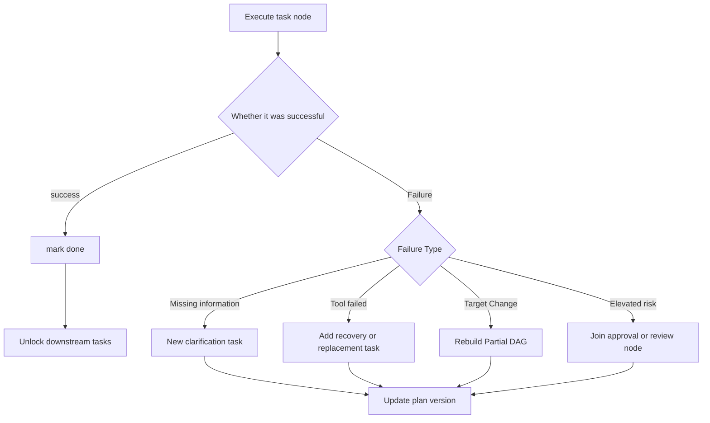

# Multi-Agent Knowledge · Step 3: Task decomposition and planning

> Planner converts goals into task graphs with owners, dependencies, and acceptance criteria, and reschedules only the affected parts in case of failure.

## 1. Core terms of task decomposition and planning

When you first encounter the terms below, use these working definitions as a quick reference; later sections cover their properties and engineering implications.

| Term | Working definition | Key idea |
|---|---|---|
| Planner | Planner | A role or module that generates task graphs, dependencies, and execution sequences. |
| DAG | Directed Acyclic Graph | A task structure that uses nodes to represent tasks and arrows to represent dependencies and does not cycle. |
| SOP | Standard Operating Procedure | Fix the experience process into repeatable steps. |
| ToT / GoT | Thinking Tree / Thinking Map | Organize, compare and combine multiple reasoning routes using trees and general diagrams respectively. |


<!-- learning-path:start -->
<div class="learning-path">
<div class="learning-path-title">How to study this chapter</div>
<div class="learning-path-step"><span>1</span><div> First understand the planning object, and then convert the user goal into a task graph with dependencies and acceptance conditions (sections 1 to 3). </div></div>
<div class="learning-path-step"><span>2</span><div>Redefine the task graph and Planner output, and learn dependency ordering, SOP and ToT/GoT (sections 4 to 8). </div></div>
<div class="learning-path-step"><span>3</span><div>Finally trigger replanning based on failures, assumptions, and budget signals, and check the plan with a table of common errors (Section 9-10). </div></div>
</div>
<!-- learning-path:end -->

---

## 2. Planning structure from user goals to executable tasks

Planning should first fix the input and output, and then discuss the algorithm. The input includes goals, constraints and success criteria; the output includes task nodes, dependencies, responsible persons, acceptance conditions and re-planning entry after failure.


<div class="concept-card">
<div class="concept-line"> Goal </div>
<div class="concept-line"> → Constraints describe the boundaries that cannot be crossed </div>
<div class="concept-line"> → Success criteria describe what counts as completion</div>
<div class="concept-line"> → Task decomposition splits the target into nodes </div>
<div class="concept-line"> → Dependency graph (DAG) illustrates the sequence relationship </div>
<div class="concept-line"> → Role assignment (Assignment) describes who is responsible for each node </div>
<div class="concept-line"> → Execution / Replanning (Execution / Replanning) Adjust the plan based on feedback </div>
</div>

References:
- Tree of Thoughts Think of reasoning as a searchable thought tree: [ToT](https://arxiv.org/abs/2305.10601)
- Graph of Thoughts allows ideas to be combined, fed back and reused in general graphs: [GoT](https://arxiv.org/abs/2308.09687)
- ReAct interweaves reasoning and action: [ReAct](https://arxiv.org/abs/2210.03629)
- MetaGPT uses SOP to constrain the collaboration process: [MetaGPT](https://arxiv.org/abs/2308.00352)
- ChatDev uses chat chain to manage software development stages: [ChatDev](https://arxiv.org/abs/2307.07924)

These methods respectively solve process solidification, multi-route search and reasoning-action interleaving, but this chapter will unify them into the main line of "generating and maintaining executable task graphs". In the next section, we will first go through the complete planning process, and then implement the data structure and scheduling rules one by one.

---

## 3. Complete planning process from goals to executable task map

This section first clarifies an easily confused boundary: **Planner is not responsible for completing all subtasks personally, it is responsible for generating a set of "work orders" that other Agents can pick up, execute and accept.** If Planner directly outputs the final code or final report without the person in charge, dependencies, and acceptance conditions, it is still just a one-time answer, not multi-agent planning.

The job of the Planner is not to break a sentence into several headings, but to turn the goal into an executable, verifiable, and retryable task map. A good plan contains at least: tasks, dependencies, responsible persons, inputs, outputs, acceptance criteria and failure handling.

Think of it like a formal set of tickets written by the project manager to the team, rather than a memo to themselves. Each work order must allow the recipient to start working without second-guessing the user's intent. It must also let the scheduler know when it can be started and the reviewer know how to accept it.

It can be explained using the following structure diagram:

### 3.1 From user goals to task DAG

This diagram splits the Planner's work into three different objects: the input goals and constraints, the task contract supplemented during composition, and the directed acyclic graph finally handed over to the scheduler. Composition actions can be completed step by step, but the order of task execution must be determined by the dependent edges and cannot continue to be drawn as a fixed assembly line.


When reading the picture, pay attention to: T1, T2, and T3 have no pre-dependencies and can enter the execution queue at the same time; T4 must wait for all three to complete. The nodes describe "what to do and how to accept it", and the dependent edges describe "when it can be started." The two together form an executable plan.

The composition process can be compressed into four steps:

1. Identify scope, non-goals, success criteria, budget and risk boundaries from user goals.
2. Break out candidate tasks with independent products instead of just listing topic titles.
3. Complete owner, inputs, outputs, acceptance and fallback for each node.
4. Add dependency edges and check for missing dependencies, cycles, unreachable nodes, and parallelizable branches before handing it over to the scheduler.

First, recognize an indispensable field of the "plan node":

| Field | Function |
|---|---|
| `id` | Allow subsequent messages to reference the task |
| `objective` | What to accomplish in this step |
| `owner` | Which Agent is responsible |
| `inputs` | What materials are needed |
| `outputs` | What is produced |
| `depends_on` | Which tasks it depends on |
| `acceptance` | How to judge completion |
| `fallback` | What to do after failure |

The example on the right corresponds to "writing a framework comparison report": T1, T2, and T3 collect official information from AutoGen, MetaGPT, and CrewAI respectively; T4 extracts comparison dimensions after the three other materials are complete; then T5 generates a first draft, T6 checks references and facts, and T7 outputs final recommendations. The task list is the same. Without these dependency edges, the scheduler cannot determine which tasks can be parallelized and which tasks must wait.

This picture reveals the relationship between Planning and Topology: If T1/T2/T3 can be parallel, it is suitable for star or blackboard; if it must be done step by step, it is suitable for chain; if each step requires approval, a Supervisor is needed.

Planning also deals with uncertainty. In real systems, the first version of the plan is often wrong, so the Planner needs to re-plan based on observations:

### 3.2 Replanned trigger path

This diagram follows the replanning paragraph and shows how to add clarification, recovery, approval, or replacement tasks after failure.




When reading the picture, pay attention to this: the plan is a variable state, not a static list generated at once.


<div class="concept-card">
<div class="concept-line"> executes T2</div>
<div class="concept-line">  ↓</div>
<div class="concept-line"> Found official document version change </div>
<div class="concept-line">  ↓</div>
<div class="concept-line">New T2b: Check Migration Instructions</div>
<div class="concept-line">  ↓</div>
<div class="concept-line"> Update T4’s input dependency </div>
<div class="concept-line">  ↓</div>
<div class="concept-line"> Notifies Synthesizer of delay in writing first draft </div>
</div>

So the plan is not a static list, but a variable state of the system in operation. Please draw a DAG (Directed Acyclic Graph) by yourself, don't just write a list of projects; dependencies, parallelism and fallback will be more intuitive on the graph.

---

## 4. Data structure of executable task graph


This section only solves one thing: **turn natural language plans into data that can be read at runtime**. The Planner generates `Plan`, the scheduler reads `depends_on` to determine which tasks can be started, the router reads `owner_role` to select the recipient, and the Reviewer reads `success_check` to determine whether the product passes.

Taking the OAuth case as an example, the first work order is not "implement login", but "confirm requirements". The evidence of its completion is that there is no TBD in the requirements list; only when this ticket is passed will the architect's design task be unlocked. This is done to prevent developers from writing code in advance when the callback address and user merge strategy are not clear yet.


```python
from pydantic import BaseModel, Field
from typing import Literal

class SubTask(BaseModel):
    id: str
    title: str
    description: str
    owner_role: str
    depends_on: list[str] = Field(default_factory=list)
    success_check: str
    risk: Literal["low", "medium", "high"] = "low"

class Plan(BaseModel):
    goal: str
    assumptions: list[str]
    subtasks: list[SubTask]
    done_definition: str
```

<div class="code-explanation">
<div class="code-explanation-title">Python code description</div>
<p><strong> Purpose: </strong> represents the plan as a structured object with dependencies, owners, acceptance conditions and risks. <strong> execution process: </strong><code>Plan</code> saves the overall goal and completion definition, and each <code>SubTask</code> describes a dispatchable work unit. <strong>Key points: </strong><code>success_check</code> makes "done" verifiable, <code>depends_on</code> provides the basis for subsequent topological sorting. </p>
</div>


The classes in the code are just data shells, what really matters are the collaborative relationships formed between the fields: `id` allows the message to refer to the task, `owner_role` represents the attribution of responsibility, `depends_on` represents the launch threshold, `success_check` represents the completion threshold, and `risk` determines whether to insert additional reviews.

The example below only shows the first two nodes. A complete plan should also continue to include implementation, testing, security review, and documentation tasks; don't misunderstand the two items in the example as a complete OAuth development process.


Next, fill these two nodes into the aforementioned <code>Plan</code> data structure:

```python
plan = Plan(
    goal="Add GitHub OAuth login to a Flask API",
    assumptions=["Existing user table", "Allow adding dependencies"],
    subtasks=[
        SubTask(
            id="T1",
            title="Confirm requirements",
            description="Lists callback URLs, user fields, and failure behaviors for OAuth logins.",
            owner_role="product_manager",
            success_check="Requirements list has no TBD.",
        ),
        SubTask(
            id="T2",
            title="Design Certification Process",
            description="Given routing, session, token storage and error handling designs.",
            owner_role="architect",
            depends_on=["T1"],
            success_check="Security review without high risk.",
            risk="medium",
        ),
    ],
    done_definition="Test passed, security review passed, document updated.",
)
```

<div class="code-explanation">
<div class="code-explanation-title">Python code description</div>
<p><strong>Purpose: </strong> Demonstrates how to instantiate a real plan using the GitHub OAuth feature. <strong>Execution process: </strong>T1 first eliminates the TBD in the requirements. T2 depends on T1 and is responsible for the certification process design. The overall completion also requires testing, safety reviews and document updates. <strong> Key points: </strong> Assumptions are recorded separately. Once assumptions such as "existing user table" are invalid, replanning should be triggered. </p>
</div>


When this plan enters runtime, the system's action sequence is: deliver T1 first; after T1 passes acceptance, write the product reference into the shared state; then input the reference as T2; if T1 still has TBD, T2 remains blocked instead of "do it first and talk about it later". This is the fundamental difference between structured planning and ordinary TODO.


---

## 5. Input constraints and output format of Planner Prompt


Planner Prompt is "job description + input package + output form" for planning roles. Rather than letting the model freely discuss solutions, it restricts the model to submitting only one candidate plan. After the runtime receives the candidate plan, it also checks whether the role exists, whether the dependency ID is valid, whether there are loops in the graph, and whether independent reviews are scheduled for high-risk tasks.

In the OAuth case, the input should include constraints such as existing Flask projects, directories allowed to be modified, available roles, testing tools, no reading of production keys, etc. The output must be a task list, not an OAuth tutorial or code implementation.


<div class="concept-card">
<div class="concept-line">You are the Planner. </div>
<div class="concept-line">Your job is not to solve the problem, but to break it into verifiable subtasks. </div>
<div class="concept-line"></div>
<div class="concept-line">Input: </div>
<div class="concept-line">- User target</div>
<div class="concept-line"> - Constraint </div>
<div class="concept-line">-Available Agent</div>
<div class="concept-line">- Tools and risk levels</div>
<div class="concept-line"></div>
<div class="concept-line"> Output JSON: </div>
<div class="concept-line">{</div>
<div class="concept-line">  &quot;goal&quot;: &quot;...&quot;,</div>
<div class="concept-line">  &quot;assumptions&quot;: [],</div>
<div class="concept-line">  &quot;subtasks&quot;: [</div>
<div class="concept-line">    {</div>
<div class="concept-line">      &quot;id&quot;: &quot;T1&quot;,</div>
<div class="concept-line">      &quot;title&quot;: &quot;...&quot;,</div>
<div class="concept-line">      &quot;description&quot;: &quot;...&quot;,</div>
<div class="concept-line">      &quot;owner_role&quot;: &quot;...&quot;,</div>
<div class="concept-line">      &quot;depends_on&quot;: [],</div>
<div class="concept-line">      &quot;success_check&quot;: &quot;...&quot;,</div>
<div class="concept-line">      &quot;risk&quot;: &quot;low|medium|high&quot;</div>
<div class="concept-line">    }</div>
<div class="concept-line">  ],</div>
<div class="concept-line">  &quot;done_definition&quot;: &quot;...&quot;</div>
<div class="concept-line">}</div>
<div class="concept-line"></div>
<div class="concept-line"> requires: </div>
<div class="concept-line">- Each subtask must have checkable completion conditions. </div>
<div class="concept-line">- Don’t break the same task into synonymous steps. </div>
<div class="concept-line">- High-risk tasks must be scheduled for review. </div>
</div>

You can use this template in the following order:

1. The business entrance first provides goals, scope, success criteria and hard constraints.
2. The capability registry provides currently available roles and tools.
3. Planner generates candidate `Plan` that conforms to Schema.
4. The deterministic verifier rejects plans that have no responsible person, no acceptance conditions, non-existent dependencies or loops.
5. Only tasks that pass the verification will enter the execution queue.

Therefore, the purpose of Prompt is not to "make the model think in more detail", but to allow the model output to be a structure that can be rejected, accepted, and scheduled by the next-level program.

---

## 6. Task dependency sorting and parallel scheduling


After Planner outputs the dependency graph, the executor does not yet know the startup sequence. Dependency sorting answers: Which tasks must wait, which tasks can be parallelized now, and whether there are loops in the plan that can never be started.

For example, `T2 design certification process ` depends on `T1 to confirm the requirement `, so it cannot be started in advance; `T3 investigates GitHub OAuth restrictions ` If you only rely on public documents, you can use it with T1 is parallel; `T4 implements ` which depends on both T2 and T3 and must wait for both to complete.

<div class="concept-card">
<div class="concept-line"> can be executed immediately: T1 confirmed requirements, T3 research platform restrictions </div>
<div class="concept-line">Waiting for T1:T2 Design Certification Process</div>
<div class="concept-line"> waits for T2 + T3: T4 implements OAuth</div>
<div class="concept-line">Waiting for T4: T5 test, T6 safety review</div>
</div>

Topological sorting will give a legal sequence, but it should not force serialization of all tasks. Nodes with all dependencies completed at the same time can be handed over to different agents for parallel processing.

```python
def topo_sort(tasks: list[SubTask]) -> list[SubTask]:
    by_id = {t.id: t for t in tasks}
    visited, temp, result = set(), set(), []

    def visit(tid: str):
        if tid in visited:
            return
        if tid in temp:
            raise ValueError(f"cycle detected at {tid}")
        temp.add(tid)
        for dep in by_id[tid].depends_on:
            visit(dep)
        temp.remove(tid)
        visited.add(tid)
        result.append(by_id[tid])

    for task in tasks:
        visit(task.id)
    return result
```

<div class="code-explanation">
<div class="code-explanation-title">Python code description</div>
<p><strong> Purpose: </strong> Generate legal execution order for subtasks based on dependencies. <strong> Execution process: </strong> Depth-first traversal first accesses dependencies, and then adds the current task to the result; <code>temp</code> collection is used to discover cycles in the recursive path. <strong>Key points: </strong>The code should also verify whether the dependency ID exists and preserve concurrency opportunities between parallelizable tasks. </p>
</div>


Two types of checks should be added before running: the dependent task ID must actually exist; high-risk write operations must wait for permissions or manual approval even if the dependencies have been met. Dependence sorting solves the "sequence relationship" and is not responsible for bypassing security access control.


---

## 7. SOP: Solidification of reusable task processes


SOP is "Standard Operating Procedure". It is suitable for work that has been performed repeatedly and the steps are relatively stable. Planner does not need to invent "requirements → design → implementation → test → review" from scratch every time. Instead, it loads this process first and then fills in the specific person in charge, input and acceptance conditions based on the current task.

This means that SOP and Planner are not an alternative: SOP provides a stable skeleton, and Planner is responsible for mapping current goals to the skeleton, supplementing exception tasks, and making local adjustments when the environment changes. For a new research problem, a more open plan is needed when there is no mature SOP.

Software Development SOP Example:

```yaml
name: small_feature_delivery
stages:
  - id: requirements
    owner: product_manager
    output: requirement_spec
  - id: design
    owner: architect
    input: requirement_spec
    output: design_doc
  - id: implementation
    owner: developer
    input: design_doc
    output: patch
  - id: test
    owner: tester
    input: patch
    output: test_report
  - id: review
    owner: reviewer
    input: [design_doc, patch, test_report]
    output: approval
```

<div class="code-explanation">
<div class="code-explanation-title">YAML configuration instructions</div>
<p><strong>Purpose: </strong>Use YAML to solidify the standard operating process of small function delivery into a configuration. <strong>Execution process: </strong>Each stage declares the person responsible, input and output, and the review stage consumes design documents, patches and test reports at the same time. <strong>Key points: </strong>The configuration describes the contract chain, and the running engine is still responsible for verifying the product, retrying on failure, and stage gating. </p>
</div>


Value of SOP:
- Reduce uncertainty every time planning.
- Make teaching clearer.
- Convenient insertion of quality doors.
- Convenient for playback and evaluation.

In the OAuth case, the SOP stipulates that it must go through requirements, design, implementation, testing, and review; Planner decided to add two additional tasks: "Check GitHub documentation" and "Migrate existing users." If the security review fails, the system returns to the implementation node rather than re-discussing the confirmed requirements.

---

## 8. ToT and GoT: tree search and schema reasoning


Tree of Thoughts is good for tasks where there are multiple reasonable routes, and the first route is probably not the best. It is not suitable for fixed processes, nor should it be used for every common subtask, otherwise multi-branch generation and scoring will quickly amplify tokens and delays.

In a multi-agent system, different Architects can independently propose OAuth session solutions, and then the Security Reviewer will score them based on security, scope of changes, and testability. The purpose of retaining multiple candidates is to explore the real differences, not to let the same model repeat the same answer with three names.

The basic process is divided into four steps: first generate candidate routes, then establish a comparable status for each route, then use the same rubric to score, and only expand the most promising few branches; after reaching the budget or depth limit, select one to enter the formal task map.

<div class="concept-card">
<div class="concept-line">generate candidate thoughts</div>
<div class="concept-line">  → score thoughts</div>
<div class="concept-line">  → expand promising thoughts</div>
<div class="concept-line">  → backtrack if needed</div>
</div>

Simplified code:

```python
def tree_search(problem, generate, score, depth=3, width=3):
    frontier = [{"path": [], "state": problem, "score": 0.0}]
    for _ in range(depth):
        candidates = []
        for node in frontier:
            for thought in generate(node["state"], node["path"]):
                new_path = node["path"] + [thought]
                candidates.append({
                    "path": new_path,
                    "state": apply_thought(node["state"], thought),
                    "score": score(problem, new_path),
                })
        frontier = sorted(candidates, key=lambda x: x["score"], reverse=True)[:width]
    return frontier[0]
```

<div class="code-explanation">
<div class="code-explanation-title">Python code description</div>
<p><strong> Purpose: </strong> gives a Tree of Thoughts-style limited-width tree search skeleton. <strong> Execution process: </strong> Each layer generates multiple ideas from the current frontier, applies them to the state and scores, and then only retains the highest-scoring <code>width</code> nodes to continue expanding. <strong>Key Point: </strong>This is a beam search approximation; the quality of the generator, state transitions, and scorer determines whether the search is truly better than a single path. </p>
</div>


In multi-Agent, different Agents can generate different branches and then be scored by the Judge.

Judge's score cannot be taken directly as fact. High-risk designs still go through testing, static inspection, or manual safety review; if the candidate differences are small, the search should be stopped and fall back to simpler single-route planning.

GoT (Graph of Thoughts) further relaxes the tree into a general graph. In addition to branching downward from a node, it also allows multiple ideas to be merged into a new conclusion, reuse previous results, or improve existing ideas again through feedback edges.

| Method | Structural Characteristics | Suitable Scenario |
|---|---|---|
| ToT | Candidates are forked from the parent node, retained or rolled back according to score | Compare several relatively independent solutions |
| GoT | Ideas can be forked, merged, reused and fed back | Multiple partial results need to be summarized, or intermediate conclusions will be revised repeatedly |

For example, three agents analyze security, implementation cost and compatibility respectively: ToT is more like retaining three complete candidate routes and then selecting one; GoT can merge the partial conclusions of the three into a new solution, and then connect the review feedback back to the relevant nodes. GoT is more flexible, but the graph state, deduplication, stopping conditions and cost control are also more complex; ordinary tasks prefer to use simpler ToT or fixed task graphs.

The GoT here is the "mind map" in the reasoning process, and should not be confused with the task DAG used to schedule Agents previously. Both use a graph structure, but one organizes candidate ideas and the other organizes executable tasks and their dependencies.

---

## 9. Trigger conditions and processing flow of re-planning


A plan is not a one-time document, but "replanning" does not mean clearing the schedule and regenerating all tasks. The correct approach is to first save the products that have passed acceptance, locate the nodes affected by the failure, then only replace the unfinished or expired parts, and release a new planned version.

In the OAuth case, if GitHub's documentation shows that the originally selected token process has been deprecated, the system should retain the confirmed business requirements, cancel the affected design and implementation tasks, add "check migration instructions", and then let the architect redesign it. Needs research that has been completed and is still valid does not require repeated payment.

Replanning is required in the following situations:
- Tool failed.
- Dependent task output does not satisfy success_check.
- Reviewer gives blocking issue.
- New evidence overturns a hypothesis.
- Costs exceed budget.
- Human needs for change.

```python
def needs_replan(state: dict) -> bool:
    return any([
        state.get("blocking_issue_count", 0) > 0,
        state.get("failed_tools", 0) >= 2,
        state.get("invalid_assumption") is True,
        state.get("cost_ratio", 0) > 0.8,
    ])
```

<div class="code-explanation">
<div class="code-explanation-title">Python code description</div>
<p><strong> Purpose: </strong> Centrally defines trigger signals that require abandoning the original plan and replanning. <strong> Execution process: </strong> If there is any blocking problem, continuous tool failure, failure of key assumptions, or budget consumption exceeding 80%, <code>True</code> will be returned. <strong> Key points: </strong> Completed products should be retained after triggering replanning to avoid repeated payments from scratch. </p>
</div>


A safe replanning includes four actions: recording the triggering reason; marking which assumptions or products are invalid; calculating the affected downstream nodes; generating a new version and notifying the relevant owners. If there is only a retryable network timeout, the executor should try again without disturbing the Planner to rebuild the task graph.


---

## 10. Common mistakes in mission planning


Seeing that a plan "can be generated" does not mean that it "can run". You can tell what’s wrong with Planner through symptoms:

| Symptoms | What to expect | What to do |
|---|---|---|
| Split too finely | Each small action triggers a model call, and the communication cost exceeds the work itself | Merge steps completed consecutively by the same role and the same context |
| Too rough to dismantle | The recipient still has to re-understand the goal and cannot judge the delivery boundary | Dismantle to a character who can independently receive and produce a single main product |
| No success criteria | Agent can claim completion, but the scheduler cannot unlock downstream | Write tests, files, fields or review decisions as checkable conditions |
| No review node | Upstream errors go directly to final answer or production environment | Insert independent test, Reviewer or manual approval by risk |
| No dependencies | Missing inputs are discovered only after parallel tasks are started | Make it clear which task and which product version each input comes from |
| No budget | Unlimited expansion of ToT, rework or dynamic characters | Set the upper limit of calls, tokens, time, number of reworks and manual upgrades |

Finally review each node with four questions: Who is the recipient? What do you need before you get started? What is delivered upon completion? Who uses what evidence to pass? If any question cannot be answered, the node cannot enter the execution queue.

---

<!-- chapter-check:start -->
## 11. Task decomposition and planning self-inspection
<div class="chapter-check">
<div class="chapter-check-title"> Without reading the text, try to answer </div>
<ul>
<li> Can a goal be split into subtasks with responsible persons, dependencies and acceptance conditions? </li>
<li>Can determine which nodes in the task graph can be parallelized? </li>
<li> Can you list replanning strategies when assumptions fail, tools fail, and budgets are exhausted? </li>
<li>Can you distinguish what ToT, GoT and task DAG organize respectively? </li>
</ul>
</div>
<!-- chapter-check:end -->

---

## 12. Summary of this chapter: task graph, dependencies and re-planning

The deliverable of planning is not a "beautiful outline", but a task graph that can be executed by the scheduler, checked by the Reviewer, and played back by the system.

See the next chapter **④ Collaboration Topology**: Now that the tasks and roles are there, let’s decide how they connect, wait and change the shared state.
