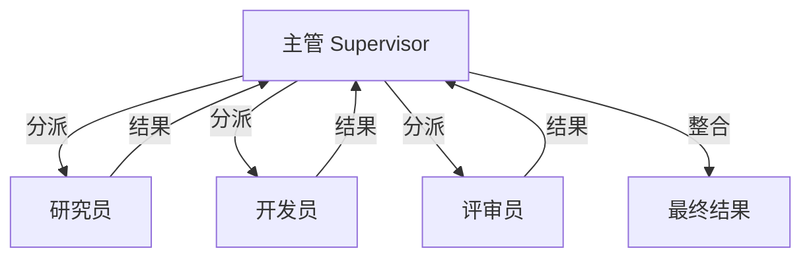
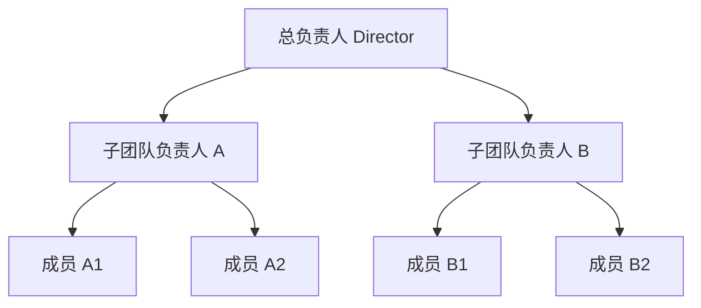
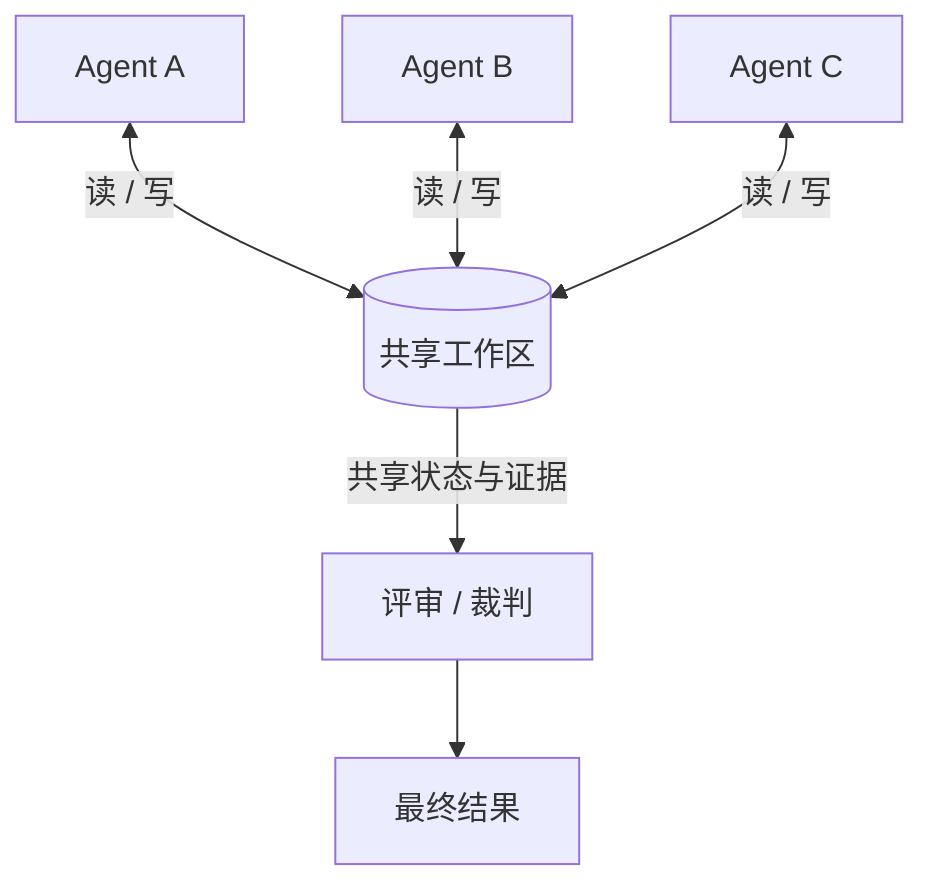
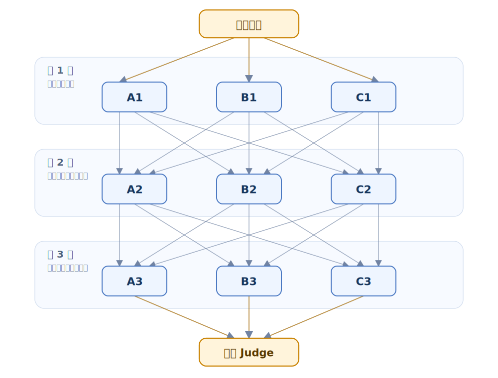
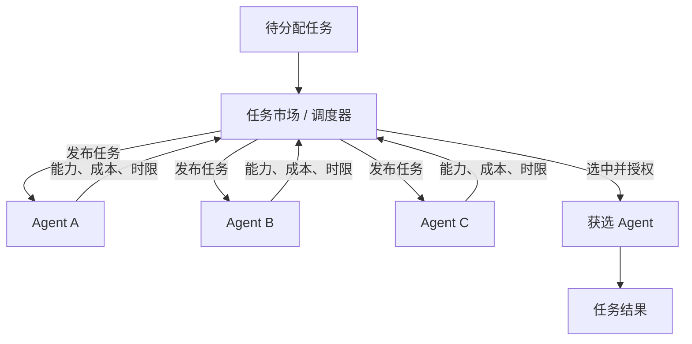

# Multi-Agent Knowledge · 第 ④ 步：协作拓扑

> 协作拓扑规定信息怎样流动、谁能修改共享状态以及谁拥有最终决策权；即使角色相同，改变拓扑也会改变团队行为。


## 1. 协作拓扑核心术语

本章第一次遇到下面这些英文时，先按这个中文含义理解；后文再展开它们的特性和工程做法。

| 英文术语 | 中文说法 | 先记住的含义 |
|---|---|---|
| Topology | 协作拓扑 | 多个智能体之间的信息连接和控制关系。 |
| Pipeline / Chain | 流水线 / 链式结构 | 任务按固定顺序从一个角色传给下一个角色。 |
| Blackboard | 黑板 | 多个智能体共享中间状态、证据和产物的工作区。 |
| Debate | 辩论结构 | 多个候选方案互相挑战，再由裁判选择或合并。 |


<!-- learning-path:start -->
<div class="learning-path">
<div class="learning-path-title">本章怎么学</div>
<div class="learning-path-step"><span>1</span><div>先认识拓扑术语，并比较链式、主管制、层级、黑板、辩论和市场结构的信息流（第 1～3 节）。</div></div>
<div class="learning-path-step"><span>2</span><div>再分别理解 Pipeline、Supervisor、Blackboard 和 Debate 的运行方式与边界（第 4～7 节）。</div></div>
<div class="learning-path-step"><span>3</span><div>最后学习 Market、Graph 和动态拓扑，并根据任务依赖、共享需求与风险选择结构（第 8～10 节）。</div></div>
</div>
<!-- learning-path:end -->

---

## 2. 常见协作拓扑的结构与适用场景

比较拓扑时要使用同一组维度：任务按什么顺序流动、状态由谁保存、角色之间怎样交换信息，以及最终决定由谁作出。下面的总览先建立共同词汇，下一节再把六种结构放到同一组图中比较。


<div class="concept-card">
<div class="concept-line">协作拓扑（Collaboration topology）</div>
<div class="concept-line">  → 链式 / 流水线（Pipeline / Chain）：A 做完交给 B，再交给 C</div>
<div class="concept-line">  → 主管制（Supervisor）：Manager 统一分派给多个角色</div>
<div class="concept-line">  → 黑板制（Blackboard）：多个角色读写同一个共享工作区</div>
<div class="concept-line">  → 辩论制（Debate）：多个观点互相挑战后交给裁判</div>
<div class="concept-line">  → 市场制（Market）：任务由具备能力的角色竞标或领取</div>
</div>

引用：
- AutoGen 强调多 Agent conversation 可以用自然语言和代码定义交互行为：[AutoGen](https://arxiv.org/abs/2308.08155)
- MetaGPT 把 SOP 编码进多角色流水线：[MetaGPT](https://arxiv.org/abs/2308.00352)
- LangGraph 常用图结构表达 Agent 工作流：[LangGraph](https://github.com/langchain-ai/langgraph)
- Swarm 强调轻量 handoff：[openai/swarm](https://github.com/openai/swarm)

这些项目分别突出流水线、图编排或交接机制，但项目名称本身不能代替拓扑分析。判断一个系统属于哪种结构，仍要回到信息流、共享状态和决策权。

---

## 3. 协作拓扑中的信息流、共享状态与决策权


协作拓扑就是 Agent 之间的连接方式。它回答的不是“有几个 Agent”，而是“信息按什么路径走，谁能影响谁，谁对最终结果负责”。

下面把六种常见拓扑分别画开。每张图只表达一种组织形状，箭头表示主要的信息或任务流向。

### 3.1 链式拓扑（Chain）的顺序信息流


读图时重点看：任务沿固定顺序单向传递；后一个角色依赖前一个角色的产物。

### 3.2 星型与主管制拓扑（Star / Supervisor）的中心调度



读图时重点看：主管统一分派、收集和整合，外围角色通常不直接互相调度。

### 3.3 层级拓扑（Hierarchy）的分层汇总



读图时重点看：任务和决策逐级下发，局部结果逐级汇总，适合规模较大的多子团队任务。

### 3.4 黑板拓扑（Blackboard）的共享状态



读图时重点看：多个角色不必互相逐一传话，而是通过同一个受治理的共享状态协作。

### 3.5 辩论拓扑（Debate）的候选评审



读图时重点看：同一轮的 A、B、C 之间没有连线；第一轮的每个节点都连接第二轮的 A2、B2、C2，第二轮也以相同方式全连接第三轮。这样每个辩论者在新一轮都能读取上一轮三个人的全部回答，最后由裁判综合 A3、B3、C3。

### 3.6 市场拓扑（Market）的竞价分配



读图时重点看：候选角色按能力、成本或时限竞标，调度器根据明确的评分规则分配任务。

同样是多个 Agent，信息路径、共享状态和裁决权不同，系统行为就会完全不同。

拓扑选择会直接影响成本、延迟和质量：

| 拓扑 | 适合场景 | 风险 |
|---|---|---|
| 链式 | 步骤固定的流水线 | 前面错了后面全错 |
| 星型 | 需要集中调度 | Supervisor 成瓶颈 |
| 层级 | 大任务、多子团队 | 层级之间信息损失 |
| 黑板 | 多人共享证据或状态 | 黑板需要治理和版本 |
| 辩论 | 高风险决策、方案选择 | 成本高，容易空转 |
| 市场 | 任务竞标、动态分配 | 评分函数难设计 |

为了看清拓扑造成的差异，下面把同一个任务分别放进三种拓扑：

任务：为一个项目选择前端框架。

- **链式做法**：Researcher 调研后把证据交给 Analyst，Analyst 形成比较结论，Writer 写成建议，Reviewer 最后检查。优点是简单；缺点是 Analyst 只能看到 Researcher 交付的材料。
- **星型做法**：Supervisor 同时把 React、Vue、Svelte 的调研任务分给不同 Researcher，再把各自结果交给 Decision Analyst 比较，最后统一整合。优点是可以并行；缺点是 Supervisor 要负责处理冲突和信息汇总。
- **辩论做法**：React、Vue、Svelte 的 Advocate 分别提出方案并互相质疑，Judge 根据证据选择或合并结论。优点是能暴露取舍；缺点是需要更多轮通信，成本更高。

### 3.7 协作拓扑的选择条件

不需要把拓扑选择画成决策树。先画清任务依赖、信息依赖和权力依赖，再按下面的任务特征选择即可：

1. **步骤固定、产物依次加工**：优先使用链式拓扑。
2. **任务可并行，但需要一个角色统一分派和整合**：优先使用星型 / 主管制拓扑。
3. **任务规模大，包含多个相对独立的子团队**：使用层级拓扑，并明确每一级的汇总格式。
4. **多个角色需要持续读取和更新同一批证据或状态**：使用黑板拓扑，并为共享状态增加版本、权限和冲突规则。
5. **结论风险高，必须比较互斥方案或主动暴露反例**：在基础拓扑上加入辩论者、批评者和独立裁判。
6. **候选角色较多，任务需要按能力、成本或负载动态分配**：使用市场拓扑，并先定义可审计的评分和授权规则。

这些条件可以组合。例如“大任务 + 共享证据 + 高风险决策”可以用层级拓扑组织子团队、用黑板共享证据，并只在关键决策点加入辩论和裁判。默认从满足需求的最简单拓扑开始，只有观测到真实瓶颈时再增加层级、共享状态或动态分配。

如果只画“谁连谁”，没有画“什么信息流过去”，拓扑图就只是装饰图，不是系统设计。

---

## 4. Pipeline：分阶段串行协作

前一节已经比较了多种组织形状，下面从约束最强的 Pipeline 开始。它把阶段顺序固定下来，每个角色消费上一阶段的产物并交付下一阶段所需的输入。


适合：
- 软件开发流水线。
- 报告写作。
- 数据分析。
- 审批流。

<div class="concept-card">
<div class="concept-line">需求分析 → 方案设计 → 实现 → 测试 → 评审 → 交付</div>
</div>

代码骨架：

```python
class Pipeline:
    def __init__(self, steps):
        self.steps = steps

    def run(self, artifact: dict) -> dict:
        for name, agent in self.steps:
            artifact = agent.run(artifact)
            artifact["_last_step"] = name
        return artifact

pipeline = Pipeline([
    ("requirements", requirements_agent),
    ("design", architect_agent),
    ("implementation", coder_agent),
    ("test", tester_agent),
    ("review", reviewer_agent),
])
```

<div class="code-explanation">
<div class="code-explanation-title">Python 代码说明</div>
<p><strong>用途：</strong>实现固定顺序的流水线拓扑。<strong>执行过程：</strong><code>run()</code> 让同一个 <code>artifact</code> 依次经过需求、设计、实现、测试和评审角色，并记录最后完成的阶段。<strong>关键点：</strong>每一步都应定义输入输出契约并持久化检查点，否则上游错误会无声传到下游。</p>
</div>


优点：可解释、可测试、可恢复。  
缺点：上游错误会传递，下游通常只能补救。

<div class="deep-dive-link">
<a href="index.html?page=topology-pipeline">深入阅读：Pipeline 流水线拓扑的现代实现</a>
<p>了解阶段门禁、检查点、背压，以及 AutoFlow、AFlow、ADAS、AAFLOW 等 2024–2026 年工作流研究。</p>
</div>

---

## 5. Supervisor：中心化任务调度

Pipeline 适合下一步可以预先确定的任务；当任务类型不固定、每次只需调用部分专家时，可以把选择权集中到 Supervisor。主管保存进度并选择下一位角色，Worker 完成后把结果交回主管。


适合：
- 用户问题类型不固定。
- 专家很多，但每次只需要其中几个。
- 需要动态路由。

```python
def route(task: str) -> str:
    if "SQL" in task or "database" in task:
        return "data_engineer"
    if "security" in task or "auth" in task:
        return "security_reviewer"
    if "UI" in task or "CSS" in task:
        return "frontend_engineer"
    return "generalist"
```

<div class="code-explanation">
<div class="code-explanation-title">Python 代码说明</div>
<p><strong>用途：</strong>用确定性关键词规则把任务分给数据、安全、前端或通用角色。<strong>执行过程：</strong>函数按条件从上到下匹配并返回唯一角色名称。<strong>关键点：</strong>规则路由便宜且可测试，但当前匹配区分大小写、词表有限，实际使用应规范化输入并准备回退策略。</p>
</div>


带状态的 supervisor：

```python
class Supervisor:
    def __init__(self, agents: dict):
        self.agents = agents

    def next_agent(self, state: dict) -> str:
        if state.get("needs_research"):
            return "researcher"
        if state.get("needs_code"):
            return "coder"
        if state.get("needs_review"):
            return "reviewer"
        return "finalizer"

    def run(self, state: dict) -> dict:
        for _ in range(8):
            name = self.next_agent(state)
            state = self.agents[name].run(state)
            if state.get("done"):
                return state
        state["error"] = "max_supervisor_turns"
        return state
```

<div class="code-explanation">
<div class="code-explanation-title">Python 代码说明</div>
<p><strong>用途：</strong>展示带共享状态和轮数限制的主管调度。<strong>执行过程：</strong><code>next_agent()</code> 根据待办标志选择角色，<code>run()</code> 最多调度八次，角色执行后把更新后的状态交回主管。<strong>关键点：</strong>若一直无法满足 <code>done</code>，系统写入明确错误，避免主管无限循环。</p>
</div>


优点：灵活。  
缺点：主管 prompt 和路由策略会成为单点风险。

<div class="deep-dive-link">
<a href="index.html?page=topology-supervisor">深入阅读：Supervisor 主管制与现代编排器</a>
<p>从普通路由函数深入到任务/进度账本、能力注册、重规划、Magentic-One 和当前框架状态。</p>
</div>

---

## 6. Blackboard：共享状态协作

Supervisor 通过中心节点传递任务，信息较多时容易形成汇总瓶颈。Blackboard 改为让角色围绕同一份受治理状态协作，适合需要持续积累证据或中间结论的任务。


黑板架构来自传统 AI 和 MAS。所有 Agent 都读写一个共享空间。

适合：
- 研究任务。
- 诊断任务。
- 多源证据收集。
- 复杂设计评审。

```python
class Blackboard:
    def __init__(self):
        self.cards = []

    def post(self, card: dict):
        required = {"id", "kind", "owner", "content"}
        missing = required - set(card)
        if missing:
            raise ValueError(f"missing fields: {missing}")
        self.cards.append(card)

    def query(self, kind: str | None = None):
        return [c for c in self.cards if kind is None or c["kind"] == kind]
```

<div class="code-explanation">
<div class="code-explanation-title">Python 代码说明</div>
<p><strong>用途：</strong>提供一个最小共享黑板，统一接收和查询中间卡片。<strong>执行过程：</strong><code>post()</code> 检查四个必填字段后追加卡片，<code>query()</code> 可按类型过滤。<strong>关键点：</strong>真实黑板还需唯一 ID、版本、并发写入、权限、归档和去重机制。</p>
</div>


示例卡片：

```python
blackboard.post({
    "id": "EV-001",
    "kind": "evidence",
    "owner": "researcher",
    "content": "AutoGen supports conversational single and multi-agent applications.",
    "source": "https://microsoft.github.io/autogen/stable/",
    "confidence": 0.9,
})
```

<div class="code-explanation">
<div class="code-explanation-title">Python 代码说明</div>
<p><strong>用途：</strong>展示研究者如何向黑板提交一条带来源和置信度的证据。<strong>执行过程：</strong>卡片以 <code>EV-001</code> 标识，正文说明结论，<code>source</code> 支持下游回查，<code>confidence</code> 表示发送者把握。<strong>关键点：</strong>额外字段未被前一段最小校验限制，生产中应使用完整 Schema。</p>
</div>


优点：信息共享自然。  
缺点：黑板会膨胀，需要 schema、去重、归档和权限。

<div class="deep-dive-link">
<a href="index.html?page=topology-blackboard">深入阅读：Blackboard 黑板拓扑与共享工作空间</a>
<p>从经典多 Agent Blackboard 论文理解中央与分布式形态，再对照 Han & Zhang、Salemi 等人的 LLM 论文和 Flock 项目，最后进入来源追踪、角色视图与调度实现。</p>
</div>

---

## 7. Debate：多候选评审与决策

Blackboard 适合共同积累事实，但共享状态本身不会自动产生独立观点。需要比较互相竞争的候选结论时，可以让多个 Agent 独立作答、交叉评审，再由明确的 Judge 规则作出决定。


适合：
- 数学推理。
- 策略选择。
- 高风险结论。
- 事实核查。

论文锚点：[Improving Factuality and Reasoning in Language Models through Multiagent Debate](https://arxiv.org/abs/2305.14325)

```python
def debate(question: str, agents: list, judge) -> dict:
    arguments = []
    for round_id in range(3):
        for agent in agents:
            msg = agent.argue(question, arguments)
            arguments.append({
                "round": round_id,
                "agent": agent.name,
                "content": msg,
            })
    return judge.decide(question, arguments)
```

<div class="code-explanation">
<div class="code-explanation-title">Python 代码说明</div>
<p><strong>用途：</strong>实现三轮、多参与者的候选论证流程。<strong>执行过程：</strong>每个智能体读取问题和已有论点后追加新论点，所有轮次结束后由裁判统一决定。<strong>关键点：</strong>论点列表会不断增长，实际系统应限制长度、保持候选独立，并为裁判定义评分标准。</p>
</div>


注意：
- 辩论 Agent 应该尽量独立初始化，避免共享同一错误。
- Judge 应有评分 rubrics。
- 不要让“更长的答案”天然得高分。

<div class="deep-dive-link">
<a href="index.html?page=topology-debate">深入阅读：Debate 辩论、置信度与裁判可靠性</a>
<p>补充 2024–2026 年关于候选多样性、显式不确定性、Judge 偏差和普通辩论失效条件的新证据。</p>
</div>

---

## 8. Market：基于竞价的任务分配

Debate 解决“多个候选怎样比较”，Market 解决“多个可用专家怎样分配大量任务”。调度器根据能力、预计质量、成本和时限选择承担者，而不是预先固定每个任务的接收角色。


适合大量任务和大量专家。

```python
class Bid(BaseModel):
    agent: str
    expected_quality: float
    expected_cost: float
    reason: str

def allocate(task, bids: list[Bid]) -> str:
    def utility(bid: Bid):
        return bid.expected_quality - 0.2 * bid.expected_cost
    return max(bids, key=utility).agent
```

<div class="code-explanation">
<div class="code-explanation-title">Python 代码说明</div>
<p><strong>用途：</strong>用质量与成本构造任务竞标的效用函数。<strong>执行过程：</strong>每个 <code>Bid</code> 报告预期质量、成本和理由，分配器选择 <code>质量 - 0.2×成本</code> 最高的智能体。<strong>关键点：</strong>报价必须结合历史实绩校准，否则智能体可以通过夸大质量获得任务。</p>
</div>


问题：
- Agent 会不会夸大自己能力。
- 质量和成本如何校准。
- 是否需要历史表现作为权重。

<div class="deep-dive-link">
<a href="index.html?page=market-task-auction">深入阅读：多智能体任务拍卖与市场式分配</a>
<p>从当前启发式评分继续学习能力虚报、质量与成本校准、历史信誉、策略拍卖、激励相容，以及 2024–2026 年的相关公开论文。</p>
</div>

---

## 9. Graph：通用状态图编排

Market 主要改变任务分配，Graph 则把节点、条件边、循环和结束条件统一表示为可执行结构。Pipeline、Supervisor 甚至带返工的评审流程，都可以视为受约束的图。


图结构把节点和边都显式化。

```python
from dataclasses import dataclass
from typing import Callable

@dataclass
class Edge:
    source: str
    target: str
    condition: Callable[[dict], bool]

class AgentGraph:
    def __init__(self, nodes: dict, edges: list[Edge], start: str):
        self.nodes = nodes
        self.edges = edges
        self.start = start

    def run(self, state: dict) -> dict:
        current = self.start
        while current != "END":
            state = self.nodes[current].run(state)
            candidates = [e for e in self.edges if e.source == current and e.condition(state)]
            if not candidates:
                raise RuntimeError(f"no edge from {current}")
            current = candidates[0].target
        return state
```

<div class="code-explanation">
<div class="code-explanation-title">Python 代码说明</div>
<p><strong>用途：</strong>把智能体工作流表示成节点、条件边和显式起点。<strong>执行过程：</strong>当前节点执行后，运行时筛选所有条件为真的出边并沿第一条继续，直到 <code>END</code>。<strong>关键点：</strong>没有合法出边会立即报错；生产图还要检测多边冲突、循环、并行合流和持久化恢复。</p>
</div>


图结构适合表达：
- 条件分支。
- 失败回退。
- 人类审批。
- 并行分支合流。

<div class="deep-dive-link">
<a href="index.html?page=topology-graph">深入阅读：Graph 作为通用可执行拓扑</a>
<p>把其他模式视为受限图模板，深入状态 reducer、fan-out/fan-in、循环、子图、检查点和结构优化。</p>
</div>

---

## 10. 动态拓扑：按任务调整团队结构

普通 Graph 在运行前已经确定节点和边；动态拓扑允许系统在运行中增加角色、删除低价值成员或改变通信边。只有任务类型开放、静态团队反复暴露能力缺口时，这种额外复杂度才可能值得。


动态拓扑指运行中创建角色或改变连接。AutoAgents 和一些近期研究尝试根据任务自动生成专家。

适合：
- 任务类型很开放。
- 事先不知道需要哪些专家。
- 有强评审和预算控制。

风险：
- 角色爆炸。
- 成本不可控。
- 生成的专家职责重叠。
- 难以复现。

一个限流策略：

```python
def can_create_agent(team_state: dict) -> bool:
    return (
        team_state["agent_count"] < 6
        and team_state["estimated_cost"] < team_state["budget"] * 0.7
        and team_state["unresolved_subtasks"] > 2
    )
```

<div class="code-explanation">
<div class="code-explanation-title">Python 代码说明</div>
<p><strong>用途：</strong>给动态创建新角色设置数量、成本和未解决任务三重门槛。<strong>执行过程：</strong>只有现有智能体少于六个、估算成本低于预算七成且未解决子任务超过两个时才允许扩容。<strong>关键点：</strong>这是护栏示例，阈值应与团队收益评测和剩余预算联动。</p>
</div>

<div class="deep-dive-link">
<a href="index.html?page=topology-dynamic">深入阅读：Dynamic Topology 与自动团队设计</a>
<p>追踪 G-Designer、AgentPrune、ARG-Designer、GoAgent、图扩散拓扑和 ADAS，并学习动态变更治理。</p>
</div>

到这里，七类结构已经按“固定阶段—中心调度—共享状态—候选评审—市场分配—通用图—运行时改图”的顺序展开。选型时应从最简单的可行结构开始，再用运行数据证明是否需要增加共享状态、裁判、市场或动态调整。


---

<!-- chapter-check:start -->
## 11. 协作拓扑选型自检
<div class="chapter-check">
<div class="chapter-check-title">不看正文，尝试回答</div>
<ul>
<li>能否为固定步骤、动态路由和共享证据各选一种拓扑并说明理由？</li>
<li>能否指出主管制与黑板制的信息瓶颈分别在哪里？</li>
<li>能否从任务依赖、信息依赖和权力依赖三层画拓扑？</li>
</ul>
</div>
<!-- chapter-check:end -->

---

## 12. 本章总结：拓扑结构与选型原则

拓扑选择建议：

| 场景 | 首选 |
|---|---|
| 教学和稳定交付 | Pipeline |
| 动态问题路由 | Supervisor |
| 多证据研究 | Blackboard |
| 高风险结论 | Debate + Judge |
| 大规模任务池 | Market |
| 生产复杂流程 | Graph |

下一章看 **⑤ 通信协议**：拓扑只是连线，真正流动的是消息。
