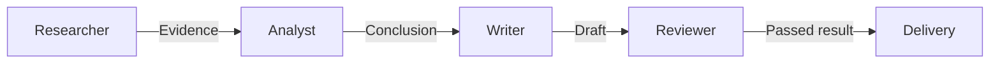
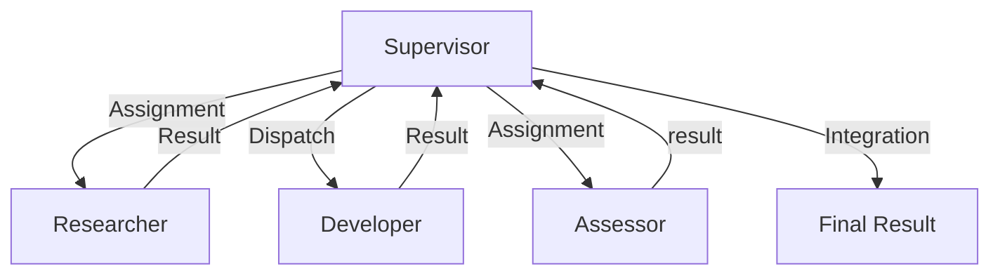
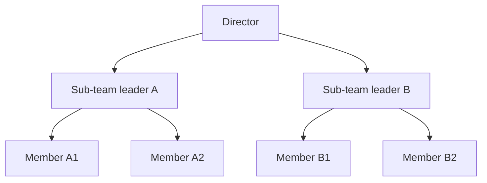
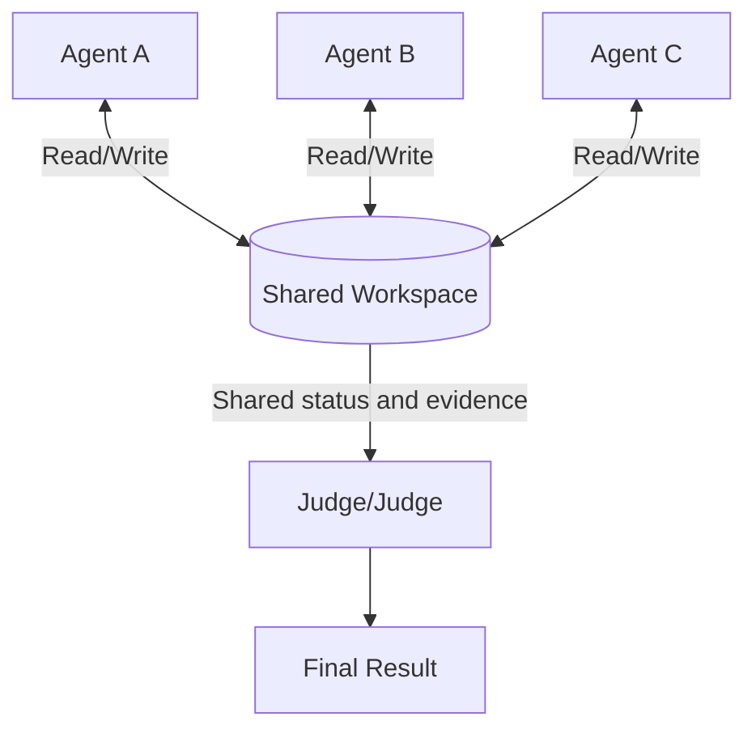
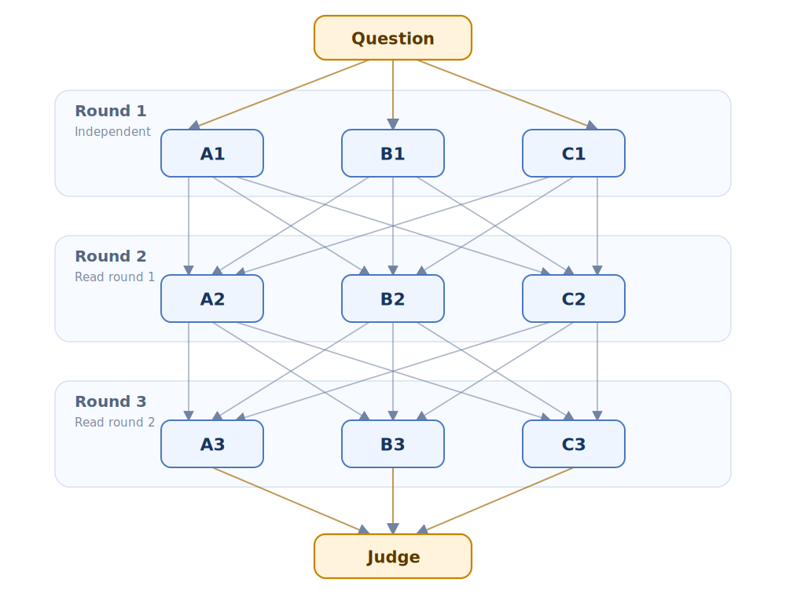
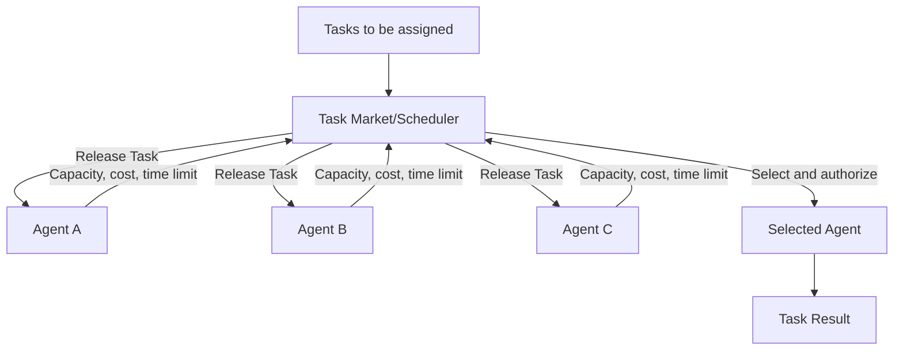

# Multi-Agent Knowledge · Step 4: Collaboration Topology

> The collaboration topology dictates how information flows, who can modify shared state, and who has final decision-making authority; even if the roles are the same, changing the topology can change team behavior.


## 1. Core terms of collaboration topology

When you first encounter the terms below, use these working definitions as a quick reference; later sections cover their properties and engineering implications.

| Term | Working definition | Key idea |
|---|---|---|
| Topology | Collaboration topology | Information connections and control relationships between multiple agents. |
| Pipeline / Chain | Pipeline / Chain structure | Tasks are passed from one role to the next in a fixed order. |
| Blackboard | Blackboard | Workspace where multiple agents share intermediate states, evidence, and products. |
| Debate | Debate structure | Multiple candidates challenge each other and are selected or combined by the referee. |


<!-- learning-path:start -->
<div class="learning-path">
<div class="learning-path-title">How to study this chapter</div>
<div class="learning-path-step"><span>1</span><div> Begin by recognizing topological terms and compare the information flow of chains, masters, hierarchies, blackboards, debates, and market structures (Sections 1-3). </div></div>
<div class="learning-path-step"><span>2</span><div> Then understand the operation methods and boundaries of Pipeline, Supervisor, Blackboard and Debate respectively (sections 4 to 7). </div></div>
<div class="learning-path-step"><span>3</span><div>Finally learn Market, Graph and dynamic topology, and select structures based on task dependencies, shared requirements and risks (sections 8-10). </div></div>
</div>
<!-- learning-path:end -->

---

## 2. Structure and applicable scenarios of common collaboration topologies

Use the same set of dimensions when comparing topologies: in what order tasks flow, who maintains state, how information is exchanged between actors, and who makes the final decision. The following overview first establishes a common vocabulary, and the next section will compare the six structures in the same set of pictures.


<div class="concept-card">
<div class="concept-line">Collaboration topology</div>
<div class="concept-line"> → Chain / Pipeline (Pipeline / Chain): A completes the work and hands it to B, and then hands it to C</div>
<div class="concept-line"> → Supervisor: Manager is assigned to multiple roles </div>
<div class="concept-line"> → Blackboard: Multiple roles can read and write the same shared workspace </div>
<div class="concept-line"> → Debate: Multiple opinions challenge each other and then are handed over to the referee </div>
<div class="concept-line"> → Market: Tasks are bid or received by capable characters</div>
</div>

References:
- AutoGen emphasizes that multi-Agent conversation can use natural language and code to define interactive behaviors: [AutoGen](https://arxiv.org/abs/2308.08155)
- MetaGPT encodes SOP into the multi-actor pipeline: [MetaGPT](https://arxiv.org/abs/2308.00352)
- LangGraph commonly used graph structure expresses Agent workflow: [LangGraph](https://github.com/langchain-ai/langgraph)
- Swarm emphasizes lightweight handoff: [openai/swarm](https://github.com/openai/swarm)

These projects highlight pipelines, graph orchestration, or handover mechanisms respectively, but the project name itself cannot replace topological analysis. To determine which structure a system belongs to, we still have to go back to information flow, shared state, and decision-making rights.

---

## 3. Information flow, shared status and decision-making rights in collaborative topology


The collaboration topology is the connection method between Agents. What it answers is not "how many Agents are there", but "what path does the information take, who can influence whom, and who is responsible for the final result."

The six common topologies are drawn below. Each diagram expresses only one organizational shape, with arrows indicating the main flow of information or tasks.

### 3.1 Sequential information flow of chain topology (Chain)



When reading the picture, pay attention to: tasks are passed in one direction in a fixed order; the latter role depends on the product of the previous role.

### 3.2 Central scheduling of star and supervisor topology (Star/Supervisor)



When reading the diagram, focus on: Supervisors allocate, collect, and integrate in a unified manner, and peripheral roles usually do not schedule each other directly.

### 3.3 Hierarchical summary of hierarchical topology (Hierarchy)



When reading the diagram, pay attention to: tasks and decisions are distributed level by level, and local results are summarized level by level, which is suitable for larger-scale multi-sub-team tasks.

### 3.4 Shared status of Blackboard topology



When reading the diagram, pay attention to this: multiple roles do not need to communicate with each other one by one, but collaborate through the same governed shared state.

### 3.5 Candidate Review of Debate Topology (Debate)



When reading the picture, pay attention to: There are no connections between A, B, and C in the same round; each node in the first round is connected to A2, B2, and C2 in the second round, and the second round is also connected to the third round in the same way. In this way, each debater can read all the answers of the three people in the previous round in the new round, and finally the referee will combine A3, B3, and C3.

### 3.6 Bidding allocation of market topology (Market)



When reading the diagram, focus on: Candidate roles bid based on ability, cost or time limit, and the scheduler allocates tasks based on clear scoring rules.

For the same multiple Agents, but with different information paths, shared states, and decision rights, the system behavior will be completely different.

Topology choice directly affects cost, latency and quality:

| Topology | Suitable scenarios | Risks |
|---|---|---|
| Chain type | Assembly line with fixed steps | If something is wrong in the front, it will be wrong in the end |
| Star | Needs centralized scheduling | Supervisor becomes a bottleneck |
| Hierarchy | Large tasks, multiple sub-teams | Information loss between levels |
| Blackboard | Multiple people share evidence or status | Blackboard requires governance and versions |
| Debate | High-risk decisions and program selection | High cost, easy to idle |
| Market | Task bidding, dynamic allocation | Scoring function is difficult to design |

In order to see the differences caused by topology, let's put the same task into three topologies:

Task: Choose a front-end framework for a project.

- **Chain approach**: The Researcher hands the evidence to the Analyst after investigation, the Analyst forms a comparative conclusion, the Writer writes suggestions, and the Reviewer finally checks. The advantage is simplicity; the disadvantage is that Analyst can only see the materials delivered by Researcher.
- **Star approach**: Supervisor assigns the research tasks of React, Vue, and Svelte to different Researchers at the same time, then sends the respective results to Decision Analyst for comparison, and finally integrates them uniformly. The advantage is that it can be parallelized; the disadvantage is that the Supervisor is responsible for handling conflicts and information summary.
- **Debate Practice**: Advocates of React, Vue, and Svelte propose solutions and question each other, and the Judge selects or combines conclusions based on evidence. The advantage is that it exposes trade-offs; the disadvantage is that more rounds of communication are required and the cost is higher.

### 3.7 Selection criteria for collaboration topology

There is no need to draw the topology selection as a decision tree. First draw clear task dependencies, information dependencies and power dependencies, and then select according to the following task characteristics:

1. **Steps are fixed and products are processed sequentially**: Chain topology is preferred.
2. **Tasks can be parallelized, but a role needs to be assigned and integrated**: Prioritize the star/master topology.
3. **The task is large in scale and contains multiple relatively independent sub-teams**: Use hierarchical topology and clarify the summary format at each level.
4. **Multiple roles need to continuously read and update the same batch of evidence or status**: Use a blackboard topology and add version, permission and conflict rules for the shared status.
5. **Conclusions are risky and must compare mutually exclusive solutions or actively expose counterexamples**: Add debaters, critics and independent referees to the basic topology.
6. **There are many candidate roles and tasks need to be dynamically allocated based on capacity, cost or load**: Use a market topology and define auditable scoring and authorization rules first.

These conditions can be combined. For example, "Large tasks + shared evidence + high-risk decisions" can use hierarchical topology to organize sub-teams, use blackboards to share evidence, and only add debate and refereeing at key decision points. By default, you start with the simplest topology that meets your needs, and only add layers, shared state, or dynamic allocation when real bottlenecks are observed.

If you only draw "who is connected to whom" and do not draw "what information flows through", the topology diagram is just a decorative diagram, not a system design.

---

## 4. Pipeline: Phased serial collaboration

We have compared various organizational shapes in the previous section. Let’s start with the most constrained Pipeline. It fixes the sequence of stages, with each role consuming the products of the previous stage and delivering the input required for the next stage.


Suitable for:
- Software development pipeline.
- Report writing.
- Data analysis.
- Approval flow.

<div class="concept-card">
<div class="concept-line">Requirements analysis → Solution design → Implementation → Testing → Review → Delivery</div>
</div>

Code skeleton:

```python
class Pipeline:
    def __init__(self, steps):
        self.steps = steps

    def run(self, artifact: dict) -> dict:
        for name, agent in self.steps:
            artifact = agent.run(artifact)
            artifact["_last_step"] = name
        return artifact

pipeline = Pipeline([
    ("requirements", requirements_agent),
    ("design", architect_agent),
    ("implementation", coder_agent),
    ("test", tester_agent),
    ("review", reviewer_agent),
])
```

<div class="code-explanation">
<div class="code-explanation-title">Python code description</div>
<p><strong> Purpose: </strong> implements a fixed sequence pipeline topology. <strong> Execution process: </strong><code>run()</code> Let the same <code>artifact</code> pass through the requirements, design, implementation, testing and review roles in sequence, and record the final completed stage. <strong> Key points: </strong> Each step should define input and output contracts and persist checkpoints, otherwise upstream errors will be silently propagated to downstream. </p>
</div>


Advantages: Interpretable, testable, recoverable.
Disadvantages: Upstream errors are propagated and can often only be remedied downstream.

<div class="deep-dive-link">
<a href="index.html?lang=en&page=topology-pipeline">Further reading: modern Pipeline topology implementations</a>
<p>Learn about stage gating, checkpointing, backpressure, and workflow research from AutoFlow, AFlow, ADAS, AAFLOW, and more 2024–2026. </p>
</div>

---

## 5. Supervisor: Centralized task scheduling

Pipeline is suitable for tasks whose next step can be determined in advance; when the task type is not fixed and only some experts need to be called each time, the selection can be centralized in the Supervisor. The supervisor saves the progress and selects the next role. When the worker completes, the result is returned to the supervisor.


Suitable for:
- User question types are not fixed.
- There are many experts, but only a few of them are needed at a time.
- Requires dynamic routing.

```python
def route(task: str) -> str:
    if "SQL" in task or "database" in task:
        return "data_engineer"
    if "security" in task or "auth" in task:
        return "security_reviewer"
    if "UI" in task or "CSS" in task:
        return "frontend_engineer"
    return "generalist"
```

<div class="code-explanation">
<div class="code-explanation-title">Python code description</div>
<p><strong> Purpose: </strong> Use deterministic keyword rules to assign tasks to data, security, front-end or general roles. <strong> execution process: </strong> function matches from top to bottom according to conditions and returns the unique role name. <strong> Key points: </strong> Rule routing is cheap and testable, but current matching is case-sensitive and the vocabulary is limited. For actual use, input should be standardized and fallback strategies prepared. </p>
</div>


Supervisor with status:

```python
class Supervisor:
    def __init__(self, agents: dict):
        self.agents = agents

    def next_agent(self, state: dict) -> str:
        if state.get("needs_research"):
            return "researcher"
        if state.get("needs_code"):
            return "coder"
        if state.get("needs_review"):
            return "reviewer"
        return "finalizer"

    def run(self, state: dict) -> dict:
        for _ in range(8):
            name = self.next_agent(state)
            state = self.agents[name].run(state)
            if state.get("done"):
                return state
        state["error"] = "max_supervisor_turns"
        return state
```

<div class="code-explanation">
<div class="code-explanation-title">Python code description</div>
<p><strong> Purpose: </strong> Shows supervisor scheduling with shared state and round limit. <strong> Execution process: </strong><code>next_agent()</code> Select the role according to the to-do flag, <code>run()</code> is scheduled up to eight times, and the updated status is returned to the supervisor after the role is executed. <strong> Key points: </strong> If <code>done</code> cannot be satisfied, the system will write a clear error to avoid infinite loops. </p>
</div>


Advantages: Flexible.
Disadvantages: Supervisor prompts and routing policies become single points of risk.

<div class="deep-dive-link">
<a href="index.html?lang=en&page=topology-supervisor">Further reading: Supervisor topologies and modern orchestrators</a>
<p> drills down from normal routing functions to task/progress ledger, capability registration, replanning, Magentic-One and current framework state. </p>
</div>

---

## 6. Blackboard: Shared Status Collaboration

Supervisor delivers tasks through the central node, and when there is a lot of information, it is easy to form a summary bottleneck. Blackboard instead lets roles collaborate around the same governed state, making it ideal for tasks that require an ongoing accumulation of evidence or intermediate conclusions.


Blackboard architecture comes from traditional AI and MAS. All Agents read and write a shared space.

Suitable for:
- Research tasks.
- Diagnostic tasks.
-Multiple sources of evidence collection.
- Complex design review.

```python
class Blackboard:
    def __init__(self):
        self.cards = []

    def post(self, card: dict):
        required = {"id", "kind", "owner", "content"}
        missing = required - set(card)
        if missing:
            raise ValueError(f"missing fields: {missing}")
        self.cards.append(card)

    def query(self, kind: str | None = None):
        return [c for c in self.cards if kind is None or c["kind"] == kind]
```

<div class="code-explanation">
<div class="code-explanation-title">Python code description</div>
<p><strong> Purpose: </strong> provides a minimal shared blackboard to uniformly receive and query intermediate cards. <strong> Execution process: </strong><code>post()</code> Checks four required fields and then appends the card, <code>query()</code> can be filtered by type. <strong>Key points: </strong>A real blackboard also requires unique ID, version, concurrent writing, permissions, archiving and deduplication mechanisms. </p>
</div>


Example card:

```python
blackboard.post({
    "id": "EV-001",
    "kind": "evidence",
    "owner": "researcher",
    "content": "AutoGen supports conversational single and multi-agent applications.",
    "source": "https://microsoft.github.io/autogen/stable/",
    "confidence": 0.9,
})
```

<div class="code-explanation">
<div class="code-explanation-title">Python code description</div>
<p><strong> Purpose: </strong> Shows how a researcher can submit a piece of evidence with source and confidence level to Blackboard. <strong> Execution process: </strong> The card is marked with <code>EV-001</code>, and the text explains the conclusion, <code>source</code> Supports downstream review, <code>confidence</code> indicates the sender’s confidence. <strong>Key points: </strong>Extra fields are not restricted by the previous minimum validation, and the full Schema should be used in production. </p>
</div>


Advantages: Information sharing is natural.
Disadvantages: Blackboard will bloat and requires schema, deduplication, archiving and permissions.

<div class="deep-dive-link">
<a href="index.html?lang=en&page=topology-blackboard">Further reading: Blackboard topologies and shared workspaces</a>
<p> understands the central and distributed forms from the classic multi-agent Blackboard paper, then compares the LLM paper and Flock project of Han & Zhang, Salemi, etc., and finally enters the source tracking, role view and scheduling implementation. </p>
</div>

---

## 7. Debate: Multiple candidate review and decision-making

Blackboard is good for the collective accumulation of facts, but shared status by itself does not automatically generate independent opinions. When competing candidate conclusions need to be compared, multiple Agents can be allowed to answer independently, cross-review, and then make a decision based on clear Judge rules.


Suitable for:
- Mathematical reasoning.
- Strategy selection.
- High stakes conclusion.
- Fact check.

Paper anchor: [Improving Factuality and Reasoning in Language Models through Multiagent Debate](https://arxiv.org/abs/2305.14325)

```python
def debate(question: str, agents: list, judge) -> dict:
    arguments = []
    for round_id in range(3):
        for agent in agents:
            msg = agent.argue(question, arguments)
            arguments.append({
                "round": round_id,
                "agent": agent.name,
                "content": msg,
            })
    return judge.decide(question, arguments)
```

<div class="code-explanation">
<div class="code-explanation-title">Python code description</div>
<p><strong> Purpose: </strong> Realizes a three-round, multi-participant candidate argumentation process. <strong>Execution process: </strong>Each agent reads the question and existing arguments and adds new arguments. After all rounds, the referee makes a unified decision. <strong>Key Point: </strong>The argument list will grow continuously, and a practical system should limit the length, keep candidates independent, and define scoring criteria for judges. </p>
</div>


Note:
- Debate Agents should be initialized independently as much as possible to avoid sharing the same error.
- Judge should score rubrics.
- Don't let "longer answers" automatically lead to higher scores.

<div class="deep-dive-link">
<a href="index.html?lang=en&page=topology-debate">Further reading: Debate, confidence, and Judge reliability</a>
<p> Supplement 2024–2026 New evidence on candidate diversity, explicit uncertainty, Judge bias, and ordinary debate failure conditions. </p>
</div>

---

## 8. Market: Task allocation based on bidding

Debate solves "how to compare multiple candidates", and Market solves "how to distribute a large number of tasks among multiple available experts." The scheduler selects the bearer based on capabilities, expected quality, cost, and timelines, rather than fixing the receiving role for each task in advance.


Suitable for a large number of tasks and a large number of experts.

```python
class Bid(BaseModel):
    agent: str
    expected_quality: float
    expected_cost: float
    reason: str

def allocate(task, bids: list[Bid]) -> str:
    def utility(bid: Bid):
        return bid.expected_quality - 0.2 * bid.expected_cost
    return max(bids, key=utility).agent
```

<div class="code-explanation">
<div class="code-explanation-title">Python code description</div>
<p><strong> Purpose: </strong> Constructs a utility function for task bidding using quality and cost. <strong> Execution: </strong> Each <code>Bid</code> reports expected quality, cost and justification, and the allocator selects the <code> quality - 0.2 × cost </code> highest agent. <strong>Key point: </strong>The quotation must be calibrated with historical performance, otherwise the agent can obtain the task by exaggerating the quality. </p>
</div>


Question:
- Will the Agent exaggerate his abilities?
- How quality and cost calibrate.
- Whether historical performance is required as weighting.

<div class="deep-dive-link">
<a href="index.html?lang=en&page=market-task-auction">Further reading: multi-agent task auctions and market-based allocation</a>
<p> Continue learning from current heuristic scoring on capability false reporting, quality and cost calibration, historical reputation, strategic auctions, incentive compatibility, and related open papers in 2024–2026. </p>
</div>

---

## 9. Graph: Universal state chart arrangement

Market mainly changes task allocation, while Graph unifiedly represents nodes, conditional edges, loops and end conditions as executable structures. Pipelines, Supervisors, and even review processes with rework can all be considered constrained graphs.


The graph structure makes both nodes and edges explicit.

```python
from dataclasses import dataclass
from typing import Callable

@dataclass
class Edge:
    source: str
    target: str
    condition: Callable[[dict], bool]

class AgentGraph:
    def __init__(self, nodes: dict, edges: list[Edge], start: str):
        self.nodes = nodes
        self.edges = edges
        self.start = start

    def run(self, state: dict) -> dict:
        current = self.start
        while current != "END":
            state = self.nodes[current].run(state)
            candidates = [e for e in self.edges if e.source == current and e.condition(state)]
            if not candidates:
                raise RuntimeError(f"no edge from {current}")
            current = candidates[0].target
        return state
```

<div class="code-explanation">
<div class="code-explanation-title">Python code description</div>
<p><strong> Purpose: </strong> represents the agent workflow as nodes, conditional edges, and explicit starting points. <strong> Execution process: </strong> After the current node is executed, all outgoing edges whose conditions are true are filtered during runtime and continue along the first one until <code>END</code>. <strong>Key points: </strong>If there is no legal edge, an error will be reported immediately; the production graph must also detect multi-edge conflicts, loops, parallel merging and persistent recovery. </p>
</div>


The graph structure is suitable for expressing:
- Conditional branches.
- Fallback on failure.
- Human approval.
- Convergence of parallel branches.

<div class="deep-dive-link">
<a href="index.html?lang=en&page=topology-graph">Further reading: Graph as a general executable topology</a>
<p> Treat other patterns as restricted graph templates, diving into state reducers, fan-out/fan-in, loops, subgraphs, checkpoints, and structural optimizations. </p>
</div>

---

## 10. Dynamic topology: adjust team structure according to tasks

A normal Graph has nodes and edges determined before running; a dynamic topology allows the system to add roles, remove low-value members, or change communication edges on the fly. This extra complexity may only be worth it if the task types are open and capability gaps are repeatedly exposed by static teams.


Dynamic topology refers to creating roles or changing connections on the fly. AutoAgents and some recent research attempt to automatically generate experts based on tasks.

Suitable for:
- Mission types are very open.
- Not knowing in advance which experts will be needed.
- Have strong review and budget control.

Risks:
-Character explosion.
- Costs are uncontrollable.
- Generated experts have overlapping responsibilities.
- Difficult to reproduce.

A current limiting strategy:

```python
def can_create_agent(team_state: dict) -> bool:
    return (
        team_state["agent_count"] < 6
        and team_state["estimated_cost"] < team_state["budget"] * 0.7
        and team_state["unresolved_subtasks"] > 2
    )
```

<div class="code-explanation">
<div class="code-explanation-title">Python code description</div>
<p><strong> Purpose: </strong> Set triple thresholds of quantity, cost and unresolved tasks for dynamically creating new characters. <strong> Execution process: </strong> Capacity expansion is only allowed when there are less than six existing agents, the estimated cost is less than 70% of the budget, and there are more than two unsolved subtasks. <strong>Key Point: </strong>This is an example of a guardrail, the threshold should be tied to the team revenue measurement and remaining budget. </p>
</div>

<div class="deep-dive-link">
<a href="index.html?lang=en&page=topology-dynamic">Further reading: dynamic topologies and automated team design</a>
<p> Track G-Designer, AgentPrune, ARG-Designer, GoAgent, graph diffusion topology, and ADAS, and learn dynamic change governance. </p>
</div>

At this point, the seven types of structures have been developed in the order of "fixed stage—central scheduling—shared state—candidate review—market allocation—general graph—runtime modification of graph". When selecting, you should start with the simplest feasible structure, and then use operational data to prove whether you need to add shared states, referees, markets, or dynamic adjustments.


---

<!-- chapter-check:start -->
## 11. Collaboration topology selection self-test
<div class="chapter-check">
<div class="chapter-check-title"> Without reading the text, try to answer </div>
<ul>
<li> Can you choose one topology each for fixed steps, dynamic routing, and shared evidence and explain why? </li>
<li> Can you point out where the information bottlenecks are between the supervisor system and the blackboard system? </li>
<li> Can you draw a topology from the three layers of task dependence, information dependence and power dependence? </li>
</ul>
</div>
<!-- chapter-check:end -->

---

## 12. Summary of this chapter: topology and selection principles

Topology selection suggestions:

| Scenario | Preferred |
|---|---|
| Teaching and Stable Delivery | Pipeline |
| Dynamic Issue Routing | Supervisor |
| Multiple Evidence Research | Blackboard |
| High-Stakes Conclusion | Debate + Judge |
| Large-scale task pool | Market |
| Complex production process | Graph |

See the next chapter **⑤ Communication Protocol**: The topology is just the connection, what really flows is the message.
