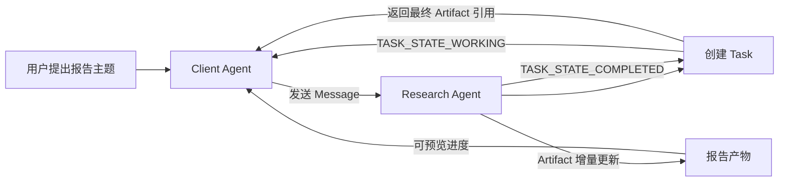
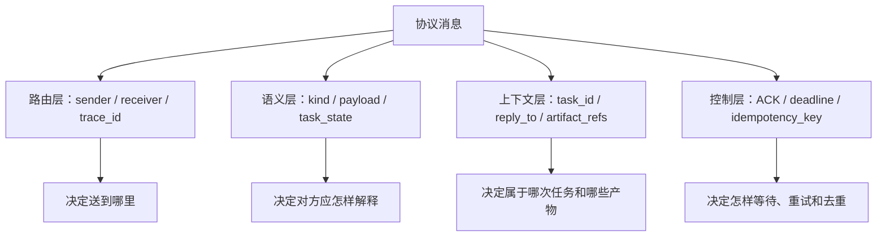
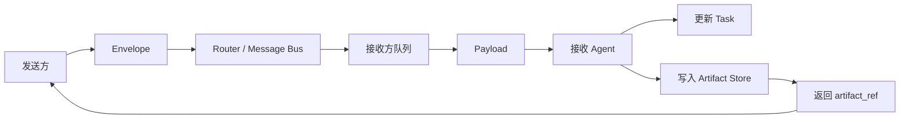
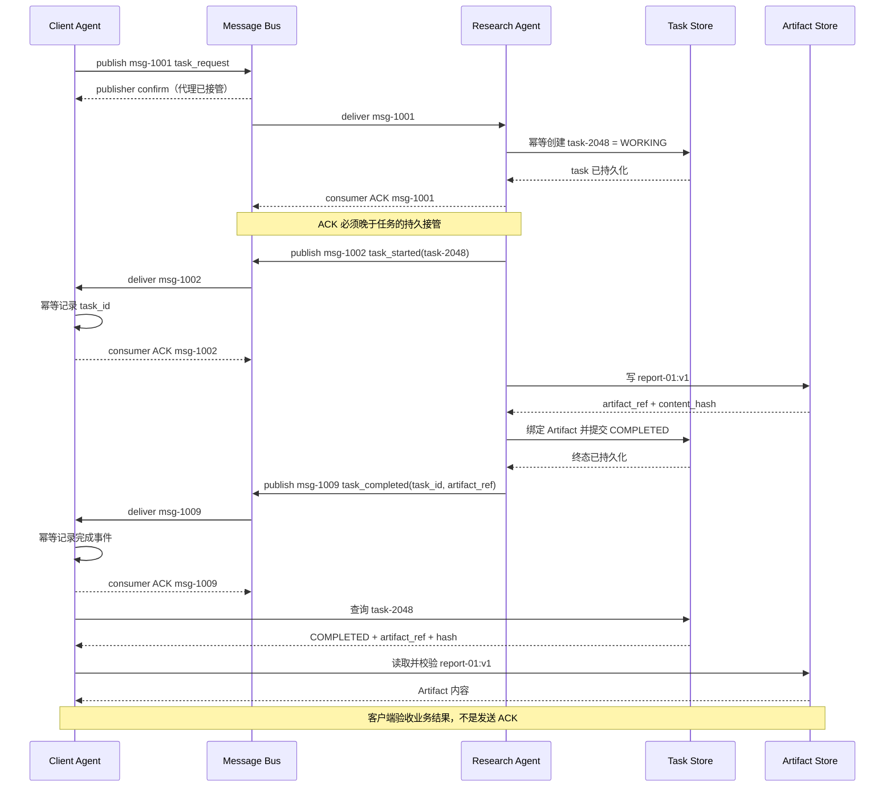
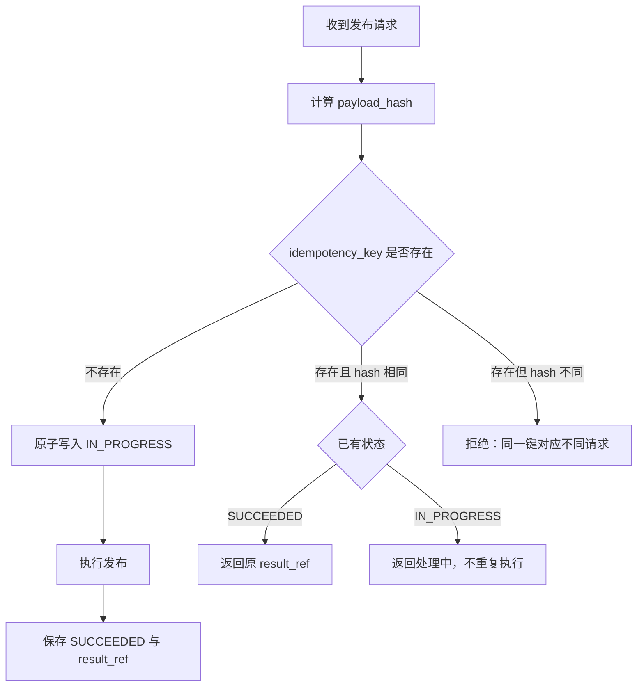
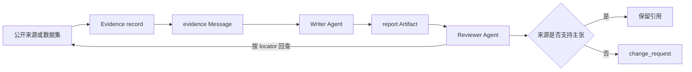
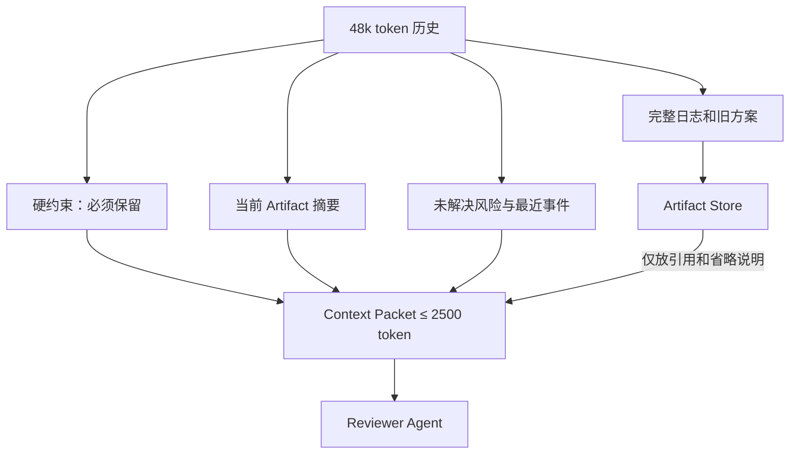
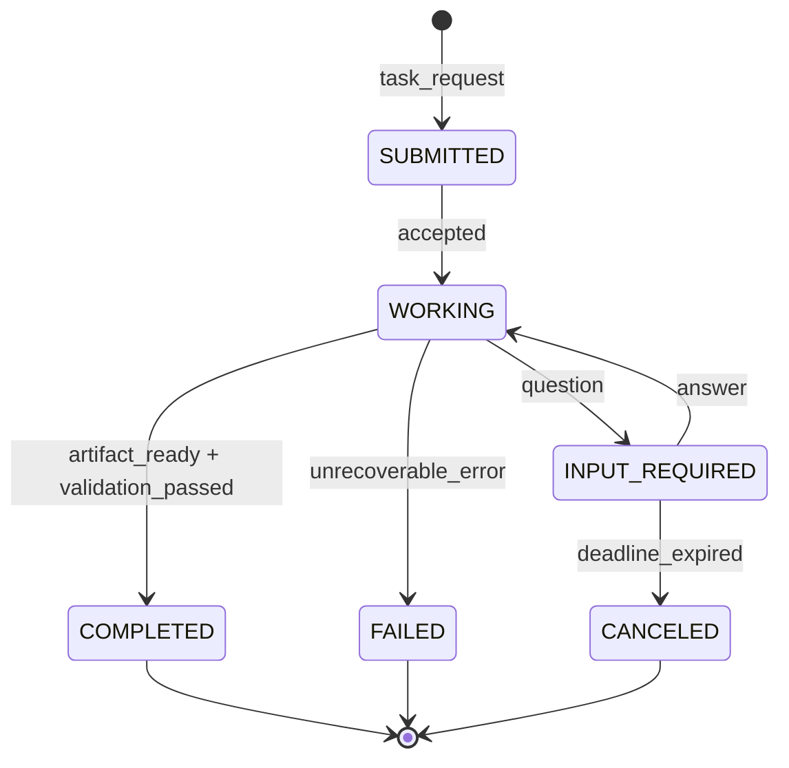
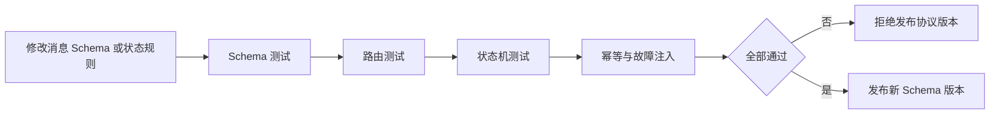

# Multi-Agent Knowledge · 第 ⑤ 步：通信协议

> 通信协议让路由器、接收 Agent 和审计系统对同一条消息作出一致处理。本章用一个长报告任务说明消息如何投递、确认、重试、引用并进入任务状态机。

## 1. 多 Agent 通信协议核心术语

第一次遇到英文术语时，先用右栏建立直觉。后文会把每个术语放回同一条任务链中。

| 英文术语 | 中文说法 | 在本章中的具体含义 |
|---|---|---|
| Message | 消息 | 参与者为了启动任务、补充输入、提问或报告状态而发送的通信单元。 |
| Envelope | 信封 | 路由器可以读取的外层信息，例如消息编号、发送者、接收者和追踪号。 |
| Payload | 载荷 | 接收者真正处理的业务内容，例如报告主题、评审意见或结构化参数。 |
| Task | 任务 | 跨多轮持续存在的工作对象，有独立编号、状态和最终产物。 |
| Artifact | 产物 | 任务产生的可保存结果，例如报告、补丁、证据表或测试日志。 |
| Consumer ACK | 消费确认 | 消费者向消息代理确认某次投递已经处理到约定的持久边界，代理可以删除该投递；不等于业务任务完成。 |
| Publisher confirm | 发布确认 | 消息代理确认已经接管发布消息；不表示目标消费者已经处理。 |
| Idempotency | 幂等性 | 同一业务请求被重复投递时，不会产生第二次副作用。 |
| Retry | 重试 | 发送者在超时或临时失败后再次投递请求。 |
| Trace ID | 追踪号 | 把一次任务跨 Agent、队列和工具产生的事件串在一起。 |
| Schema | 结构约束 | 规定字段名称、类型、必填条件和允许值的机器可检查契约。 |
| TTL, Time To Live | 生存时间或跳数 | 限制消息可以等待多久或被转发多少次。 |
| Dead-letter queue | 死信队列 | 保存多次投递仍失败的消息，等待诊断或人工处理。 |

<!-- learning-path:start -->
<div class="learning-path">
<div class="learning-path-title">本章怎么学</div>
<div class="learning-path-step"><span>1</span><div>先用 A2A 长报告任务区分 Message、Task、状态更新与 Artifact，并识别非结构化消息的问题（第 1～3 节）。</div></div>
<div class="learning-path-step"><span>2</span><div>再沿消息生命周期学习字段边界、ACK、幂等、引用、上下文预算和任务状态机（第 4～10 节）。</div></div>
<div class="learning-path-step"><span>3</span><div>最后通过拒绝路径测试、公开标准对照和失败恢复练习验证协议（第 11～14 节）。</div></div>
</div>
<!-- learning-path:end -->

---

## 2. 长报告跨 Agent 流转案例


本章采用 [Agent2Agent Protocol（A2A，智能体到智能体协议）公开规范](https://github.com/a2aproject/A2A/blob/main/docs/specification.md)中的长任务模式建立直觉。该规范描述了独立 Agent 应用之间的互操作，公开示例包含“请求撰写详细报告”、流式状态更新、增量产物和最终完成状态。

这里必须先划清来源边界：**Message、Task、Artifact 及异步更新来自 A2A 公开规范；本章后续增加的内部角色名、trace 字段和 Python 校验器是教学实现，不是 A2A SDK 源码。**

案例中有四个可以观察的对象：

| 对象 | 它是什么 | 本例中的具体职责 |
|---|---|---|
| Client Agent | 客户端智能体 | 发出“撰写气候变化报告”的请求，并接收进度与结果。 |
| Research Agent | 远程研究智能体 | 接受请求，在内部检索、组织材料并生成报告。 |
| Task | 长期任务对象 | 保存 `task_id`、当前状态和产物列表，网络断开后仍可查询。 |
| Artifact | 任务产物 | 保存报告正文或文件引用，是最终业务结果，而不是一句聊天回复。 |

### 2.1 长任务在真实规范中的执行主线



读图时重点看：请求内容通过 Message 进入系统，持续工作由 Task 承载，最终报告由 Artifact 承载。三个对象不能合并成一段不断变长的聊天文本。

把图换成运行账本，读者会更容易看见状态变化：

| 顺序 | 可观察事件 | 关键字段 | 这一步结束后系统知道什么 |
|---:|---|---|---|
| 1 | 客户端发送请求 | `message_id=msg-1001` | 这是一个新的报告请求。 |
| 2 | 服务端创建任务 | `task_id=task-2048` | 后续事件都可以绑定同一任务。 |
| 3 | 状态变为工作中 | `state=WORKING` | 请求已接受，但尚未完成。 |
| 4 | 发送产物增量 | `artifact_id=report-01` | 报告已经产生部分内容，可预览但不可当成最终版。 |
| 5 | 状态变为完成 | `state=COMPLETED` | 不应再接受普通修改消息，除非创建修订任务。 |
| 6 | 客户端读取产物 | `artifact_id=report-01` | 最终结果有稳定编号，可以保存、下载或交给 Reviewer。 |

这张表就是本章后续所有概念的落点：Schema 负责检查字段，信封负责路由，ACK 负责确认接收，幂等键负责处理重试，状态机负责阻止非法流转，Artifact 引用负责交付大结果。

### 2.2 独立 Agent 循环与团队协作循环


单个 Agent 的闭环通常是 `task → action → observation → final`；团队闭环则会反复经过 `route → message → agent action → artifact/state update → review → reroute`。区别不只是多了几个模型调用，而是多了跨角色边界：谁能接收哪类任务、消息是否有效、产物属于哪个版本、交接后谁拥有控制权，以及失败时由谁升级。

<div class="concept-card">
<div class="concept-line">团队循环</div>
<div class="concept-line">  → 路由器选择接收者</div>
<div class="concept-line">  → 协议校验消息与交接权限</div>
<div class="concept-line">  → 接收者执行自己的局部循环</div>
<div class="concept-line">  → 产物与状态写回共享记录</div>
<div class="concept-line">  → 评审或主管决定结束、返工、重路由或人工升级</div>
</div>

因此，模型可以提出 `handoff` 或 `final`，但运行时必须校验接收者、消息 Schema、预算、终止条件与权限。局部 Agent 循环只有通过这些协议边界连接起来，才能形成可靠的团队循环。

---

## 3. 非结构化状态消息的局限


假设 Research Agent 只发回一句：

<div class="concept-card">
<div class="concept-line">“报告写好了，见上面。”</div>
</div>

人类可能凭聊天上下文猜出它的意思，机器却会遇到至少六个无法确定的问题：

| 缺失信息 | Client Agent 的困难 | 生产系统中的直接后果 |
|---|---|---|
| 消息编号 | 不知道是否已经处理过 | 网络重发后可能重复入库或重复通知。 |
| 任务编号 | 不知道属于哪份报告 | 两个并行报告的结果可能串线。 |
| 消息类型 | 不知道这是进度还是最终结果 | 草稿可能被当作最终报告发布。 |
| 产物编号 | 找不到完整报告 | 只能继续复制长文本，无法版本化。 |
| 状态 | 不知道任务是否已经结束 | 客户端可能继续等待，也可能过早停止。 |
| 来源与版本 | 不知道由谁在何时生成 | 无法审计、撤回或比较修订版。 |

一条可执行的教学协议消息可以写成下面这样。它不是 A2A 原始线格式，而是把本章需要讲解的四层信息放进一个对象：

```json
{
  "message_id": "msg-1005",
  "trace_id": "trace-climate-report-01",
  "task_id": "task-2048",
  "sender": "research_agent",
  "receiver": "client_agent",
  "kind": "artifact_ready",
  "reply_to": "msg-1001",
  "payload": {
    "summary": "报告已完成，共 6 节，引用 14 项来源。",
    "task_state": "completed"
  },
  "artifact_refs": ["artifact:report-01:v1"],
  "control": {
    "requires_ack": true,
    "idempotency_key": "task-2048:artifact-ready:v1",
    "deadline": "2026-07-10T10:05:00Z"
  }
}
```

<div class="code-explanation">
<div class="code-explanation-title">JSON 消息说明</div>
<p><strong>用途：</strong>把“报告写好了”变成机器可以路由和核验的完成事件。<strong>执行过程：</strong>路由器先读取 sender、receiver 与 kind，客户端再读取 payload 和 artifact_refs，投递层用 requires_ack 与 idempotency_key 处理确认和重试。<strong>关键点：</strong>这是一份教学协议示例；生产实现应使用正式 Schema、身份认证和时间格式校验。</p>
</div>

### 3.1 可执行消息的四层结构



读图时重点看：正文只是语义层的一部分。没有另外三层，系统仍然不知道该把正文交给谁、如何关联任务，以及失败后能否重试。

---

## 4. 从用户意图到可投递消息的六步转换


协议不是在自然语言外面随便套一层 JSON。发送端要完成六个彼此不同的步骤：

1. **识别业务意图**：这是提交评审，不是普通通知。
2. **解析目标对象**：目标是 `review_agent`，任务是 `task-2048`，产物是 `report-01:v1`。
3. **选择消息类型**：选择 `review_request`，让接收方进入对应处理器。
4. **填充信封**：生成消息编号、追踪号、发送者、接收者和回复关系。
5. **填充控制字段**：决定是否需要 ACK、何时超时、重复请求怎样识别。
6. **执行发送前校验**：字段、权限、大小、敏感数据和状态流转全部通过后才投递。

下表展示每一步真正产生的中间结果：

| 步骤 | 输入 | 输出 | 失败时应怎样处理 |
|---|---|---|---|
| 意图识别 | “交给评审者” | `intent=submit_for_review` | 意图不明确时先提问，不猜测高风险动作。 |
| 对象解析 | 当前任务上下文 | task、artifact、receiver 三个稳定 ID | 找不到产物时拒绝发送。 |
| 类型选择 | 意图和当前状态 | `kind=review_request` | 类型不受支持时返回协议错误。 |
| 信封生成 | 发送主体和运行信息 | message_id、trace_id、reply_to | 缺少 trace 时不能进入生产队列。 |
| 控制策略 | 风险、时限和副作用 | ACK、deadline、idempotency_key | 写操作没有幂等键时拒绝。 |
| Schema 校验 | 完整候选消息 | 合法消息或错误列表 | 错误返回发送方修正，不投递半合法对象。 |

下面的 Pydantic 模型是**本章教学实现**，用于展示“条件字段”如何在模型之外强制执行：

```python
from datetime import datetime
from typing import Any, Literal

from pydantic import BaseModel, Field, model_validator


class Control(BaseModel):
    requires_ack: bool = True
    idempotency_key: str | None = None
    deadline: datetime | None = None


class ProtocolMessage(BaseModel):
    message_id: str
    trace_id: str
    task_id: str
    sender: str
    receiver: str
    kind: Literal[
        "task_request",
        "question",
        "answer",
        "progress",
        "artifact_ready",
        "review_request",
        "review_result",
        "error",
    ]
    payload: dict[str, Any]
    artifact_refs: list[str] = Field(default_factory=list)
    confidence: float | None = Field(default=None, ge=0.0, le=1.0)
    control: Control

    @model_validator(mode="after")
    def enforce_kind_specific_fields(self):
        if self.kind in {"artifact_ready", "review_request"} and not self.artifact_refs:
            raise ValueError(f"{self.kind} requires artifact_refs")
        if self.kind == "review_result" and self.confidence is None:
            raise ValueError("review_result requires confidence")
        return self
```

<div class="code-explanation">
<div class="code-explanation-title">Python 教学实现说明</div>
<p><strong>用途：</strong>展示基础类型约束与按消息类型触发的条件约束。<strong>执行过程：</strong>Pydantic 先检查字段类型和置信度范围，再由 model_validator 检查 artifact_ready、review_request 与 review_result 的专属要求。<strong>关键点：</strong>这不是 A2A 官方模型；它演示的是“模型提出消息，运行时决定消息是否合法”的边界。</p>
</div>

代码的价值要通过具体失败来理解：

| 候选消息 | 校验结果 | 为什么 |
|---|---|---|
| `review_request` 没有 `artifact_refs` | 拒绝 | 评审者不知道检查哪个版本。 |
| `review_result` 没有 `confidence` | 拒绝 | 聚合器无法执行本章约定的置信度路由。 |
| `confidence=1.3` | 拒绝 | 超出 0 到 1 的约定范围。 |
| `progress` 没有产物 | 允许 | 进度事件可以只报告任务状态。 |

---

## 5. 消息信封、载荷、任务与产物的职责边界

上一节说明了发送端怎样把用户意图转换成消息，本节进一步拆开消息周围的长期对象。只有信封、载荷、Task 和 Artifact 各自承担稳定职责，路由、状态恢复和大产物存储才不会挤在同一段正文里。


可以把一次交付想成寄送档案，而不是聊天：

<div class="concept-card">
<div class="concept-line">信封（Envelope）：寄给谁、来自谁、属于哪次任务</div>
<div class="concept-line">载荷（Payload）：这次通信想表达什么</div>
<div class="concept-line">任务（Task）：这项工作目前进行到哪里</div>
<div class="concept-line">产物（Artifact）：真正要长期保存和复用的结果</div>
</div>

### 5.1 消息对象的读取方与职责



读图时重点看：Router 只需要理解信封；接收 Agent 才理解载荷；大结果写入 Artifact Store 后只把引用送回消息链。

| 对象 | 主要读者 | 是否频繁变化 | 典型内容 | 不应放入什么 |
|---|---|---:|---|---|
| Envelope | 网关、路由器、审计器 | 每条消息都不同 | sender、receiver、trace_id、kind | 完整报告正文 |
| Payload | 目标 Agent | 每条消息都不同 | 请求参数、问题、摘要、评审意见 | 路由凭据和内部密钥 |
| Task | 编排器、客户端 | 随工作进展变化 | state、history、artifact 列表 | 无限制的模型思考过程 |
| Artifact | 下游 Agent、用户、评审者 | 按版本变化 | 报告、代码、证据表、日志 | 仅靠聊天顺序才能理解的内容 |

A2A 当前规范明确区分 Message 与 Artifact：Message 用于启动任务、澄清、状态沟通和追加输入，任务输出应通过 Artifact 返回。这样做的工程意义是，结果不会因为聊天窗口截断、流式连接中断或消息清理而消失。

下面只保留 A2A 数据关系中的最小字段，便于对照，不表示完整规范对象：

```json
{
  "message": {
    "messageId": "msg-1001",
    "role": "ROLE_USER",
    "parts": [{"text": "撰写一份气候变化报告"}]
  },
  "task": {
    "id": "task-2048",
    "status": {"state": "TASK_STATE_WORKING"},
    "artifacts": []
  }
}
```

<div class="code-explanation">
<div class="code-explanation-title">A2A 字段关系说明</div>
<p><strong>用途：</strong>展示请求消息与长期任务不是同一个对象。<strong>执行过程：</strong>客户端用 Message 提交文本 Part，服务端创建具有独立 id 和状态的 Task；报告完成后 artifacts 才会出现。<strong>关键点：</strong>这是依据公开规范压缩后的字段对照，不是可直接发送的完整 HTTP 请求。</p>
</div>

---

## 6. 发布确认、消费 ACK 与业务完成语义

对象边界明确以后，下一步是确定每个参与者究竟确认了什么。发布确认、消费 ACK 和业务完成发生在不同时间点，覆盖的责任范围也不同，不能用一个“成功”字段代替。


本节采用“至少一次投递的消息代理”作为教学模型，并严格区分三类方向与责任都不同的事实：

1. **Publisher confirm（发布确认）**：Message Bus 已经接管请求消息；它不知道 Research Agent 是否处理。
2. **Consumer ACK（消费确认）**：消费者已经把这次投递处理到约定的持久边界，Message Bus 可以删除该投递；它只对应某一条消息。
3. **业务完成**：Task 已进入 `COMPLETED` 终态，Artifact 已持久化并可校验；这是应用状态，不是 ACK。

[RabbitMQ 官方确认机制说明](https://www.rabbitmq.com/docs/confirms)明确区分 publisher confirm 与 consumer acknowledgement，二者相互独立。若使用 HTTP/SSE 形式的 A2A，而不是消息代理，应使用响应、Task、状态更新和 Artifact 语义，不应生造 broker ACK。

### 6.1 ACK 与业务结果的独立时序



读图时重点看：Bus 的发布确认只覆盖发布端到代理；Research Agent 只有在 Task 已持久化后才能 ACK 请求；完成事件只有在 Artifact 与 `COMPLETED` 终态提交后才能发布；Client 对完成事件的 ACK 只表示该事件已记录，真正验收还要查询 Task 并校验 Artifact。

Consumer ACK 必须晚于 Task 的持久化接管。若先 ACK，代理删除请求后 Research Agent 又立即崩溃，系统将既没有请求消息，也没有 Task，造成任务永久丢失。

[A2A 规范](https://github.com/a2aproject/A2A/blob/main/docs/specification.md)把 Task 定义为有生命周期的状态对象，成功完成要进入 `TASK_STATE_COMPLETED`；任务输出应通过与 Task 关联的 Artifact 交付。瞬时消息或 ACK 不能作为关键业务结果的唯一依据。

把同一次运行记录成事件账本，可以直接定位故障：

| 时间 | 事件 | 状态 | 若在这里中断会看到什么 |
|---|---|---|---|
| 10:00:00 | Bus 返回 publisher confirm | REQUEST_PUBLISHED | 代理已接管消息，Research Agent 可能尚未收到。 |
| 10:00:01 | `task-2048` 持久化后 ACK 请求 | WORKING | 代理可删除请求；任务不会因消费者随后崩溃而消失。 |
| 10:00:02 | Client 记录 `task_started` | WORKING | Client 获得 task_id，可查询进度；尚未完成。 |
| 10:03:10 | `report-01:v1` 与 hash 写入 | WORKING | Artifact 已存在，但 Task 终态尚未提交。 |
| 10:03:11 | Artifact 绑定 Task，终态提交 | COMPLETED | 服务端业务完成事实已经持久化。 |
| 10:03:12 | Client 记录完成事件并 ACK | COMPLETED | 只表示通知投递完成，不等于 Client 已验收 Artifact。 |
| 10:03:13 | Client 查询 Task、读取并校验 Artifact | CLIENT_ACCEPTED | Client 才能把结果标记为已验收。 |

消息系统常见的投递语义也要用具体后果理解：

| 投递语义 | 可能丢失 | 可能重复 | 适合什么 | 接收端责任 |
|---|---:|---:|---|---|
| At-most-once，至多一次 | 是 | 否 | 可丢弃的进度心跳 | 不需要去重，但必须接受丢失。 |
| At-least-once，至少一次 | 否 | 是 | 任务请求、写操作和关键事件 | 必须使用幂等键去重。 |
| Exactly-once effect，业务效果一次 | 否 | 传输仍可重复 | 付款、部署、提交报告 | 通过事务、幂等记录和唯一约束实现业务效果一次。 |

“恰好一次投递”在跨网络系统中很难直接保证，工程上通常追求的是：消息可以重复到达，但最终副作用只发生一次。

如果消息多次重试仍不能处理，不应无限循环。它应进入 Dead-letter queue（死信队列），同时保存原消息、最后错误、重试次数、Schema 版本和 trace_id，供人工或修复后的消费者重新处理。

---

## 7. 幂等键与重复副作用控制


先看具体事故：客户端发送“发布 report-01:v1”，服务端已经发布成功，但返回 ACK 前网络断开。客户端只看到超时，于是发送同一请求。若执行器只根据“又收到一条消息”判断，就会发布两次。

### 7.1 幂等记录阻止重复执行的流程



读图时重点看：幂等键不是单纯的结果缓存。系统还要比较请求指纹，并区分 IN_PROGRESS 与 SUCCEEDED，才能覆盖执行中崩溃和并发重复请求。

下面是教学级执行器，`reserve_atomic()` 表示必须由数据库事务或唯一索引实现的原子保留操作：

```python
import hashlib
import json


def fingerprint(tool_name: str, args: dict) -> str:
    canonical = json.dumps(args, sort_keys=True, separators=(",", ":"))
    return hashlib.sha256(f"{tool_name}:{canonical}".encode()).hexdigest()


def execute_once(store, key: str, tool_name: str, args: dict):
    request_hash = fingerprint(tool_name, args)
    record = store.get(key)

    if record and record.request_hash != request_hash:
        raise ValueError("idempotency key reused with different payload")
    if record and record.status == "SUCCEEDED":
        return record.result_ref
    if record and record.status == "IN_PROGRESS":
        raise RuntimeError("request is already in progress")

    store.reserve_atomic(key, request_hash, status="IN_PROGRESS")
    try:
        result_ref = call_tool(tool_name, args)
        store.mark_succeeded(key, result_ref)
        return result_ref
    except Exception as exc:
        store.mark_failed(key, repr(exc))
        raise
```

<div class="code-explanation">
<div class="code-explanation-title">Python 教学实现说明</div>
<p><strong>用途：</strong>展示重复请求、并发请求和键冲突怎样分别处理。<strong>执行过程：</strong>执行器先规范化参数并计算指纹，再检查幂等记录；只有原子保留成功的调用者能执行工具，成功结果保存为稳定引用。<strong>关键点：</strong>reserve_atomic 不能用普通内存字典代替；生产系统还要定义 FAILED 是否允许重试、IN_PROGRESS 超时回收和外部工具自己的幂等能力。</p>
</div>

一个好幂等键通常由业务动作决定，而不是由重试次数决定：

| 动作 | 合理键示例 | 不合理键示例 | 原因 |
|---|---|---|---|
| 发布报告版本 | `publish:task-2048:report-01:v1` | 随机 UUID | 每次重试 UUID 不同，无法识别同一动作。 |
| 写入评审结论 | `review:task-2048:report-01:v1:reviewer-a` | `task-2048` | 粒度太粗，会把不同评审者误判为重复。 |
| 发送进度心跳 | 可不设或按时间窗设置 | 永久固定键 | 心跳本来就允许产生多条不同事件。 |

---

## 8. 引用协议与证据追踪


通信协议不能只保证“消息送到了”，还要保证重要结论能回到证据。引用至少回答四个问题：

| 问题 | 对应字段 | 示例 |
|---|---|---|
| 引用了什么对象 | `kind`、`target` | URL、文件、Artifact、另一条 Message |
| 对象中的哪一部分 | `locator` | 页码、章节、行号、JSON Pointer |
| 引用哪个版本 | `version` 或内容哈希 | `v1`、Git SHA、SHA-256 |
| 谁做了这次引用 | sender 与 trace_id | `research_agent`、`trace-climate-report-01` |

### 8.1 从证据来源到最终报告的引用链



读图时重点看：引用不是报告末尾的一串链接。Reviewer 必须能沿 Artifact 中的引用回到来源具体位置，并判断来源是否真正支持主张。

大产物需要稳定的清单，而不是把全文复制进消息：

```json
{
  "artifact_id": "report-01",
  "task_id": "task-2048",
  "version": 1,
  "media_type": "text/markdown",
  "uri": "artifact://task-2048/report-01/v1",
  "sha256": "d741c9...",
  "created_by": "research_agent",
  "citations": [
    {
      "target": "https://www.ipcc.ch/report/ar6/wg1/chapter/summary-for-policymakers/",
      "locator": "A.1.7"
    }
  ]
}
```

<div class="code-explanation">
<div class="code-explanation-title">Artifact 清单说明</div>
<p><strong>用途：</strong>让报告可以按任务、版本、格式和内容哈希稳定引用。<strong>执行过程：</strong>消息只携带 artifact URI；接收者按权限读取完整内容，再利用 citations 定位到 IPCC AR6 第一工作组决策者摘要 A.1.7。<strong>关键点：</strong>Artifact 清单仍是教学对象，但引用目标和定位是真实公开来源；Reviewer 还需核对正文主张是否与该段原意一致。</p>
</div>

`sha256` 的作用不是证明内容正确，而是证明接收者读取的字节与发送者引用的版本一致。真实性还需要身份签名、访问控制和来源核验。

---

## 9. 上下文预算与接收方信息裁剪


上下文预算不是“从尾部截取 2,500 token”。它是一次有优先级的信息装配：

1. 先保留任务目标和不可违反的硬约束。
2. 再保留 Reviewer 当前要判断的 Artifact 摘要与版本。
3. 再选择最近错误、未解决争议和高风险证据。
4. 完整材料保存在 Artifact Store，只把引用放进上下文。
5. 明确写出省略了什么，让 Reviewer 不会把摘要误当全部事实。

### 9.1 长历史的上下文裁剪流程



读图时重点看：压缩不是删除来源。正文进入有限 Context Packet，完整材料留在 Artifact Store，并通过引用按需读取。

一个具体 Context Packet 可以按下面的预算组成：

| 内容块 | 预算 | 为什么保留 |
|---|---:|---|
| 目标与验收标准 | 250 | 告诉 Reviewer 最终要判断什么。 |
| 安全与地域硬约束 | 250 | 任何摘要都不能覆盖这些约束。 |
| 报告结构与主张摘要 | 800 | 支持快速建立整体认识。 |
| 高风险引用与争议 | 700 | 把有限注意力放在最可能出错的位置。 |
| 最近两次修改 | 300 | 解释当前版本怎样形成。 |
| Artifact 与日志引用 | 150 | 允许按需回查完整材料。 |
| 省略说明 | 50 | 明确哪些历史没有进入当前上下文。 |

<div class="concept-card">
<div class="concept-line">Reviewer 实际收到的 Context Packet</div>
<div class="concept-line">目标：核验 report-01:v1 的事实与引用</div>
<div class="concept-line">必须保留：14 条引用都要可定位；不得包含未脱敏个人数据</div>
<div class="concept-line">当前摘要：6 节、3 个主要结论、2 个待确认数字</div>
<div class="concept-line">完整材料：artifact://task-2048/research-log/v3</div>
<div class="concept-line">已省略：早期被否决的大纲与重复搜索结果</div>
</div>

这比“把最近二十条消息复制给 Reviewer”更可靠，因为接收者知道信息为何进入上下文，也知道去哪里找被省略的证据。

---

## 10. 任务状态机与消息类型


消息类型描述“这一次通信在做什么”，任务状态描述“长期任务目前在哪里”。两者相关，但不是同一个维度。

| 维度 | 示例 | 生命周期 | 谁更新 |
|---|---|---|---|
| 消息类型 | question、answer、progress、artifact_ready | 每发送一条消息就产生一个新值 | 消息发送者提出，协议层校验 |
| 任务状态 | SUBMITTED、WORKING、INPUT_REQUIRED、COMPLETED、FAILED | 一个任务持续更新同一状态字段 | 任务所有者或编排器 |

### 10.1 长报告任务状态机



读图时重点看：`question` 只是触发任务进入 INPUT_REQUIRED 的事件；收到 `answer` 后任务回到 WORKING。只有 Artifact 已就绪且验收通过，任务才进入 COMPLETED。

当任务处于 INPUT_REQUIRED 时，协议只允许接收少数消息。`question -> final` 的问题不是单纯“两个单词顺序不对”，而是系统仍在等待必要输入，却被一条 final 跳过了未解决问题。

```python
ALLOWED_EVENTS = {
    "SUBMITTED": {"accepted", "rejected"},
    "WORKING": {"progress", "question", "artifact_ready", "error"},
    "INPUT_REQUIRED": {"answer", "canceled", "error"},
    "COMPLETED": set(),
    "FAILED": set(),
    "CANCELED": set(),
}


def validate_event(task_state: str, message_kind: str) -> None:
    allowed = ALLOWED_EVENTS.get(task_state)
    if allowed is None:
        raise ValueError(f"unknown task state: {task_state}")
    if message_kind not in allowed:
        raise ValueError(
            f"message {message_kind!r} is illegal while task is {task_state}"
        )
```

<div class="code-explanation">
<div class="code-explanation-title">Python 状态校验说明</div>
<p><strong>用途：</strong>在接收消息前检查当前 Task 是否允许这种事件。<strong>执行过程：</strong>运行时按 task_state 找到允许集合；INPUT_REQUIRED 只接受 answer、canceled 或 error，因此 final 会被明确拒绝。<strong>关键点：</strong>合法事件还不等于合法状态更新；生产系统应由 reducer 或事务统一写入新状态，并记录旧状态、事件和新状态。</p>
</div>

终态也需要明确：COMPLETED、FAILED 和 CANCELED 默认不再接受普通业务事件。若要修改已完成报告，应创建 revision task 或显式 reopen 流程，而不是偷偷把终态改回 WORKING。

---

## 11. 协议拒绝路径与副作用测试

前面的 Schema、ACK、幂等和状态机只有在反例中才能证明有效。协议测试既要检查合法消息能通过，也要确认非法状态、未知接收者和重复请求被拒绝且不会留下额外副作用。


协议测试至少覆盖四层：

| 测试层 | 正常样例 | 反例 | 必须观察的结果 |
|---|---|---|---|
| Schema | 合法 `review_result` | 缺 confidence | 校验失败，消息未投递。 |
| 路由 | 已注册 receiver | 不存在的 receiver | 进入明确错误或死信，不被随机 Agent 接收。 |
| 状态机 | INPUT_REQUIRED + answer | INPUT_REQUIRED + final | 状态保持不变，并记录拒绝事件。 |
| 幂等 | 首次发布 | 同键同参数再次发布 | 工具调用次数仍为 1，返回同一 result_ref。 |

下面的测试要求测试名称、协议约束和断言保持一致：既然 `review_result` 必须包含置信度，缺失该字段就必须被拒绝。

```python
import pytest
from pydantic import ValidationError


def test_review_result_requires_confidence(valid_message_data):
    data = valid_message_data | {
        "kind": "review_result",
        "confidence": None,
    }
    with pytest.raises(ValidationError):
        ProtocolMessage.model_validate(data)


def test_final_is_rejected_while_waiting_for_answer():
    with pytest.raises(ValueError, match="illegal"):
        validate_event("INPUT_REQUIRED", "final")


def test_duplicate_request_reuses_result(store, call_counter):
    first = execute_once(store, "publish:report-01:v1", "publish", {"v": 1})
    second = execute_once(store, "publish:report-01:v1", "publish", {"v": 1})
    assert second == first
    assert call_counter.value == 1
```

<div class="code-explanation">
<div class="code-explanation-title">Python 协议测试说明</div>
<p><strong>用途：</strong>分别验证字段条件、状态拒绝和幂等副作用。<strong>执行过程：</strong>第一个测试期待 Pydantic 校验错误；第二个测试确认等待答案时不能结束；第三个测试用调用计数证明重复请求没有再次执行工具。<strong>关键点：</strong>valid_message_data、store 和 call_counter 是测试夹具；完整项目还应断言拒绝事件、队列长度和 Task 状态没有变化。</p>
</div>

### 11.1 协议变更的发布前测试门



读图时重点看：协议版本发布前不仅测试正常消息，还要故意制造重复投递、ACK 丢失、非法状态和旧版本消息。

---

## 12. 公开标准与项目中的通信协议


本章的字段不是凭空出现的，但也不应冒充某个统一标准。可以把三个公开来源放在同一张对照表中：

| 来源 | 主要解决的问题 | 可直接核验的结构 | 本章借鉴的教学点 |
|---|---|---|---|
| [FIPA ACL Message Structure](https://www.fipa.org/repository/aclspecs.html) | Agent 的交际行为与消息语义 | performative、sender、receiver、content、language、ontology、conversation-id 等 | 消息不仅有正文，还要说明行为、参与者和会话关系。 |
| [CloudEvents Specification](https://github.com/cloudevents/spec/blob/main/cloudevents/spec.md) | 跨服务、平台描述事件的通用信封 | 必填的 id、source、specversion、type，以及可选 subject、time、dataschema | 中间件应能在不解析业务 data 的情况下检查和路由事件。 |
| [A2A Specification](https://github.com/a2aproject/A2A/blob/main/docs/specification.md) | 独立 Agent 应用的异步、跨模态互操作 | AgentCard、Message、Task、Part、Artifact、状态更新及多种协议绑定 | Message 用于通信，Task 承载长期状态，Artifact 承载任务输出。 |

三个来源不能简单互相替代：

- FIPA ACL 更强调“这句话是一种什么交际行为”。
- CloudEvents 更强调“事件怎样拥有统一、可路由的上下文属性”。
- A2A 更强调“不同 Agent 应用怎样围绕长任务、状态和产物互操作”。

实际项目可以采用其中一个标准，也可以在内部协议中吸收这些设计原则。无论选哪条路线，都要固定 Schema 版本、认证方法、错误格式、状态语义和兼容策略，不能只复制几个字段名。

A2A 当前规范还提醒了一个容易忽略的边界：流式状态消息可能因断线而遗漏，关键事实不能只依赖瞬时消息；需要持久化的状态应落在 Task 或可重新查询的 Artifact 中。这正是本章反复区分消息、任务和产物的原因。

---

## 13. 通信失败运行恢复练习


先看下面六条乱序记录：

| event_id | trace_id | task_id | kind | 关键内容 |
|---|---|---|---|---|
| e-5 | trace-01 | task-2048 | progress | `state=WORKING` |
| e-2 | trace-01 | task-2048 | consumer_ack | `reply_to=msg-1001, durable_task=task-2048` |
| e-0 | trace-01 | 未分配 | publisher_confirm | `message_id=msg-1001` |
| e-9 | trace-01 | task-2048 | artifact_update | `artifact=report-01:v1, content_hash=...` |
| e-1 | trace-01 | 未分配 | task_request | `message_id=msg-1001` |
| e-7 | trace-01 | task-2048 | error | `retryable=true` |

按下面步骤完成纸面或代码练习：

1. 先按因果关系而不是 event_id 字符串排序：request 先于 publisher confirm；Task 持久化先于 consumer ACK；Task 创建先于 progress。
2. 找出 error 是否发生在 Artifact 之前；若日志缺少 timestamp 或 parent_id，应明确写“无法确定”，不能猜。
3. 检查 artifact_update 是否带稳定 Artifact 引用和内容哈希；Artifact 出现不等于 Task 已完成。
4. 检查 Task 是否存在 COMPLETED 事件；没有就不能只凭 Artifact 出现宣布任务完成。
5. 若 error 标记为 retryable，使用原 idempotency_key 重试；不要生成新键再次执行同一副作用。

完成练习后，读者应得到一个重要结论：**协议字段的价值不是让对象看起来整齐，而是让信息不完整、网络失败和多角色并发发生时，系统仍能说清楚“已经发生什么、没有发生什么、下一步为什么这样做”。**

---

## 14. 通信协议的研究与工程依据

下面只判断“本章描述的具体架构或机制是否有公开证据”，不把通用中间件的存在等同于整套多智能体架构已经落地。核验日期为 2026-07-12。

| 本章架构或机制 | 真实论文或项目 | 公开使用信息 | 与本章设计的对应程度 |
|---|---|---|---|
| 结构化 Agent 消息：发送者、接收者、语义动作、会话标识 | [JADE Programmer's Guide](https://jade.tilab.com/doc/programmersguide.pdf)；[FIPA ACL Message Structure](https://www.fipa.org/specs/fipa00061/) | JADE 是面向 FIPA 兼容多智能体系统的 Java 框架，`jade.lang.acl` 直接处理 ACLMessage；FIPA ACL 定义 performative、sender、receiver、protocol、conversation-id 等字段。 | **直接支撑结构化通信思想**，但 JADE/FIPA 面向经典 MAS，不等于本章的 LLM Agent JSON 对象。 |
| 通用事件信封：让路由器不解析业务正文也能读取事件上下文 | [CloudEvents Specification](https://github.com/cloudevents/spec) | CloudEvents 已形成规范、协议绑定和多语言 SDK，用于跨服务、平台和系统描述事件。它适合承载 `id`、`source`、`type` 等外层上下文。 | **基础设施层直接支撑**；它不定义 Agent、Task、Artifact 或多智能体协作语义。 |
| 异步 Agent-to-Agent：Message、Task、状态更新与 Artifact 分离 | [A2A Specification](https://github.com/a2aproject/A2A/blob/main/docs/specification.md)；[A2A Samples](https://github.com/a2aproject/a2a-samples) | A2A 官方规范定义长任务生命周期、流式/推送更新和 Artifact；官方样例仓库提供 Python、Go、Java、JavaScript、.NET 等 SDK 示例与多智能体工作流。 | **直接对应**本章贯穿案例；正文中的内部角色名和教学 Schema 仍不是 A2A SDK 源码。 |
| 发布确认与 Consumer ACK 分离 | [RabbitMQ Consumer Acknowledgements and Publisher Confirms](https://www.rabbitmq.com/docs/confirms) | RabbitMQ 在真实消息代理中分别实现 publisher confirm 与 consumer acknowledgement，可支撑本章的投递责任边界。 | **中间件机制直接对应**；公开资料能证明 RabbitMQ 的机制，能证明采用本章完整多智能体 ACK 架构的项目：**无**。 |
| 幂等消息与重复副作用拦截 | [A2A Specification：Idempotency](https://github.com/a2aproject/A2A/blob/main/docs/specification.md#331-idempotency) | A2A 规定查询和取消操作的幂等语义，并允许 Agent 用 `messageId` 识别重复 Send Message。 | **部分对应**；能证明采用本章“幂等键 + 载荷哈希 + 结果记录”完整账本结构的公开多智能体项目：**无**。 |
| Claim → Evidence → Source → Artifact 的引用协议 | 无 | A2A 可携带结构化数据和 Artifact，但其核心规范没有规定本章这套四段式主张—证据引用模型。 | **无**；这是教学架构，落地时需要项目自行定义 Schema、解析器和验收规则。 |
| 按目标、约束、风险和产物引用分配 token 的 Context Packet | 无 | 公开项目普遍存在摘要、历史过滤或上下文裁剪，但没有找到与本章预算表及 `omitted_paths` 语义完全相同的公开论文或项目。 | **无**；不能把一般的“上下文压缩”写成本架构已被采用。 |
| Task 状态机与终态拒绝规则 | [A2A Specification](https://github.com/a2aproject/A2A/blob/main/docs/specification.md) | A2A Task 具有明确生命周期；终态任务不能继续接收消息，并支持 `input-required`、`completed`、`failed`、`canceled`、`rejected` 等状态。 | **直接对应状态机原则**；本章的状态名子集和转移校验器是教学实现。 |
| 协议兼容与一致性测试 | [A2A Technology Compatibility Kit](https://github.com/a2aproject/a2a-tck) | A2A 项目提供 TCK 检查协议实现兼容性，官方项目页也将其列为实现测试工具。 | **直接支撑协议一致性测试**；本章的路由、幂等副作用和回放用例仍需业务项目自行补充。 |

读这张表时要抓住一个边界：**“有真实组件”不等于“有完整架构案例”**。例如 RabbitMQ 确实实现两类确认，但如果没有公开多智能体项目展示 Task 持久化、ACK、Artifact 和业务验收怎样共同工作，就只能把它标为组件级证据。

---

<!-- chapter-check:start -->
## 15. 通信协议设计自检
<div class="chapter-check">
<div class="chapter-check-title">不看正文，尝试回答</div>
<ul>
<li>能否写出一条消息的路由、语义、上下文和控制字段？</li>
<li>能否解释幂等键怎样阻止工具被重复执行？</li>
<li>能否为 question 到 final 的非法跳转写出测试？</li>
<li>能否区分 publisher confirm、consumer ACK、Task COMPLETED 和客户端业务验收？</li>
</ul>
</div>
<!-- chapter-check:end -->

---

## 16. 本章总结：消息语义、可靠投递与上下文治理

通信协议不是“给聊天加几个 JSON 字段”，而是把一次协作拆成可观察的 Message、Task、Artifact 和状态事件。读者现在应该能够沿同一条任务解释：

- 自然语言意图怎样变成可校验消息。
- 信封、载荷、任务和产物为什么分离。
- ACK、业务完成和投递语义为什么不能混为一谈。
- 重试怎样通过幂等记录避免重复副作用。
- 引用和上下文预算怎样在控制 token 的同时保留可追溯性。
- 状态机和测试怎样在模型之外拒绝非法流程。

下一章看 **⑥ 路由与交接**：协议定义消息怎样表达，路由与交接决定消息和任务由谁接住。
