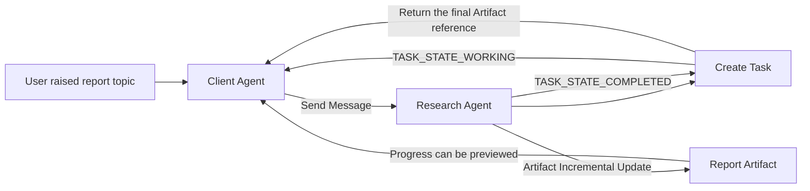
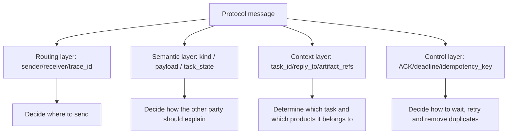
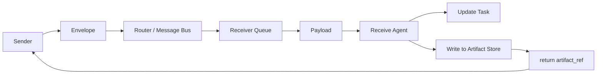
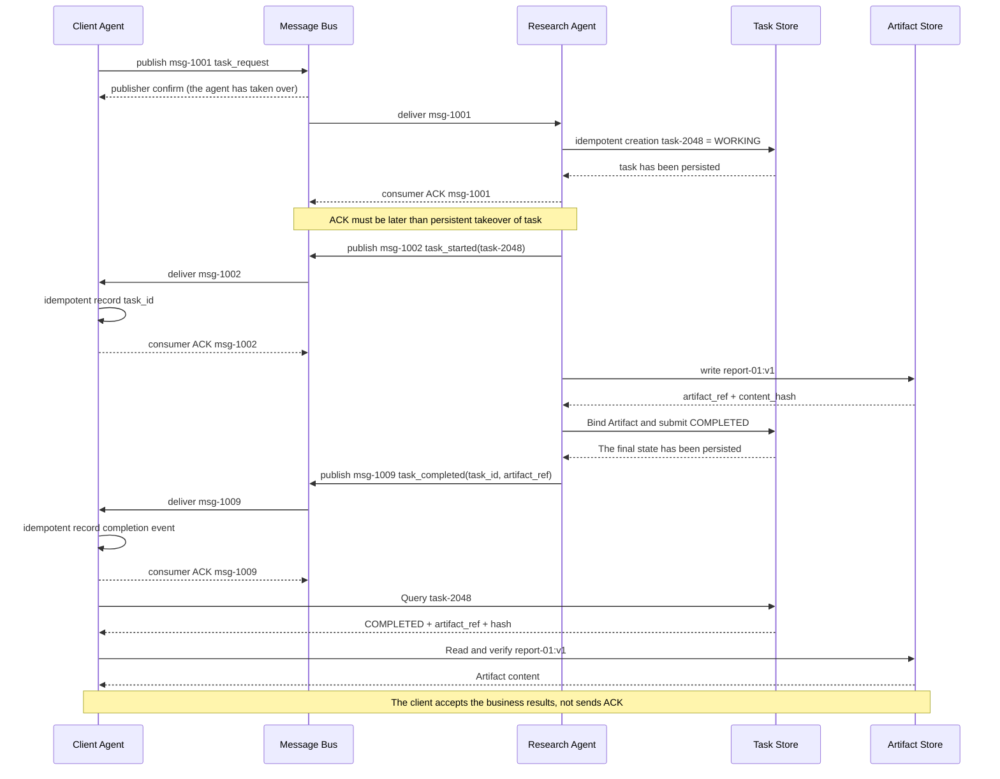
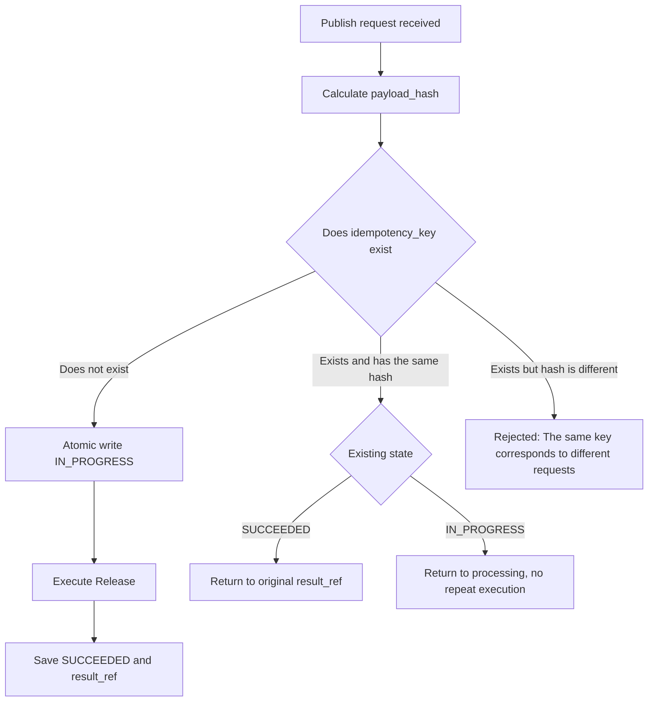
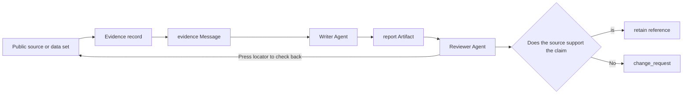
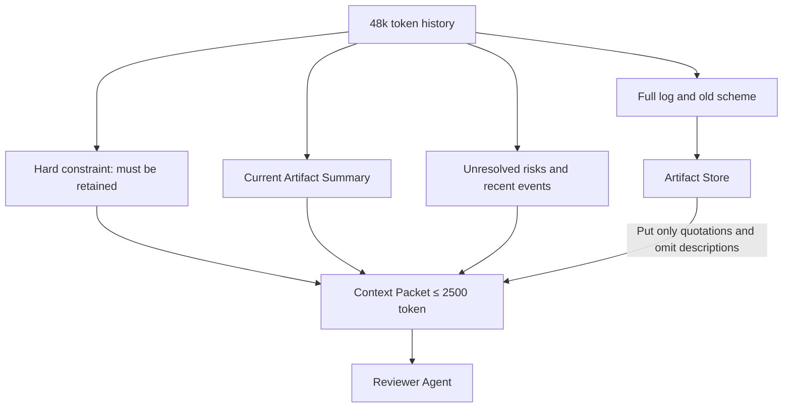
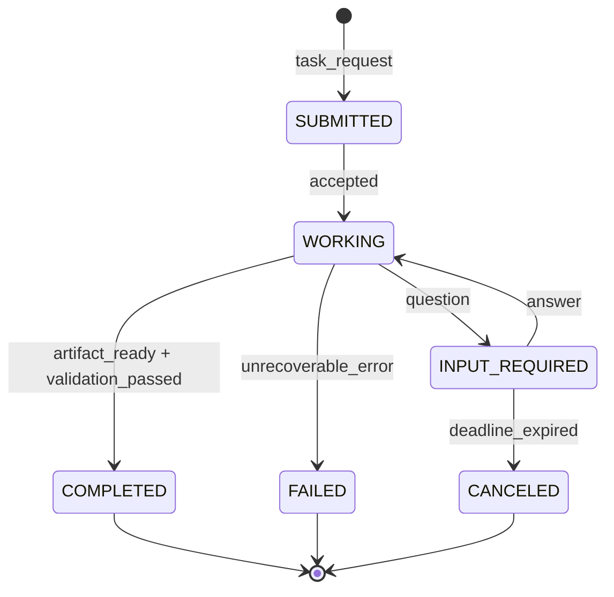
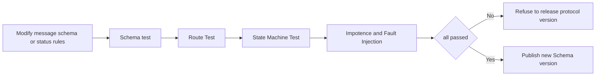

# Multi-Agent Knowledge · Step 5: Communication Protocol

> The communication protocol allows the router, receiving agent, and auditing system to process the same message consistently. This chapter uses a long report task to illustrate how messages are delivered, confirmed, retried, referenced and entered into the task state machine.

## 1. Core terms of multi-Agent communication protocol

When encountering an English term for the first time, use the right column to build your intuition. Each term will be put back into the same task chain later.

| Term | Working definition | Meaning in this chapter |
|---|---|---|
| Message | Message | A unit of communication sent by a participant to initiate a task, provide additional input, ask a question, or report status. |
| Envelope | Envelope | The outer layer of information that the router can read, such as the message number, sender, recipient, and tracking number. |
| Payload | Payload | The business content that the recipient actually processes, such as report topics, review comments, or structured parameters. |
| Task | Task | A work object that persists across multiple rounds, with independent number, status, and final product. |
| Artifact | The savable results produced by a task, such as a report, patch, evidence sheet, or test log. |
| Consumer ACK | Consumption confirmation | The consumer confirms to the message agent that a certain delivery has been processed to the agreed persistence boundary, and the agent can delete the delivery; it does not mean that the business task is completed. |
| Publisher confirm | Publish confirmation | The message broker confirms that it has taken over the publishing message; it does not mean that the target consumer has processed it. |
| Idempotency | Idempotence | When the same business request is delivered repeatedly, there will be no second side effects. |
| Retry | Retry | The sender delivers the request again after a timeout or temporary failure. |
| Trace ID | Trace number | String together the events generated by a task across Agents, queues and tools. |
| Schema | Structural Constraints | A machine-checkable contract that specifies field names, types, required conditions, and allowed values. |
| TTL, Time To Live | Time to Live or Hop Count | Limits how long a message can wait or be forwarded. |
| Dead-letter queue | Dead-letter queue | Save messages that have failed to be delivered multiple times, waiting for diagnosis or manual processing. |

<!-- learning-path:start -->
<div class="learning-path">
<div class="learning-path-title">How to study this chapter</div>
<div class="learning-path-step"><span>1</span><div> First use the A2A long report task to distinguish Message, Task, status update and Artifact, and identify problems with unstructured messages (sections 1 to 3). </div></div>
<div class="learning-path-step"><span>2</span><div> Then learn field boundaries, ACK, idempotence, references, context budgets, and task state machines along the message life cycle (Section 4-10). </div></div>
<div class="learning-path-step"><span>3</span><div>Finally validate the protocol through rejection path testing, open standard controls, and failure recovery exercises (sections 11-14). </div></div>
</div>
<!-- learning-path:end -->

---

## 2. Long report cross-Agent transfer case


This chapter builds intuition using the long task pattern in the [Agent2Agent Protocol (A2A, Agent to Agent Protocol) public specification](https://github.com/a2aproject/A2A/blob/main/docs/specification.md). The specification describes interoperability between independent Agent applications. Public examples include "request to write detailed reports", streaming status updates, incremental artifacts, and final completion status.

Here we must first draw a clear source boundary: **Message, Task, Artifact and asynchronous updates come from A2A public specifications; the internal role names, trace fields and Python validators added later in this chapter are teaching implementations, not the A2A SDK source code. **

There are four observable objects in the case:

| Object | What it is | Specific responsibilities in this example |
|---|---|---|
| Client Agent | Client Agent | Issues a request to "write a climate change report" and receives the progress and results. |
| Research Agent | Remote Research Agent | Accepts requests, retrieves, organizes materials internally, and generates reports. |
| Task | Long-term task object | Save `task_id`, current status and product list, which can still be queried after the network is disconnected. |
| Artifact | Task product | Save the report text or file reference, which is the final business result, not a chat reply. |

### 2.1 The main execution line of long tasks in real specifications



When reading the picture, focus on: the request content enters the system through Message, the continuous work is carried by Task, and the final report is carried by Artifact. Three objects cannot be combined into an ever-growing chat text.

By replacing the diagram with a running ledger, it will be easier for readers to see status changes:

| Sequence | Observable events | Key fields | What does the system know after this step |
|---:|---|---|---|
| 1 | Client sends request | `message_id=msg-1001` | This is a new report request. |
| 2 | Server-side creation task | `task_id=task-2048` | Subsequent events can be bound to the same task. |
| 3 | Status changed to Working | `state=WORKING` | The request was accepted but not completed. |
| 4 | Send product increment | `artifact_id=report-01` | Part of the report has been produced and can be previewed but cannot be regarded as the final version. |
| 5 | Status changes to Complete | `state=COMPLETED` | Normal modification messages should no longer be accepted unless a revision task is created. |
| 6 | The client reads the product | `artifact_id=report-01` | The final result has a stable number and can be saved, downloaded or handed over to Reviewer. |

This table is the starting point for all subsequent concepts in this chapter: Schema is responsible for checking fields, envelopes are responsible for routing, ACK is responsible for confirming receipt, idempotent keys are responsible for handling retries, state machines are responsible for preventing illegal flows, and artifact references are responsible for delivering large results.

### 2.2 Independent Agent cycle and team collaboration cycle


The closed loop of a single Agent is usually `task → action → observation → final`; the closed loop of a team will pass through `route → message → agent action → artifact/state update → review → reroute` repeatedly. The difference is not just a few more model calls, but more cross-role boundaries: who can receive which type of tasks, whether the message is valid, which version the product belongs to, who has control after handover, and who upgrades in case of failure.

<div class="concept-card">
<div class="concept-line">Team Cycle</div>
<div class="concept-line"> → Router selects receiver </div>
<div class="concept-line"> → Protocol verification message and handover authority </div>
<div class="concept-line"> → The receiver executes its own local loop </div>
<div class="concept-line"> → The product and status are written back to the shared record </div>
<div class="concept-line"> → End, rework, reroute or manual upgrade at review or supervisor decision </div>
</div>

Therefore, the model can propose `handoff` or `final`, but the runtime must verify the receiver, message schema, budget, termination conditions, and permissions. Only when local Agent loops are connected through these protocol boundaries can a reliable team loop be formed.

---

## 3. Limitations of unstructured status messages


Suppose the Research Agent only sends back one sentence:

<div class="concept-card">
<div class="concept-line"> "The report is written, see above." </div>
</div>

Humans may guess its meaning based on the chat context, but machines will encounter at least six undetermined problems:

| Missing information | Client Agent difficulties | Direct consequences in production systems |
|---|---|---|
| Message number | I don’t know if it has been processed | It may be re-entered or notified again after the network resends it. |
| Task number | Don't know which report it belongs to | The results of two parallel reports may be concatenated. |
| Message type | Not sure if this is progress or final | Draft may be released as final report. |
| Product number | Full report not found | Long text can only be copied and cannot be versioned. |
| Status | Don't know if the task has ended | The client may continue to wait, or it may stop prematurely. |
| Source and version | Don't know who generated it when | No way to audit, retract, or compare revisions. |

An executable teaching protocol message can be written as follows. It is not the A2A original line format, but puts the four layers of information that need to be explained in this chapter into an object:

```json
{
  "message_id": "msg-1005",
  "trace_id": "trace-climate-report-01",
  "task_id": "task-2048",
  "sender": "research_agent",
  "receiver": "client_agent",
  "kind": "artifact_ready",
  "reply_to": "msg-1001",
  "payload": {
    "summary": "Report completed, 6 sections in total, citing 14 sources.",
    "task_state": "completed"
  },
  "artifact_refs": ["artifact:report-01:v1"],
  "control": {
    "requires_ack": true,
    "idempotency_key": "task-2048:artifact-ready:v1",
    "deadline": "2026-07-10T10:05:00Z"
  }
}
```

<div class="code-explanation">
<div class="code-explanation-title">JSON message description</div>
<p><strong> Purpose: </strong> turns "report written" into a completion event that the machine can route and verify. <strong>Execution process: </strong>The router first reads sender, receiver and kind, then the client reads payload and artifact_refs. The delivery layer uses requires_ack and idempotency_key to handle confirmation and retry. <strong>Key Points: </strong>This is an example of a teaching protocol; production implementations should use formal schema, authentication, and time format validation. </p>
</div>

### 3.1 Four-layer structure of executable messages



When reading pictures, pay attention to: the text is only part of the semantic layer. Without the other three layers, the system still doesn't know who to give the text to, how to associate tasks, and whether it can retry if it fails.

---

## 4. Six-step conversion from user intent to deliverable message


The protocol is not just a layer of JSON outside the natural language. The sender completes six distinct steps:

1. **Identify business intent**: This is a submission review, not an ordinary notification.
2. **Resolve target object**: The target is `review_agent`, the task is `task-2048`, and the product is `report-01:v1`.
3. **Select message type**: Select `review_request` to let the receiver enter the corresponding processor.
4. **Fill envelope**: Generate message number, tracking number, sender, receiver and reply relationship.
5. **Fill control fields**: Determine whether ACK is required, when to timeout, and how to identify repeated requests.
6. **Perform pre-send verification**: fields, permissions, size, sensitive data and status transfer must be passed before delivery.

The following table shows the actual intermediate results produced by each step:

| Steps | Input | Output | What to do if it fails |
|---|---|---|---|
| Intent identification | "Leave it to the reviewers" | `intent=submit_for_review` | Ask questions first when the intent is unclear, and do not guess at high-risk actions. |
| Object analysis | Current task context | Three stable IDs of task, artifact, and receiver | Refuse to send if the product cannot be found. |
| Type selection | Intent and current state | `kind=review_request` | A protocol error returned when the type is not supported. |
| Envelope generation | Send body and running information | message_id, trace_id, reply_to | Cannot enter the production queue when trace is missing. |
| Control strategy | Risks, deadlines, and side effects | ACK, deadline, idempotency_key | Write operation rejected without idempotent key. |
| Schema verification | Complete candidate message | Legal message or error list | Error return to sender for correction, semi-legal objects will not be delivered. |

The following Pydantic model is the tutorial implementation for this chapter and is used to show how "conditional fields" are enforced outside the model:

```python
from datetime import datetime
from typing import Any, Literal

from pydantic import BaseModel, Field, model_validator


class Control(BaseModel):
    requires_ack: bool = True
    idempotency_key: str | None = None
    deadline: datetime | None = None


class ProtocolMessage(BaseModel):
    message_id: str
    trace_id: str
    task_id: str
    sender: str
    receiver: str
    kind: Literal[
        "task_request",
        "question",
        "answer",
        "progress",
        "artifact_ready",
        "review_request",
        "review_result",
        "error",
    ]
    payload: dict[str, Any]
    artifact_refs: list[str] = Field(default_factory=list)
    confidence: float | None = Field(default=None, ge=0.0, le=1.0)
    control: Control

    @model_validator(mode="after")
    def enforce_kind_specific_fields(self):
        if self.kind in {"artifact_ready", "review_request"} and not self.artifact_refs:
            raise ValueError(f"{self.kind} requires artifact_refs")
        if self.kind == "review_result" and self.confidence is None:
            raise ValueError("review_result requires confidence")
        return self
```

<div class="code-explanation">
<div class="code-explanation-title">Python teaching implementation instructions</div>
<p><strong> Purpose: </strong> displays basic type constraints and conditional constraints triggered by message types. <strong>Execution process: </strong>Pydantic first checks the field type and confidence range, and then the model_validator checks the exclusive requirements of artifact_ready, review_request and review_result. <strong> Key points: </strong> This is not an official A2A model; it demonstrates the boundaries of "the model proposes a message and the runtime determines whether the message is legitimate." </p>
</div>

The value of code is understood through concrete failures:

| Candidate message | Verification result | Why |
|---|---|---|
| `review_request` does not have `artifact_refs` | Reject | The reviewer does not know which version to check. |
| `review_result` does not have `confidence` | Reject | The aggregator cannot perform the confidence routing agreed in this chapter. |
| `confidence=1.3` | Rejection | Outside the agreed range of 0 to 1. |
| `progress` No artifacts | Allowed | Progress events can only report task status. |

---

## 5. Responsibility boundaries for message envelopes, payloads, tasks and products

The previous section explained how the sender converts user intent into a message. This section further unpacks the long-term objects surrounding the message. Only when envelopes, payloads, tasks, and artifacts have their own stable responsibilities can routing, state recovery, and large product storage not be squeezed into the same body of text.


Think of a delivery as sending a file rather than chatting:

<div class="concept-card">
<div class="concept-line"> Envelope: Who it is sent to, who it comes from, and which mission it belongs to </div>
<div class="concept-line"> Payload: What does this communication want to express </div>
<div class="concept-line">Task: Where this work is currently </div>
<div class="concept-line">Artifact: The result that really needs to be preserved and reused for a long time</div>
</div>

### 5.1 Readers and responsibilities of message objects



When reading the picture, pay attention to: Router only needs to understand the envelope; only the receiving Agent understands the payload; after the large result is written to the Artifact Store, it only sends the reference back to the message chain.

| Who | Primary readers | Does it change frequently | Typical content | What not to put |
|---|---|---:|---|---|
| Envelope | Gateway, router, auditor | Every message is different | sender, receiver, trace_id, kind | Full report text |
| Payload | Target Agent | Different for each message | Request parameters, questions, summary, review comments | Routing credentials and internal keys |
| Task | Orchestrator, client | Changes as work progresses | State, history, artifact list | Unlimited model thinking process |
| Artifact | Downstream Agents, users, reviewers | Changes by version | Reports, code, evidence tables, logs | Content that can only be understood by the chat sequence |

A2A The current specification clearly distinguishes between Messages and Artifacts: Messages are used to initiate tasks, clarify, communicate status, and append input, and task output should be returned through Artifacts. The engineering significance of this is that the results will not disappear due to chat window truncation, streaming connection interruption, or message cleaning.

Only the smallest fields in the A2A data relationship are retained below for ease of comparison and do not represent the complete specification object:

```json
{
  "message": {
    "messageId": "msg-1001",
    "role": "ROLE_USER",
    "parts": [{"text": "Write a report on climate change"}]
  },
  "task": {
    "id": "task-2048",
    "status": {"state": "TASK_STATE_WORKING"},
    "artifacts": []
  }
}
```

<div class="code-explanation">
<div class="code-explanation-title">A2A Field relationship description</div>
<p><strong> Purpose: </strong> The display request message is not the same object as the long-term task. <strong>Execution process: </strong>The client uses Message to submit the text Part, and the server creates a Task with independent id and status; artifacts will not appear until the report is completed. <strong> Key points: </strong> This is a field comparison compressed according to public specifications, not a complete HTTP request that can be sent directly. </p>
</div>

---

## 6. Release confirmation, consumption ACK and business completion semantics

After the object boundaries are clear, the next step is to determine what each participant confirms. Publishing acknowledgment, consuming ACK and business completion occur at different points in time, covering different scopes of responsibility and cannot be replaced by a "success" field.


This section uses "at least once delivery message agent" as the teaching model, and strictly distinguishes three types of facts with different directions and responsibilities:

1. **Publisher confirm**: The Message Bus has taken over the request message; it does not know whether the Research Agent processed it.
2. **Consumer ACK (consumption confirmation)**: The consumer has processed this delivery to the agreed persistence boundary, and the Message Bus can delete the delivery; it only corresponds to a certain message.
3. **Business Completed**: Task has entered the `COMPLETED` final state, Artifact has been persisted and can be verified; this is the application state, not ACK.

[RabbitMQ official confirmation mechanism description](https://www.rabbitmq.com/docs/confirms) clearly distinguish publisher confirm and consumer acknowledgement, which are independent of each other. If using HTTP/SSE form of A2A instead of a message broker, response, task, status update, and artifact semantics should be used and broker ACKs should not be generated.

### 6.1 Independent timing of ACK and business results



When reading the picture, pay attention to: Bus's release confirmation only covers the release end to the agent; Research Agent can only ACK the request after the Task has been persisted; the completion event can only be released after the Artifact and `COMPLETED` final state are submitted; the Client's ACK for the completion event only means that the event has been recorded, and the real acceptance requires querying the Task and verifying the Artifact.

Consumer ACK must occur later than the Task's persistence takeover. If the ACK is sent first and the Research Agent crashes immediately after the agent deletes the request, the system will have neither request message nor Task, causing the task to be permanently lost.

[A2A specification](https://github.com/a2aproject/A2A/blob/main/docs/specification.md) defines Task as a state object with a life cycle, and successful completion requires entering `TASK_STATE_COMPLETED`; task output should be delivered through the Artifact associated with the Task. Instantaneous messages or ACKs cannot be relied upon as the sole basis for business-critical results.

Recording the same run as an event ledger allows you to directly locate faults:

| Time | Event | Status | What will you see if you interrupt here |
|---|---|---|---|
| 10:00:00 | Bus returns publisher confirm | REQUEST_PUBLISHED | The agent has taken over the message, the Research Agent may not have received it yet. |
| 10:00:01 | `task-2048` ACK the request after persisting | WORKING | The proxy can delete the request; the task will not disappear if the consumer subsequently crashes. |
| 10:00:02 | Client record `task_started` | WORKING | Client obtains task_id and can query the progress; it has not been completed yet. |
| 10:03:10 | `report-01:v1` and hash written | WORKING | The Artifact already exists, but the Task final state has not yet been committed. |
| 10:03:11 | Artifact is bound to Task, and the final state is submitted | COMPLETED | The fact that the server-side business is completed has been persisted. |
| 10:03:12 | The Client records the completion event and ACK | COMPLETED | only means that the notification delivery is completed, which does not mean that the Client has accepted the Artifact. |
| 10:03:13 | Client queries Task, reads and verifies Artifact | CLIENT_ACCEPTED | Client can mark the result as accepted. |

The common delivery semantics of messaging systems should also be understood with specific consequences:

| Delivery semantics | May be lost | May be duplicated | What is suitable | Receiver responsibility |
|---|---:|---:|---|---|
| At-most-once | Yes | No | Droppable progress heartbeat | No deduplication required, but loss must be accepted. |
| At-least-once, at least once | No | Yes | Task requests, write operations, and critical events | Must use idempotent keys for deduplication. |
| Exactly-once effect, business effect once | No | Transfer can still be repeated | Payment, deployment, submission report | Business effect is achieved once through transactions, idempotent records and unique constraints. |

"Exactly one delivery" is difficult to directly guarantee in a cross-network system. What is usually pursued in engineering is that the message can arrive repeatedly, but the final side effect only occurs once.

If a message cannot be processed after multiple retries, there should not be an infinite loop. It should enter the dead-letter queue, saving the original message, last error, retries, schema version and trace_id for reprocessing by a human or fixed consumer.

---

## 7. Idempotent keys and repeated side effects control


Let’s look at the specific incident first: the client sent “Publish report-01:v1” and the server published successfully, but the network was disconnected before returning ACK. The client only sees the timeout and sends the same request. If the executor only judges based on "received another message", it will be published twice.

### 7.1 Idempotent records prevent repeated execution of processes



When reading the picture, pay attention to this: idempotent keys are not simply result caches. The system also needs to compare request fingerprints and differentiate between IN_PROGRESS and SUCCEEDED to cover mid-execution crashes and concurrent duplicate requests.

Here is the educational level executor, `reserve_atomic()` represents an atomic preserved operation that must be implemented by a database transaction or a unique index:

```python
import hashlib
import json


def fingerprint(tool_name: str, args: dict) -> str:
    canonical = json.dumps(args, sort_keys=True, separators=(",", ":"))
    return hashlib.sha256(f"{tool_name}:{canonical}".encode()).hexdigest()


def execute_once(store, key: str, tool_name: str, args: dict):
    request_hash = fingerprint(tool_name, args)
    record = store.get(key)

    if record and record.request_hash != request_hash:
        raise ValueError("idempotency key reused with different payload")
    if record and record.status == "SUCCEEDED":
        return record.result_ref
    if record and record.status == "IN_PROGRESS":
        raise RuntimeError("request is already in progress")

    store.reserve_atomic(key, request_hash, status="IN_PROGRESS")
    try:
        result_ref = call_tool(tool_name, args)
        store.mark_succeeded(key, result_ref)
        return result_ref
    except Exception as exc:
        store.mark_failed(key, repr(exc))
        raise
```

<div class="code-explanation">
<div class="code-explanation-title">Python teaching implementation instructions</div>
<p><strong> Purpose: </strong> shows how to handle duplicate requests, concurrent requests and key conflicts respectively. <strong> Execution process: </strong> The executor first normalizes parameters and calculates fingerprints, and then checks idempotent records; only callers with successful atomic retention can execute the tool, and the successful results are saved as stable references. <strong>Key points: </strong>reserve_atomic cannot be replaced by an ordinary memory dictionary; the production system also needs to define whether FAILED allows retries, IN_PROGRESS timeout recycling and the idempotent capabilities of the external tool itself. </p>
</div>

A good idempotent key is usually determined by the business action rather than the number of retries:

| Action | Example of a reasonable key | Example of an unreasonable key | Reason |
|---|---|---|---|
| Publish report version | `publish:task-2048:report-01:v1` | Random UUID | The UUID is different for each retry and the same action cannot be recognized. |
| Write the review conclusion | `review:task-2048:report-01:v1:reviewer-a` | `task-2048` | If the granularity is too coarse, different reviewers will be mistakenly judged as duplicates. |
| Send progress heartbeat | Can be set without setting or according to time window | Permanently fixed key | Heartbeat inherently allows the generation of multiple different events. |

---

## 8. Citation protocol and evidence tracking


The communication protocol cannot only ensure that "the message is delivered", but also ensures that important conclusions can be returned to the evidence. Quotes answer at least four questions:

| Question | Corresponding fields | Example |
|---|---|---|
| What object is referenced | `kind`, `target` | URL, file, Artifact, another Message |
| Which part of the object | `locator` | Page number, chapter, line number, JSON Pointer |
| Which version to reference | `version` or content hash | `v1`, Git SHA, SHA-256 |
| Who made this reference | sender and trace_id | `research_agent`, `trace-climate-report-01` |

### 8.1 Citation chain from evidence source to final report



When reading the picture, pay attention to: the citation is not a series of links at the end of the report. The reviewer must be able to follow the citation in the artifact back to the specific location of the source and determine whether the source actually supports the claim.

Large products require a stable list, rather than copying the full text into the message:

```json
{
  "artifact_id": "report-01",
  "task_id": "task-2048",
  "version": 1,
  "media_type": "text/markdown",
  "uri": "artifact://task-2048/report-01/v1",
  "sha256": "d741c9...",
  "created_by": "research_agent",
  "citations": [
    {
      "target": "https://www.ipcc.ch/report/ar6/wg1/chapter/summary-for-policymakers/",
      "locator": "A.1.7"
    }
  ]
}
```

<div class="code-explanation">
<div class="code-explanation-title">Artifact Manifest Description</div>
<p><strong> Purpose: </strong> Makes reports referenceable by task, version, format, and content hash. <strong> Execution process: </strong> The message only carries the artifact URI; the recipient reads the complete content according to the permissions, and then uses citations to locate the IPCC AR6 Working Group 1 decision-maker summary A.1.7. <strong>Key points: </strong>Artifact The list is still a teaching object, but the citation target and positioning are real public sources; the Reviewer also needs to check whether the main text claims are consistent with the original meaning of the paragraph. </p>
</div>

The purpose of `sha256` is not to prove that the content is correct, but to prove that the bytes read by the receiver are consistent with the version referenced by the sender. Authenticity also requires identity signatures, access controls, and provenance verification.

---

## 9. Context budget and receiver information clipping


The contextual budget is not "cut 2,500 tokens off the tail." It is a prioritized assembly of information:

1. First retain the task objectives and hard constraints that cannot be violated.
2. Then retain the summary and version of the Artifact that Reviewer currently wants to judge.
3. Then select recent errors, unresolved disputes, and high-risk evidence.
4. The complete material is kept in the Artifact Store, only quotes are put into context.
5. Clearly write out what has been omitted so that reviewers do not mistake the summary for all the facts.

### 9.1 Long history context pruning process



When reading the picture, it is important to note: compression does not delete the source. The main text goes into the Limited Context Packet, and the full material remains in the Artifact Store and is read on demand via citations.

A specific Context Packet can be composed according to the following budget:

| Content Blocks | Budget | Why Keep |
|---|---:|---|
| Goals and Acceptance Criteria | 250 | Tell the Reviewer what to ultimately judge. |
| Security and geographical hard constraints | 250 | These constraints cannot be overridden by any summary. |
| Report structure and summary of claims | 800 | Supports rapid development of overall understanding. |
| High-risk citations and controversy | 700 | Focus your limited attention on where things are most likely to go wrong. |
| Last two revisions | 300 | Explain how the current version came to be. |
| Artifacts and Log References | 150 | Allows full material review on demand. |
| Omit explanation | 50 | Make it clear which history does not enter the current context. |

<div class="concept-card">
<div class="concept-line">Reviewer actual received Context Packet</div>
<div class="concept-line"> Goal: Verify facts and references of report-01:v1 </div>
<div class="concept-line"> Must be retained: all 14 citations must be located; must not contain unmasked personal data </div>
<div class="concept-line">Current summary: 6 sections, 3 main conclusions, 2 figures to be confirmed</div>
<div class="concept-line">Full material: artifact://task-2048/research-log/v3</div>
<div class="concept-line"> Omitted: Early rejected outlines and duplicate search results </div>
</div>

This is more reliable than "copy the last twenty messages to Reviewer" because the recipient knows why the message came into context and knows where to look for evidence of omissions.

---

## 10. Task state machine and message type


The message type describes "what the communication is doing this time", and the task status describes "where the long-term task is currently". The two are related, but not in the same dimension.

| Dimensions | Examples | Lifecycle | Who updates |
|---|---|---|---|
| Message type | question, answer, progress, artifact_ready | Each time a message is sent, a new value is generated | Proposed by the message sender, protocol layer verification |
| Task status | SUBMITTED, WORKING, INPUT_REQUIRED, COMPLETED, FAILED | A task continuously updates the same status field | Task owner or orchestrator |

### 10.1 Long report task state machine



When reading the picture, pay attention to: `question` is only an event that triggers the task to enter INPUT_REQUIRED; after receiving `answer`, the task returns to WORKING. Only when the Artifact is ready and the acceptance is passed, the task will enter COMPLETED.

When a task is INPUT_REQUIRED, the protocol allows only a few messages to be received. The problem with `question -> final` is not simply "the two words are in the wrong order", but that the system is still waiting for the necessary input, but was skipped by a final unresolved problem.

```python
ALLOWED_EVENTS = {
    "SUBMITTED": {"accepted", "rejected"},
    "WORKING": {"progress", "question", "artifact_ready", "error"},
    "INPUT_REQUIRED": {"answer", "canceled", "error"},
    "COMPLETED": set(),
    "FAILED": set(),
    "CANCELED": set(),
}


def validate_event(task_state: str, message_kind: str) -> None:
    allowed = ALLOWED_EVENTS.get(task_state)
    if allowed is None:
        raise ValueError(f"unknown task state: {task_state}")
    if message_kind not in allowed:
        raise ValueError(
            f"message {message_kind!r} is illegal while task is {task_state}"
        )
```

<div class="code-explanation">
<div class="code-explanation-title">Python status verification instructions</div>
<p><strong>Purpose: </strong>Check whether the current Task allows this event before receiving the message. <strong>Execution process: </strong>Find the allowed set by task_state during runtime; INPUT_REQUIRED only accepts answer, canceled or error, so final will be explicitly rejected. <strong>Key points: </strong>Legal events are not equal to legal status updates; the production system should uniformly write new states by reducers or transactions, and record old states, events, and new states. </p>
</div>

The final state also needs to be clear: COMPLETED, FAILED and CANCELED no longer accept ordinary business events by default. To modify a completed report, you should create a revision task or explicitly reopen the process instead of secretly changing the final state back to WORKING.

---

## 11. Protocol rejection path and side effect testing

The previous Schemas, ACKs, idempotence, and state machines can only be proven valid with counterexamples. Protocol testing not only checks that legitimate messages can pass, but also confirms that illegal status, unknown recipients, and repeated requests are rejected without leaving additional side effects.


Protocol testing covers at least four layers:

| Test layer | Normal example | Counterexample | Results that must be observed |
|---|---|---|---|
| Schema | Valid `review_result` | Missing confidence | Verification failed and the message was not delivered. |
| Routing | Registered receiver | Non-existent receiver | Entering explicit error or dead letter, not received by random Agent. |
| State machine | INPUT_REQUIRED + answer | INPUT_REQUIRED + final | The state remains unchanged and a rejection event is logged. |
| Idempotent | First release | Release again with the same key and parameters | The number of tool calls is still 1 and the same result_ref is returned. |

The following test requires that the test name, protocol constraints, and assertions be consistent: since `review_result` must contain confidence, missing this field must be rejected.

```python
import pytest
from pydantic import ValidationError


def test_review_result_requires_confidence(valid_message_data):
    data = valid_message_data | {
        "kind": "review_result",
        "confidence": None,
    }
    with pytest.raises(ValidationError):
        ProtocolMessage.model_validate(data)


def test_final_is_rejected_while_waiting_for_answer():
    with pytest.raises(ValueError, match="illegal"):
        validate_event("INPUT_REQUIRED", "final")


def test_duplicate_request_reuses_result(store, call_counter):
    first = execute_once(store, "publish:report-01:v1", "publish", {"v": 1})
    second = execute_once(store, "publish:report-01:v1", "publish", {"v": 1})
    assert second == first
    assert call_counter.value == 1
```

<div class="code-explanation">
<div class="code-explanation-title">Python protocol testing instructions</div>
<p><strong> Purpose: </strong> Validates field conditions, status rejections, and idempotent side effects respectively. <strong> Execution process: </strong> The first test expects a Pydantic checksum error; the second test confirms that it cannot end while waiting for an answer; the third test uses the call count to prove that repeated requests do not execute the tool again. <strong>Key Points: </strong>valid_message_data, store, and call_counter are test fixtures; the full project should also assert that rejection events, queue length, and Task status have not changed. </p>
</div>

### 11.1 Pre-release testing gate for protocol changes



When reading the picture, pay attention to: before the protocol version is released, not only normal messages are tested, but also duplicate delivery, ACK loss, illegal status and old version messages are deliberately created.

---

## 12. Open standards and communication protocols in projects


The fields in this chapter do not appear out of thin air, but they should not pretend to be a unified standard. Three public sources can be placed in the same comparison table:

| Source | Main problems to be solved | Directly verifiable structure | Teaching points for reference in this chapter |
|---|---|---|---|
| [FIPA ACL Message Structure](https://www.fipa.org/repository/aclspecs.html) | Agent's communication behavior and message semantics | performative, sender, receiver, content, language, ontology, conversation-id, etc. | The message not only has the text, but also describes the behavior, participants, and conversation relationships. |
| [CloudEvents Specification](https://github.com/cloudevents/spec/blob/main/cloudevents/spec.md) | A common envelope for describing events across services and platforms | Required id, source, specversion, type, and optional subject, time, dataschema | Middleware should be able to inspect and route events without parsing business data. |
| [A2A Specification](https://github.com/a2aproject/A2A/blob/main/docs/specification.md) | Asynchronous, cross-modal interoperation of independent Agent applications | AgentCard, Message, Task, Part, Artifact, status updates and multiple protocol bindings | Message is used for communication, Task carries long-term status, and Artifact carries task output. |

The three sources are not simply substitutes for each other:

- FIPA ACL puts more emphasis on "what kind of communicative behavior this sentence is".
- CloudEvents puts more emphasis on "how events have unified, routable contextual properties."
- A2A puts more emphasis on "how different Agent applications interoperate around long tasks, states, and products."

Real projects can adopt one of these standards, or they can incorporate these design principles in internal protocols. No matter which route you choose, you must fix the Schema version, authentication method, error format, state semantics, and compatibility policy. You cannot just copy a few field names.

A2A's current specification also reminds of an easily overlooked boundary: streaming status messages may be missed due to disconnection, and key facts cannot rely solely on transient messages; states that need to be persisted should fall in Tasks or requeryable Artifacts. This is why this chapter repeatedly distinguishes between messages, tasks, and products.

---

## 13. Run recovery exercise if communication fails


Let’s take a look at the following six out-of-order records:

| event_id | trace_id | task_id | kind | key content |
|---|---|---|---|---|
| e-5 | trace-01 | task-2048 | progress | `state=WORKING` |
| e-2 | trace-01 | task-2048 | consumer_ack | `reply_to=msg-1001, durable_task=task-2048` |
| e-0 | trace-01 | unassigned | publisher_confirm | `message_id=msg-1001` |
| e-9 | trace-01 | task-2048 | artifact_update | `artifact=report-01:v1, content_hash=...` |
| e-1 | trace-01 | unassigned | task_request | `message_id=msg-1001` |
| e-7 | trace-01 | task-2048 | error | `retryable=true` |

Follow these steps to complete the paper or code exercise:

1. Sort by causality first instead of event_id string: request precedes publisher confirm; Task persistence precedes consumer ACK; Task creation precedes progress.
2. Find out whether the error occurred before the Artifact; if the log lacks timestamp or parent_id, you should clearly write "Unable to determine" and cannot guess.
3. Check whether artifact_update has stable Artifact reference and content hash; the presence of Artifact does not mean that the Task has been completed.
4. Check whether there is a COMPLETED event in the Task; if not, the task cannot be declared completed just by the appearance of the Artifact.
5. If the error is marked as retryable, use the original idempotency_key to try again; do not generate a new key to perform the same side effect again.

After completing the exercise, the reader should get an important conclusion: **The value of the protocol field is not to make the object look neat, but to allow the system to still tell clearly "what has happened, what has not happened, and why to do this next step" when information is incomplete, network failure and multi-role concurrency occur. **

---

## 14. Research and engineering basis of communication protocols

The following only determines "whether there is public evidence for the specific architecture or mechanism described in this chapter", and does not equate the existence of general middleware with the implementation of the entire multi-agent architecture. The verification date is 2026-07-12.

| Structure or mechanism of this chapter | Real paper or project | Public use information | Degree of correspondence with the design of this chapter |
|---|---|---|---|
| Structured Agent message: sender, receiver, semantic action, session identifier | [JADE Programmer's Guide](https://jade.tilab.com/doc/programmersguide.pdf); [FIPA ACL Message Structure](https://www.fipa.org/specs/fipa00061/) | JADE is a Java framework for FIPA-compliant multi-agent systems, `jade.lang.acl` handles ACLMessage directly; FIPA ACL definition Performative, sender, receiver, protocol, conversation-id and other fields. | **Directly supports the idea of ​​structured communication**, but JADE/FIPA is oriented to classic MAS and is not equal to the LLM Agent JSON object in this chapter. |
| Universal event envelope: allows routers to read event context without parsing the business body | [CloudEvents Specification](https://github.com/cloudevents/spec) | CloudEvents has formed specifications, protocol bindings, and multi-language SDKs for describing events across services, platforms, and systems. It is suitable for carrying outer contexts such as `id`, `source`, `type`, etc. | **Infrastructure layer directly supports**; it does not define Agent, Task, Artifact or multi-agent collaboration semantics. |
| Asynchronous Agent-to-Agent: Separation of Message, Task, status update and Artifact | [A2A Specification](https://github.com/a2aproject/A2A/blob/main/docs/specification.md); [A2A Samples](https://github.com/a2aproject/a2a-samples) | A2A official specification defines long task life cycle, streaming/push updates and Artifact; the official sample repository provides Python, Go, Java, JavaScript, .NET and other SDKs Examples and multi-agent workflows. | **Direct correspondence** This chapter runs through cases; the internal role names and teaching schemas in the text are still not A2A SDK source code. |
| Separation of publication confirmations and Consumer ACK | [RabbitMQ Consumer Acknowledgements and Publisher Confirms](https://www.rabbitmq.com/docs/confirms) | RabbitMQ implements publisher confirm and consumer acknowledgement respectively in the real message broker, which can support the delivery responsibility boundary of this chapter. | **The middleware mechanism directly corresponds**; public information can prove the mechanism of RabbitMQ and projects that adopt the complete multi-agent ACK architecture of this chapter: **None**. |
| Idempotent messages and duplicate side effect interception | [A2A Specification: Idempotency](https://github.com/a2aproject/A2A/blob/main/docs/specification.md#331-idempotency) | A2A specifies idempotent semantics for query and cancellation operations, and allows the Agent to use `messageId` to identify duplicate Send Messages. | **Partial correspondence**; public multi-agent projects that can prove the complete ledger structure of "idempotent key + payload hash + result record" in this chapter: **None**. |
| Reference protocol for Claim → Evidence → Source → Artifact | None | A2A can carry structured data and Artifact, but its core specifications do not stipulate the four-stage claim-evidence reference model in this chapter. | **None**; This is a teaching architecture. When implemented, the project needs to define its own Schema, parser and acceptance rules. |
| Context Packet that allocates tokens by goals, constraints, risks, and product references | None | Public projects generally use summary, history filtering, or context clipping, but no public papers or projects with exactly the same semantics as the budget table and `omitted_paths` of this chapter were found. | **None**; general "context compression" cannot be written into this architecture as it has been adopted. |
| Task state machine and final state rejection rules | [A2A Specification](https://github.com/a2aproject/A2A/blob/main/docs/specification.md) | A2A Task has a clear life cycle; final state tasks cannot continue to receive messages and support `input-required`, `completed`, `failed`, `canceled`, `rejected` and other statuses. | **Directly corresponds to the state machine principle**; the state name subset and transition checker in this chapter are teaching implementations. |
| Protocol compatibility and consistency testing | [A2A Technology Compatibility Kit](https://github.com/a2aproject/a2a-tck) | The A2A project provides TCK to check protocol implementation compatibility, and the official project page also lists it as an implementation testing tool. | **Directly supports protocol consistency testing**; the routing, idempotent side effects and playback use cases in this chapter still need to be supplemented by business projects. |

There is a boundary to grasp when reading this table: **"having real components" does not mean "having complete architectural cases"**. For example, RabbitMQ does implement two types of confirmations, but if there is no public multi-agent project showing how Task persistence, ACK, Artifact and business acceptance work together, it can only be marked as component-level evidence.

---

<!-- chapter-check:start -->
## 15. Communication protocol design self-test
<div class="chapter-check">
<div class="chapter-check-title"> Without reading the text, try to answer </div>
<ul>
<li> Can you write out the routing, semantics, context and control fields of a message? </li>
<li> Can you explain how idempotent keys prevent tools from being executed repeatedly? </li>
<li> Can you write a test for the illegal jump from question to final? </li>
<li>Can you distinguish publisher confirm, consumer ACK, Task COMPLETED and client business acceptance? </li>
</ul>
</div>
<!-- chapter-check:end -->

---

## 16. Summary of this chapter: message semantics, reliable delivery and context governance

The communication protocol is not "adding a few JSON fields to the chat", but splitting a collaboration into observable Messages, Tasks, Artifacts and status events. The reader should now be able to explain along the same lines:

- How natural language intent turns into verifiable messages.
- Why envelopes, payloads, tasks and products are separated.
- Why ACK, business completion and delivery semantics cannot be confused.
- Retry how to avoid duplicate side effects through idempotent records.
- How reference and context budgets control tokens while preserving traceability.
- How state machines and tests reject illegal processes outside the model.

See the next chapter **⑥ Routing and Handover**: The protocol defines how messages are expressed, and routing and handover determine who receives the messages and tasks.
