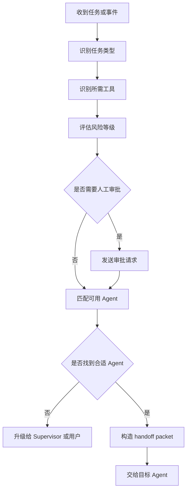
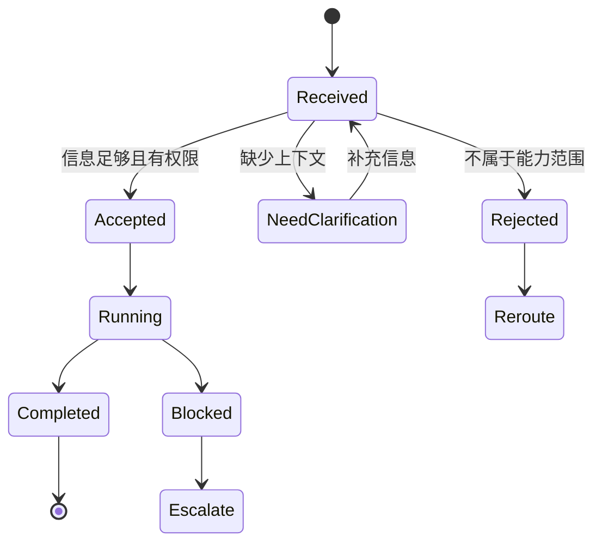

# Multi-Agent Knowledge · 第 ⑥ 步：路由与交接

> 路由决定任务交给谁，交接决定接收者拿到哪些目标、约束和产物；失败升级则规定接不住时由谁负责。


## 1. 路由与交接核心术语

本章第一次遇到下面这些英文时，先按这个中文含义理解；后文再展开它们的特性和工程做法。

| 英文术语 | 中文说法 | 先记住的含义 |
|---|---|---|
| Triage | 分诊 | 先判断任务类型、风险和所需能力。 |
| Routing | 路由 | 选择下一个处理任务的智能体。 |
| Handoff packet | 交接包 | 交给下游角色的目标、状态、约束和产物引用。 |
| Escalation | 升级 | 无法处理或风险过高时交给主管或人类。 |


<!-- learning-path:start -->
<div class="learning-path">
<div class="learning-path-title">本章怎么学</div>
<div class="learning-path-step"><span>1</span><div>先区分分诊、路由、交接和升级，再沿完整链路观察一次任务转移（第 1～3 节）。</div></div>
<div class="learning-path-step"><span>2</span><div>再实现 Triage、规则优先的路由、Handoff Packet 和受控交接函数（第 4～7 节）。</div></div>
<div class="learning-path-step"><span>3</span><div>最后用失败升级、路由与交接评测及真实项目对照验证整条链路（第 8～10 节）。</div></div>
</div>
<!-- learning-path:end -->

---

## 2. 路由、交接与升级链路

一次任务转移至少包含四个不同动作：Triage 判断任务类型与风险，Routing 选择接收者，Handoff 传递可执行上下文，Escalation 处理无人能接或风险过高的情况。本节先给出整条链路和公开项目锚点，后文再逐项实现。


<div class="concept-card">
<div class="concept-line">进入任务或消息（Incoming task / message）</div>
<div class="concept-line">  → 意图分类（Classify intent）判断它要解决什么</div>
<div class="concept-line">  → 能力匹配（Required capability）找到需要的角色能力</div>
<div class="concept-line">  → 权限与风险检查（Permission / Risk check）判断是否能直接处理</div>
<div class="concept-line">  → 路由决策（Routing decision）选择下一个智能体</div>
<div class="concept-line">  → 交接包（Handoff packet）带上目标、状态、约束和产物</div>
<div class="concept-line">  → 执行或升级（Execute / Escalate）完成处理或交给更高层</div>
</div>

项目锚点：
- Swarm 的两个核心原语是 Agent 和 handoffs：[openai/swarm](https://github.com/openai/swarm)
- AutoGen 支持多 Agent team 和不同 conversation pattern：[AutoGen Teams](https://microsoft.github.io/autogen/stable/user-guide/agentchat-user-guide/tutorial/teams.html)
- CrewAI 支持 sequential 和 hierarchical process：[CrewAI Crews](https://docs.crewai.com/en/concepts/crews)

这些项目采用的 API 不同，但都必须回答“谁接手、带什么信息、失败后找谁”。下一节用同一条任务把四个动作串起来，避免把路由函数误当成完整交接。

---

## 3. 从任务分类到可执行交接的完整流程


路由和交接经常被混在一起，但它们是两件事。路由是选择下一个 Agent；交接是把足够的信息交给它，让它不需要重新猜上下文。

先用这张图观察一次路由决策依次读取哪些信息：

### 3.1 任务路由决策树

这张图对应路由流程：先识别类型、工具和风险，再决定审批、匹配或升级。




读图时重点看：路由不是按角色名匹配，而是按能力、权限、风险和状态匹配。


<div class="concept-card">
<div class="concept-line">新任务或中间事件</div>
<div class="concept-line">  ↓</div>
<div class="concept-line">Triage：判断任务类型和风险</div>
<div class="concept-line">  ↓</div>
<div class="concept-line">Capability Match：匹配角色能力和工具权限</div>
<div class="concept-line">  ↓</div>
<div class="concept-line">Policy Check：检查预算、权限、审批规则</div>
<div class="concept-line">  ↓</div>
<div class="concept-line">Select Agent：选择下一个处理者</div>
<div class="concept-line">  ↓</div>
<div class="concept-line">Build Handoff Packet：构造交接包</div>
<div class="concept-line">  ↓</div>
<div class="concept-line">Receiver Acknowledges：接收方确认能处理</div>
<div class="concept-line">  ↓</div>
<div class="concept-line">Execute / Escalate / Return</div>
</div>

路由器需要看的不是“谁名字最像”，而是能力和状态：

| 路由信号 | 例子 |
|---|---|
| 任务类型 | research、coding、testing、security、writing |
| 所需工具 | web.search、file.write、run_tests |
| 风险等级 | read、write、external、deployment |
| 当前状态 | 哪些 Agent 忙、哪些失败过 |
| 预算限制 | 是否还能承担多轮调用 |
| 人类规则 | 是否需要审批或人工接管 |

交接包至少应该包含：

### 3.2 交接包状态机

这张状态机紧贴交接包字段，说明接收方可能接受、澄清、拒绝、阻塞或升级。




读图时重点看：交接不是发一句话，而是让接收者能确认自己能否接住任务。


<div class="concept-card">
<div class="concept-line">task_id：当前任务</div>
<div class="concept-line">goal：接收者要完成什么</div>
<div class="concept-line">current_state：目前做到哪里</div>
<div class="concept-line">artifacts：相关文件、证据、patch、日志</div>
<div class="concept-line">decisions：已经做过的决定</div>
<div class="concept-line">constraints：不能违反的约束</div>
<div class="concept-line">expected_output：接收者要返回什么</div>
<div class="concept-line">failure_policy：做不了时怎么办</div>
</div>

举一个典型交接：

<div class="concept-card">
<div class="concept-line">Researcher → Writer</div>
<div class="concept-line">goal: 写框架对比报告初稿</div>
<div class="concept-line">artifacts:</div>
<div class="concept-line">  - evidence:autoGen-docs</div>
<div class="concept-line">  - evidence:metagpt-readme</div>
<div class="concept-line">  - evidence:crewai-docs</div>
<div class="concept-line">constraints:</div>
<div class="concept-line">  - 不使用未引用事实</div>
<div class="concept-line">  - 每个比较结论必须引用 evidence id</div>
<div class="concept-line">expected_output:</div>
<div class="concept-line">  - markdown report</div>
<div class="concept-line">  - unresolved_questions</div>
</div>

如果没有交接包，Writer 可能会重新搜索、编造细节或忽略 Researcher 的证据。交接的目标是让下游 Agent 明确“我接到的是哪一棒”。

失败升级也要显式：

<div class="concept-card">
<div class="concept-line">Agent 无法完成</div>
<div class="concept-line">  ├─ 缺信息：问用户或退回 Planner</div>
<div class="concept-line">  ├─ 缺权限：请求审批或交给 Operator</div>
<div class="concept-line">  ├─ 工具失败：重试、降级或记录 blocker</div>
<div class="concept-line">  └─ 高风险：交给 Human Reviewer</div>
</div>

这条链路说明了三类责任：路由减少错误分配，交接减少上下文丢失，升级防止失败被无限重试掩盖。下面先实现入口处的 Triage 决策。

---

## 4. Triage Agent：任务分类与初始路由

Triage 位于任务入口，只做分类和初始建议，不直接执行专业任务。它的输入是用户任务和可用角色目录，输出至少包括目标角色、选择理由、所需上下文和风险等级；运行时还要检查目标是否存在、角色是否有权限，以及高风险任务是否必须转人工。


```python
class RouteDecision(BaseModel):
    target_agent: str
    reason: str
    required_context: list[str]
    risk: str

def triage(task: str) -> RouteDecision:
    prompt = f"""
Classify this task and choose one target agent.
Agents:
- researcher: evidence and citations
- developer: code changes
- tester: test plans and execution
- security_reviewer: risk review
- human: ambiguous or high-risk approval

Task:
{task}
"""
    return RouteDecision.model_validate(llm_json(prompt))
```

<div class="code-explanation">
<div class="code-explanation-title">Python 代码说明</div>
<p><strong>用途：</strong>让分诊模型返回目标角色、理由、所需上下文和风险等级。<strong>执行过程：</strong>提示列出各角色能力与高风险转人工规则，模型输出再由 <code>RouteDecision</code> 校验。<strong>关键点：</strong>模型路由只负责不确定情况，结果仍应经过允许列表和风险策略检查。</p>
</div>

结构化输出让模型建议可以被拒绝和审计，但并不意味着所有任务都应该调用模型。下一节先把高确定性和高风险场景写成规则，只把无法明确判断的任务交给 Triage 模型。


---

## 5. 规则路由与模型路由的优先级


路由顺序应当是“硬规则优先，模型处理剩余模糊情况”。权限、生产写入和明确关键词属于可测试边界，不应由模型自由覆盖；模型适合处理语义相近、描述不完整或多个角色都可能胜任的任务。

```python
def deterministic_route(task: str) -> str | None:
    lowered = task.lower()
    if "delete production" in lowered or "send email" in lowered:
        return "human"
    if "security" in lowered or "token" in lowered:
        return "security_reviewer"
    if "test" in lowered or "pytest" in lowered:
        return "tester"
    return None

def route(task: str) -> str:
    return deterministic_route(task) or triage(task).target_agent
```

<div class="code-explanation">
<div class="code-explanation-title">Python 代码说明</div>
<p><strong>用途：</strong>把高风险和高确定性的关键词规则放在模型路由之前。<strong>执行过程：</strong>任务先转小写，删除生产或发邮件直接转人工，安全相关转评审者，测试相关转测试者；没有命中才调用分诊模型。<strong>关键点：</strong>这种“规则优先、模型回退”更可预测，也便于给关键规则写回归测试。</p>
</div>


规则命中时应记录规则编号和原因；模型回退时应保存候选角色、置信度和原始决定。得到目标角色以后，系统仍不能直接调用它，因为接收者还需要任务目标、产物引用和约束；这些内容由下一节的交接包承载。

---

## 6. Handoff Packet：交接上下文的数据契约


路由结果只回答“交给谁”，Handoff Packet 还要回答“交什么”。接收者需要知道任务目标、当前进度、已完成产物、必须遵守的约束、未决问题和期望输出，才能判断自己是否能接住任务。

```python
class HandoffPacket(BaseModel):
    from_agent: str
    to_agent: str
    task: str
    objective: str
    context_summary: str
    artifacts: dict[str, str]
    constraints: list[str]
    open_questions: list[str]
    expected_output: str
```

<div class="code-explanation">
<div class="code-explanation-title">Python 代码说明</div>
<p><strong>用途：</strong>定义交接时必须携带的最小上下文包。<strong>执行过程：</strong>数据包明确谁交给谁、任务与目标、摘要、产物、约束、未决问题和期望输出。<strong>关键点：</strong>接收者因此不需要重读全部对话，也不会只收到一句含糊的“你继续处理”。</p>
</div>


下面把架构师已经确认的 OAuth 设计交给开发者，产物使用引用而不是复制整段历史：

```python
packet = HandoffPacket(
    from_agent="architect",
    to_agent="developer",
    task="Implement OAuth callback handler.",
    objective="Add GitHub OAuth login without logging tokens.",
    context_summary="Design uses state parameter and server-side session.",
    artifacts={"design_doc": "artifacts/design-oauth.md"},
    constraints=["No token in logs", "All tests must pass"],
    open_questions=[],
    expected_output="Patch summary and test commands run.",
)
```

<div class="code-explanation">
<div class="code-explanation-title">Python 代码说明</div>
<p><strong>用途：</strong>展示架构师向开发者交接 OAuth 回调实现的具体数据。<strong>执行过程：</strong>目标强调不记录 token，设计文档以产物引用传递，约束和期望输出分别规定安全边界与验收材料。<strong>关键点：</strong>空的 <code>open_questions</code> 表示此时没有已知未决项，而不是默认忽略疑问。</p>
</div>

交接包是数据契约，还没有执行控制权转移。下一节的交接函数负责验证目标角色和授权关系，再把这份数据交给接收者。


---

## 7. 交接函数与上下文转移

交接函数是路由决定与角色执行之间的运行时门。它至少要验证接收者存在、发送者有权交接、数据包通过 Schema 校验，并记录交接事件；接收者拒绝任务时，原任务状态不能被误标为已接收。


```python
def handoff(packet: HandoffPacket, agents: dict):
    if packet.to_agent not in agents:
        raise ValueError(f"unknown agent {packet.to_agent}")
    target = agents[packet.to_agent]
    return target.run(packet.model_dump())
```

<div class="code-explanation">
<div class="code-explanation-title">Python 代码说明</div>
<p><strong>用途：</strong>根据交接包找到目标智能体并调用其统一运行接口。<strong>执行过程：</strong>函数先确认目标名称存在，再取出目标对象，将 Pydantic 数据包转成字典交给 <code>run()</code>。<strong>关键点：</strong>存在性检查必须发生在字典索引之前，才能给未知角色返回清晰错误。</p>
</div>


仅检查角色存在仍不够。下面在真正调用接收者之前增加发送者到接收者的授权检查：

```python
def secure_handoff(packet: HandoffPacket, agents: dict, policy: dict):
    allowed = policy.get(packet.from_agent, set())
    if packet.to_agent not in allowed:
        raise PermissionError(f"{packet.from_agent} cannot hand off to {packet.to_agent}")
    return handoff(packet, agents)
```

<div class="code-explanation">
<div class="code-explanation-title">Python 代码说明</div>
<p><strong>用途：</strong>在普通交接外增加角色到角色的授权关系。<strong>执行过程：</strong>函数从策略表读取发送者允许的接收者集合，未授权则拒绝，授权后才调用实际交接。<strong>关键点：</strong>这样可阻止低权限角色绕过主管直接把任务交给部署或人工审批角色。</p>
</div>

真实系统还应把“已发送、已接受、已拒绝”建模为不同事件，并在超时后恢复原 owner 或重新路由。接收者存在且有权限，也可能因为工具故障、信息不足或风险过高而失败；下一节定义这些情况的升级路径。


---

## 8. 失败升级策略

失败处理要先分类，再决定重试、降级、重新路由或转人工。临时网络错误可以有限重试；缺少输入应退回 Planner 或询问用户；权限不足不能靠重试解决；高风险和多次失败应升级给 Supervisor 或人类。


```python
def handle_agent_failure(agent_name: str, error: str, state: dict) -> str:
    if "permission" in error.lower():
        return "human"
    if state.get("retry_count", 0) < 2:
        return agent_name
    if agent_name != "supervisor":
        return "supervisor"
    return "human"
```

<div class="code-explanation">
<div class="code-explanation-title">Python 代码说明</div>
<p><strong>用途：</strong>把智能体失败映射为重试、升级主管或转人工。<strong>执行过程：</strong>权限错误立即转人工，普通失败在两次以内交回原角色，之后升级主管；主管仍失败则转人工。<strong>关键点：</strong>错误分类比盲目重试重要，状态中还应记录退避时间和已尝试策略。</p>
</div>


升级决定必须记录错误类别、已尝试次数、最后 owner 和下一责任人。这样评测时才能区分“路由选错人”“接收者执行失败”和“升级策略过晚”；下一节分别衡量这些问题。

---

## 9. 路由准确率与交接质量评测


路由准确率只检查目标角色是否正确，交接质量还要检查必需上下文是否完整、越权交接是否被拒绝、失败是否及时升级。最小回归集应覆盖确定性规则、模型回退、模糊输入和高风险任务。

```python
ROUTE_CASES = [
    ("Find papers about CAMEL and summarize.", "researcher"),
    ("Run pytest and explain failures.", "tester"),
    ("Check whether this patch leaks API keys.", "security_reviewer"),
    ("Deploy to production now.", "human"),
]

def test_router():
    for task, expected in ROUTE_CASES:
        assert route(task) == expected
```

<div class="code-explanation">
<div class="code-explanation-title">Python 代码说明</div>
<p><strong>用途：</strong>用代表性任务构成路由回归测试集。<strong>执行过程：</strong>测试逐条调用路由器并断言研究、测试、安全和生产部署任务进入预期角色。<strong>关键点：</strong>生产评测集还应覆盖模糊输入、冲突关键词、多语言、恶意提示和模型回退路径。</p>
</div>


回归测试应报告按任务类型分组的准确率、未授权交接率、交接包缺字段率和升级准确率，而不是只给一个总分。测试结果说明教学实现是否稳定，下一节再用公开项目核对这些机制在真实框架中分别出现在哪一层。

---

## 10. 真实项目中的路由与交接实现

下表逐项对应本章设计。只有项目源码、官方文档或论文明确出现相同机制时才写“直接对应”；只有相邻能力时写“部分对应”；精确定义找不到公开证据时写“无”。核验日期为 2026-07-12。

| 本章架构或机制 | 真实论文或项目 | 公开使用信息 | 与本章设计的对应程度 |
|---|---|---|---|
| Triage Agent 选择专业 Agent | [OpenAI Swarm](https://github.com/openai/swarm)；[OpenAI Agents SDK handoffs](https://github.com/openai/openai-agents-python/blob/main/docs/handoffs.md) | Swarm 仓库提供 `triage_agent` 和航空客服多 Agent 示例；Agents SDK 文档用 Triage Agent 在 billing、refund 等专业 Agent 之间选择 handoff。 | **直接对应**“先分诊，再转交专业角色”。Swarm 明确是教育性实验框架，不应表述为生产采用证明。 |
| 规则优先、模型回退的混合路由器 | [MasRouter](https://arxiv.org/abs/2502.11133)及其[开源代码](https://github.com/yanweiyue/masrouter) | MasRouter 研究多智能体系统中的协作模式、角色和模型级联路由，证明路由可被显式优化；但它使用学习式控制器，不是本章的关键词规则优先实现。 | 精确架构的公开论文或项目：**无**。MasRouter 只能作为相关研究，不能充当相同实现。 |
| 同时读取能力、权限、风险和运行状态的路由决策树 | [A2A AgentCard 与能力声明](https://github.com/a2aproject/A2A/blob/main/docs/specification.md) | A2A 用 AgentCard 公布技能、接口和可选能力，客户端应先验证能力再调用；它没有规定本章这棵综合权限、风险和负载的决策树。 | **部分对应能力发现**；完整四信号路由树的公开项目：**无**。 |
| Handoff Packet 携带摘要、约束、产物引用、未决问题和期望输出 | [OpenAI Agents SDK handoff inputs and filters](https://github.com/openai/openai-agents-python/blob/main/docs/handoffs.md#handoff-inputs) | Agents SDK 的 `input_type` 可校验 handoff 时生成的 reason、priority、summary 等元数据，`input_filter` 可控制接收 Agent 看到的历史。 | **部分对应**；与本章全部字段完全相同的公开 Handoff Packet：**无**。应用仍需定义自己的持久化和 Artifact 引用规则。 |
| 用函数/工具调用完成控制权转移 | [OpenAI Agents SDK](https://github.com/openai/openai-agents-python)；[OpenAI Swarm](https://github.com/openai/swarm) | Agents SDK 把 handoff 暴露为面向模型的工具，并由运行时转给目标 Agent；Swarm 通过函数返回另一个 Agent 完成 transfer。 | **直接对应**本章 `handoff()` 的核心控制流；具体注册表、异常和数据对象不同。 |
| 发送者—接收者权限矩阵控制 secure handoff | [OpenAI Agents SDK handoffs](https://github.com/openai/openai-agents-python/blob/main/docs/handoffs.md) | Agents SDK 支持用 `is_enabled` 动态启用或禁用某条 handoff，也可在 `on_handoff` 中执行应用检查。 | **部分对应动态授权入口**；采用本章 sender→allowed_targets 矩阵的公开项目：**无**。 |
| 卡住后重规划、升级主管或人工 | [Magentic-One 论文](https://arxiv.org/abs/2411.04468)；[AutoGen Magentic-One 实现](https://github.com/microsoft/autogen/blob/main/python/packages/autogen-magentic-one/README.md) | Magentic-One 的 Orchestrator 维护 Task Ledger 与 Progress Ledger，跟踪进度并在错误或停滞后重新规划；AutoGen 提供 `MagenticOneGroupChat` 实现并设置最大停滞次数。 | **直接支撑主管恢复与重规划**；本章“权限错误→人工、普通错误→重试、主管失败→人工”的完整固定链条：**无**。 |
| 路由回归集与准确率、成本等评测 | [OpenAI Swarm examples](https://github.com/openai/swarm)；[MasRouter](https://arxiv.org/abs/2502.11133) | Swarm 仓库给出 triage、airline 等示例的 eval 入口；MasRouter 公开论文和代码用任务效果与开销评估多智能体路由。 | **直接支撑路由需要评测**；本章四条 `ROUTE_CASES` 与风险指标是教学测试集，不是上述项目的数据集。 |

这张表还说明了三个不能混淆的层次：Triage 解决“由谁接手”，Handoff 解决“怎样转移控制与上下文”，失败升级解决“接不住以后由谁负责”。某个项目只实现其中一层时，不能据此宣称整套路由—交接—升级架构都已得到验证。

---

<!-- chapter-check:start -->
## 11. 路由与交接设计自检
<div class="chapter-check">
<div class="chapter-check-title">不看正文，尝试回答</div>
<ul>
<li>能否说明哪些路由规则应先于模型判断？</li>
<li>能否写出一个不依赖完整聊天记录的交接包？</li>
<li>能否为权限失败、普通失败和主管失败设计不同升级路径？</li>
</ul>
</div>
<!-- chapter-check:end -->

---

## 12. 本章总结：任务路由、上下文交接与失败升级

路由与交接的目标是**把任务交给最合适、最有权限、上下文最充分的 Agent**，并在失败时有明确升级路径。

下一章看 **⑦ 观测、评测与调试**：路由与交接是否可靠，需要通过跨 Agent 轨迹、事件和回归集验证。
