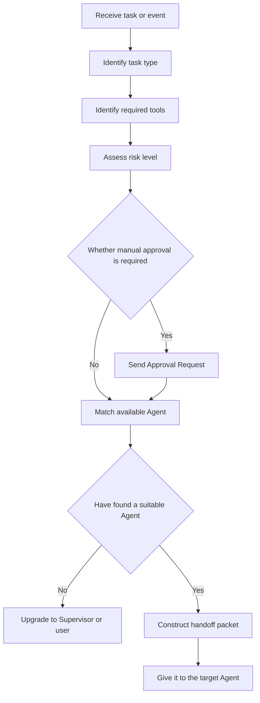
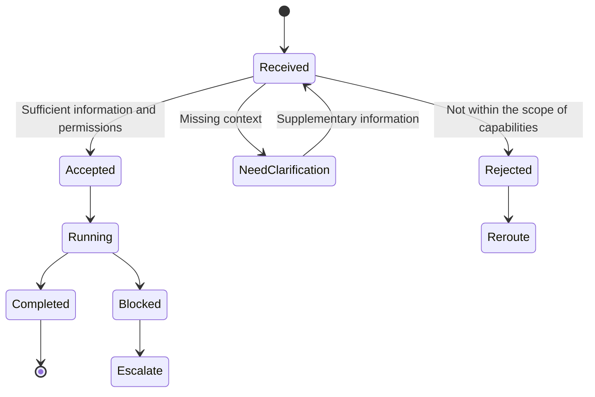

# Multi-Agent Knowledge · Step 6: Routing and Handover

> Routing determines who the task is handed over to, and handover determines which goals, constraints, and products the recipient gets; failed upgrades stipulate who will be responsible if the task cannot be taken over.


## 1. Core terms of routing and handover

When you first encounter the terms below, use these working definitions as a quick reference; later sections cover their properties and engineering implications.

| Term | Working definition | Key idea |
|---|---|---|
| Triage | Triage | First determine the task type, risks and required abilities. |
| Routing | Routing | Selecting the next agent to handle the task. |
| Handoff packet | Handoff packet | Goals, status, constraints and product references handed over to downstream roles. |
| Escalation | Escalation | Hand over to a supervisor or human when it cannot be handled or the risk is too high. |


<!-- learning-path:start -->
<div class="learning-path">
<div class="learning-path-title">How to study this chapter</div>
<div class="learning-path-step"><span>1</span><div> First differentiate between triage, routing, handover and upgrade, and then observe a task transfer along the complete link (sections 1-3). </div></div>
<div class="learning-path-step"><span>2</span><div> Then implement Triage, rule-first routing, Handoff Packet, and controlled handover functions (sections 4-7). </div></div>
<div class="learning-path-step"><span>3</span><div> Finally, the entire link is verified using failed upgrades, routing and handover evaluations, and real project comparisons (sections 8 to 10). </div></div>
</div>
<!-- learning-path:end -->

---

## 2. Routing, handover and upgrade links

A task transfer contains at least four different actions: Triage determines the task type and risk, Routing selects the recipient, Handoff delivers the executable context, and Escalation handles situations where no one can take the task or the risk is too high. This section first gives the entire link and public project anchor points, and then implements them one by one later.


<div class="concept-card">
<div class="concept-line">Incoming task/message </div>
<div class="concept-line"> → Classify intent to determine what it wants to solve </div>
<div class="concept-line"> → Required capability finds the required character ability </div>
<div class="concept-line"> → Permission / Risk check to determine whether can be processed directly</div>
<div class="concept-line"> → Routing decision selects the next agent </div>
<div class="concept-line"> → Handoff packet with goals, status, constraints and artifacts </div>
<div class="concept-line"> → Execute/Escalate to complete the processing or hand it over to a higher level </div>
</div>

Project anchor:
- The two core primitives of Swarm are Agent and handoffs: [openai/swarm](https://github.com/openai/swarm)
- AutoGen supports multiple Agent teams and different conversation patterns: [AutoGen Teams](https://microsoft.github.io/autogen/stable/user-guide/agentchat-user-guide/tutorial/teams.html)
- CrewAI supports sequential and hierarchical processes: [CrewAI Crews](https://docs.crewai.com/en/concepts/crews)

The APIs used by these projects are different, but they all must answer "who takes over, what information to bring, and who to contact after failure." The next section uses the same task to string together four actions to avoid mistaking the routing function for a complete handover.

---

## 3. Complete process from task classification to executable handover


Routing and handoff are often lumped together, but they are two different things. Routing is to select the next Agent; handover is to give it enough information so that it does not need to guess the context again.

First use this picture to observe what information is read in sequence for a routing decision:

### 3.1 Task routing decision tree

This diagram corresponds to the routing process: identify types, tools, and risks before deciding to approve, match, or upgrade.




When reading the diagram, pay attention to this: Routing is not matched by role name, but by capabilities, permissions, risks, and status.


<div class="concept-card">
<div class="concept-line">New task or intermediate event</div>
<div class="concept-line">  ↓</div>
<div class="concept-line">Triage: Determine task type and risk </div>
<div class="concept-line">  ↓</div>
<div class="concept-line">Capability Match: Match role capabilities and tool permissions </div>
<div class="concept-line">  ↓</div>
<div class="concept-line">Policy Check: Check budget, permissions, approval rules</div>
<div class="concept-line">  ↓</div>
<div class="concept-line">Select Agent: Select the next processor </div>
<div class="concept-line">  ↓</div>
<div class="concept-line">Build Handoff Packet: Construct handoff packet </div>
<div class="concept-line">  ↓</div>
<div class="concept-line">Receiver Acknowledges: The receiver confirms that it can handle </div>
<div class="concept-line">  ↓</div>
<div class="concept-line">Execute / Escalate / Return</div>
</div>

What the router needs to look at is not "who has the most similar name", but its capabilities and status:

| Routing Signals | Example |
|---|---|
| Task type | research, coding, testing, security, writing |
| Required tools | web.search, file.write, run_tests |
| Risk level | read, write, external, deployment |
| Current status | Which Agents are busy and which have failed |
| Budget constraints | Can we still afford multiple rounds of calls |
| Human rules | Whether approval or manual takeover is required |

The handover package should contain at least:

### 3.2 Handover package state machine

This state machine follows the handover packet fields, indicating that the recipient may accept, clarify, reject, block, or escalate.




When reading the picture, pay attention to this: Handover is not about sending a sentence, but about allowing the recipient to confirm whether he can take the task.


<div class="concept-card">
<div class="concept-line">task_id: current task </div>
<div class="concept-line">goal: What the recipient wants to accomplish </div>
<div class="concept-line">current_state: Where we are currently </div>
<div class="concept-line">artifacts: related documents, evidence, patches, logs</div>
<div class="concept-line">decisions: Decisions that have been made</div>
<div class="concept-line">constraints: Constraints that cannot be violated </div>
<div class="concept-line">expected_output: What should the receiver return </div>
<div class="concept-line">failure_policy: What to do when you can’t do it </div>
</div>

Give a typical handover:

<div class="concept-card">
<div class="concept-line">Researcher → Writer</div>
<div class="concept-line">goal: Write the first draft of the framework comparison report</div>
<div class="concept-line">artifacts:</div>
<div class="concept-line">  - evidence:autoGen-docs</div>
<div class="concept-line">  - evidence:metagpt-readme</div>
<div class="concept-line">  - evidence:crewai-docs</div>
<div class="concept-line">constraints:</div>
<div class="concept-line"> - Do not use the unquoted fact </div>
<div class="concept-line"> - Each comparison conclusion must reference evidence id</div>
<div class="concept-line">expected_output:</div>
<div class="concept-line">  - markdown report</div>
<div class="concept-line">  - unresolved_questions</div>
</div>

Without a handover packet, the Writer might have re-searched, made up details, or ignored the Researcher's evidence. The goal of the handover is to let the downstream agent know "which stick I received."

Failed upgrades must also be made explicit:

<div class="concept-card">
<div class="concept-line">Agent could not complete </div>
<div class="concept-line"> ├─ Missing information: ask user or return Planner</div>
<div class="concept-line"> ├─ Missing permission: request approval or hand it over to Operator</div>
<div class="concept-line"> ├─ Tool failed: retry, downgrade, or log blocker</div>
<div class="concept-line"> └─ High Risk: Leave it to Human Reviewer</div>
</div>

This link illustrates three categories of responsibilities: routing to reduce misallocations, handovers to reduce context loss, and upgrades to prevent failures being masked by infinite retries. Next, we first implement the Triage decision at the entrance.

---

## 4. Triage Agent: task classification and initial routing

Triage is located at the task entrance. It only makes classification and initial suggestions and does not directly perform professional tasks. Its input is a directory of user tasks and available roles, and its output includes at least the target role, selection reason, required context and risk level; when running, it also checks whether the target exists, whether the role has permissions, and whether high-risk tasks must be transferred to manual tasks.


```python
class RouteDecision(BaseModel):
    target_agent: str
    reason: str
    required_context: list[str]
    risk: str

def triage(task: str) -> RouteDecision:
    prompt = f"""
Classify this task and choose one target agent.
Agents:
- researcher: evidence and citations
- developer: code changes
- tester: test plans and execution
- security_reviewer: risk review
- human: ambiguous or high-risk approval

Task:
{task}
"""
    return RouteDecision.model_validate(llm_json(prompt))
```

<div class="code-explanation">
<div class="code-explanation-title">Python code description</div>
<p><strong> Purpose: </strong> Let the triage model return the target role, rationale, required context, and risk level. <strong> Execution process: </strong> prompts to list each role's capabilities and high-risk manual transfer rules, and the model output is then verified by <code>RouteDecision</code>. <strong> Key points: </strong> Model routing is only responsible for uncertain situations, the results should still be checked by allow lists and risk policies. </p>
</div>

Structured output allows model recommendations to be rejected and audited, but does not mean that the model should be called for all tasks. In the next section, we first write high-certainty and high-risk scenarios into rules, and only assign tasks that cannot be determined clearly to the Triage model.


---

## 5. Priority of rule routing and model routing


The routing order should be "hard rules first, model handles remaining ambiguities". Permissions, production writes, and explicit keywords belong to testable boundaries and should not be freely covered by the model; the model is suitable for handling tasks with similar semantics, incomplete descriptions, or multiple roles that may be competent.

```python
def deterministic_route(task: str) -> str | None:
    lowered = task.lower()
    if "delete production" in lowered or "send email" in lowered:
        return "human"
    if "security" in lowered or "token" in lowered:
        return "security_reviewer"
    if "test" in lowered or "pytest" in lowered:
        return "tester"
    return None

def route(task: str) -> str:
    return deterministic_route(task) or triage(task).target_agent
```

<div class="code-explanation">
<div class="code-explanation-title">Python code description</div>
<p><strong> Purpose: </strong> Place high-risk and high-certainty keyword rules before model routing. <strong> Execution process: </strong> Tasks are first converted to lowercase, delete production or send emails and directly transfer to manual, safety-related are transferred to reviewers, test-related are transferred to testers; the triage model is called only if there is no hit. <strong>Key points: </strong> This kind of "rule first, model fallback" is more predictable and makes it easier to write regression tests for key rules. </p>
</div>


When a rule is hit, the rule number and reason should be recorded; when the model is rolled back, the candidate role, confidence level, and original decision should be saved. After obtaining the target role, the system still cannot call it directly because the recipient also needs task goals, product references, and constraints; these contents are carried by the handover package in the next section.

---

## 6. Handoff Packet: Data contract of handover context


The routing result only answers "to whom", Handoff Packet also answers "to what". The recipient needs to know the task goal, current progress, completed products, constraints that must be adhered to, open issues and expected output in order to judge whether he can accept the task.

```python
class HandoffPacket(BaseModel):
    from_agent: str
    to_agent: str
    task: str
    objective: str
    context_summary: str
    artifacts: dict[str, str]
    constraints: list[str]
    open_questions: list[str]
    expected_output: str
```

<div class="code-explanation">
<div class="code-explanation-title">Python code description</div>
<p><strong> Purpose: </strong> Defines the minimum context packet that must be carried during handover. <strong> Execution process: </strong> The data package identifies who is assigned to whom, tasks and goals, summary, products, constraints, open issues and expected output. <strong>Key Point: </strong>The recipient therefore doesn’t need to reread the entire conversation, nor does he just receive a vague “You get on with it.” </p>
</div>


Next, the OAuth design that has been confirmed by the architect is handed over to the developer. The product uses references instead of copying the entire history:

```python
packet = HandoffPacket(
    from_agent="architect",
    to_agent="developer",
    task="Implement OAuth callback handler.",
    objective="Add GitHub OAuth login without logging tokens.",
    context_summary="Design uses state parameter and server-side session.",
    artifacts={"design_doc": "artifacts/design-oauth.md"},
    constraints=["No token in logs", "All tests must pass"],
    open_questions=[],
    expected_output="Patch summary and test commands run.",
)
```

<div class="code-explanation">
<div class="code-explanation-title">Python code description</div>
<p><strong>Purpose: </strong> shows the specific data of OAuth callback implementation handed over by the architect to the developer. <strong> Execution process: </strong> The goal emphasizes not to record tokens, design documents are passed by product references, and constraints and expected outputs respectively specify safety boundaries and acceptance materials. <strong> Key points: </strong> Empty <code>open_questions</code> means that there are no known open items at this time, instead of ignoring questions by default. </p>
</div>

The handover package is a data contract, and the transfer of control has not yet been performed. The handover function in the next section is responsible for verifying the target role and authorization relationship, and then handing this data to the recipient.


---

## 7. Handover function and context transfer

The handoff function is the runtime gate between routing decisions and role execution. It must at least verify that the receiver exists, that the sender has the right to hand over, that the data packet passes Schema verification, and that the handover event is recorded; when the receiver rejects the task, the original task status cannot be mistakenly marked as received.


```python
def handoff(packet: HandoffPacket, agents: dict):
    if packet.to_agent not in agents:
        raise ValueError(f"unknown agent {packet.to_agent}")
    target = agents[packet.to_agent]
    return target.run(packet.model_dump())
```

<div class="code-explanation">
<div class="code-explanation-title">Python code description</div>
<p><strong>Purpose: </strong>Find the target agent according to the handover package and call its unified running interface. <strong> execution process: </strong> function first confirms that the target name exists, then takes out the target object, converts the Pydantic data packet into a dictionary and hands it to <code>run()</code>. <strong>Key Point: </strong>The existence check must occur before the dictionary index in order to return a clear error for unknown roles. </p>
</div>


Just checking that the character exists is still not enough. The following adds an authorization check from the sender to the receiver before actually calling the receiver:

```python
def secure_handoff(packet: HandoffPacket, agents: dict, policy: dict):
    allowed = policy.get(packet.from_agent, set())
    if packet.to_agent not in allowed:
        raise PermissionError(f"{packet.from_agent} cannot hand off to {packet.to_agent}")
    return handoff(packet, agents)
```

<div class="code-explanation">
<div class="code-explanation-title">Python code description</div>
<p><strong>Purpose: </strong>Add role-to-role authorization relationship outside of ordinary handover. <strong> execution process: </strong> function reads the set of receivers allowed by the sender from the policy table. If not authorized, it will be rejected. The actual handover will be called only after authorization. <strong>Key point: </strong>This prevents low-privilege roles from bypassing supervisors and directly handing tasks to deployment or manual approval roles. </p>
</div>

A real system should also model "sent, accepted, rejected" as different events, and restore the original owner or reroute after timeout. The recipient exists and has permissions, or it may fail due to tool failure, insufficient information, or excessive risk; the next section defines the escalation path for these cases.


---

## 8. Failure upgrade strategy

Failure handling must be classified first before deciding to retry, downgrade, reroute, or transfer manually. Temporary network errors can have limited retries; missing input should fall back to Planner or ask the user; insufficient permissions cannot be resolved by retries; high risk and multiple failures should be escalated to a Supervisor or human.


```python
def handle_agent_failure(agent_name: str, error: str, state: dict) -> str:
    if "permission" in error.lower():
        return "human"
    if state.get("retry_count", 0) < 2:
        return agent_name
    if agent_name != "supervisor":
        return "supervisor"
    return "human"
```

<div class="code-explanation">
<div class="code-explanation-title">Python code description</div>
<p><strong>Usage: </strong> maps agent failure to retry, upgrade to supervisor, or transfer to manual. <strong> Execution process: </strong> Immediate transfer to manual if permission error occurs. If normal failure occurs, the original role will be returned within two times, and then promoted to supervisor; if the supervisor still fails, transfer to manual. <strong> Key points: </strong> Error classification is more important than blind retries, and the backoff time and attempted strategies should also be recorded in the status. </p>
</div>


Escalation decisions must document the error category, number of attempts, last owner, and next responsible owner. In this way, we can distinguish between "wrong route selection", "receiver execution failure" and "upgrade strategy too late" during evaluation; the next section measures these issues respectively.

---

## 9. Routing accuracy and handover quality evaluation


The routing accuracy only checks whether the target role is correct. The handover quality also checks whether the necessary context is complete, whether the unauthorized handover is rejected, and whether the failure is escalated in a timely manner. The minimal regression set should cover deterministic rules, model fallback, fuzzy inputs, and high-risk tasks.

```python
ROUTE_CASES = [
    ("Find papers about CAMEL and summarize.", "researcher"),
    ("Run pytest and explain failures.", "tester"),
    ("Check whether this patch leaks API keys.", "security_reviewer"),
    ("Deploy to production now.", "human"),
]

def test_router():
    for task, expected in ROUTE_CASES:
        assert route(task) == expected
```

<div class="code-explanation">
<div class="code-explanation-title">Python code description</div>
<p><strong> Purpose: </strong> Use representative tasks to form a routing regression test set. <strong> Execution: </strong> The test calls the router one by one and asserts that research, test, security, and production deployment tasks enter the expected role. <strong> Key points: </strong> The production evaluation set should also cover ambiguous input, conflicting keywords, multi-language, malicious prompts and model fallback paths. </p>
</div>


Regression testing should report accuracy grouped by task type, unauthorized handover rate, handover package missing field rate, and upgrade accuracy rate, rather than just giving an overall score. The test results show whether the teaching implementation is stable. In the next section, public projects will be used to check at which layer these mechanisms appear in the real framework.

---

## 10. Implementation of routing and handover in real projects

The following table corresponds to the design of this chapter item by item. Write "direct correspondence" only when the same mechanism clearly appears in the project source code, official documents or papers; write "partial correspondence" when there are only adjacent capabilities; write "none" when no public evidence can be found for a precise definition. The verification date is 2026-07-12.

| Structure or mechanism of this chapter | Real paper or project | Public use information | Degree of correspondence with the design of this chapter |
|---|---|---|---|
| Triage Agent Select professional Agent | [OpenAI Swarm](https://github.com/openai/swarm); [OpenAI Agents SDK handoffs](https://github.com/openai/openai-agents-python/blob/main/docs/handoffs.md) | The Swarm warehouse provides `triage_agent` and airline customer service multi-Agent examples; the Agents SDK document uses Triage Agent to select handoff between professional Agents such as billing and refund. | **Directly corresponds to** "Triage first, then transfer to professional roles". Swarm is expressly an educational experimental framework and should not be expressed as proof of production adoption. |
| Hybrid router with rule priority and model fallback | [MasRouter](https://arxiv.org/abs/2502.11133) and its [open source code](https://github.com/yanweiyue/masrouter) | MasRouter studies collaboration modes, roles, and model cascade routing in multi-agent systems, proving that routing can be explicitly optimized; but it uses a learning controller, which is not a rule-first implementation of the keywords in this chapter. | Published papers or projects with precise architecture: **None**. MasRouter can only be used as a related study and cannot serve as an identical implementation. |
| A routing decision tree that simultaneously reads capabilities, permissions, risks, and operating status | [A2A AgentCard and Capability Statement](https://github.com/a2aproject/A2A/blob/main/docs/specification.md) | A2A uses AgentCard to publish skills, interfaces, and optional capabilities. The client should verify the capabilities before calling; it does not specify the decision tree of this chapter that integrates permissions, risks, and loads. | **Partial correspondence capability discovery**; Public project of complete four-signal routing tree: **None**. |
| Handoff Packet carries summary, constraints, product references, open issues and expected output | [OpenAI Agents SDK handoff inputs and filters](https://github.com/openai/openai-agents-python/blob/main/docs/handoffs.md#handoff-inputs) | Agents SDK's `input_type` can verify the reason, priority, summary and other metadata generated during handoff, and `input_filter` can control the history seen by the receiving Agent. | **Partial correspondence**; Exactly the same public Handoff Packet as all fields in this chapter: **None**. Applications still need to define their own persistence and artifact reference rules. |
| Use function/tool calls to complete the transfer of control | [OpenAI Agents SDK](https://github.com/openai/openai-agents-python); [OpenAI Swarm](https://github.com/openai/swarm) | Agents SDK exposes handoff as a model-oriented tool and transfers it to the target Agent by the runtime; Swarm returns another Agent through the function to complete the transfer. | **Directly corresponds** to the core control flow of `handoff()` in this chapter; the specific registry, exceptions and data objects are different. |
| Sender-receiver permission matrix control secure handoff | [OpenAI Agents SDK handoffs](https://github.com/openai/openai-agents-python/blob/main/docs/handoffs.md) | Agents SDK supports dynamically enabling or disabling a handoff using `is_enabled`, and application checks can also be performed in `on_handoff`. | **Part corresponds to the dynamic authorization entry**; public projects using the sender→allowed_targets matrix in this chapter: **None**. |
| Replan, upgrade supervisor or labor after stuck | [Magentic-One paper](https://arxiv.org/abs/2411.04468); [AutoGen Magentic-One implementation](https://github.com/microsoft/autogen/blob/main/python/packages/autogen-magentic-one/README.md) | Magentic-One's Orchestrator maintains Task Ledger and Progress Ledger, tracks progress and replans after errors or stalls; AutoGen provides `MagenticOneGroupChat` Implement and set the maximum number of stalls. | **Directly supports supervisor recovery and re-planning**; the complete fixed chain of "authority error→manual, common error→retry, supervisor failure→manual" in this chapter: **None**. |
| Routing regression set and evaluation of accuracy, cost, etc. | [OpenAI Swarm examples](https://github.com/openai/swarm); [MasRouter](https://arxiv.org/abs/2502.11133) | The Swarm warehouse provides eval entries for triage, airline and other examples; MasRouter public papers and codes use task effects and costs to evaluate multi-agent routing. | **Direct support for routing requires evaluation**; the four items in this chapter `ROUTE_CASES` and risk indicators are teaching test sets, not the data sets of the above projects. |

This table also illustrates three levels that cannot be confused: Triage solves "who will take over", Handoff solves "how to transfer control and context", and failed upgrade solves "who will be responsible after failure." When a project only implements one layer, it cannot be claimed that the entire routing-handover-upgrade architecture has been verified.

---

<!-- chapter-check:start -->
## 11. Routing and handover design self-test
<div class="chapter-check">
<div class="chapter-check-title"> Without reading the text, try to answer </div>
<ul>
<li> Can you explain which routing rules should be judged before the model? </li>
<li> Is it possible to write a handover package that does not rely on the complete chat history? </li>
<li> Can different upgrade paths be designed for permission failures, normal failures, and supervisor failures? </li>
</ul>
</div>
<!-- chapter-check:end -->

---

## 12. Summary of this chapter: task routing, context handover and failed upgrade

The goal of routing and handover is to hand over tasks to the most appropriate, authorized, and contextual Agent, and to have a clear upgrade path in case of failure.

See the next chapter **⑦ Observation, Evaluation and Debugging**: Whether routing and handover are reliable needs to be verified through cross-Agent trajectories, events and regression sets.
