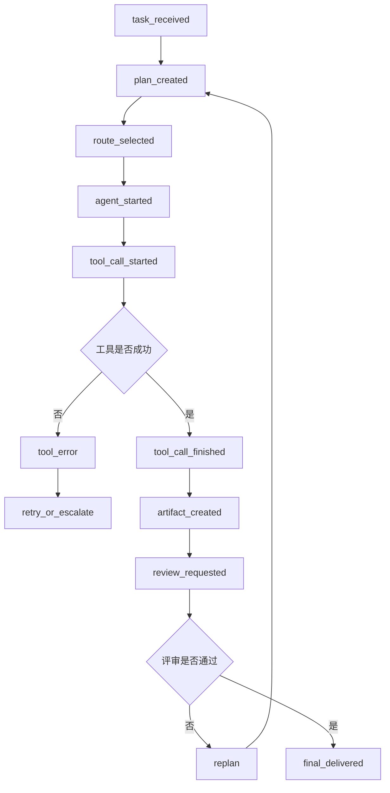
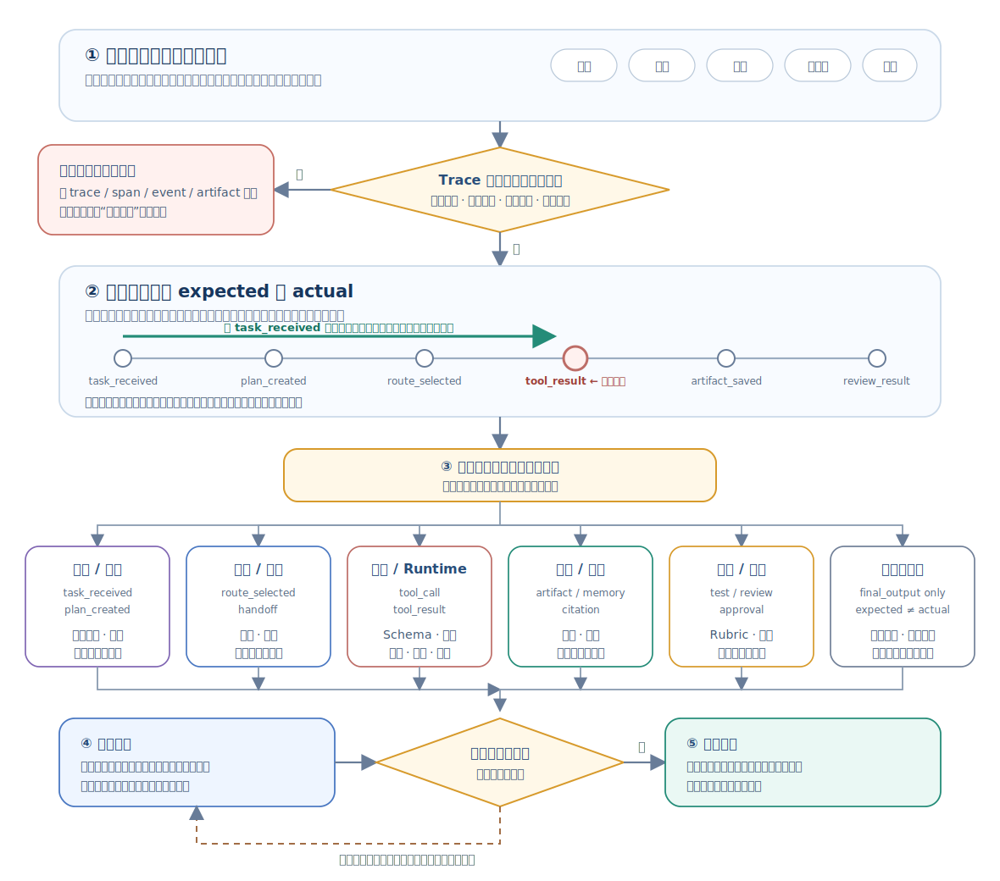

# Multi-Agent Knowledge · 第 ⑦ 步：观测、评测与调试

> 多 Agent 任务可能在规划、路由、工具、交接或评审环节失败。事件、Trace、指标和回放可以把问题定位到具体步骤。


## 1. 观测、评测与调试核心术语

本章第一次遇到下面这些英文时，先按这个中文含义理解；后文再展开它们的特性和工程做法。

| 英文术语 | 中文说法 | 先记住的含义 |
|---|---|---|
| Trace | 追踪链路 | 一次任务从开始到结束的事件记录。 |
| Event | 事件 | 运行过程中发生的可记录动作，如路由、工具调用、评审。 |
| Replay | 回放 | 用日志复现一次运行过程以定位问题。 |
| Metric | 指标 | 衡量质量、成本、延迟或安全的量化数据。 |


<!-- learning-path:start -->
<div class="learning-path">
<div class="learning-path-title">本章怎么学</div>
<div class="learning-path-step"><span>1</span><div>先认识观测对象，并把一次团队运行还原成按时间排列的事件链（第 1～3 节）。</div></div>
<div class="learning-path-step"><span>2</span><div>再用事件日志、Trace、指标和固定路由集连接单次诊断与多次评测（第 4～7 节）。</div></div>
<div class="learning-path-step"><span>3</span><div>最后通过单变量回放定位首个异常事件，并把失败归入稳定类别（第 8～9 节）。</div></div>
</div>
<!-- learning-path:end -->

---

## 2. 观测、评测与调试的数据链路

观测、评测和调试不是三套孤立工作。事件与 Trace 保存单次运行事实，指标把多次运行汇总成趋势，回归集固定可比较输入，回放则在受控条件下重现失败。


<div class="concept-card">
<div class="concept-line">一次运行（Run）</div>
<div class="concept-line">  → 智能体事件（Agent events）记录每个角色做了什么</div>
<div class="concept-line">  → 消息（Messages）记录角色之间怎么协作</div>
<div class="concept-line">  → 工具调用（Tool calls）记录外部动作和结果</div>
<div class="concept-line">  → 产物（Artifacts）记录文件、报告、补丁或证据表</div>
<div class="concept-line">  → 指标（Metrics）记录成本、延迟、成功率和错误</div>
<div class="concept-line">  → 回放（Replay）帮助定位失败发生在哪里</div>
</div>

评测引用：
- AgentBench 评估 LLM 在多环境中的 Agent 能力：[AgentBench](https://arxiv.org/abs/2308.03688)
- WebArena 评估 Web 任务成功率：[WebArena](https://arxiv.org/abs/2307.13854)
- SWE-bench 评估真实 GitHub issue 修复：[SWE-bench](https://arxiv.org/abs/2310.06770)
- AutoGen Studio 强调原型、调试和评估多 Agent workflow：[AutoGen Studio](https://arxiv.org/abs/2408.15247)

后文会沿“事件记录 → Trace 关联 → 指标汇总 → 回归测试 → 单变量回放 → 故障分类”的顺序展开。下一节先把一次团队运行转换成可按时间检查的事件链。

---

## 3. 多 Agent 运行过程的事件化记录流程


多 Agent 系统失败时，最终答案通常看不出问题发生在哪里。可能是 Planner 拆错了、Router 分错人了、工具失败了、Reviewer 放过了错误，也可能是上下文压缩丢了关键信息。因此观测的第一步是把运行过程事件化。

先沿这张 Trace（追踪）图按时间恢复一次运行：

### 3.1 多 Agent Trace 事件链

这张图对应 trace 例子，把一次任务从接收到交付的关键事件连起来。




读图时重点看：调试时要找第一处异常事件，而不是只看最终答案。


<div class="concept-card">
<div class="concept-line">trace_id = task-2026-001</div>
<div class="concept-line">  ├─ event 1: task_received</div>
<div class="concept-line">  ├─ event 2: plan_created</div>
<div class="concept-line">  ├─ event 3: route_to_researcher</div>
<div class="concept-line">  ├─ event 4: tool_call_started</div>
<div class="concept-line">  ├─ event 5: tool_call_finished</div>
<div class="concept-line">  ├─ event 6: artifact_created</div>
<div class="concept-line">  ├─ event 7: review_requested</div>
<div class="concept-line">  ├─ event 8: review_failed</div>
<div class="concept-line">  └─ event 9: replanned</div>
</div>

每个事件至少要包含：

| 字段 | 用途 |
|---|---|
| `trace_id` | 把一次任务串起来 |
| `span_id` | 表示某个子步骤 |
| `agent` | 谁做的 |
| `event_type` | 发生了什么 |
| `input_ref` | 输入来自哪里 |
| `output_ref` | 输出保存在哪里 |
| `cost` | token、时间、工具费用 |
| `status` | success、error、blocked |

评测也要分层。不要只问“最终答案好不好”，而要逐层定位：

<div class="concept-card">
<div class="concept-line">任务层：是否解决用户问题</div>
<div class="concept-line">计划层：任务拆分是否合理</div>
<div class="concept-line">路由层：是否交给正确 Agent</div>
<div class="concept-line">工具层：工具调用是否正确</div>
<div class="concept-line">证据层：事实是否有来源</div>
<div class="concept-line">评审层：错误是否被发现</div>
<div class="concept-line">成本层：是否超预算</div>
<div class="concept-line">安全层：是否越权或泄露</div>
</div>

一个实用调试流程：

### 3.2 按时间定位首个异常事件

先根据最终失败锁定对应的 Trace，但检查事件时要从 `task_received` 开始，按时间从前往后逐个比较预期与实际。找到时间上最早的偏离点后，再按事件责任定位到计划、路由、工具、证据、评审或任务边界。



读图时重点看：后续节点的错误可能只是上游偏差的传播结果。不要先改 Prompt，也不要同时修改多个组件；先修第一个偏离点，再用相同输入和配置做最小重放。


1. 先看最终失败类型：错答、漏答、超时、越权、成本爆炸。
2. 从 Trace 的起点开始，按时间从前往后找到最早的异常事件。
3. 判断异常属于计划、路由、工具、记忆还是评审。
4. 用最小复现任务重放该路径。
5. 给该路径加回归测试。

例如“最终报告引用了不存在的论文”，不要直接改 Writer prompt。应该追：

<div class="concept-card">
<div class="concept-line">Writer 是否凭空生成？</div>
<div class="concept-line">  ↓</div>
<div class="concept-line">如果是，看 evidence table 是否缺约束</div>
<div class="concept-line">  ↓</div>
<div class="concept-line">如果 evidence table 有错，看 Researcher 的工具结果</div>
<div class="concept-line">  ↓</div>
<div class="concept-line">如果工具结果没错，看 Reader 是否摘要错误</div>
<div class="concept-line">  ↓</div>
<div class="concept-line">如果 Reviewer 没发现，看引用检查 rubric</div>
</div>

调试多 Agent 的关键是把“模型不好”拆成具体失败点。只有失败点具体，修复才不会变成盲目加 prompt。

---

## 4. 事件日志的数据结构

上一节说明了为什么要记录事件，本节定义最小事件结构。每条记录需要时间、Trace、角色、事件类型和结构化数据；只有字段稳定，后续查询才能跨角色重建顺序。


```python
from datetime import datetime
from pydantic import BaseModel

class Event(BaseModel):
    ts: str
    trace_id: str
    agent: str
    kind: str
    data: dict

class EventLogger:
    def __init__(self):
        self.events = []

    def log(self, trace_id, agent, kind, **data):
        self.events.append(Event(
            ts=datetime.utcnow().isoformat(),
            trace_id=trace_id,
            agent=agent,
            kind=kind,
            data=data,
        ))
```

<div class="code-explanation">
<div class="code-explanation-title">Python 代码说明</div>
<p><strong>用途：</strong>定义统一事件和内存事件记录器。<strong>执行过程：</strong><code>log()</code> 自动生成时间戳，并把 trace、角色、事件类型和任意结构化数据保存为 <code>Event</code>。<strong>关键点：</strong>生产记录器应写入持久化后端、使用时区明确的时间戳并对敏感字段脱敏。</p>
</div>


事件类型应围绕状态变化和可诊断动作设计，例如：
- `agent_started`
- `message_sent`
- `tool_called`
- `tool_result`
- `handoff`
- `review_decision`
- `error`
- `final`

事件正文还应保存输入或产物引用、组件版本和结果状态，但不应直接记录密钥或完整敏感数据。字段统一以后，下一节用同一个 Trace ID 把不同角色写入的事件连接起来。

---

## 5. Trace ID 与跨 Agent 链路关联

单条事件只能说明一个局部动作，Trace ID 才能把 Planner、Worker、工具和 Reviewer 的记录归入同一次运行。它应在任务入口生成，并在消息、工具调用、Artifact 和错误事件之间原样传递。


```python
trace_id = "run-20260706-001"
logger.log(trace_id, "planner", "plan_created", subtasks=5)
logger.log(trace_id, "developer", "tool_called", tool="edit_file")
logger.log(trace_id, "tester", "test_result", passed=False)
```

<div class="code-explanation">
<div class="code-explanation-title">Python 代码说明</div>
<p><strong>用途：</strong>展示同一个 <code>trace_id</code> 如何贯穿规划、编辑和测试事件。<strong>执行过程：</strong>三个不同角色各写一条事件，查询该追踪号即可重建从计划产生到测试失败的顺序。<strong>关键点：</strong>跨智能体共享追踪号是定位“错误从哪一步开始”的基础。</p>
</div>


Trace ID 只负责关联，不负责判断质量；同一条链路仍可能稳定地产生错误结果。下一节把多条 Trace 汇总为成功率、成本、延迟和过程指标，再用异常指标反向定位具体链路。

---

## 6. 多 Agent 运行质量评测指标


事件日志和 Trace 面向**单次运行定位**，评测指标面向**多次运行比较**。指标不能替代 Trace：它先告诉你“哪一类表现变好了或变坏了”，出现异常后仍要回到对应 Trace，查找时间上最早的偏离事件。

一次评测需要三类输入，并产生一份可用于发布决策和回归测试的报告：

| 环节 | 需要什么 | 作用 |
|---|---|---|
| 评测任务 | 固定任务集、任务类型、风险等级、验收标准 | 明确什么算成功，防止不同版本使用不同口径 |
| 运行记录 | 每次运行的结果标签、Trace、工具调用、交接、评审和人工升级事件 | 计算结果与过程指标，并能下钻到失败证据 |
| 运行条件 | 模型与 Prompt 版本、工具版本、预算、超时、重试次数 | 保证基线与候选版本可以公平比较 |
| 评测输出 | 总体指标、分组指标、与基线的差值、失败样本链接 | 交给发布闸门、路由回归和故障分析使用 |

### 6.1 评测指标的统计口径

把“一次端到端任务运行”作为基本评测单位。基线版本和候选版本必须使用相同任务集、验收标准、预算上限和重复次数；总体结果还要按任务类型与风险等级分组。否则，某个版本可能只是少跑了困难任务，看起来却像成功率提高了。

### 6.2 互相制约的指标组合

| 指标 | 回答的问题 | 计算口径 | 方向与注意点 |
|---|---|---|---|
| `success_rate` | 最终完成了多少任务？ | 成功任务数 ÷ 全部任务数 | 越高越好；成功必须由预先定义的验收条件判定 |
| `first_pass_success` | 多少任务无需返工就通过？ | 首轮通过任务数 ÷ 全部任务数 | 越高越好；不要把重试后的成功算作首轮成功 |
| `cost_per_success` | 获得一次成功实际花了多少？ | 全部成功和失败尝试的总成本 ÷ 成功任务数 | 越低越好；必须计入失败与重试成本 |
| `turns_per_task` | 团队为一个任务往返了多少轮？ | 协作轮数总和 ÷ 任务数 | 通常越低越好，但不能以牺牲质量为代价 |
| `p95_latency` | 慢任务最慢到什么程度？ | 端到端耗时的第 95 百分位 | 越低越好；平均值会掩盖长尾等待 |
| `tool_error_rate` | 工具层有多少调用失败？ | 失败工具调用数 ÷ 全部工具调用数 | 越低越好；应再按工具名和错误类型分组 |
| `handoff_accuracy` | 任务是否交给了正确角色？ | 正确交接数 ÷ 有期望标签的交接数 | 越高越好；没有标准答案的生产流量不能直接计算 |
| `reviewer_catch_rate` | Reviewer 拦住了多少已知缺陷？ | 被拦截的已知缺陷数 ÷ 已知缺陷总数 | 越高越好；同时报告误拒率，防止一律拒绝 |
| `human_escalation_rate` | 多少任务需要人工介入？ | 人工升级任务数 ÷ 全部任务数 | 不是单纯越低越好；高风险任务主动升级可能是正确行为 |
| `unsafe_release_rate` | 有多少危险结果越过闸门？ | 已放行危险结果数 ÷ 高风险任务数 | 越低越好；通常应作为发布阻断指标 |

这些指标分别覆盖四个层面：`success_rate` 和 `first_pass_success` 看最终质量；`handoff_accuracy`、`tool_error_rate` 与 `reviewer_catch_rate` 看协作过程；`cost_per_success`、`turns_per_task` 与 `p95_latency` 看效率；`human_escalation_rate` 与 `unsafe_release_rate` 看治理结果。

### 6.3 最小指标计算示例

```python
def cost_per_success(runs):
    success = [r for r in runs if r["success"]]
    if not success:
        return float("inf")
    return sum(r["cost"] for r in runs) / len(success)
```

<div class="code-explanation">
<div class="code-explanation-title">Python 代码说明</div>
<p><strong>用途：</strong>计算每次成功所承担的平均总成本。<strong>执行过程：</strong>先筛出成功运行数；若没有成功返回无穷大，否则用所有尝试的总成本除以成功次数。<strong>关键点：</strong>失败成本也被计入，能真实反映一个策略为获得一次成功付出的代价。</p>
</div>

不能用单个指标宣布系统“更好”。比较版本时按下面顺序阅读报告：

1. **先看安全闸门**：如果 `unsafe_release_rate` 上升，候选版本不能发布。
2. **再看任务质量**：确认总体和各任务类别的 `success_rate`、`first_pass_success` 没有退化。
3. **然后看效率代价**：在质量相当时，再比较 `cost_per_success`、`p95_latency` 和轮数。
4. **最后解释变化来源**：用工具、交接和评审指标缩小故障层，再打开对应 Trace 定位首个异常事件。

因此，本节的输出不是一个孤立分数，而是一份带任务分组、版本差值和失败 Trace 链接的评测报告。下一节会把其中的 `handoff_accuracy` 落成固定案例集上的**路由回归测试**，演示一个过程指标怎样成为可重复执行的质量闸门。


---

## 7. 路由回归测试与固定任务集


上一节的 `handoff_accuracy` 是一个汇总指标，路由回归测试则是产生这个指标的固定实验。它把一组有标准答案的路由案例反复交给新旧 Router，在相同条件下比较输出，从而回答“这次修改是否让某类任务更容易分错”。

### 7.1 路由回归案例的数据要求

一个案例不能只有任务文本。至少要保存案例编号、风险等级、允许去向和来源；高风险案例还应说明为什么必须交给安全角色、人工审批或拒绝执行。

| 案例类型 | 要验证什么 | 期望输出示例 |
|---|---|---|
| 清晰职责 | 常规任务能否交给对应专家 | 论文总结 → `researcher` |
| 边界与歧义 | 多个角色都相关时是否遵守优先级 | 代码中的令牌泄露 → `security_reviewer` |
| 超出能力 | 没有合适 Agent 时是否停止自动路由 | 未知高风险操作 → `human_review` |
| 权限与高风险 | 能力匹配但权限不足时是否进入审批 | 导出客户数据 → `human_approval` |
| 历史事故 | 已经发生过的误路由是否真正被修复 | 事故输入 → 修复后的允许去向 |

有些任务只允许一个角色，有些任务允许多个安全去向。因此案例使用 `allowed_routes`，而不是强迫所有任务只有唯一的 `expected_agent`。


```python
def evaluate_router(router, cases):
    if not cases:
        raise ValueError("cases must not be empty")

    results = []
    for case in cases:
        pred = router(case["task"])
        passed = pred in case["allowed_routes"]
        results.append({
            "case_id": case["case_id"],
            "risk": case["risk"],
            "predicted": pred,
            "allowed": case["allowed_routes"],
            "passed": passed,
        })

    high_risk_errors = [
        r for r in results
        if r["risk"] == "high" and not r["passed"]
    ]
    return {
        "accuracy": sum(r["passed"] for r in results) / len(results),
        "high_risk_errors": high_risk_errors,
        "results": results,
    }
```

<div class="code-explanation">
<div class="code-explanation-title">Python 代码说明</div>
<p><strong>用途：</strong>用固定案例集测量路由准确率，并单独列出高风险误路由。<strong>执行过程：</strong>Router 为每条任务预测去向，只要落在该案例的允许集合中就通过；随后汇总总体准确率、逐例结果和高风险失败列表。<strong>关键点：</strong>总体准确率可能被大量简单案例抬高，所以高风险错误必须单独作为发布阻断项。</p>
</div>


最小案例集可以这样写：

```python
cases = [
    {
        "case_id": "research-001",
        "task": "Summarize papers about CAMEL",
        "risk": "low",
        "allowed_routes": ["researcher"],
    },
    {
        "case_id": "code-001",
        "task": "Patch failing pytest",
        "risk": "medium",
        "allowed_routes": ["developer"],
    },
    {
        "case_id": "security-001",
        "task": "Review OAuth token storage",
        "risk": "high",
        "allowed_routes": ["security_reviewer", "human_review"],
    },
    {
        "case_id": "approval-001",
        "task": "Export the production customer database",
        "risk": "high",
        "allowed_routes": ["human_approval"],
    },
]
```

<div class="code-explanation">
<div class="code-explanation-title">Python 代码说明</div>
<p><strong>用途：</strong>给 Router 提供覆盖常规分工、安全审查和人工审批的最小案例集。<strong>执行过程：</strong>每条记录声明任务、风险等级与允许去向；安全审查允许专业角色或人工接手，但生产数据库导出只能进入人工审批。<strong>关键点：</strong>真实回归集还要加入多语言、冲突关键词、角色不可用、权限变化和历史事故案例。</p>
</div>

执行回归时，应同时运行当前基线和候选 Router，并报告总体准确率、按任务类型与风险分组的准确率、混淆矩阵以及高风险错误清单。一个实用的发布规则是：**历史事故案例全部通过、高风险误路由为零、任何重要类别都不得低于基线**。

如果某条案例失败，回归报告只能说明“哪条路由退化了”，还不能说明“为什么退化”。下一节把失败案例对应的输入、配置和中间状态装入回放包，在不重复整个生产流程的情况下定位原因。


---

## 8. 可回放调试与单变量对照


Trace 和回放解决不同问题：Trace 是已经发生过的事件记录，回答“当时发生了什么”；回放包除了事件，还保存重新构造某一步所需的输入、配置、依赖结果和状态快照，回答“能否在受控条件下再次得到这个结果”。

### 8.1 回放包的数据要求

| 内容 | 示例 | 为什么需要 |
|---|---|---|
| 定位信息 | `trace_id`、`span_id`、`step_id`、父事件 | 找到被重放步骤及其上下游关系 |
| 组件版本 | Agent、模型、Prompt、Router、工具版本 | 区分输入变化和实现变化 |
| 实际输入输出 | 消息、结构化参数、响应、错误与状态码 | 还原该步骤的真实行为 |
| 外部依赖快照 | 工具结果、检索结果、API 响应或其内容哈希 | 防止外部数据变化导致“无法复现” |
| 状态与产物 | 共享状态版本、Artifact 引用与哈希 | 确认下游读取的是哪个版本 |
| 运行条件 | 温度、随机种子、预算、超时、重试与权限策略 | 控制非确定性和运行时差异 |

敏感消息、令牌和个人数据必须在进入回放存储前脱敏；只有内容哈希而没有原始内容时，可以验证一致性，但不能完整重建输入。

### 8.2 三种运行回放模式

| 方式 | 做法 | 适用场景 | 风险 |
|---|---|---|---|
| 纯回放 | 直接返回已保存的模型与工具结果，不重新执行 | 测试下游逻辑、界面和状态机 | 最安全、最稳定，但不能验证上游组件的新行为 |
| 单步重执行 | 固定上游输入，只重新运行可疑组件 | 比较新版 Router、Prompt 或解析器 | 可能产生模型费用；工具应使用 Stub 或沙箱 |
| 全链重执行 | 从任务起点重新运行整条链 | 验证最终修复及组件交互 | 成本最高，可能再次触发外部副作用 |

调试默认从纯回放或单步重执行开始。发送邮件、修改文件、执行交易等有副作用的工具不能直接在生产环境回放，必须替换为 Stub、只读模式或隔离沙箱。


下面的教学存储器只实现**纯回放**：保存某一步的完整记录，并在之后返回它，不重新调用模型或工具。

```python
from copy import deepcopy

class ReplayStore:
    def __init__(self):
        self.records = {}

    def save_step(self, trace_id, step_id, component, request, response, config):
        key = (trace_id, step_id)
        self.records[key] = deepcopy({
            "component": component,
            "request": request,
            "response": response,
            "config": config,
        })

    def replay(self, trace_id, step_id):
        key = (trace_id, step_id)
        if key not in self.records:
            raise KeyError(f"replay step not found: {key}")
        return deepcopy(self.records[key])
```

<div class="code-explanation">
<div class="code-explanation-title">Python 代码说明</div>
<p><strong>用途：</strong>按 Trace 和步骤编号保存组件调用记录，用于离线纯回放。<strong>执行过程：</strong><code>save_step()</code> 把组件、请求、响应和配置深拷贝到存储中；<code>replay()</code> 用复合键取回另一份副本，避免测试代码修改原记录。<strong>关键点：</strong>函数只是返回历史数据，不会重新执行组件；生产回放包还需保存外部依赖、Artifact 哈希、策略版本和脱敏信息。</p>
</div>


### 8.3 从失败 Trace 生成回归案例

1. 在 Trace 中按时间从前往后找到首个异常事件。
2. 读取该事件执行前的输入、配置、状态和外部依赖快照。
3. 先用保存结果做纯回放，确认下游能够稳定重现同一失败。
4. 再只重执行可疑组件，并且一次只改变一个变量，例如 Router 版本或 Prompt 版本。
5. 比较事件输出、Artifact 哈希和下游验收结果，确认修复是否消除失败。
6. 把这份最小回放包转成固定回归案例，防止同类问题再次出现。

可回放调试的输出应包括：可复现的首个异常步骤、导致变化的最小变量、修复前后的差异，以及新加入的回归案例。下一节再把这些已验证的失败归入稳定的故障类别，用于统计趋势和分配修复责任。

---

## 9. 多 Agent 故障分类

回放已经定位了首个异常事件，故障分类则把具体失败映射到稳定类别和责任组件。分类依据应是最早的致因，而不是最终出现错误的角色；否则上游规划错误会被误记成下游评审错误。


| 故障 | 例子 | 修复 |
|---|---|---|
| 规划错误 | 漏掉测试任务 | 强化 Plan schema |
| 路由错误 | 安全问题给了 Coder | 路由回归集 |
| 上下文错误 | Reviewer 没看到 diff | Handoff packet |
| 工具错误 | shell timeout | 重试、沙箱、timeout |
| 评审错误 | 放过 high 风险 | Rubric + 测试 |
| 成本失控 | Agent 互相循环 | max_turns + budget |

每条失败记录还应保存对应 Trace、首个异常事件、影响范围和修复后的回归案例。这样故障表既能用于趋势统计，也能把责任交给 Planner、Router、工具层、Reviewer 或运行时，而不是笼统归因于“模型表现不好”。

---

<!-- chapter-check:start -->
## 10. 观测、评测与调试自检
<div class="chapter-check">
<div class="chapter-check-title">不看正文，尝试回答</div>
<ul>
<li>能否用同一个 trace_id 重建规划、执行、测试和评审顺序？</li>
<li>能否区分任务成功率、路由准确率和每次成功成本？</li>
<li>能否设计包含允许去向、风险等级和历史事故的路由回归案例？</li>
<li>能否区分纯回放、单步重执行和全链重执行，并说明怎样隔离副作用？</li>
</ul>
</div>
<!-- chapter-check:end -->

---

## 11. 本章总结：事件追踪、质量评测与故障回放

观测和评测的目标是把“Agent 表现不好”拆成具体可修的问题：规划、路由、上下文、工具、评审、成本还是安全。

下一章看 **⑧ 安全与生产化**：把评测中暴露的权限、注入、成本和恢复风险变成生产护栏。
