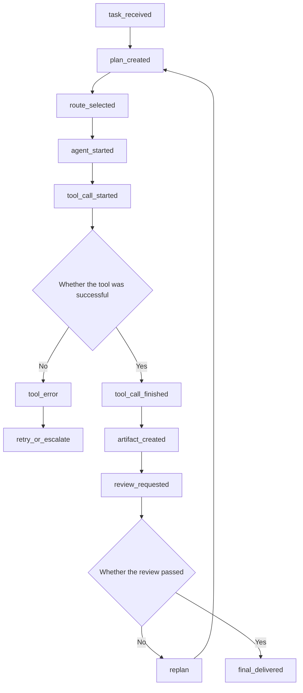
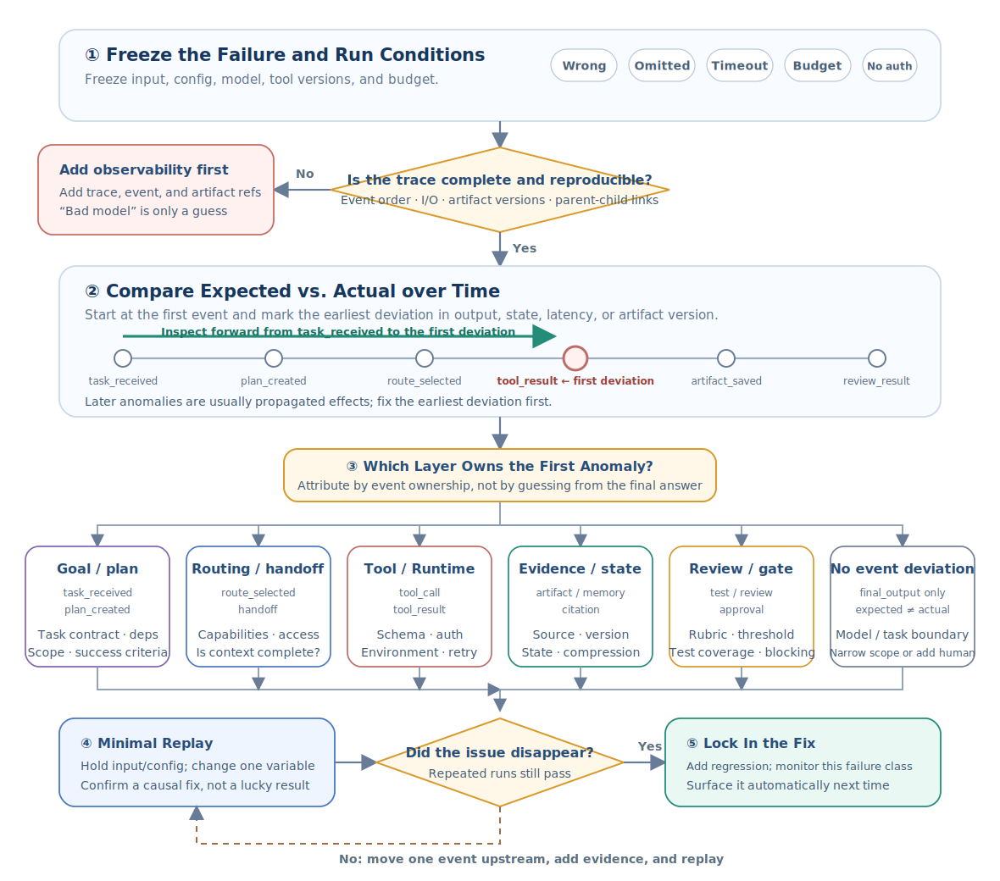

# Multi-Agent Knowledge · Step 7: Observation, Evaluation and Debugging

> Multi-Agent tasks may fail in planning, routing, tooling, handover, or review. Events, Traces, indicators and replays can locate problems to specific steps.


## 1. Core terms for observation, evaluation and debugging

When you first encounter the terms below, use these working definitions as a quick reference; later sections cover their properties and engineering implications.

| Term | Working definition | Key idea |
|---|---|---|
| Trace | Trace link | Event record of a task from start to finish. |
| Event | Event | Recordable actions that occur during operation, such as routing, tool invocation, and review. |
| Replay | Playback | Use logs to reproduce a running process to locate the problem. |
| Metric | Quantitative data that measures quality, cost, latency, or security. |


<!-- learning-path:start -->
<div class="learning-path">
<div class="learning-path-title">How to study this chapter</div>
<div class="learning-path-step"><span>1</span><div>First get to know the observation object, and restore a team operation into a chain of events arranged in time (sections 1 to 3). </div></div>
<div class="learning-path-step"><span>2</span><div>Reuse event logs, traces, metrics, and fixed routing sets to connect single diagnostics to multiple reviews (sections 4-7). </div></div>
<div class="learning-path-step"><span>3</span><div> Finally, the first abnormal event is located through univariate playback, and the failure is classified into the stable category (sections 8-9). </div></div>
</div>
<!-- learning-path:end -->

---

## 2. Data link for observation, evaluation and debugging

Observation, evaluation and debugging are not three separate sets of tasks. Events and Traces store the facts of a single run, indicators aggregate multiple runs into trends, regression sets fix comparable inputs, and replays reproduce failures under controlled conditions.


<div class="concept-card">
<div class="concept-line">Run </div>
<div class="concept-line"> → Agent events record what each character did </div>
<div class="concept-line"> → Messages record how roles collaborate </div>
<div class="concept-line"> → Tool calls record external actions and results </div>
<div class="concept-line"> → Artifacts documentation, reports, patches, or evidence sheets </div>
<div class="concept-line"> → Metrics record cost, latency, success rate, and errors </div>
<div class="concept-line"> → Replay helps locate where the failure occurred </div>
</div>

References:
- AgentBench evaluates LLM's Agent capabilities in multiple environments: [AgentBench](https://arxiv.org/abs/2308.03688)
- WebArena evaluates Web task success rate: [WebArena](https://arxiv.org/abs/2307.13854)
- SWE-bench evaluates real GitHub issue Fix: [SWE-bench](https://arxiv.org/abs/2310.06770)
- AutoGen Studio emphasizes prototyping, debugging, and evaluating multi-Agent workflows: [AutoGen Studio](https://arxiv.org/abs/2408.15247)

The following article will be expanded in the order of "Event Record → Trace Association → Indicator Summary → Regression Test → Univariate Playback → Fault Classification". The next section begins by converting a team run into a chain of events that can be checked over time.

---

## 3. Event-based recording process of multi-Agent running process


When a multi-agent system fails, the final answer often doesn't reveal where the problem occurred. It may be that the Planner disassembled it by mistake, the Router assigned the wrong person, the tool failed, the Reviewer missed the error, or it may be that context compression lost key information. Therefore, the first step in observation is to eventize the operating process.

First resume a run in time along this Trace graph:

### 3.1 Multi-Agent Trace event chain

This picture corresponds to the trace example, connecting the key events of a task from receipt to delivery.




When reading the picture, focus on looking for the first abnormal event when debugging, rather than just looking at the final answer.


<div class="concept-card">
<div class="concept-line">trace_id = task-2026-001</div>
<div class="concept-line">  ├─ event 1: task_received</div>
<div class="concept-line">  ├─ event 2: plan_created</div>
<div class="concept-line">  ├─ event 3: route_to_researcher</div>
<div class="concept-line">  ├─ event 4: tool_call_started</div>
<div class="concept-line">  ├─ event 5: tool_call_finished</div>
<div class="concept-line">  ├─ event 6: artifact_created</div>
<div class="concept-line">  ├─ event 7: review_requested</div>
<div class="concept-line">  ├─ event 8: review_failed</div>
<div class="concept-line">  └─ event 9: replanned</div>
</div>

Each event must contain at least:

| Field | Purpose |
|---|---|
| `trace_id` | String together a task |
| `span_id` | Represents a substep |
| `agent` | Who did it |
| `event_type` | What happened |
| `input_ref` | Where the input comes from |
| `output_ref` | Where the output is saved |
| `cost` | token, time, tool cost |
| `status` | success、error、blocked |

Evaluations should also be divided into layers. Don’t just ask “Is the final answer good?” but position it layer by layer:

<div class="concept-card">
<div class="concept-line">Task layer: whether to solve user problems</div>
<div class="concept-line">Planning layer: Is the task splitting reasonable?</div>
<div class="concept-line">Routing layer: Whether it is handed over to the correct Agent</div>
<div class="concept-line">Tool layer: Whether the tool call is correct</div>
<div class="concept-line">Evidence layer: Whether the facts have a source</div>
<div class="concept-line"> Review level: Whether the error was found </div>
<div class="concept-line"> Cost layer: Whether it is over budget </div>
<div class="concept-line"> Security layer: Whether it is overstepping authority or leaking </div>
</div>

A practical debugging process:

### 3.2 Locate the first abnormal event by time

First lock the corresponding Trace based on the final failure, but when checking the event, start from `task_received`, and compare the expected and actual events one by one from front to back according to time. After finding the earliest deviation point in time, locate the plan, route, tool, evidence, review or task boundary according to the event responsibility.



When reading the diagram, pay attention to this: errors in subsequent nodes may just be the result of the propagation of upstream deviations. Don't change Prompt first, and don't modify multiple components at the same time; fix the first deviation point first, and then do minimal replay with the same input and configuration.


1. Let’s first look at the final failure type: wrong answer, missed answer, timeout, overstep of authority, and cost explosion.
2. Starting from the starting point of Trace, find the earliest abnormal event from front to back in time.
3. Determine whether the exception belongs to planning, routing, tools, memory, or review.
4. Replay the path with a minimal recurring task.
5. Add regression testing to the path.

For example, "The final report cites a non-existent paper", do not change the Writer prompt directly. Should pursue:

<div class="concept-card">
<div class="concept-line">Is Writer generated out of thin air? </div>
<div class="concept-line">  ↓</div>
<div class="concept-line"> If yes, see if the evidence table lacks constraints </div>
<div class="concept-line">  ↓</div>
<div class="concept-line">If the evidence table is wrong, look at the Researcher tool results</div>
<div class="concept-line">  ↓</div>
<div class="concept-line"> If the tool result is correct, check if the Reader summary is wrong </div>
<div class="concept-line">  ↓</div>
<div class="concept-line">If Reviewer does not find it, see the reference check rubric</div>
</div>

The key to debugging multiple agents is to break down "bad models" into specific failure points. Only when the failure point is specific can the repair not become a blind prompt.

---

## 4. Data structure of event log

The previous section explained why events should be logged, this section defines the minimal event structure. Each record requires time, trace, role, event type and structured data; only if the fields are stable, subsequent queries can reconstruct the order across roles.


```python
from datetime import datetime
from pydantic import BaseModel

class Event(BaseModel):
    ts: str
    trace_id: str
    agent: str
    kind: str
    data: dict

class EventLogger:
    def __init__(self):
        self.events = []

    def log(self, trace_id, agent, kind, **data):
        self.events.append(Event(
            ts=datetime.utcnow().isoformat(),
            trace_id=trace_id,
            agent=agent,
            kind=kind,
            data=data,
        ))
```

<div class="code-explanation">
<div class="code-explanation-title">Python code description</div>
<p><strong> Purpose: </strong> Defines the unified event and memory event loggers. <strong> execution process: </strong><code>log()</code> automatically generates timestamps and saves traces, roles, event types and any structured data as <code>Event</code>. <strong> Key Points: </strong> Production loggers should be written to a persistence backend, use time zone-aware timestamps, and desensitize sensitive fields. </p>
</div>


Event types should be designed around state changes and diagnosable actions, such as:
- `agent_started`
- `message_sent`
- `tool_called`
- `tool_result`
- `handoff`
- `review_decision`
- `error`
- `final`

The event body should also hold input or artifact references, component versions, and result status, but should not directly record keys or complete sensitive data. After the fields are unified, the next section uses the same Trace ID to connect events written by different roles.

---

## 5. Trace ID is associated with cross-Agent links

A single event can only describe a local action, and Trace ID can classify the records of Planner, Worker, Tool and Reviewer into the same run. It should be generated at task entry and passed unchanged between messages, tool calls, artifacts, and error events.


```python
trace_id = "run-20260706-001"
logger.log(trace_id, "planner", "plan_created", subtasks=5)
logger.log(trace_id, "developer", "tool_called", tool="edit_file")
logger.log(trace_id, "tester", "test_result", passed=False)
```

<div class="code-explanation">
<div class="code-explanation-title">Python code description</div>
<p><strong> Purpose: </strong> shows how the same <code>trace_id</code> is used throughout planning, editing, and testing events. <strong> Execution process: </strong> Three different roles each write an event. Query the tracking number to reconstruct the sequence from plan generation to test failure. <strong> Key points: </strong> Sharing tracking numbers across agents is the basis for locating "which step the error started from." </p>
</div>


Trace ID is only responsible for correlation and not for judging quality; the same link may still produce erroneous results stably. The next section summarizes multiple traces into success rate, cost, delay and process indicators, and then uses abnormal indicators to reversely locate specific links.

---

## 6. Multi-Agent running quality evaluation indicators


Event logs and traces are oriented to **single run positioning**, and evaluation indicators are oriented to **multiple run comparisons**. Indicators cannot replace Trace: they first tell you "which type of performance has gotten better or worse." After an exception occurs, you still have to return to the corresponding Trace to find the earliest deviation event in time.

An evaluation requires three types of input and produces a report that can be used for release decisions and regression testing:

| Links | What is needed | Function |
|---|---|---|
| Evaluation tasks | Fixed task set, task type, risk level, acceptance criteria | Clarify what counts as success to prevent different versions from using different calibers |
| Run records | Result tags, traces, tool calls, handovers, reviews and manual upgrade events for each run | Calculate results and process indicators, and drill down to failure evidence |
| Running conditions | Model and Prompt version, tool version, budget, timeout, number of retries | Ensure that baseline and candidate versions can be compared fairly |
| Evaluation output | Overall index, group index, difference from baseline, failed sample link | Used by release gate, routing regression and failure analysis |

### 6.1 Statistical caliber of evaluation indicators

Take "one end-to-end task run" as the basic evaluation unit. Baseline and release candidates must use the same set of tasks, acceptance criteria, budget caps, and number of iterations; overall results are also grouped by task type and risk level. Otherwise, a certain version may simply run fewer difficult tasks, but appear to have an increased success rate.

### 6.2 Mutually restrictive indicator combinations

| Indicators | Answered questions | Calculation caliber | Directions and points of attention |
|---|---|---|---|
| `success_rate` | How many tasks were completed? | Number of successful tasks ÷ Number of total tasks | Higher is better; success must be determined by predefined acceptance criteria |
| `first_pass_success` | How many tasks passed without rework? | Number of tasks passed in the first round ÷ Number of total tasks | The higher, the better; do not count success after retry as success in the first round |
| `cost_per_success` | How much does it actually cost to achieve success? | Total cost of all successful and failed attempts ÷ Number of successful tasks | Lower is better; failure and retry costs must be included |
| `turns_per_task` | How many round trips did the team make for a task? | Sum of collaboration rounds ÷ number of tasks | Usually lower is better, but not at the expense of quality |
| `p95_latency` | How slow is a slow task? | 95th percentile of end-to-end elapsed time | Lower is better; average masks long tail waits |
| `tool_error_rate` | How many calls to the tool layer failed? | Number of failed tool calls ÷ Number of total tool calls | The lower the better; this should then be grouped by tool name and error type |
| `handoff_accuracy` | Is the task assigned to the correct role? | Number of correct handovers ÷ Number of handovers with expected labels | The higher the better; production flow without standard answers cannot be calculated directly |
| `reviewer_catch_rate` | How many known defects has Reviewer blocked? | Number of intercepted known defects ÷ Total number of known defects | The higher the better; the false rejection rate is also reported to prevent blanket rejection |
| `human_escalation_rate` | How many tasks require manual intervention? | Number of manual upgrade tasks ÷ Number of total tasks | It is not simply that lower is better; proactive upgrade of high-risk tasks may be the correct behavior |
| `unsafe_release_rate` | How many dangerous outcomes get past the gate? | Number of dangerous results released ÷ Number of high-risk tasks | Lower is better; should generally be used as a release blocking metric |

These indicators cover four levels respectively: `success_rate` and `first_pass_success` look at the final quality; `handoff_accuracy`, `tool_error_rate` and `reviewer_catch_rate` look at the collaboration process; `cost_per_success`, `turns_per_task` and `p95_latency` looks at efficiency; `human_escalation_rate` and `unsafe_release_rate` look at governance results.

### 6.3 Minimum indicator calculation example

```python
def cost_per_success(runs):
    success = [r for r in runs if r["success"]]
    if not success:
        return float("inf")
    return sum(r["cost"] for r in runs) / len(success)
```

<div class="code-explanation">
<div class="code-explanation-title">Python code description</div>
<p><strong> Purpose: </strong> Calculates the average total cost incurred per success. <strong> Execution process: </strong> First filter out the number of successful runs; if there is no success, return infinity, otherwise divide the total cost of all attempts by the number of successes. <strong>Key points: </strong>The cost of failure is also included, which can truly reflect the price a strategy pays for a success. </p>
</div>

A single metric cannot be used to declare a system "better." Read the reports in the following order when comparing versions:

1. **Look at the safety gate first**: If `unsafe_release_rate` rises, the release candidate cannot be released.
2. **Look at the task quality again**: Confirm that there is no degradation in `success_rate` and `first_pass_success` overall and in each task category.
3. **Then look at the efficiency cost**: When the quality is equivalent, compare `cost_per_success`, `p95_latency` and the number of rounds.
4. **Finally explain the source of the change**: Use tools, handover and review indicators to narrow down the fault layer, and then open the corresponding Trace to locate the first abnormal event.

Therefore, the output of this section is not an isolated score, but a review report with task groupings, version differences, and failure trace links. The next section will implement `handoff_accuracy` into a **routing regression test** on a fixed case set, demonstrating how a process indicator can become a repeatable quality gate.


---

## 7. Routing regression testing and fixed task set


The `handoff_accuracy` in the previous section is a summary indicator, and the routing regression test is a fixed experiment that generates this indicator. It repeatedly gives a set of routing cases with standard answers to the old and new Routers, and compares the outputs under the same conditions to answer "whether this modification makes certain types of tasks more likely to be misdivided."

### 7.1 Data requirements for routing regression cases

A case cannot have only task text. At a minimum, the case number, risk level, allowed destination, and source should be saved; high-risk cases should also have a description of why they must be handed over to a security role, manually approved, or denied execution.

| Case type | What to verify | Example of expected output |
|---|---|---|
| Clear responsibilities | Can routine tasks be handed over to corresponding experts | Paper summary → `researcher` |
| Boundaries and ambiguity | Whether to respect precedence when multiple roles are related | Token leakage in code → `security_reviewer` |
| Beyond capacity | Whether to stop automatic routing when there is no suitable Agent | Unknown high-risk operation → `human_review` |
| Permissions and high risks | Whether to enter for approval when capabilities match but insufficient permissions | Export customer data → `human_approval` |
| Historical accidents | Whether the misrouting that has occurred has actually been repaired | Incident input → Allowed destination after repair |

Some missions only allow one character, and some missions allow multiple safe places to go. So the case uses `allowed_routes` instead of forcing all tasks to have a unique `expected_agent`.


```python
def evaluate_router(router, cases):
    if not cases:
        raise ValueError("cases must not be empty")

    results = []
    for case in cases:
        pred = router(case["task"])
        passed = pred in case["allowed_routes"]
        results.append({
            "case_id": case["case_id"],
            "risk": case["risk"],
            "predicted": pred,
            "allowed": case["allowed_routes"],
            "passed": passed,
        })

    high_risk_errors = [
        r for r in results
        if r["risk"] == "high" and not r["passed"]
    ]
    return {
        "accuracy": sum(r["passed"] for r in results) / len(results),
        "high_risk_errors": high_risk_errors,
        "results": results,
    }
```

<div class="code-explanation">
<div class="code-explanation-title">Python code description</div>
<p><strong> Purpose: </strong> Measure routing accuracy with a fixed set of cases and isolate high-risk misrouting. <strong>Execution process: </strong>Router predicts the destination for each task and passes it as long as it falls in the allowed set of the case; then summarizes the overall accuracy, case-by-case results, and high-risk failure list. <strong>Key Point: </strong>Overall accuracy may be inflated by a large number of simple cases, so high-risk errors must be separately blocked for release. </p>
</div>


The minimal case set can be written like this:

```python
cases = [
    {
        "case_id": "research-001",
        "task": "Summarize papers about CAMEL",
        "risk": "low",
        "allowed_routes": ["researcher"],
    },
    {
        "case_id": "code-001",
        "task": "Patch failing pytest",
        "risk": "medium",
        "allowed_routes": ["developer"],
    },
    {
        "case_id": "security-001",
        "task": "Review OAuth token storage",
        "risk": "high",
        "allowed_routes": ["security_reviewer", "human_review"],
    },
    {
        "case_id": "approval-001",
        "task": "Export the production customer database",
        "risk": "high",
        "allowed_routes": ["human_approval"],
    },
]
```

<div class="code-explanation">
<div class="code-explanation-title">Python code description</div>
<p><strong> Purpose: </strong> provides Router with a minimum case set covering routine division of labor, security review, and manual approval. <strong> Execution process: </strong> Each record declares the task, risk level and allowed destination; the security review allows professional roles or manual takeover, but the production database export can only be subject to manual approval. <strong>Key points: </strong>The real regression set also needs to add multi-language, conflicting keywords, role unavailability, permission changes and historical accident cases. </p>
</div>

When performing regression, you should run both the current baseline and the candidate Router and report overall accuracy, accuracy grouped by task type and risk, a confusion matrix, and a list of high-risk errors. A practical release rule is: **All historical incident cases pass, zero high-risk misrouting, and no important categories fall below the baseline**.

If a certain case fails, the regression report can only explain "which route is degraded", but cannot explain "why it is degraded". In the next section, the input, configuration, and intermediate states corresponding to the failure cases are loaded into the playback package to locate the cause without repeating the entire production process.


---

## 8. Replayable debugging and single variable comparison


Trace and playback solve different problems: Trace is a record of events that have already occurred, answering "what happened at that time"; in addition to events, the playback package also saves the input, configuration, dependency results and status snapshots required to reconstruct a certain step, answering "can this result be obtained again under controlled conditions?"

### 8.1 Data requirements for playback packages

| Content | Examples | Why you need it |
|---|---|---|
| Positioning information | `trace_id`, `span_id`, `step_id`, parent event | Find the replayed step and its upstream and downstream relationships |
| Component version | Agent, model, prompt, router, tool version | Distinguish between input changes and implementation changes |
| Actual input and output | Messages, structured parameters, responses, errors and status codes | Restore the true behavior of this step |
| External dependency snapshots | Tool results, retrieval results, API responses or their content hashes | Prevent external data changes from causing "irreproducibility" |
| State and artifacts | Shared state versions, artifact references and hashes | Confirm which version is being read downstream |
| Running conditions | Temperature, random seeds, budgets, timeouts, retries, and permission policies | Controlling non-determinism and runtime variance |

Sensitive messages, tokens, and personal data must be desensitized before entering replay storage; with only a hash of the content without the original content, consistency can be verified, but the input cannot be completely reconstructed.

### 8.2 Three running playback modes

| Methods | Practices | Applicable scenarios | Risks |
|---|---|---|---|
| Pure playback | Return saved model and tool results directly without re-executing | Test downstream logic, interface and state machine | The safest and most stable, but cannot verify the new behavior of upstream components |
| Single-step re-execution | Fixed upstream input, only re-run suspect components | Compare new versions of Router, Prompt or parser | May incur model fees; tools should use stubs or sandboxes |
| Full chain re-execution | Rerun the entire chain from the starting point of the task | Verify final fixes and component interactions | The highest cost and may trigger external side effects again |

Debugging starts with pure replay or single-step re-execution by default. Tools with side effects such as sending emails, modifying files, and executing transactions cannot be directly played back in the production environment and must be replaced with Stub, read-only mode, or isolation sandbox.


The following teaching memory only implements **Pure Playback**: saves the complete record of a step and returns it later, without re-invoking the model or tool.

```python
from copy import deepcopy

class ReplayStore:
    def __init__(self):
        self.records = {}

    def save_step(self, trace_id, step_id, component, request, response, config):
        key = (trace_id, step_id)
        self.records[key] = deepcopy({
            "component": component,
            "request": request,
            "response": response,
            "config": config,
        })

    def replay(self, trace_id, step_id):
        key = (trace_id, step_id)
        if key not in self.records:
            raise KeyError(f"replay step not found: {key}")
        return deepcopy(self.records[key])
```

<div class="code-explanation">
<div class="code-explanation-title">Python code description</div>
<p><strong>Purpose: </strong>Save component call records by Trace and step number for offline pure playback. <strong> Execution process: </strong><code>save_step()</code> Deep copy components, requests, responses and configurations to storage; <code>replay()</code> Use a composite key to retrieve another copy to avoid the test code from modifying the original record. <strong>Key points: The </strong> function only returns historical data and does not re-execute the component; the production playback package also needs to save external dependencies, Artifact hashes, policy versions and desensitization information. </p>
</div>


### 8.3 Generate regression cases from failure Trace

1. Find the first abnormal event in Trace from front to back in time.
2. Read the input, configuration, status and external dependency snapshot before the event is executed.
3. First use the saved results for pure playback to confirm that the downstream can reproduce the same failure stably.
4. Re-execute only the suspect component and change only one variable at a time, such as Router version or Prompt version.
5. Compare the event output, artifact hash, and downstream acceptance results to confirm whether the fix eliminates the failure.
6. Convert this minimal replay package into a fixed regression case to prevent similar problems from recurring.

The output of replayable debugging should include: the first reproducible abnormal step, the smallest variable that caused the change, the difference before and after repair, and the newly added regression case. The next section classifies these verified failures into stable failure categories for trending and assigning repair responsibilities.

---

## 9. Multi-Agent fault classification

Replay has located the first abnormal event, and fault classification maps specific failures to stable categories and responsible components. The classification should be based on the earliest cause, not the role of the final error; otherwise, upstream planning errors will be mistakenly recorded as downstream review errors.


| Bug | Example | Fix |
|---|---|---|
| Planning errors | Missing test tasks | Strengthening Plan schema |
| Routing error | Security issues given to Coder | Routing regression set |
| Context Error | Reviewer doesn't see diff | Handoff packet |
| tool errors | shell timeout | retry, sandbox, timeout |
| Review Errors | Let High Risk Go | Rubric + Testing |
| Costs are out of control | Agents cycle with each other | max_turns + budget |

Each failure record should also save the corresponding Trace, the first abnormal event, the scope of impact, and the regression case after repair. In this way, the fault table can be used for trend statistics, and the responsibility can be handed over to the Planner, Router, tool layer, Reviewer or runtime, rather than being generally attributed to "poor model performance".

---

<!-- chapter-check:start -->
## 10. Observation, evaluation and debugging self-test
<div class="chapter-check">
<div class="chapter-check-title"> Without reading the text, try to answer </div>
<ul>
<li> Can the planning, execution, testing and review sequence be reconstructed using the same trace_id? </li>
<li>Can differentiate between task success rate, routing accuracy and cost per success? </li>
<li> Is it possible to design a routing regression case that includes allowed destinations, risk levels, and historical incidents? </li>
<li> Can you differentiate between pure replay, single-step re-execution and full-chain re-execution, and explain how to isolate side effects? </li>
</ul>
</div>
<!-- chapter-check:end -->

---

## 11. Summary of this chapter: event tracking, quality evaluation and fault playback

The goal of observation and evaluation is to break down "Agent's poor performance" into specific fixable problems: planning, routing, context, tools, review, cost or security.

See the next chapter **⑧ Security and production**: Turn the permissions, injection, cost and recovery risks exposed in the evaluation into production guardrails.
