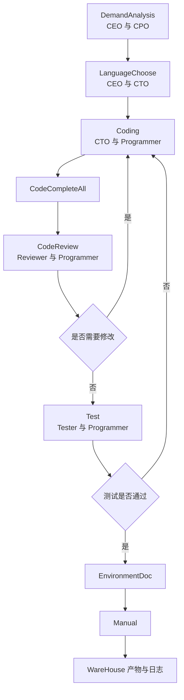
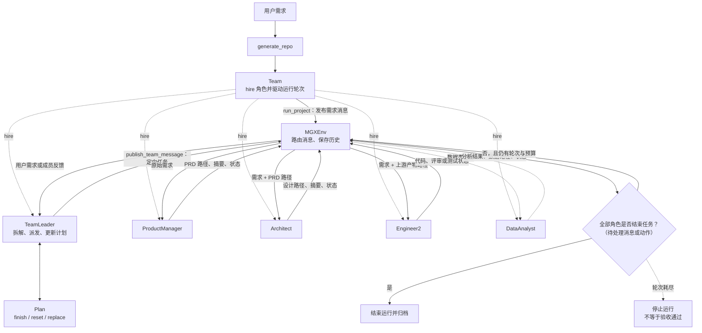

# 9. 案例：ChatDev 与 MetaGPT 软件工厂

> 本章以 ChatDev 1.0 与 MetaGPT 为例，比较配置驱动和对象驱动的软件团队；流程图与中文说明用于解释项目结构，不等同于源码逐行展开。

本章的教学目标不是让你“背一个框架”，而是让你看懂多 Agent 软件开发系统通常怎样把工作拆成：

- 公司/团队：谁在场。
- 角色：每个 Agent 的职责边界。
- 阶段/SOP：什么时候谁和谁对话。
- 产物：最终落到哪些文件、日志、配置或代码仓库。
- 可复用机制：哪些部分是配置，哪些部分是运行时对象。


## 1. 软件工厂案例核心术语

本章第一次遇到下面这些英文时，先按这个中文含义理解；后文再展开它们的特性和工程做法。

| 英文术语 | 中文说法 | 先记住的含义 |
|---|---|---|
| ChatChain | 聊天链 | ChatDev 中用配置描述的软件开发阶段链。 |
| Phase | 阶段 | 流程中的一个明确协作步骤。 |
| RoleConfig | 角色配置 | 定义角色身份和职责提示的配置文件。 |
| Team / Role / Action | 团队 / 角色 / 动作 | MetaGPT 用来表达软件公司流程的核心对象。 |


<!-- learning-path:start -->
<div class="learning-path">
<div class="learning-path-title">本章怎么学</div>
<div class="learning-path-step"><span>1</span><div>先掌握案例术语，并确认 ChatDev 与 MetaGPT 的版本和阅读入口（第 1～2 节）。</div></div>
<div class="learning-path-step"><span>2</span><div>再分别追踪 ChatDev 的配置驱动流程与 MetaGPT 的对象驱动团队（第 3～4 节）。</div></div>
<div class="learning-path-step"><span>3</span><div>最后比较两种架构、区分源码事实与教学抽象，并完成源码追踪练习（第 5～8 节）。</div></div>
</div>
<!-- learning-path:end -->

---

## 2. 软件工厂案例范围与版本

ChatDev 与 MetaGPT 都以“软件团队”描述多 Agent 协作，但两者的公开版本、入口和核心抽象不同。本节先固定本章实际核验的分支与对象，避免把 ChatDev 2.0 的能力误写成 1.0 结构，也避免把教学流程图当成 MetaGPT 源码。


| 案例 | 公开来源 | 本章使用的内容 |
|---|---|---|
| ChatDev 1.0 | OpenBMB/ChatDev 的 `chatdev1.0` 分支、ChatDev 论文 | 虚拟软件公司、角色表、ChatChain 阶段配置、Phase 配置、输出目录结构 |
| ChatDev 2.0 / DevAll | OpenBMB/ChatDev 当前 README | ChatDev 从“软件开发多 Agent 系统”演化为更通用的多 Agent 编排平台 |
| MetaGPT | FoundationAgents/MetaGPT 仓库、MetaGPT 论文 | `Team`、`Role`、`Action`、软件公司角色、`generate_repo()` 示例 |

公开入口：

- ChatDev: https://github.com/OpenBMB/ChatDev
- ChatDev 1.0 分支: https://github.com/OpenBMB/ChatDev/tree/chatdev1.0
- ChatDev 论文: https://arxiv.org/abs/2307.07924
- MetaGPT: https://github.com/FoundationAgents/MetaGPT
- MetaGPT 论文: https://arxiv.org/abs/2308.00352

后文先追踪 ChatDev 1.0 的角色和阶段配置，再追踪 MetaGPT 的 Team、Role 与 Action。比较时只使用上表列出的公开范围。

## 3. ChatDev 1.0：配置驱动的虚拟软件公司


ChatDev 1.0 的公开 README 把它描述成一个由多种角色组成的虚拟软件公司。其角色包括 CEO、CPO、CTO、Programmer、Reviewer、Tester、Art designer 等；它们在需求分析、设计、编码、测试、文档等 functional seminars 中协作。

这个案例的关键点是：很多“协作流程”不是散落在代码里的 if/else，而是写在配置里。

两类实现的组织路径：

<div class="concept-card">
<div class="concept-line">公开软件工厂案例（Public software factory cases）</div>
<div class="concept-line">  → ChatDev 的聊天链（ChatChain）用配置描述软件开发阶段</div>
<div class="concept-line">  → 阶段配置（PhaseConfig）说明谁和谁在每一步对话</div>
<div class="concept-line">  → 角色配置（RoleConfig）说明每个角色的身份和职责</div>
<div class="concept-line">  → MetaGPT 的团队对象（Team）组织多个角色</div>
<div class="concept-line">  → 角色与动作（Role / Action）把 SOP 写进代码结构</div>
<div class="concept-line">  → 产物与日志（Artifacts / Logs）让过程可复现和审计</div>
</div>

### 3.1 ChatChain：阶段化软件开发流程


`ChatChainConfig.json` 中的 `chain` 字段用 JSON 配置定义软件开发流水线。核心阶段包括：

### 3.2 ChatDev 1.0 的阶段执行链

这张图放在 ChatDev 阶段表旁边，把 DemandAnalysis 到 WareHouse 的配置链画成可回退流程。




读图时重点看：代码评审和测试不是直线，通过失败分支回到 Coding。


| 顺序 | 阶段名 | 作用 |
|---:|---|---|
| 1 | `DemandAnalysis` | CEO 与 CPO 对齐需求、模态与产品形态 |
| 2 | `LanguageChoose` | CEO 与 CTO 选择编程语言 |
| 3 | `Coding` | CTO 向 Programmer 提需求，Programmer 产出代码文件 |
| 4 | `CodeCompleteAll` | 对代码做补全类处理 |
| 5 | `CodeReview` | Reviewer 与 Programmer 进行代码评审和修改 |
| 6 | `Test` | Tester 与 Programmer 处理测试暴露的问题 |
| 7 | `EnvironmentDoc` | CTO 与 Programmer 生成环境依赖文档 |
| 8 | `Manual` | CEO 与 CPO 生成用户手册 |

从配置里抽出来的最小结构长这样：

```json
{ "phase": "DemandAnalysis", "phaseType": "SimplePhase" }
{ "phase": "CodeReview", "phaseType": "ComposedPhase", "cycleNum": 3 }
```

<div class="code-explanation">
<div class="code-explanation-title">JSON 配置说明</div>
<p><strong>用途：</strong>摘录 ChatDev 1.0 配置中的两类阶段定义。<strong>执行过程：</strong><code>DemandAnalysis</code> 是单阶段，<code>CodeReview</code> 是可循环三次的组合阶段，运行器据 <code>phaseType</code> 选择不同执行器。<strong>关键点：</strong>这两行是 JSONL 风格的独立对象片段，不是一个可直接整体解析的 JSON 数组。</p>
</div>


这里最值得学的是 `SimplePhase` 与 `ComposedPhase` 的区别：

- `SimplePhase` 适合一次明确对话就能推进的阶段，例如需求分析、语言选择。
- `ComposedPhase` 适合内部还要循环若干子阶段的阶段，例如代码评审与测试。

### 3.3 RoleConfig：角色的提示词身份


`RoleConfig.json` 记录每个角色的身份说明。比如：

| 角色 | 在系统中的职责 |
|---|---|
| `Chief Executive Officer` | 提需求、做关键决策 |
| `Chief Product Officer` | 把用户需求转成产品级描述 |
| `Chief Technology Officer` | 做技术与语言选择，约束实现方式 |
| `Programmer` | 根据技术任务写代码 |
| `Code Reviewer` | 检查代码质量、指出问题 |
| `Software Test Engineer` | 运行或设计测试，汇总错误 |
| `Chief Creative Officer` | 处理 GUI、图标等创意设计 |

这说明多 Agent 系统里的“角色”至少包含三层：

1. 名字：例如 `Programmer`。
2. 职责提示：它被要求关注什么、避免什么。
3. 阶段绑定：它在哪些阶段与哪些角色交互。

如果只实现第 1 层，你得到的是“多个名字不同的聊天机器人”；如果同时实现第 2、3 层，才开始像一个工作流系统。

### 3.4 PhaseConfig：通信角色与对话终止条件


`PhaseConfig.json` 进一步定义每个阶段的参与方。例如：

| 阶段 | Assistant | User | 教学解释 |
|---|---|---|---|
| `DemandAnalysis` | `Chief Product Officer` | `Chief Executive Officer` | 产品负责人追问和整理 CEO 的需求 |
| `LanguageChoose` | `Chief Technology Officer` | `Chief Executive Officer` | CTO 根据需求建议编程语言 |
| `Coding` | `Programmer` | `Chief Technology Officer` | CTO 下发技术任务，程序员按格式产出文件 |
| `CodeReviewComment` | `Code Reviewer` | `Programmer` | Reviewer 找问题 |
| `CodeReviewModification` | `Programmer` | `Code Reviewer` | Programmer 根据评论修改代码 |
| `TestErrorSummary` | `Programmer` | `Software Test Engineer` | 程序员读测试错误并总结 |
| `TestModification` | `Programmer` | `Software Test Engineer` | 程序员根据测试反馈修复 |

注意这个设计中的一个细节：同一条“代码评审”业务链会被拆成评论和修改两个方向。这样做的好处是让不同 Agent 的发言目标更窄，输出更容易验证。

### 3.5 ChatDev 运行产物


ChatDev 1.0 README 描述了运行后生成的项目目录。默认会在 `WareHouse` 下创建软件项目，并保留：

- 生成的软件文件。
- 运行时使用的三个 JSON 配置。
- 带时间戳的日志。
- 本次任务的提示词记录。

这对教学特别重要：多 Agent 工程系统通常不会只依赖“最后一条回答”，而会保存过程配置、阶段日志和最终代码，这样后续才能复现、审计和调试。

## 4. MetaGPT：SOP 驱动的 Team、Role 与 Action


MetaGPT 的公开 README 用一句话概括了它的哲学：`Code = SOP(Team)`。它强调把标准操作流程编码进由多角色组成的团队。

README 中的最小用法来自项目官方示例：

```python
from metagpt.software_company import generate_repo

repo = generate_repo("Create a 2048 game")
```

<div class="code-explanation">
<div class="code-explanation-title">Python 代码说明</div>
<p><strong>用途：</strong>展示 MetaGPT 公开入口如何用一句需求启动软件仓库生成。<strong>执行过程：</strong><code>generate_repo()</code> 在内部创建并运行团队，返回生成仓库信息；这里的需求是官方示例“Create a 2048 game”。<strong>关键点：</strong>短入口隐藏了角色、动作、消息和环境循环，后文代码会继续展开这些组件。</p>
</div>


下面继续拆解 `generate_repo()` 背后如何组织团队。

### 4.1 MetaGPT 软件公司的对象关系

这张图贴在 MetaGPT 段落旁边，把 `generate_repo()`、`Team` 和各角色的核心对象连接起来。




读图时重点看：MetaGPT 更像对象化团队，而 ChatDev 更像配置化流程；但“对象化”不代表自由聊天，它仍然依靠可路由消息、角色动作、计划状态和停止条件形成闭环。

如果把这些机制只压缩成一个“协调与推进”节点，图就没有解释系统如何运行。真正承担协调的是 **消息、环境和计划状态**。这些角色并不是互相直接调用 Python 方法；`Team` 先把角色注册进同一个环境，再由环境投递消息，由收到相关消息的角色执行 Action 或工具。

#### 4.1.1 角色通信机制

MetaGPT 的 `Message` 至少携带 `content`、`cause_by`、`sent_from` 和 `send_to`。通信过程可以拆成四步：

1. `Team.run_project()` 把用户需求发布到环境。
2. `MGXEnv.publish_message()` 根据 `send_to` 路由消息；普通成员的反馈会经过 `TeamLeader`，`TeamLeader.publish_team_message()` 则把任务定向发给指定成员。
3. 消息进入角色自己的接收缓冲区。角色的 `_observe()` 会根据自己监听的 `cause_by`，或者消息是否明确发给自己，筛出需要处理的消息。
4. 角色执行 Action 或工具，把产物路径、摘要、状态或问题写回新消息，再经环境交给 `TeamLeader`。因此，下游拿到的不是一句“上一步完成了”，还应包含它继续工作所需的需求、约束和文件路径。

当前 `Team` 默认创建 `MGXEnv`，属于 **TeamLeader 中心协调 + 环境消息路由**。公共消息可以让其他成员知情，但由谁开始下一项工作，仍由消息的目标和 `TeamLeader` 的派发决定。`Environment.run()` 每一轮运行所有非 idle 角色，所以它不是把 `ProductManager()`、`Architect()`、`Engineer2()` 写成固定的顺序函数调用。

本段核对的源码锚点是 MetaGPT `main` 分支提交 `11cdf466`：[`software_company.py`](https://github.com/FoundationAgents/MetaGPT/blob/11cdf466d042aece04fc6cfd13b28e1a70341b1f/metagpt/software_company.py)、[`team.py`](https://github.com/FoundationAgents/MetaGPT/blob/11cdf466d042aece04fc6cfd13b28e1a70341b1f/metagpt/team.py)、[`mgx_env.py`](https://github.com/FoundationAgents/MetaGPT/blob/11cdf466d042aece04fc6cfd13b28e1a70341b1f/metagpt/environment/mgx/mgx_env.py)、[`role.py`](https://github.com/FoundationAgents/MetaGPT/blob/11cdf466d042aece04fc6cfd13b28e1a70341b1f/metagpt/roles/role.py) 和 [`team_leader.py`](https://github.com/FoundationAgents/MetaGPT/blob/11cdf466d042aece04fc6cfd13b28e1a70341b1f/metagpt/roles/di/team_leader.py)。如果后续版本改变默认环境或路由逻辑，应以新提交重新核对。

#### 4.1.2 协调与交接关系

| 角色 | 典型输入 | 产出与反馈 | 谁决定下一步 |
|---|---|---|---|
| `TeamLeader` | 用户需求、成员反馈、当前 Plan | 拆分任务，选择成员，连同约束和上游产物路径定向派发；更新或重置 Plan | `TeamLeader` 根据反馈继续派发、返工或回复用户 |
| `ProductManager` | 原始用户需求 | PRD、用户故事，以及产物路径和完成/阻塞状态 | 反馈先回到环境与 `TeamLeader`，再由它把 PRD 上下文交给下游 |
| `Architect` | 需求与 PRD 路径 | 系统设计、接口或技术约束，以及产物路径和状态 | `TeamLeader` 决定是否进入实现或补充设计 |
| `Engineer2` | 需求、设计和其他上游产物路径 | 代码、运行结果、评审/修复状态 | `TeamLeader` 根据反馈结束、返工或继续派发 |
| `DataAnalyst` | 数据采集、分析或建模任务 | 数据、分析结果、Notebook/文件路径和状态 | `TeamLeader` 把数据结果接到后续开发，或直接向用户汇报 |

这些角色不一定每次全部出场。当前 `TeamLeader` 的指令允许小型软件直接交给工程师，纯数据任务直接交给数据分析师；复杂软件才按需求、设计、实现等阶段逐步派发。因此，协作顺序是运行时决策，不是 `hire()` 列表的先后顺序。

#### 4.1.3 任务完成条件

“完成”必须分层看，否则很容易把停止运行误写成项目验收：

| 层级 | 判定者与信号 | 它真正说明什么 |
|---|---|---|
| 一次角色动作完成 | 角色执行 Action/工具并发布结果消息 | 本次反应结束，不代表该角色承担的整项任务已验收 |
| 一项计划任务完成 | `TeamLeader` 读取成员反馈，并调用 `Plan.finish_current_task`；发现缺失时也可以 reset/replace | 这是协调者基于消息作出的流程判断，默认不是独立验证器的确定性验收 |
| 团队运行结束 | `Team.run()` 发现 `env.is_idle`，或达到 `n_round`；预算不足会抛出异常 | idle 只表示所有角色当前没有待处理消息、todo 或缓冲区内容；轮次耗尽和预算不足更不能算成功 |
| 软件项目验收通过 | 当前通用 `Team.run()` 没有统一的业务验收器 | 必须由测试、代码评审、CI、专门验证角色或用户按明确标准另行判定 |

所以，对“谁判定任务完成”的准确回答是：**计划步骤由 `TeamLeader` 根据成员反馈推进，运行循环由 `Team`/`Environment` 的状态停止，而项目是否合格并没有由某一个内置角色自动保证。** 当前 `software_company.py` 中招聘 `QaEngineer` 的代码还是注释状态，不能把“团队停止”解释成“测试已通过”。

例如，产品经理返回 PRD 路径后，`TeamLeader` 可以把该 Plan 步骤标记完成，并把“原始需求 + PRD 路径”发给架构师；架构师返回设计后再交给工程师。工程师若只报告“代码已生成”，运行可能最终进入 idle，但只有在验收标准明确要求并确实取得“可以启动、关键测试通过、评审问题关闭”等证据后，才能把软件判为完成。

> **教学强化，不是当前源码的统一内置规则：** 生产系统应给每项任务附上 `task_id`、必需产物、验收条件和证据字段；成员返回 `success`、`blocked` 或 `failed`；最好由非产出者或 CI 验证证据。只有所有必需任务都为 `verified` 才宣布项目完成，`idle` 或 `n_round == 0` 只能触发“停止并汇报当前状态”。


### 4.2 `software_company.py`：团队组合


MetaGPT 仓库的 `metagpt/software_company.py` 中，`generate_repo()` 会导入并组织这些角色：

```python
from metagpt.roles.architect import Architect
from metagpt.roles.di.engineer2 import Engineer2
from metagpt.roles.product_manager import ProductManager
from metagpt.roles.team_leader import TeamLeader
from metagpt.team import Team
```

<div class="code-explanation">
<div class="code-explanation-title">Python 代码说明</div>
<p><strong>用途：</strong>展示 MetaGPT 软件公司入口组合的角色类。<strong>执行过程：</strong>入口模块导入架构师、工程师、产品经理、团队负责人和 <code>Team</code> 容器。<strong>关键点：</strong>这些类随后被实例化并加入同一个团队环境。</p>
</div>


随后它创建 `Team`，并 hire 一组角色：

```python
company = Team(context=ctx)
company.hire([TeamLeader(), ProductManager(), Architect(), Engineer2(), DataAnalyst()])
```

<div class="code-explanation">
<div class="code-explanation-title">Python 代码说明</div>
<p><strong>用途：</strong>展示 MetaGPT 如何创建团队并招聘不同职责的角色。<strong>执行过程：</strong><code>Team(context=ctx)</code> 共享运行上下文，<code>hire()</code> 把负责人、产品经理、架构师、工程师和数据分析师加入同一环境。<strong>关键点：</strong>角色加入团队后仍靠消息订阅、动作和环境驱动协作，不是简单依次调用函数。</p>
</div>


这段结构说明：MetaGPT 的“软件公司”不是只有聊天顺序，而是把角色对象放进团队运行环境中。

### 4.3 `Team`：角色、SOP 与环境


`metagpt/team.py` 中的 `Team` 被描述为拥有角色、SOP 和环境的组织，用于执行多 Agent 活动，比如写可执行代码。

先把两种实现压缩成下面的结构，再回看源码细节：

<div class="concept-card">
<div class="concept-line">Team</div>
<div class="concept-line">  -&gt; roles: TeamLeader / ProductManager / Architect / Engineer2 / DataAnalyst</div>
<div class="concept-line">  -&gt; env: 角色通信与上下文传递环境</div>
<div class="concept-line">  -&gt; run_project(): 接收用户需求</div>
<div class="concept-line">  -&gt; run(): 驱动团队逐步执行</div>
</div>

这组对象共同覆盖角色集合、通信环境、项目入口和团队运行循环。

### 4.4 `ProductManager`：从需求到 PRD


MetaGPT 的 `ProductManager` 角色文件中可以看到两个身份字段：

```python
name: str = "Alice"
profile: str = "Product Manager"
```

<div class="code-explanation">
<div class="code-explanation-title">Python 代码说明</div>
<p><strong>用途：</strong>摘出 MetaGPT <code>ProductManager</code> 类中的身份字段。<strong>执行过程：</strong><code>name</code> 给角色实例一个人物名，<code>profile</code> 声明其组织职责。<strong>关键点：</strong>这只是公开源码的最小片段；产品经理真正的行为还由目标、动作和监听消息共同决定。</p>
</div>


它设置了与 PRD 相关的 actions，并监听用户需求类消息。这个设计对应软件工程里的上游产物：

- 用户需求。
- 产品需求文档。
- 用户故事。
- 竞品或市场分析。

### 4.5 `Engineer`：从任务到代码与评审


MetaGPT 的 `Engineer` 角色文件中可以看到它关注写代码、修复问题、代码评审等动作。它的 action/watch 结构把工程师能响应的消息类型限定住，例如任务分配、代码总结、代码修复、代码评审。

这比“让一个 Agent 自由发挥写代码”更工程化，因为它把输入事件和输出动作放进了角色边界。

## 5. ChatDev 与 MetaGPT 的架构对照


| 维度 | ChatDev 1.0 | MetaGPT |
|---|---|---|
| 核心隐喻 | 虚拟软件公司 | SOP 驱动的软件团队 |
| 流程表达 | JSON 配置中的 ChatChain / Phase | Python 对象中的 Team / Role / Action |
| 角色表达 | `RoleConfig.json` 中的角色提示 | `roles/*.py` 中的 Role 类 |
| 阶段控制 | `SimplePhase` / `ComposedPhase` / `cycleNum` | `run_project()`、消息、watch/action |
| 可审计产物 | `WareHouse`、配置、日志、prompt | 项目仓库、角色动作、环境消息 |

学多 Agent 工程时，这两个案例可以放在一起看：

- ChatDev 更适合理解“配置驱动流程”。
- MetaGPT 更适合理解“对象驱动团队”。
- 两者都会把角色、阶段、消息和产物显式化。

## 6. 源码事实与教学抽象的边界


阅读本章时要区分三层内容：仓库路径、配置字段和源码对象属于可核验事实；极短代码片段用于定位公开实现；流程图和中文解释属于教学抽象。

教学抽象可以帮助理解 ChatDev 与 MetaGPT，但不能声称与源码逐行等价。引用案例时应同时给出项目、分支或版本、文件路径与对象名；无法定位到公开来源的示例只能明确标为自建练习。


---

<!-- chapter-check:start -->
## 7. 软件工厂架构与源码事实自检
<div class="chapter-check">
<div class="chapter-check-title">不看正文，尝试回答</div>
<ul>
<li>能否指出 ChatDev 阶段链和 MetaGPT Team/Role/Action 的代码位置？</li>
<li>能否从用户需求开始，复述 Message、MGXEnv、TeamLeader 与专业角色之间的一次完整交接？</li>
<li>能否解释“Action 返回”“Plan 步骤完成”“环境 idle”和“项目验收通过”为何是四件不同的事？</li>
<li>能否解释配置驱动和对象驱动的控制差异？</li>
<li>能否区分本章中的原始代码片段与教学解释？</li>
</ul>
</div>
<!-- chapter-check:end -->

---

## 8. ChatDev 与 MetaGPT 源码追踪练习


1. 打开 ChatDev 1.0 的 `CompanyConfig/Default/ChatChainConfig.json`，找出哪些阶段是 `ComposedPhase`。
2. 打开 ChatDev 1.0 的 `PhaseConfig.json`，画出 `CodeReview` 下面的子阶段。
3. 打开 MetaGPT 的 `metagpt/software_company.py`，确认 `generate_repo()` hire 了哪些角色。
4. 打开 MetaGPT 的 `metagpt/roles/product_manager.py` 和 `metagpt/roles/engineer.py`，比较两个角色的 `goal`、`actions` 和 `watch`。
5. 思考：如果你要做一个“数据分析软件工厂”，更适合采用 ChatDev 的配置链，还是 MetaGPT 的 Role/Action 对象？

下一章看 **⑩ 研究团队案例**：对比软件开发流水线与文献综述团队在工具分工、轮次调度和停止条件上的差异。
