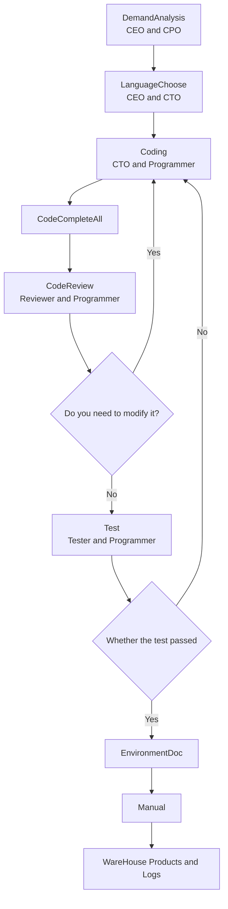
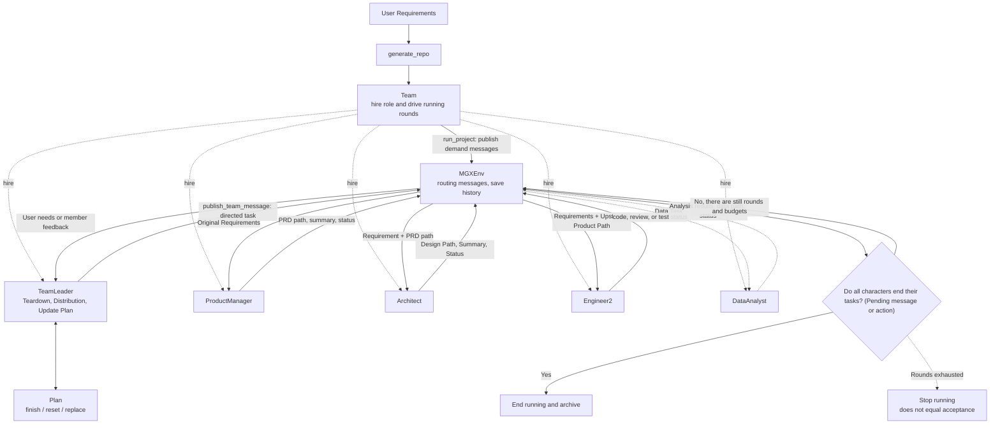

# 9. Case: ChatDev and MetaGPT software factory

> This chapter takes ChatDev 1.0 and MetaGPT as examples to compare configuration-driven and object-driven software teams; the flow chart and Chinese description are used to explain the project structure and are not equivalent to the line-by-line expansion of the source code.

The teaching goal of this chapter is not to let you "memorize a framework", but to let you understand how multi-agent software development systems usually divide the work into:

- Company/Team: Who is present.
- Role: the responsibility boundaries of each Agent.
- Stages/SOPs: Who talks to whom and when.
- Product: Which files, logs, configurations or code repositories it ends up in.
- Reusability mechanism: which parts are configurations and which parts are runtime objects.


## 1. Core terms of software factory case

When you first encounter the terms below, use these working definitions as a quick reference; later sections cover their properties and engineering implications.

| Term | Working definition | Key idea |
|---|---|---|
| ChatChain | Chat Chain | A chain of software development stages described by configuration in ChatDev. |
| Phase | Phase | An explicit collaborative step in a process. |
| RoleConfig | Role Configuration | A configuration file that defines role identities and responsibilities. |
| Team / Role / Action | Team / Role / Action | MetaGPT is the core object used to express the processes of software companies. |


<!-- learning-path:start -->
<div class="learning-path">
<div class="learning-path-title">How to study this chapter</div>
<div class="learning-path-step"><span>1</span><div>First master the case terminology, and confirm the version and reading entrance of ChatDev and MetaGPT (sections 1 to 2). </div></div>
<div class="learning-path-step"><span>2</span><div> and then track ChatDev’s configuration-driven process and MetaGPT’s object-driven team (sections 3 to 4). </div></div>
<div class="learning-path-step"><span>3</span><div>Finally compare the two architectures, distinguish source code facts from teaching abstractions, and complete source code tracing exercises (sections 5-8). </div></div>
</div>
<!-- learning-path:end -->

---

## 2. Software factory case scope and version

Both ChatDev and MetaGPT use "software teams" to describe multi-agent collaboration, but their public versions, entrances, and core abstractions are different. This section first fixes the branches and objects of the actual verification of this chapter to avoid mistakenly writing the capabilities of ChatDev 2.0 as the 1.0 structure, and to avoid treating the teaching flow chart as MetaGPT source code.


| Case | Open source | Content used in this chapter |
|---|---|---|
| ChatDev 1.0 | `chatdev1.0` branch of OpenBMB/ChatDev, ChatDev paper | Virtual software company, role table, ChatChain phase configuration, Phase configuration, output directory structure |
| ChatDev 2.0 / DevAll | OpenBMB/ChatDev Current README | ChatDev evolves from a "software development multi-agent system" to a more general multi-agent orchestration platform |
| MetaGPT | FoundationAgents/MetaGPT repository, MetaGPT paper | `Team`, `Role`, `Action`, Software Company Role, `generate_repo()` Example |

Public entrance:

- ChatDev: https://github.com/OpenBMB/ChatDev
- ChatDev 1.0 branch: https://github.com/OpenBMB/ChatDev/tree/chatdev1.0
- ChatDev paper: https://arxiv.org/abs/2307.07924
- MetaGPT: https://github.com/FoundationAgents/MetaGPT
- MetaGPT paper: https://arxiv.org/abs/2308.00352

The following article will first track the roles and stage configurations of ChatDev 1.0, and then track the Team, Role and Action of MetaGPT. Only the exposure scopes listed in the table above are used when comparing.

## 3. ChatDev 1.0: Configuration-driven virtual software company


The public README for ChatDev 1.0 describes it as a virtual software company made up of multiple roles. Their roles include CEO, CPO, CTO, Programmer, Reviewer, Tester, Art designer, etc.; they collaborate in functional seminars such as requirements analysis, design, coding, testing, documentation, etc.

The key point of this case is: many "collaboration processes" are not if/else scattered in the code, but written in the configuration.

Two types of organizational paths for implementation:

<div class="concept-card">
<div class="concept-line">Public software factory cases </div>
<div class="concept-line"> → ChatDev’s chat chain (ChatChain) uses configuration to describe the software development stage </div>
<div class="concept-line"> → PhaseConfig describes who talks to whom at each step </div>
<div class="concept-line"> → Role configuration (RoleConfig) describes the identity and responsibilities of each role</div>
<div class="concept-line"> → MetaGPT’s team object (Team) organizes multiple roles </div>
<div class="concept-line"> → Role/Action (Role / Action) writes the SOP into the code structure </div>
<div class="concept-line"> → Artifacts/Logs make the process reproducible and auditable</div>
</div>

### 3.1 ChatChain: Staged Software Development Process


The `chain` field in `ChatChainConfig.json` defines the software development pipeline with JSON configuration. Core stages include:

### 3.2 Phase execution chain of ChatDev 1.0

This picture is placed next to the ChatDev stage table and draws the configuration chain from DemandAnalysis to WareHouse as a reversible process.




When reading the picture, pay attention to: code review and testing are not straight lines, and return to Coding through the failed branch.


| Sequence | Stage name | Function |
|---:|---|---|
| 1 | `DemandAnalysis` | CEO and CPO align needs, modalities and product forms |
| 2 | `LanguageChoose` | CEO and CTO choose programming language |
| 3 | `Coding` | The CTO makes requests to the Programmer, and the Programmer produces code files |
| 4 | `CodeCompleteAll` | Complete code processing |
| 5 | `CodeReview` | Reviewer and Programmer conduct code review and modification |
| 6 | `Test` | Tester and Programmer deal with problems exposed by testing |
| 7 | `EnvironmentDoc` | CTO and Programmer generate environment dependency documents |
| 8 | `Manual` | CEO and CPO Generation User Manual |

The minimal structure extracted from the configuration looks like this:

```json
{ "phase": "DemandAnalysis", "phaseType": "SimplePhase" }
{ "phase": "CodeReview", "phaseType": "ComposedPhase", "cycleNum": 3 }
```

<div class="code-explanation">
<div class="code-explanation-title">JSON Configuration Description</div>
<p><strong> Purpose: </strong> Excerpt Two types of stage definitions in ChatDev 1.0 configuration. <strong> Execution process: </strong><code>DemandAnalysis</code> is a single stage, <code>CodeReview</code> is a combination stage that can be cycled three times, the runner data <code>phaseType</code> Select different actuators. <strong>Key points: </strong>These two lines are independent object fragments in JSONL style, not a JSON array that can be parsed directly as a whole. </p>
</div>


The most worthwhile thing to learn here is the difference between `SimplePhase` and `ComposedPhase`:

- `SimplePhase` is suitable for stages that can be advanced with a clear conversation, such as needs analysis and language selection.
- `ComposedPhase` is suitable for stages that need to cycle through several sub-stages internally, such as code review and testing.

### 3.3 RoleConfig: Prompt word identity of the role


`RoleConfig.json` records the identity description of each role. For example:

| Role | Responsibilities in the system |
|---|---|
| `Chief Executive Officer` | Raise demands and make key decisions |
| `Chief Product Officer` | Convert user needs into product-level description |
| `Chief Technology Officer` | Make technology and language choices, and constrain implementation methods |
| `Programmer` | Write code according to technical tasks |
| `Code Reviewer` | Check code quality and point out problems |
| `Software Test Engineer` | Run or design tests, summarize errors |
| `Chief Creative Officer` | Processing GUI, icons and other creative designs |

This shows that the "roles" in the multi-Agent system include at least three levels:

1. Name: For example `Programmer`.
2. Responsibility reminder: what it is asked to focus on and what to avoid.
3. Stage binding: It interacts with which characters at which stages.

If you only implement layer 1, you will get "multiple chatbots with different names"; if you implement layers 2 and 3 at the same time, it will start to look like a workflow system.

### 3.4 PhaseConfig: Communication role and dialogue termination conditions


`PhaseConfig.json` further defines the parties involved in each stage. For example:

| Stage | Assistant | User | Teaching Explanation |
|---|---|---|---|
| `DemandAnalysis` | `Chief Product Officer` | `Chief Executive Officer` | The product owner questions and organizes the CEO’s needs |
| `LanguageChoose` | `Chief Technology Officer` | `Chief Executive Officer` | CTO recommends programming languages based on needs |
| `Coding` | `Programmer` | `Chief Technology Officer` | The CTO issues technical tasks, and the programmer produces files according to the format |
| `CodeReviewComment` | `Code Reviewer` | `Programmer` | Reviewer Find a problem |
| `CodeReviewModification` | `Programmer` | `Code Reviewer` | Programmer Modify code based on comments |
| `TestErrorSummary` | `Programmer` | `Software Test Engineer` | Programmer reads test errors and summarizes |
| `TestModification` | `Programmer` | `Software Test Engineer` | Fixes by programmers based on test feedback |

Pay attention to a detail in this design: the same "code review" business chain will be split into two directions: comment and modification. The advantage of this is that the speech targets of different agents are narrower and the output is easier to verify.

### 3.5 ChatDev running product


ChatDev 1.0 README describes the project directory generated after running. By default, software projects are created under `WareHouse` and remain:

- Generated software files.
- Three JSON configurations used at runtime.
- Timestamped logs.
- Record of prompt words for this task.

This is particularly important for teaching: multi-agent engineering systems often do not rely solely on the "last answer" but instead save process configurations, stage logs, and final code so that they can be reproduced, audited, and debugged later.

## 4. MetaGPT: SOP-driven Team, Role and Action


MetaGPT’s public README sums up its philosophy in one sentence: `Code = SOP(Team)`. It emphasizes codifying standard operating procedures into multi-role teams.

The minimal usage in the README is from the project's official example:

```python
from metagpt.software_company import generate_repo

repo = generate_repo("Create a 2048 game")
```

<div class="code-explanation">
<div class="code-explanation-title">Python code description</div>
<p><strong> Purpose: </strong> shows how to use the MetaGPT public entrance to start software warehouse generation with a requirement. <strong> Execution process: </strong><code>generate_repo()</code> Create and run the team internally and return the generated warehouse information; the requirement here is the official example "Create a 2048 game". <strong>Key points: </strong>The short entry hides roles, actions, messages and environment loops, and the following code will continue to expand these components. </p>
</div>


Let’s continue to dismantle how to organize the team behind `generate_repo()`.

### 4.1 Object relationship of MetaGPT software company

This picture is posted next to the MetaGPT paragraph, connecting `generate_repo()`, `Team` and the core objects of each role.




When reading the picture, pay attention to: MetaGPT is more like an object-based team, while ChatDev is more like a configured process; but "object-based" does not mean free chat, it still relies on routable messages, role actions, plan status and stop conditions to form a closed loop.

If these mechanisms are compressed into only a "coordination and advancement" node, the diagram does not explain how the system operates. What really does the coordination is **message, environment and plan status**. These roles do not directly call each other's Python methods; `Team` first registers the role into the same environment, then the environment delivers the message, and the role that receives the relevant message executes the Action or tool.

#### 4.1.1 Role communication mechanism

MetaGPT's `Message` carries at least `content`, `cause_by`, `sent_from`, and `send_to`. The communication process can be broken down into four steps:

1. `Team.run_project()` publishes user requirements to the environment.
2. `MGXEnv.publish_message()` routes messages according to `send_to`; feedback from ordinary members will go through `TeamLeader`, and `TeamLeader.publish_team_message()` will direct the task to designated members.
3. The message enters the character's own receive buffer. The role's `_observe()` will filter out the messages that need to be processed based on the `cause_by` it listens to, or whether the message is explicitly sent to itself.
4. The role executes the Action or tool, writes the product path, summary, status or problem back as a new message, and then passes it to `TeamLeader` through the environment. Therefore, what the downstream gets is not only a sentence "the previous step is completed", but also the requirements, constraints and file paths it needs to continue working.

Currently `Team` creates `MGXEnv` by default, which belongs to **TeamLeader Central Coordination + Environmental Message Routing**. Public messages can inform other members, but who starts the next task is still determined by the destination of the message and the dispatch of `TeamLeader`. `Environment.run()` runs all non-idle roles every round, so it is not written as a fixed sequence of function calls.

The source code anchor point checked in this paragraph is MetaGPT `main` branch submission `11cdf466`: [`software_company.py`](https://github.com/FoundationAgents/MetaGPT/blob/11cdf466d042aece04fc6cfd13b28e1a70341b1f/metagpt/software_company.py), [`team.py`](__MA_PROTEC TED_0001__), [`mgx_env.py`](https://github.com/FoundationAgents/MetaGPT/blob/11cdf466d042aece04fc6cfd13b28e1a70341b1f/metagpt/environment/mgx/mgx_env.py), [`role.py`](https://github.com/FoundationAgents/MetaGPT/blob/11cdf466d042aece04fc6cfd13b28e1a70341b1f/metagpt/roles/role.py) and [`team_leader.py`](https://github.com/FoundationAgents/MetaGPT/blob/11cdf466d042aece04fc6cfd13b28e1a70341b1f/metagpt/roles/di/team_leader.py). If subsequent versions change the default environment or routing logic, they should be rechecked with a new commit.

#### 4.1.2 Coordination and handover relationship

| Roles | Typical inputs | Outputs and feedback | Who decides next steps |
|---|---|---|---|
| `TeamLeader` | User needs, member feedback, current Plan | Split tasks, select members, and distribute them along with constraints and upstream product paths; update or reset the Plan | `TeamLeader` Continue to distribute, rework or reply to users based on feedback |
| `ProductManager` | Original user requirements | PRD, user stories, as well as product paths and completion/blocking status | Feedback is first returned to the environment and `TeamLeader`, which then hands the PRD context to the downstream |
| `Architect` | Requirements and PRD path | System design, interface or technical constraints, and product path and status | `TeamLeader` Decision whether to enter implementation or supplementary design |
| `Engineer2` | Requirements, design, and other upstream product paths | Code, run results, review/fix status | `TeamLeader` End, rework, or continue shipping based on feedback |
| `DataAnalyst` | Data collection, analysis or modeling tasks | Data, analysis results, Notebook/file paths and status | `TeamLeader` Receive data results for subsequent development, or report directly to users |

These characters may not all appear every time. The current `TeamLeader` directive allows small software to be handed directly to engineers and pure data tasks to data analysts; complex software is gradually distributed according to requirements, design, implementation and other stages. Therefore, the cooperation order is a runtime decision, not the order of the `hire()` list.

#### 4.1.3 Task completion conditions

"Complete" must be viewed in layers, otherwise it is easy to mistakenly write "stop operation" as project acceptance:

| Hierarchy | Judgers and Signals | What It Really Says |
|---|---|---|
| A character action is completed | The character executes the Action/tool and publishes the result message | The end of this reaction does not mean that the entire task undertaken by the character has been accepted |
| A planned task is completed | `TeamLeader` reads member feedback and calls `Plan.finish_current_task`; you can also reset/replace when it is found missing | This is a process judgment made by the coordinator based on the message. The default is not the deterministic acceptance of the independent verifier |
| Team run ends | `Team.run()` finds `env.is_idle`, or reaches `n_round`; insufficient budget will throw an exception | idle only means that all roles currently have no pending messages, todos or buffer content; round exhaustion and insufficient budget cannot be counted as success |
| Software project acceptance passed | Currently common `Team.run()` There is no unified business acceptor | It must be determined separately by testing, code review, CI, specialized verification roles or users according to clear standards |

So, the correct answer to "who determines task completion" is: **The planning step is advanced by `TeamLeader` based on member feedback, the run loop is stopped by the status of `Team`/`Environment`, and the project's eligibility is not automatically guaranteed by a built-in role. ** The code of currently recruiting `QaEngineer` in `software_company.py` is still in an annotation state, and "team stopped" cannot be interpreted as "test passed".

For example, after the product manager returns the PRD path, `TeamLeader` can mark the Plan step as completed and send the "original requirements + PRD path" to the architect; the architect returns the design and then hands it to the engineer. If the engineer only reports "code has been generated", the operation may eventually enter idle. However, the software can only be judged as completed after the acceptance criteria clearly require it and evidence such as "can be started, key tests passed, and review issues closed" are obtained.

> **Teaching enhancement, not a unified built-in rule for the current source code:** The production system should attach `task_id`, required artifacts, acceptance conditions and evidence fields to each task; members return `success`, `blocked` or `failed`; it is best to have the evidence verified by a non-producer or CI. The project is declared complete only if all required tasks are `verified`, `idle` or `n_round == 0` can only trigger Stop and Report Current Status.


### 4.2 `software_company.py`: Team composition


In `metagpt/software_company.py` of the MetaGPT repository, `generate_repo()` will import and organize these roles:

```python
from metagpt.roles.architect import Architect
from metagpt.roles.di.engineer2 import Engineer2
from metagpt.roles.product_manager import ProductManager
from metagpt.roles.team_leader import TeamLeader
from metagpt.team import Team
```

<div class="code-explanation">
<div class="code-explanation-title">Python code description</div>
<p><strong>Purpose: </strong> Displays the role class of the MetaGPT software company entrance combination. <strong> execution process: </strong> entry module imports the architect, engineer, product manager, team leader and <code>Team</code> container. <strong>Key Point: </strong>These classes are then instantiated and added to the same team environment. </p>
</div>


It then creates `Team` and hires a set of roles:

```python
company = Team(context=ctx)
company.hire([TeamLeader(), ProductManager(), Architect(), Engineer2(), DataAnalyst()])
```

<div class="code-explanation">
<div class="code-explanation-title">Python code description</div>
<p><strong> Purpose: </strong> Demonstrates how MetaGPT creates teams and recruits roles with different responsibilities. <strong> Execution process: </strong><code>Team(context=ctx)</code> Share the running context, <code>hire()</code> Add the person in charge, product manager, architect, engineer and data analyst to the same environment. <strong>Key points: </strong>After the role joins the team, it still relies on message subscription, action and environment-driven collaboration, rather than simply calling functions in sequence. </p>
</div>


This structure explains: MetaGPT's "software company" does not only have chat sequences, but puts role objects into the team operating environment.

### 4.3 `Team`: Roles, SOPs and Environment


`Team` in `metagpt/team.py` is described as an organization that has roles, SOPs, and environments for performing multi-agent activities, such as writing executable code.

First compress the two implementations into the following structure, and then look back at the source code details:

<div class="concept-card">
<div class="concept-line">Team</div>
<div class="concept-line">  -&gt; roles: TeamLeader / ProductManager / Architect / Engineer2 / DataAnalyst</div>
<div class="concept-line"> -> env: role communication and context transfer environment </div>
<div class="concept-line"> -> run_project(): Receive user requirements </div>
<div class="concept-line"> -> run(): The driver team executes step by step</div>
</div>

Together, this set of objects covers role collections, communication environments, project portals, and team run loops.

### 4.4 `ProductManager`: From requirements to PRD


Two identity fields can be seen in MetaGPT's `ProductManager` role file:

```python
name: str = "Alice"
profile: str = "Product Manager"
```

<div class="code-explanation">
<div class="code-explanation-title">Python code description</div>
<p><strong> Purpose: </strong> Extracts the identity field in the MetaGPT <code>ProductManager</code> class. <strong> execution process: </strong><code>name</code> Give the role instance a character name, <code>profile</code> declares its organizational responsibilities. <strong>Key points: </strong> This is just the smallest fragment of the open source code; the product manager's real behavior is also determined by goals, actions, and listening messages. </p>
</div>


It sets actions related to PRD and listens for user demand messages. This design corresponds to the upstream products in software engineering:

- User needs.
- Product requirements document.
- User stories.
- Competitive product or market analysis.

### 4.5 `Engineer`: From tasks to code and review


You can see in the `Engineer` role file of MetaGPT that it focuses on actions such as writing code, fixing problems, and code reviews. Its action/watch structure limits the types of messages that engineers can respond to, such as task assignment, code summary, code repair, and code review.

This is more engineering than "letting an Agent write code freely" because it puts input events and output actions within the character boundary.

## 5. Architecture comparison between ChatDev and MetaGPT


| Dimensions | ChatDev 1.0 | MetaGPT |
|---|---|---|
| Core metaphor | Virtual software company | SOP-driven software team |
| Process expression | ChatChain / Phase in JSON configuration | Team / Role / Action in Python object |
| Role expressions | Role hints in `RoleConfig.json` | Role classes in `roles/*.py` |
| Phase control | `SimplePhase` / `ComposedPhase` / `cycleNum` | `run_project()`, message, watch/action |
| Auditable products | `WareHouse`, configuration, logs, prompts | Project repository, role actions, environment messages |

When learning multi-agent projects, these two cases can be viewed together:

- ChatDev is better suited for understanding "configuration driven processes".
- MetaGPT is more suitable for understanding "object-driven teams".
- Both make roles, phases, messages, and products explicit.

## 6. The boundary between source code facts and teaching abstraction


When reading this chapter, three levels of content should be distinguished: warehouse paths, configuration fields, and source code objects are verifiable facts; very short code snippets are used to locate public implementations; flowcharts and explanatory prose are teaching abstractions.

Teaching abstractions can help understand ChatDev and MetaGPT, but they cannot claim to be line-by-line equivalent to the source code. When citing cases, the project, branch or version, file path, and object name should also be given; examples that cannot be located in public sources can only be clearly marked as self-built exercises.


---

<!-- chapter-check:start -->
## 7. Software factory architecture and source code fact self-checking
<div class="chapter-check">
<div class="chapter-check-title"> Without reading the text, try to answer </div>
<ul>
<li> Can you point out the code location of the ChatDev stage chain and MetaGPT Team/Role/Action? </li>
<li> Can you retell a complete handover between Message, MGXEnv, TeamLeader and professional roles, starting from user needs? </li>
<li> Can you explain why "Action return", "Plan step completed", "Environment idle" and "Project acceptance passed" are four different things? </li>
<li> Can you explain the difference in control between configuration-driven and object-driven? </li>
<li> Can you differentiate between the original code snippets in this chapter and the instructional explanations? </li>
</ul>
</div>
<!-- chapter-check:end -->

---

## 8. ChatDev and MetaGPT source code tracking exercise


1. Open `CompanyConfig/Default/ChatChainConfig.json` in ChatDev 1.0 and find out which stages are `ComposedPhase`.
2. Open `PhaseConfig.json` of ChatDev 1.0 and draw the sub-phases below `CodeReview`.
3. Open `metagpt/software_company.py` of MetaGPT and confirm which roles have been hired by `generate_repo()`.
4. Open MetaGPT’s `metagpt/roles/product_manager.py` and `metagpt/roles/engineer.py` and compare `goal`, `actions` and `watch` of the two roles.
5. Thinking: If you want to build a "data analysis software factory", is it more suitable to use ChatDev's configuration chain or MetaGPT's Role/Action object?

See the next chapter **⑩Research Team Case**: Compare the differences between the software development pipeline and the literature review team in terms of tool division, round scheduling, and stopping conditions.
