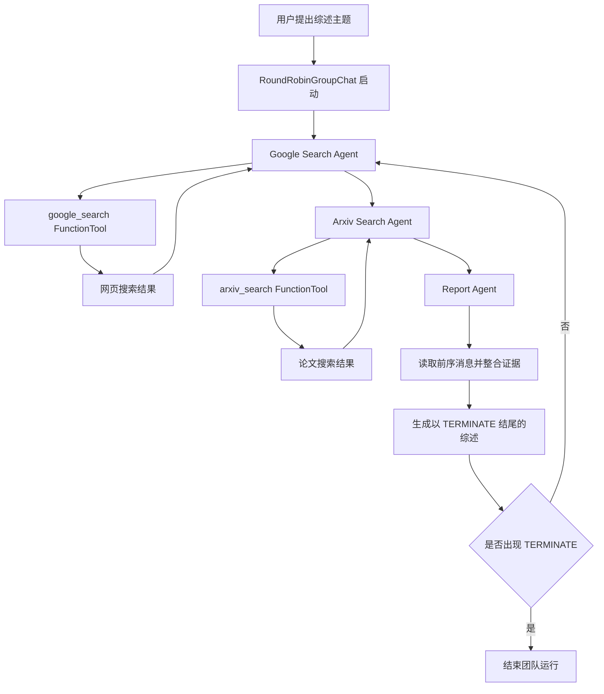
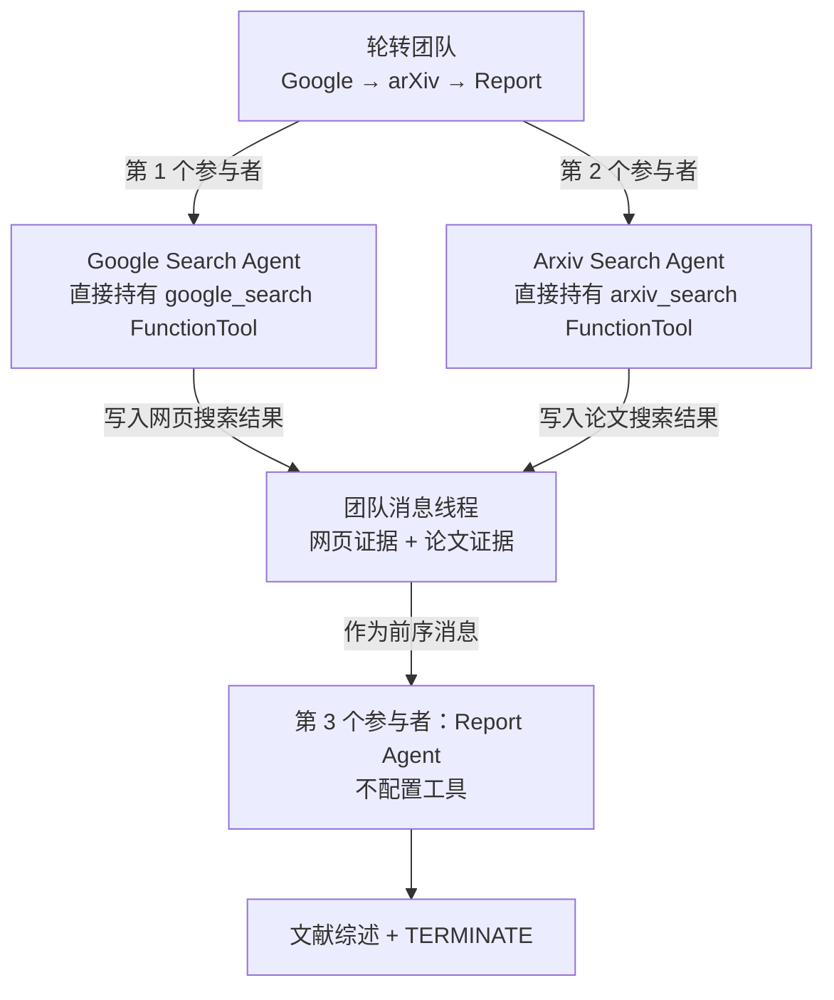

# 10. 案例：AutoGen 文献综述研究团队

> 本章以 AutoGen Literature Review 示例说明搜索工具、研究角色、轮转团队和终止条件怎样共同完成文献综述；流程图用于解释组件关系。

本章围绕同一个文献综述团队，从工具定义、角色配置、消息交接、轮转执行和停止条件逐层展开。

公开来源：

- AutoGen AgentChat Agents 教程: https://microsoft.github.io/autogen/stable/user-guide/agentchat-user-guide/tutorial/agents.html
- AutoGen AgentChat Teams 教程: https://microsoft.github.io/autogen/stable/user-guide/agentchat-user-guide/tutorial/teams.html
- AutoGen Literature Review 示例: https://microsoft.github.io/autogen/stable/user-guide/agentchat-user-guide/examples/literature-review.html
- AutoGen 仓库: https://github.com/microsoft/autogen


## 1. AutoGen 研究团队核心术语

本章第一次遇到下面这些英文时，先按这个中文含义理解；后文再展开它们的特性和工程做法。

| 英文术语 | 中文说法 | 先记住的含义 |
|---|---|---|
| AssistantAgent | 助手智能体 | AutoGen 中可绑定模型、工具和系统提示的智能体类型。 |
| FunctionTool | 函数工具 | 把普通函数包装成模型可调用工具的结构。 |
| RoundRobinGroupChat | 轮转群聊 | 让多个智能体按顺序轮流发言的团队机制。 |
| TextMentionTermination | 文本终止条件 | 当群聊消息包含指定文本时结束团队运行。 |


<!-- learning-path:start -->
<div class="learning-path">
<div class="learning-path-title">本章怎么学</div>
<div class="learning-path-step"><span>1</span><div>先掌握 AutoGen 术语，并明确 Literature Review 团队的任务、输入和输出（第 1～2 节）。</div></div>
<div class="learning-path-step"><span>2</span><div>再从 Agent 抽象、Tool、Agent 所有权和 Team 调度四层追踪实现（第 3～6 节）。</div></div>
<div class="learning-path-step"><span>3</span><div>最后运行任务、提炼模板、设计扩展，并修改官方示例验证变化（第 7～11 节）。</div></div>
</div>
<!-- learning-path:end -->

---

## 2. 研究团队的目标、输入与输出


AutoGen 官方 Literature Review 示例构造了一个多 Agent 团队，用来围绕一个主题写文献综述。团队包含三个 Agent：

### 2.1 Literature Review 团队执行流程

这张图紧贴 AutoGen 三 Agent 表，展示轮转团队如何搜索、汇总并以 TERMINATE 停止。




读图时重点看：搜索 Agent 和 Report Agent 的职责边界在图中是分开的。


| Agent | 职责 |
|---|---|
| `Google Search Agent` | 通过 Google Search 搜索网页资料 |
| `Arxiv Search Agent` | 从 arXiv 搜索论文 |
| `Report Agent` | 汇总搜索结果并写综述报告 |

三个角色形成清晰的产物链：网页证据、论文证据和综合报告分别由不同 Agent 负责。

## 3. AutoGen 的 Agent 抽象


AutoGen 的 AgentChat 文档把 Agent 定义为可以接收消息、生成响应的实体，并统一提供 `name`、`description`、`run()`、`run_stream()` 等接口。

官方示例中的基础导入包括：

```python
from autogen_agentchat.agents import AssistantAgent
from autogen_agentchat.conditions import TextMentionTermination
from autogen_agentchat.teams import RoundRobinGroupChat
from autogen_core.tools import FunctionTool
```

<div class="code-explanation">
<div class="code-explanation-title">Python 代码说明</div>
<p><strong>用途：</strong>展示 AutoGen 文献综述示例使用的四个核心抽象。<strong>执行过程：</strong><code>AssistantAgent</code> 表示角色，<code>FunctionTool</code> 包装搜索函数，<code>RoundRobinGroupChat</code> 负责轮流调度，<code>TextMentionTermination</code> 负责停止。<strong>关键点：</strong>该示例没有导入 <code>AgentTool</code>，搜索 Agent 以普通团队成员身份参加群聊。</p>
</div>


研究团队用 `AssistantAgent` 来包住不同的系统提示和工具。也就是说，三个 Agent 并不是三个完全不同的程序，而是同一类 Agent 根据：

- 名称；
- 描述；
- system message；
- 可用工具；

这些配置共同组成职责不同的研究角色。下一节先看两个搜索函数怎样被包装成 Tool，再看工具如何分配给具体 Agent。

## 4. 工具层：将搜索函数封装为 Tool


AutoGen 的 Literature Review 示例定义了两个核心函数：

| 函数 | 用途 |
|---|---|
| `google_search(...)` | 调用 Google Search API，返回网页标题、链接和摘要 |
| `arxiv_search(...)` | 调用 arXiv Python 库，返回论文标题、作者、摘要和链接 |

随后示例把函数包装为 `FunctionTool`：

```python
google_search_tool = FunctionTool(google_search, description="Search Google for information")
arxiv_search_tool = FunctionTool(arxiv_search, description="Search Arxiv for papers related to a given topic")
```

<div class="code-explanation">
<div class="code-explanation-title">Python 代码说明</div>
<p><strong>用途：</strong>把普通 Python 搜索函数包装为模型可见工具。<strong>执行过程：</strong><code>FunctionTool</code> 保存函数和自然语言描述，分别形成 Google 搜索与 arXiv 论文搜索能力。<strong>关键点：</strong>函数签名决定参数 Schema，描述应清楚区分网页信息和论文检索的适用范围。</p>
</div>


这里的教学重点是：工具函数不是直接塞给所有 Agent，而是先被包装成带描述的工具。描述会帮助模型判断“什么时候该调用这个工具”。

## 5. Agent 层：工具所有权与消息交接


官方示例创建三个 `AssistantAgent`，但工具并不是平均分配的。两个搜索 Agent 各自直接持有一个 `FunctionTool`；`Report_Agent` 不配置搜索工具，也不通过 `AgentTool` 调用另外两个 Agent。

| Agent | 直接配置的工具 | 本轮职责 | 写入群聊的结果 |
|---|---|---|---|
| `Google_Search_Agent` | `google_search_tool` | 搜索网页信息 | 标题、链接、摘要和页面正文片段 |
| `Arxiv_Search_Agent` | `arxiv_search_tool` | 搜索学术论文 | 标题、作者、发布日期、摘要和 PDF 链接 |
| `Report_Agent` | 无 | 综合前序消息中的两类证据 | 带引用的文献综述，并以 `TERMINATE` 结尾 |

### 5.1 搜索 Agent 的 FunctionTool 调用

下面只保留与工具所有权有关的字段：

```python
google_search_agent = AssistantAgent(
    name="Google_Search_Agent",
    model_client=model_client,
    tools=[google_search_tool],
)

arxiv_search_agent = AssistantAgent(
    name="Arxiv_Search_Agent",
    model_client=model_client,
    tools=[arxiv_search_tool],
)
```

<div class="code-explanation">
<div class="code-explanation-title">Python 代码说明</div>
<p><strong>用途：</strong>展示搜索能力怎样按信息源绑定给不同角色。<strong>执行过程：</strong>Google Agent 只能看到 Google 工具的 Schema，arXiv Agent 只能看到 arXiv 工具的 Schema；轮到某个搜索 Agent 发言时，它先调用自己的函数工具，再把工具结果整理成消息。<strong>关键点：</strong>这里发生的是“Agent 调用函数工具”，不是“Report Agent 调用搜索 Agent”。</p>
</div>

这种拆分让网页检索和论文检索具有不同的工具描述、参数与输出结构。问题也更容易定位：网页证据缺失时检查 Google 路径，论文元数据错误时检查 arXiv 路径。

### 5.2 Report Agent 的消息读取边界

`Report_Agent` 的相关配置可以压缩为：

```python
report_agent = AssistantAgent(
    name="Report_Agent",
    model_client=model_client,
    description="Generate a report based on a given topic",
    # 官方示例没有 tools 参数
)
```

<div class="code-explanation">
<div class="code-explanation-title">Python 代码说明</div>
<p><strong>用途：</strong>说明报告角色与搜索角色的能力边界。<strong>执行过程：</strong><code>RoundRobinGroupChat</code> 把用户任务和前序成员消息组成团队消息线程；轮到 Report Agent 时，它从上下文中读取网页与论文结果，生成综述。<strong>关键点：</strong>Report Agent 的输入来自群聊消息历史，而不是两个 <code>AgentTool</code> 的返回值。</p>
</div>

### 5.3 角色、工具与消息边界

这张图只表达“谁拥有工具、证据写到哪里”，不重复描述完整轮转时序。



读图时重点看：工具所有权在两个搜索 Agent；证据交接发生在团队消息线程；Report Agent 只负责综合与终止。


## 6. Team 层：RoundRobinGroupChat 与停止条件


官方 Teams 教程说明，team 是一组 Agent 一起工作。Literature Review 示例使用 `RoundRobinGroupChat`：

```python
termination = TextMentionTermination("TERMINATE")
team = RoundRobinGroupChat(participants=[google_search_agent, arxiv_search_agent, report_agent], termination_condition=termination)
```

<div class="code-explanation">
<div class="code-explanation-title">Python 代码说明</div>
<p><strong>用途：</strong>创建轮询研究团队并定义文本终止条件。<strong>执行过程：</strong>arXiv 搜索、Google 搜索和报告角色按参与者顺序轮流发言，任一消息出现 <code>TERMINATE</code> 时停止。<strong>关键点：</strong>仅依赖终止词仍应配合最大轮数和预算，避免角色忘记输出终止标记。</p>
</div>


这个结构有两个关键点：

1. `RoundRobinGroupChat` 让参与者按轮次说话。
2. `TextMentionTermination("TERMINATE")` 让团队在出现指定终止词时停止。

如果没有停止条件，多 Agent 对话很容易进入循环：搜索者继续补材料，报告者继续改写，团队迟迟不结束。

## 7. 研究任务的入口与执行过程


官方示例运行团队时给了一个明确任务：

```python
await Console(team.run_stream(task="Write a literature review on no code tools for building multi agent ai systems"))
```

<div class="code-explanation">
<div class="code-explanation-title">Python 代码说明</div>
<p><strong>用途：</strong>把一条文献综述任务流式送入 AutoGen 团队。<strong>执行过程：</strong><code>run_stream()</code> 持续产生团队事件，<code>Console</code> 将中间消息与最终结果展示出来，<code>await</code> 表示异步等待整个运行结束。<strong>关键点：</strong>运行前必须配置模型客户端和搜索工具所需凭据。</p>
</div>


这个任务进入团队后，大致会发生：

1. Google 搜索 Agent 查询网页资料。
2. arXiv 搜索 Agent 查询论文。
3. Report Agent 汇总结果，组织成综述。
4. 团队看到终止条件后停止。

实际输出流中会包含模型消息、工具调用、工具结果和最终报告。这也是 AutoGen 的优势之一：你可以观察团队内部过程，而不是只看到最终答案。

## 8. AutoGen 文献研究团队的模板化机制


这个案例覆盖了研究型 Agent 系统的四个核心层：

| 层 | 示例中的结构 | 可迁移经验 |
|---|---|---|
| 工具层 | `google_search`、`arxiv_search`、`FunctionTool` | 把外部信息源包装成可描述工具 |
| 角色层 | 搜索 Agent、报告 Agent | 按信息源和产物职责拆角色 |
| 团队层 | `RoundRobinGroupChat` | 用可解释的轮转机制协调 Agent |
| 停止层 | `TextMentionTermination("TERMINATE")` | 明确什么时候结束任务 |

如果你要改造成“论文调研助手”，可以沿用这个结构：

- 把 `Google_Search_Agent` 换成企业内部知识库搜索 Agent。
- 把 `Arxiv_Search_Agent` 换成 PubMed、Semantic Scholar 或专利搜索 Agent。
- 保留 `Report_Agent` 负责综合。
- 保留显式停止条件。

## 9. 研究团队的基线架构与扩展方向


案例的基础结构包括搜索函数、`FunctionTool`、三个 `AssistantAgent`、`RoundRobinGroupChat` 和文本终止条件。正文中的流程图把这些组件的关系压缩成便于阅读的结构。

扩展时可以加入 FactChecker、自定义 Evidence Schema 或替换信息源，但要单独列出新增角色、工具、消息字段和验收规则，才能判断变化发生在哪一层。


---

<!-- chapter-check:start -->
## 10. AutoGen 研究团队设计自检
<div class="chapter-check">
<div class="chapter-check-title">不看正文，尝试回答</div>
<ul>
<li>能否说出三个官方 Agent 的职责和工具边界？</li>
<li>能否解释 FunctionTool、AssistantAgent 与 RoundRobinGroupChat 的层次关系？</li>
<li>能否指出 TERMINATE 之外还需要哪些运行护栏？</li>
</ul>
</div>
<!-- chapter-check:end -->

---

## 11. AutoGen 官方研究示例扩展练习


1. 打开 AutoGen Literature Review 示例，找到 `google_search()` 与 `arxiv_search()` 的完整实现。
2. 找到 `FunctionTool(...)` 的两处包装代码，观察 description 如何描述工具边界。
3. 找到三个 `AssistantAgent` 的创建代码，比较它们的 name、description 和 system_message。
4. 把 `RoundRobinGroupChat` 换成 AutoGen Teams 教程中的其他 team preset，思考会改变什么。
5. 在不改 Agent 数量的情况下，把任务从“no code tools”改成“agent memory systems”，观察搜索与报告行为如何变化。

下一章看 **⑪ 框架与项目图谱**：把两个案例放回更大的多智能体框架生态中比较。
