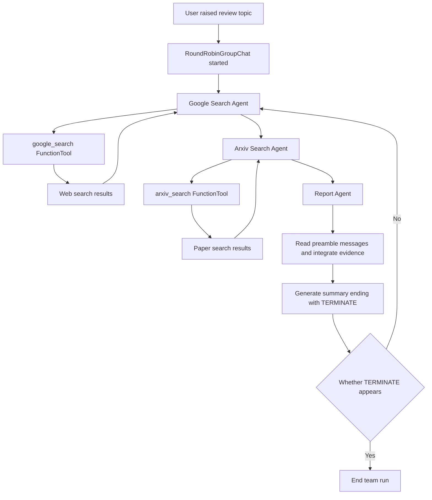
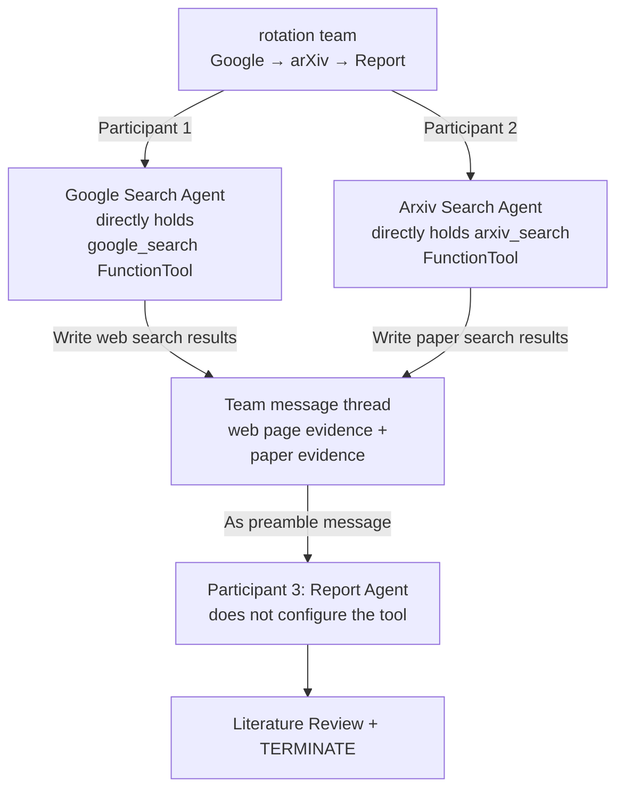

# 10. Case: AutoGen Literature Review Research Team

> This chapter uses the AutoGen Literature Review example to illustrate how search tools, research roles, rotation teams, and termination criteria work together to complete a literature review; a flowchart is used to explain component relationships.

This chapter focuses on the same literature review team and unfolds layer by layer from tool definition, role configuration, message handover, rotation execution and stop conditions.

Public sources:

- AutoGen AgentChat Agents Tutorial: https://microsoft.github.io/autogen/stable/user-guide/agentchat-user-guide/tutorial/agents.html
- AutoGen AgentChat Teams Tutorial: https://microsoft.github.io/autogen/stable/user-guide/agentchat-user-guide/tutorial/teams.html
- AutoGen Literature Review Example: https://microsoft.github.io/autogen/stable/user-guide/agentchat-user-guide/examples/literature-review.html
- AutoGen repository: https://github.com/microsoft/autogen


## 1. Core terms of the AutoGen research team

When you first encounter the terms below, use these working definitions as a quick reference; later sections cover their properties and engineering implications.

| Term | Working definition | Key idea |
|---|---|---|
| AssistantAgent | Assistant Agent | An agent type in AutoGen that can be bound to models, tools, and system prompts. |
| FunctionTool | Function Tool | A structure that wraps ordinary functions into model callable tools. |
| RoundRobinGroupChat | RoundRobinGroupChat | A team mechanism that allows multiple agents to take turns speaking in order. |
| TextMentionTermination | Text termination condition | End the team run when the group chat message contains the specified text. |


<!-- learning-path:start -->
<div class="learning-path">
<div class="learning-path-title">How to study this chapter</div>
<div class="learning-path-step"><span>1</span><div>First master AutoGen terminology and clarify the tasks, inputs, and outputs of the Literature Review team (Section 1-2). </div></div>
<div class="learning-path-step"><span>2</span><div> Then implement four layers of tracking from Agent abstraction, Tool, Agent ownership and Team scheduling (sections 3 to 6). </div></div>
<div class="learning-path-step"><span>3</span><div>Finally run the task, refine the template, design the extension, and modify the official example to verify the changes (sections 7 to 11). </div></div>
</div>
<!-- learning-path:end -->

---

## 2. Study the team’s goals, inputs and outputs


AutoGen's official Literature Review example constructs a multi-agent team to write a literature review around a topic. The team contains three Agents:

### 2.1 Literature Review Team Execution Process

This diagram follows the AutoGen three-Agent table, showing how the rotation team searches, summarizes, and stops with TERMINATE.




When reading the diagram, pay attention to: The responsibility boundaries of the search agent and the report agent are separated in the diagram.


| Agent | Responsibilities |
|---|---|
| `Google Search Agent` | Search web data via Google Search |
| `Arxiv Search Agent` | Search papers from arXiv |
| `Report Agent` | Summarize search results and write a summary report |

The three roles form a clear product chain: web page evidence, paper evidence, and comprehensive reports are each responsible for different agents.

## 3. AutoGen’s Agent abstraction


AutoGen's AgentChat document defines Agent as an entity that can receive messages and generate responses, and provides unified interfaces such as `name`, `description`, `run()`, `run_stream()`, etc.

Basic imports in the official example include:

```python
from autogen_agentchat.agents import AssistantAgent
from autogen_agentchat.conditions import TextMentionTermination
from autogen_agentchat.teams import RoundRobinGroupChat
from autogen_core.tools import FunctionTool
```

<div class="code-explanation">
<div class="code-explanation-title">Python code description</div>
<p><strong> Purpose: </strong> Demonstrates the four core abstractions used by the AutoGen literature review example. <strong> execution process: </strong><code>AssistantAgent</code> represents the role, <code>FunctionTool</code> Wrapper search function, <code>RoundRobinGroupChat</code> is responsible for round-robin scheduling, <code>TextMentionTermination</code> is responsible for stopping. <strong>Key points: </strong>This example does not import <code>AgentTool</code>, search for Agent to participate in the group chat as an ordinary team member. </p>
</div>


The research team uses `AssistantAgent` to wrap different system tips and tools. In other words, the three Agents are not three completely different programs, but the same type of Agent based on:

- Name;
- description;
- system message；
- Available tools;

Together, these configurations form research roles with different responsibilities. The next section will first look at how the two search functions are packaged into Tools, and then look at how the tools are assigned to specific Agents.

## 4. Tool layer: Encapsulate the search function as Tool


AutoGen's Literature Review example defines two core functions:

| Function | Purpose |
|---|---|
| `google_search(...)` | Call the Google Search API and return the page title, link and summary |
| `arxiv_search(...)` | Calls the arXiv Python library, returning the paper title, author, abstract and link |

The example then wraps the function as `FunctionTool`:

```python
google_search_tool = FunctionTool(google_search, description="Search Google for information")
arxiv_search_tool = FunctionTool(arxiv_search, description="Search Arxiv for papers related to a given topic")
```

<div class="code-explanation">
<div class="code-explanation-title">Python code description</div>
<p><strong> Purpose: </strong> wraps ordinary Python search functions into model visibility tools. <strong> Execution process: </strong><code>FunctionTool</code> Save functions and natural language descriptions to form Google search and arXiv paper search capabilities respectively. <strong>Key points: </strong>The function signature determines the parameter Schema, and the description should clearly distinguish the applicable scope of web page information and paper retrieval. </p>
</div>


The key point of teaching here is that tool functions are not directly given to all Agents, but are first packaged into tools with descriptions. The description will help the model determine "when to call this tool."

## 5. Agent layer: tool ownership and message handover


The official example creates three `AssistantAgent`, but the tools are not evenly distributed. Each of the two search agents directly holds one `FunctionTool`; `Report_Agent` does not configure the search tool, nor does it call the other two agents through `AgentTool`.

| Agent | Directly configured tool | Responsibilities of this round | Writing the results of the group chat |
|---|---|---|---|
| `Google_Search_Agent` | `google_search_tool` | Search web page information | Titles, links, abstracts, and page body snippets |
| `Arxiv_Search_Agent` | `arxiv_search_tool` | Search academic papers | Title, author, publication date, abstract and PDF link |
| `Report_Agent` | None | Synthesize two types of evidence in preamble messages | Literature review with citations, ending with `TERMINATE` |

### 5.1 Search Agent’s FunctionTool call

Only fields related to tool ownership are retained below:

```python
google_search_agent = AssistantAgent(
    name="Google_Search_Agent",
    model_client=model_client,
    tools=[google_search_tool],
)

arxiv_search_agent = AssistantAgent(
    name="Arxiv_Search_Agent",
    model_client=model_client,
    tools=[arxiv_search_tool],
)
```

<div class="code-explanation">
<div class="code-explanation-title">Python code description</div>
<p><strong> Purpose: </strong> Shows how search capabilities are bound to different roles according to information sources. <strong>Execution process: </strong>Google Agent can only see the Schema of the Google tool, and arXiv Agent can only see the Schema of the arXiv tool; when it is a search Agent's turn to speak, it first calls its own function tool, and then organizes the tool results into messages. <strong>Key point: </strong>What happens here is "Agent calls function tool", not "Report Agent calls search Agent". </p>
</div>

This split allows web retrieval and paper retrieval to have different tool descriptions, parameters, and output structures. Problems are also easier to locate: check the Google path if the web page evidence is missing, or the arXiv path if the paper metadata is wrong.

### 5.2 Message reading boundary of Report Agent

The relevant configuration of `Report_Agent` can be compressed as:

```python
report_agent = AssistantAgent(
    name="Report_Agent",
    model_client=model_client,
    description="Generate a report based on a given topic",
    # The official example does not have the tools parameter
)
```

<div class="code-explanation">
<div class="code-explanation-title">Python code description</div>
<p><strong> Purpose: </strong> Describes the capability boundaries between the reporting role and the search role. <strong> Execution process: </strong><code>RoundRobinGroupChat</code> Combine user tasks and previous member messages into a team message thread; when it is the Report Agent's turn, it reads web pages and paper results from the context and generates a review. <strong>Key points: The input of </strong>Report Agent comes from the group chat message history, not the return value of the two <code>AgentTool</code>. </p>
</div>

### 5.3 Roles, Tools and Message Boundaries

This picture only expresses "who owns the tools and where the evidence is written" and does not repeat the complete rotation sequence.



When reading the picture, pay attention to: the tool ownership lies in the two search agents; evidence handover occurs in the team message thread; the report agent is only responsible for synthesis and termination.


## 6. Team layer: RoundRobinGroupChat and stop conditions


The official Teams tutorial explains that a team is a group of Agents working together. Literature Review example uses `RoundRobinGroupChat`:

```python
termination = TextMentionTermination("TERMINATE")
team = RoundRobinGroupChat(participants=[google_search_agent, arxiv_search_agent, report_agent], termination_condition=termination)
```

<div class="code-explanation">
<div class="code-explanation-title">Python code description</div>
<p><strong> Purpose: </strong> Create a polling research team and define textual termination conditions. <strong> Execution process: </strong>arXiv search, Google search, and reporting roles take turns speaking in the order of participants, stopping when any message appears <code>TERMINATE</code>. <strong>Key points: </strong> Relying only on the termination word should still be consistent with the maximum number of rounds and budget to avoid the character forgetting to output the termination token. </p>
</div>


There are two key points to this structure:

1. `RoundRobinGroupChat` Let participants speak in turns.
2. `TextMentionTermination("TERMINATE")` causes the team to stop when the specified stop word occurs.

If there is no stopping condition, the multi-agent dialogue can easily enter a loop: the searcher continues to add materials, the reporter continues to rewrite, and the team continues to end.

## 7. Research task entrance and execution process


The official example gives a clear task when running the team:

```python
await Console(team.run_stream(task="Write a literature review on no code tools for building multi agent ai systems"))
```

<div class="code-explanation">
<div class="code-explanation-title">Python code description</div>
<p><strong> Purpose: </strong> Streams a literature review task to the AutoGen team. <strong> execution process: </strong><code>run_stream()</code> continues to generate team events, <code>Console</code> Display the intermediate messages and final results, <code>await</code> means asynchronously waiting for the entire operation to end. <strong>Key points: </strong>The credentials required by the model client and search tool must be configured before running. </p>
</div>


After this task enters the team, roughly what will happen:

1. Google Search Agent queries web page information.
2. arXiv Search Agent queries papers.
3. Report Agent summarizes the results and organizes them into a summary.
4. The team stops when it sees the termination condition.

The actual output stream will contain model messages, tool calls, tool results, and final reports. This is one of the advantages of AutoGen: you can observe the internal process of the team instead of just seeing the final answer.

## 8. Templating mechanism of AutoGen literature research team


This case covers the four core layers of the research Agent system:

| Layers | Structure in the example | Transferable experiences |
|---|---|---|
| Tool layer | `google_search`, `arxiv_search`, `FunctionTool` | Packaging external information sources into descriptive tools |
| Role layer | Search Agent, report Agent | Split roles according to information sources and product responsibilities |
| Team layer | `RoundRobinGroupChat` | Coordinate Agents with interpretable rotation mechanism |
| Stop layer | `TextMentionTermination("TERMINATE")` | Specify when to end the task |

If you want to transform into a "thesis research assistant", you can use this structure:

- Replace `Google_Search_Agent` with the enterprise internal knowledge base search agent.
- Replace `Arxiv_Search_Agent` with PubMed, Semantic Scholar, or Patent Search Agent.
- Reserved `Report_Agent` is responsible for synthesis.
- Preserve explicit stopping conditions.

## 9. Baseline structure and expansion direction of the research team


The basic structure of the case includes the search function, `FunctionTool`, the three `AssistantAgent`, `RoundRobinGroupChat`, and the text termination condition. The flowcharts in the text condense the relationships of these components into an easy-to-read structure.

When extending, you can add FactChecker, customize Evidence Schema, or replace information sources, but the new roles, tools, message fields, and acceptance rules must be listed separately to determine which layer the changes occur.


---

<!-- chapter-check:start -->
## 10. AutoGen research team design self-test
<div class="chapter-check">
<div class="chapter-check-title"> Without reading the text, try to answer </div>
<ul>
<li> Can you tell us the responsibilities and tool boundaries of the three official Agents? </li>
<li>Can you explain the hierarchical relationship between FunctionTool, AssistantAgent and RoundRobinGroupChat? </li>
<li> Can you point out what running guardrails are needed beyond TERMINATE? </li>
</ul>
</div>
<!-- chapter-check:end -->

---

## 11. AutoGen official research example extended exercise


1. Open the AutoGen Literature Review example and find the complete implementation of `google_search()` and `arxiv_search()`.
2. Find the two packaging codes of `FunctionTool(...)` and observe how description describes the tool boundary.
3. Find the three creation codes of `AssistantAgent` and compare their name, description and system_message.
4. Replace `RoundRobinGroupChat` with another team preset from the AutoGen Teams tutorial and think about what would change.
5. Without changing the number of Agents, change the task from "no code tools" to "agent memory systems" and observe how the search and reporting behavior changes.

See the next chapter **⑪ Framework and Project Map**: Put the two cases back into the larger multi-agent framework ecosystem for comparison.
