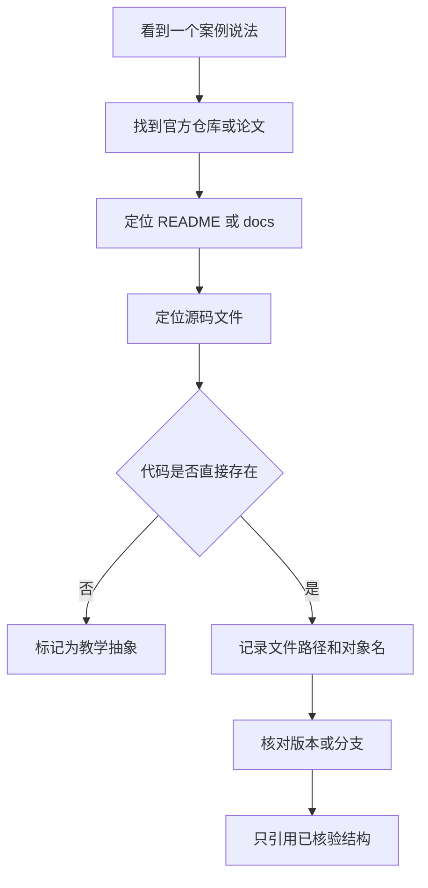
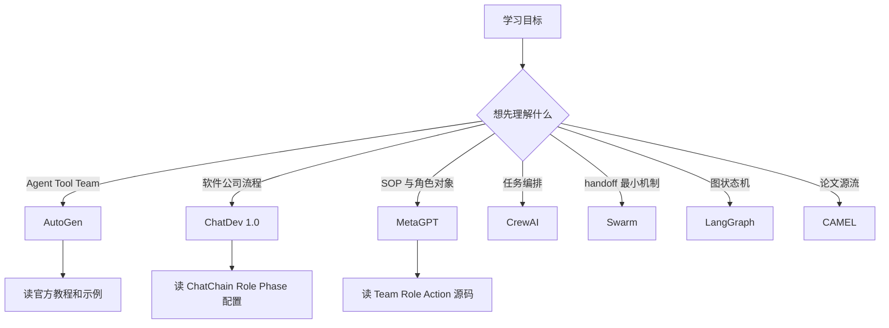

# 11. 框架与项目图谱：只保留可核验入口

> 本章以官方项目、论文、文档和源码锚点为事实依据；教学抽象会明确标注，不作为框架实现事实。

学习多 Agent 框架时，不能把“看起来像官方代码”的示例直接当成实现事实。本章先给出核验方法，再比较各框架的公开结构和适用学习目标。


## 1. 多智能体框架选型核心术语

本章第一次遇到下面这些英文时，先按这个中文含义理解；后文再展开它们的特性和工程做法。

| 英文术语 | 中文说法 | 先记住的含义 |
|---|---|---|
| Framework | 框架 | 提供智能体、工具、团队或状态编排抽象的工程项目。 |
| Source anchor | 源码锚点 | 能直接验证说法的公开文件、类名、函数或文档位置。 |
| Handoff | 控制权交接 | Swarm 等框架强调的轻量智能体切换方式。 |
| State graph | 状态图 | LangGraph 等系统用节点和边表达流程控制的方法。 |


<!-- learning-path:start -->
<div class="learning-path">
<div class="learning-path-title">本章怎么学</div>
<div class="learning-path-step"><span>1</span><div>先掌握框架术语，并从说法追到官方仓库、文档、论文和源码锚点（第 1 节）。</div></div>
<div class="learning-path-step"><span>2</span><div>再分别阅读七个公开框架的官方入口、核心对象和可核验结构（第 2～8 节）。</div></div>
<div class="learning-path-step"><span>3</span><div>最后按学习目标安排阅读顺序，并用统一规范区分框架事实与教学抽象（第 9～10 节）。</div></div>
</div>
<!-- learning-path:end -->

---

### 1.1 公开项目的事实核验流程

这张图紧贴本章的核验规则，说明如何从说法追到仓库、文档和源码。




读图时重点看：找不到直接代码锚点，就必须标成教学抽象。


- 只有来自公开仓库、官方文档或论文的内容，才标记为真实案例。
- 没有核验过的代码，不写成“框架示例代码”。
- 如果是教学抽象，会明确说明它不是原项目代码。

## 2. AutoGen：Agent、Tool 与 Team 结构

本节核验 AutoGen 的 Agent、Tool、Team 和终止条件，重点确认这些对象在官方文档与公开导入路径中的职责。


公开来源：

- 文档: https://microsoft.github.io/autogen/stable/user-guide/agentchat-user-guide/tutorial/agents.html
- Teams: https://microsoft.github.io/autogen/stable/user-guide/agentchat-user-guide/tutorial/teams.html
- Literature Review 示例: https://microsoft.github.io/autogen/stable/user-guide/agentchat-user-guide/examples/literature-review.html
- 仓库: https://github.com/microsoft/autogen

AutoGen AgentChat 文档中的核心对象包括：

| 对象 | 官方含义 |
|---|---|
| `AssistantAgent` | 内置助手 Agent，可绑定模型与工具 |
| `FunctionTool` | 把 Python 函数包装成工具 |
| `RoundRobinGroupChat` | 让一组 Agent 按轮次协作 |
| `SelectorGroupChat` | 用选择器决定下一位发言者 |
| `TextMentionTermination` | 文本匹配式终止条件 |

官方 Agents 教程中的最小结构包含这些导入：

```python
from autogen_agentchat.agents import AssistantAgent
from autogen_ext.models.openai import OpenAIChatCompletionClient
```

<div class="code-explanation">
<div class="code-explanation-title">Python 代码说明</div>
<p><strong>用途：</strong>展示 AutoGen 中智能体与 OpenAI 模型客户端的公开导入路径。<strong>执行过程：</strong><code>AssistantAgent</code> 承载角色和工具，<code>OpenAIChatCompletionClient</code> 提供模型调用实现。<strong>关键点：</strong>这里只证明模块边界，创建实例时还需模型名称、凭据和关闭客户端等生命周期管理。</p>
</div>


官方 Teams 教程中的轮转团队结构包含：

```python
from autogen_agentchat.teams import RoundRobinGroupChat
from autogen_agentchat.conditions import TextMentionTermination
```

<div class="code-explanation">
<div class="code-explanation-title">Python 代码说明</div>
<p><strong>用途：</strong>展示 AutoGen 团队编排和停止条件是独立组件。<strong>执行过程：</strong><code>RoundRobinGroupChat</code> 决定参与者轮流顺序，<code>TextMentionTermination</code> 通过指定文本判断结束。<strong>关键点：</strong>把终止逻辑对象化后，可以组合轮数、token 或人工停止等更多条件。</p>
</div>


AutoGen 适合教学的原因是它把三个问题拆得很清楚：

1. Agent 如何接收消息与调用工具。
2. Tool 如何从普通函数变成模型可选择的动作。
3. Team 如何控制多个 Agent 的发言顺序与停止条件。

## 3. ChatDev：软件公司式多 Agent 架构

本节核验 ChatDev 1.0 的虚拟软件公司结构，重点阅读角色配置、ChatChain、Phase 和运行产物。


公开来源：

- 当前仓库: https://github.com/OpenBMB/ChatDev
- 1.0 分支: https://github.com/OpenBMB/ChatDev/tree/chatdev1.0
- 论文: https://arxiv.org/abs/2307.07924
- 关键配置:
  - `CompanyConfig/Default/ChatChainConfig.json`
  - `CompanyConfig/Default/RoleConfig.json`
  - `CompanyConfig/Default/PhaseConfig.json`

ChatDev 1.0 的真实结构是：

<div class="concept-card">
<div class="concept-line">框架图谱（Framework map）</div>
<div class="concept-line">  → AutoGen：学习 Agent、Tool、Team 的官方抽象</div>
<div class="concept-line">  → ChatDev：学习软件公司式阶段链</div>
<div class="concept-line">  → MetaGPT：学习 SOP、Team、Role、Action</div>
<div class="concept-line">  → CrewAI：学习 Agent、Task、Crew、Process</div>
<div class="concept-line">  → Swarm：学习轻量交接（Handoff）</div>
<div class="concept-line">  → LangGraph：学习状态图（State graph）式编排</div>
<div class="concept-line">  → CAMEL：学习角色扮演式协作思想</div>
</div>

ChatDev 当前 README 也说明，ChatDev 2.0 / DevAll 已经从早期专门的软件开发多 Agent 系统，演化为更通用的多 Agent 编排平台；经典 1.0 版本被保留在 `chatdev1.0` 分支。

这个项目适合用来学习：

- 配置驱动的多 Agent 流程。
- 角色提示与阶段提示如何分离。
- 为什么需要保存运行日志、配置与最终产物。

## 4. MetaGPT：SOP 驱动的软件团队

本节核验 MetaGPT 的 Team、Role、Action 和消息环境，重点观察 SOP 怎样进入软件团队的对象与运行流程。


公开来源：

- 仓库: https://github.com/FoundationAgents/MetaGPT
- 论文: https://arxiv.org/abs/2308.00352
- 关键源码:
  - `metagpt/software_company.py`
  - `metagpt/team.py`
  - `metagpt/roles/product_manager.py`
  - `metagpt/roles/engineer.py`

MetaGPT README 给出的官方用法包括：

```python
from metagpt.software_company import generate_repo
repo = generate_repo("Create a 2048 game")
```

<div class="code-explanation">
<div class="code-explanation-title">Python 代码说明</div>
<p><strong>用途：</strong>展示 MetaGPT 对外暴露的高层软件仓库生成入口。<strong>执行过程：</strong>一句 2048 游戏需求进入 <code>generate_repo()</code>，内部由产品、架构和工程角色按 SOP 协作并返回仓库结果。<strong>关键点：</strong>它代表 SOP 驱动路线，和自由对话式团队的控制方式不同。</p>
</div>


源码中的 `generate_repo()` 会创建 `Team`，并 hire `TeamLeader`、`ProductManager`、`Architect`、`Engineer2`、`DataAnalyst` 等角色。

为了先建立整体认识，可以把 MetaGPT 压缩成下面的对象关系：

<div class="concept-card">
<div class="concept-line">Team</div>
<div class="concept-line">  -&gt; Role</div>
<div class="concept-line">      -&gt; Action</div>
<div class="concept-line">      -&gt; watch message types</div>
<div class="concept-line">  -&gt; Environment</div>
<div class="concept-line">  -&gt; SOP</div>
</div>

它适合学习：

- 如何把组织流程编码成对象。
- 如何把角色和动作绑定。
- 如何让不同角色通过消息环境协作。

## 5. CrewAI：Crew、Agent、Task 与 Process

本节核验 CrewAI 的 Crew、Agent、Task 和 Process，重点观察任务负责人、依赖关系和执行过程怎样被显式建模。


公开来源：

- 文档: https://docs.crewai.com/en/concepts/crews
- 仓库: https://github.com/crewAIInc/crewAI

CrewAI 文档把 crew 定义为协作完成任务的一组 Agent。官方概念页列出了 `Crew` 的重要属性：

| 属性 | 含义 |
|---|---|
| `agents` | crew 中的 Agent 列表 |
| `tasks` | crew 要执行的 Task 列表 |
| `process` | 任务执行流程，例如 sequential 或 hierarchical |
| `memory` | 是否启用记忆 |
| `cache` | 是否启用工具结果缓存 |
| `planning` | 是否启用规划 |
| `knowledge_sources` | crew 可访问的知识源 |
| `step_callback` | 每一步后的回调 |
| `task_callback` | 每个任务完成后的回调 |

官方文档给出两种创建方式：

- YAML 配置方式。
- 直接用代码定义 Agent、Task、Crew。

CrewAI 适合学习“任务编排型”多 Agent，因为它把 Task 作为一等对象，而不是只围绕聊天消息建模。

## 6. OpenAI Swarm：轻量 Handoff 机制

本节核验 OpenAI Swarm 的 Agent 与 Handoff，重点理解控制权怎样通过函数返回值在智能体之间转移，以及该项目明确声明的教育用途边界。


公开来源：

- 仓库: https://github.com/openai/swarm

Swarm README 明确说明它是 experimental、educational 的项目，并提示生产用途应使用 OpenAI Agents SDK。

Swarm 的核心抽象非常少：

| 抽象 | 含义 |
|---|---|
| `Agent` | 带 instructions 与 functions 的执行者 |
| handoff | 一个 Agent 通过函数返回另一个 Agent，把控制权交过去 |
| run loop | 获取 completion、执行工具、切换 Agent、更新 context variables |

README 中的最小 handoff 结构是：

```python
from swarm import Swarm, Agent
```

<div class="code-explanation">
<div class="code-explanation-title">Python 代码说明</div>
<p><strong>用途：</strong>展示 OpenAI Swarm 的两个最小公开抽象。<strong>执行过程：</strong><code>Agent</code> 定义角色、指令与函数，<code>Swarm</code> 客户端运行消息并根据函数返回值完成 handoff。<strong>关键点：</strong>Swarm 仓库定位为教育性实验框架，生产选型时应结合其官方状态和后继方案评估。</p>
</div>


然后通过一个函数返回另一个 `Agent` 来切换控制权。这个案例适合学习“handoff”这个最小概念，但不应该被当成生产框架选型建议。

## 7. CAMEL：角色扮演式协作

本节核验 CAMEL 的角色扮演式协作方法，重点理解角色设定、任务提示和对话过程怎样形成合作行为。


公开来源：

- 论文: https://arxiv.org/abs/2303.17760
- 项目: https://github.com/camel-ai/camel

CAMEL 的代表性贡献是 role-playing autonomous cooperative agents：通过给两个或多个 Agent 设置角色、任务和对话约束，让它们围绕任务持续协作。

本页不摘录 CAMEL 源码，因为这里没有逐行核验具体版本的实现文件。它在本教程中的位置是论文与思想入口：

- 角色扮演。
- 任务说明。
- 多 Agent 对话。
- 合作式问题求解。

## 8. LangGraph：图状态机式 Agent 编排

本节核验 LangGraph 的状态、节点和条件边，重点理解分支、循环、检查点和人工介入怎样表示为显式控制流。


公开来源：

- 文档: https://langchain-ai.github.io/langgraph/
- 仓库: https://github.com/langchain-ai/langgraph

LangGraph 常被用于把 Agent 工作流建成图：节点代表步骤，边代表状态转移，状态对象在节点之间传递。

本页不写 LangGraph 示例代码，因为前一版中的代码没有直接对应到已核验的官方片段。学习时建议直接从官方 quickstart 和 examples 入手，重点观察：

- state schema；
- node function；
- edge / conditional edge；
- compile；
- invoke / stream。

## 9. 多智能体框架的学习顺序

逐个比较框架以后，不应再按热度排列项目，而应根据要理解的协作问题选择入口。下面的路线图和表格把学习目标映射到最直接的公开对象。


### 9.1 多智能体框架学习路线

这张图放在框架选择表前，把学习目标映射到具体项目入口。




读图时重点看：选框架先看学习目标，而不是看热度或 star 数。


| 目标 | 推荐先看 | 原因 |
|---|---|---|
| 想理解 Agent + Tool + Team | AutoGen | 官方教程层次清晰，示例可运行 |
| 想理解软件开发公司式流程 | ChatDev 1.0 | 角色、阶段、配置非常直观 |
| 想理解 SOP 如何编码 | MetaGPT | Team / Role / Action 抽象明显 |
| 想理解任务编排 | CrewAI | Task 是一等对象 |
| 想理解 handoff 最小机制 | Swarm | 抽象少，适合拆概念 |
| 想理解图式控制流 | LangGraph | 状态与边显式 |
| 想理解多 Agent 论文源流 | CAMEL | role-playing 范式清楚 |

选定框架以后，还要说明表格中的判断来自官方事实还是教学归纳。下一节给出统一的标注规则，避免“适合学习某概念”被误写成“官方按该教学结构实现”。

---

## 10. 框架事实与教学抽象的标注规范

框架事实应能定位到官方文档、仓库文件、源码对象或论文；教学伪代码和架构图只能说明概念，必须明确标注为教学抽象。

引用时至少记录项目名称、版本或分支、文件路径和核验日期。若只能确认“设计风格相似”，就不能写成“源码直接如此实现”。本章的作用是提供可核验入口，而不是替代对当前官方实现的核对。

---

<!-- chapter-check:start -->
## 11. 多智能体框架结构与选型自检
<div class="chapter-check">
<div class="chapter-check-title">不看正文，尝试回答</div>
<ul>
<li>能否为一个框架说法找到官方文档、仓库和源码对象三类证据？</li>
<li>能否按对话、SOP、任务、handoff 和状态图比较框架？</li>
<li>能否明确说出某段内容是原始实现还是教学抽象？</li>
</ul>
</div>
<!-- chapter-check:end -->

完成自检后，下一章进入 **⑫ 学习路线与引用**：按设计、工程和研究目标组织练习、验收与可核验来源。
