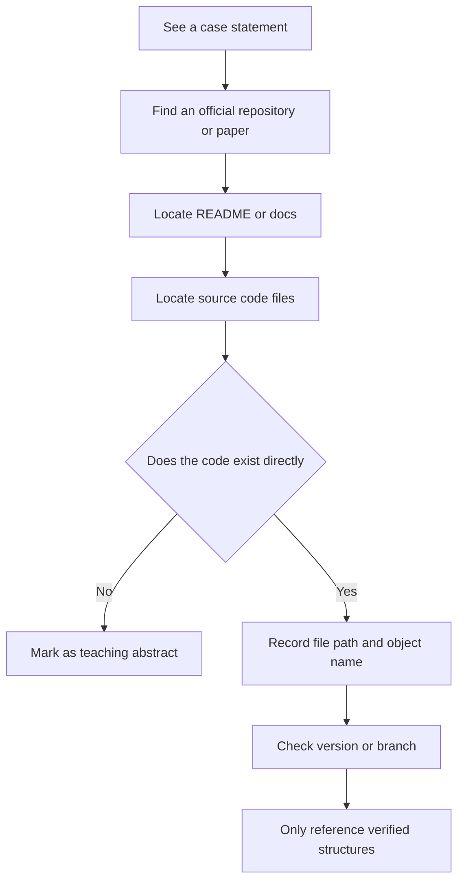
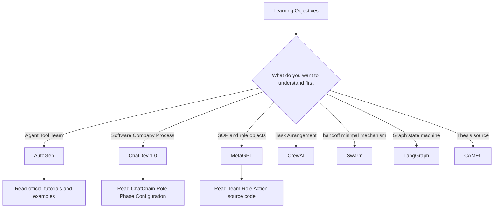

# 11. Framework and project map: only keep verifiable entries

> This chapter is based on official projects, papers, documents and source code anchors; the teaching abstracts will be clearly marked and will not be used as a framework to implement facts.

When learning the multi-agent framework, examples that "look like official code" cannot be directly regarded as implementation facts. This chapter first gives the verification method, and then compares the public structure and applicable learning objectives of each framework.


## 1. Core terms for multi-agent framework selection

When you first encounter the terms below, use these working definitions as a quick reference; later sections cover their properties and engineering implications.

| Term | Working definition | Key idea |
|---|---|---|
| Framework | Framework | Engineering projects that provide orchestration abstractions for agents, tools, teams, or states. |
| Source anchor | Source code anchor | A public file, class name, function or document location that can directly verify the statement. |
| Handoff | Control handover | A lightweight agent switching method emphasized by frameworks such as Swarm. |
| State graph | State graph | LangGraph and other systems use nodes and edges to express process control methods. |


<!-- learning-path:start -->
<div class="learning-path">
<div class="learning-path-title">How to study this chapter</div>
<div class="learning-path-step"><span>1</span><div> Start by mastering the framework terminology and follow it from the saying to official repositories, documentation, papers, and source code anchors (Section 1). </div></div>
<div class="learning-path-step"><span>2</span><div> Then read the official entrance, core objects and verifiable structures of the seven public frameworks (sections 2 to 8). </div></div>
<div class="learning-path-step"><span>3</span><div>Finally, arrange the reading order according to the learning objectives, and use unified norms to distinguish framework facts and teaching abstractions (sections 9-10). </div></div>
</div>
<!-- learning-path:end -->

---

### 1.1 Fact-checking process for public projects

This picture closely follows the verification rules of this chapter and explains how to trace from the statement to the warehouse, documents and source code.




When reading the picture, pay attention to: If you cannot find the direct code anchor, it must be marked as a teaching abstract.


- Only content from public repositories, official documents or papers is marked as real cases.
- Code that has not been verified will not be written as "framework sample code".
- If it is a teaching abstract, it will be clearly stated that it is not the original project code.

## 2. AutoGen: Agent, Tool and Team structure

This section examines AutoGen's Agent, Tool, Team, and termination conditions, focusing on confirming the responsibilities of these objects in official documentation and public import paths.


Public sources:

- Documentation: https://microsoft.github.io/autogen/stable/user-guide/agentchat-user-guide/tutorial/agents.html
- Teams: https://microsoft.github.io/autogen/stable/user-guide/agentchat-user-guide/tutorial/teams.html
- Literature Review Example: https://microsoft.github.io/autogen/stable/user-guide/agentchat-user-guide/examples/literature-review.html
- Warehouse: https://github.com/microsoft/autogen

Core objects in the AutoGen AgentChat documentation include:

| Object | Official Meaning |
|---|---|
| `AssistantAgent` | Built-in assistant Agent, which can bind models and tools |
| `FunctionTool` | Wrapping Python functions into tools |
| `RoundRobinGroupChat` | Let a group of Agents collaborate in turns |
| `SelectorGroupChat` | Use selector to determine next speaker |
| `TextMentionTermination` | Text matching termination condition |

The minimal structure from the official Agents tutorial contains these imports:

```python
from autogen_agentchat.agents import AssistantAgent
from autogen_ext.models.openai import OpenAIChatCompletionClient
```

<div class="code-explanation">
<div class="code-explanation-title">Python code description</div>
<p><strong> Purpose: </strong> shows the public import path of agents and OpenAI model clients in AutoGen. <strong> execution process: </strong><code>AssistantAgent</code> carries roles and tools, <code>OpenAIChatCompletionClient</code> provides model calling implementation. <strong> Key points: </strong> This only proves module boundaries. When creating an instance, life cycle management such as model name, credentials, and client shutdown are also required. </p>
</div>


The rotating team structure in the official Teams tutorial includes:

```python
from autogen_agentchat.teams import RoundRobinGroupChat
from autogen_agentchat.conditions import TextMentionTermination
```

<div class="code-explanation">
<div class="code-explanation-title">Python code description</div>
<p><strong> Purpose: </strong> Demonstrates that AutoGen team orchestration and stopping conditions are independent components. <strong> Execution process: </strong><code>RoundRobinGroupChat</code> determines the order of participants' turns, <code>TextMentionTermination</code> determines the end by specifying text. <strong>Key points: </strong>After objectifying the termination logic, you can combine more conditions such as round number, token or manual stop. </p>
</div>


The reason why AutoGen is suitable for teaching is that it breaks down three problems very clearly:

1. How Agent receives messages and calls tools.
2. How Tool changes from a normal function to a selectable action of the model.
3. How Team controls the speaking order and stop conditions of multiple Agents.

## 3. ChatDev: Software company-style multi-Agent architecture

This section examines the virtual software company structure of ChatDev 1.0, focusing on role configuration, ChatChain, Phase and running products.


Public sources:

- Current warehouse: https://github.com/OpenBMB/ChatDev
- 1.0 branch: https://github.com/OpenBMB/ChatDev/tree/chatdev1.0
- Paper: https://arxiv.org/abs/2307.07924
- Key configuration:
  - `CompanyConfig/Default/ChatChainConfig.json`
  - `CompanyConfig/Default/RoleConfig.json`
  - `CompanyConfig/Default/PhaseConfig.json`

The real structure of ChatDev 1.0 is:

<div class="concept-card">
<div class="concept-line">Framework map</div>
<div class="concept-line"> → AutoGen: Official abstraction for learning Agent, Tool, and Team </div>
<div class="concept-line"> → ChatDev: Learning software company-style stage chain </div>
<div class="concept-line"> → MetaGPT: Learn SOP, Team, Role, Action</div>
<div class="concept-line"> → CrewAI: Learning Agent, Task, Crew, Process</div>
<div class="concept-line"> → Swarm: Learning lightweight handoff (Handoff) </div>
<div class="concept-line"> → LangGraph: Learning state graph (State graph) style arrangement </div>
<div class="concept-line"> → CAMEL: Learn role-playing collaborative thinking </div>
</div>

ChatDev's current README also states that ChatDev 2.0/DevAll has evolved from an early specialized software development multi-Agent system to a more general multi-Agent orchestration platform; the classic 1.0 version is retained in the `chatdev1.0` branch.

This project is suitable for learning:

- Configuration-driven multi-Agent process.
- How to separate role prompts and stage prompts.
- Why you need to save running logs, configurations and final products.

## 4. MetaGPT: SOP-driven software team

This section examines the Team, Role, Action and message environment of MetaGPT, focusing on observing how SOP enters the objects and operating processes of the software team.


Public sources:

- Warehouse: https://github.com/FoundationAgents/MetaGPT
- Paper: https://arxiv.org/abs/2308.00352
- Key source code:
  - `metagpt/software_company.py`
  - `metagpt/team.py`
  - `metagpt/roles/product_manager.py`
  - `metagpt/roles/engineer.py`

The official usage given by MetaGPT README includes:

```python
from metagpt.software_company import generate_repo
repo = generate_repo("Create a 2048 game")
```

<div class="code-explanation">
<div class="code-explanation-title">Python code description</div>
<p><strong> Purpose: </strong> displays the high-level software warehouse generation entrance exposed by MetaGPT. <strong>Execution process:</strong>One sentence 2048 game requirements enter <code>generate_repo()</code>, internally the product, architecture and engineering roles collaborate according to SOP and return the warehouse results. <strong>Key points: </strong>It represents the SOP driven line, which is different from the control method of the free conversational team. </p>
</div>


`generate_repo()` in the source code will create `Team` and hire roles such as `TeamLeader`, `ProductManager`, `Architect`, `Engineer2`, `DataAnalyst`, etc.

In order to establish an overall understanding first, MetaGPT can be compressed into the following object relationships:

<div class="concept-card">
<div class="concept-line">Team</div>
<div class="concept-line">  -&gt; Role</div>
<div class="concept-line">      -&gt; Action</div>
<div class="concept-line">      -&gt; watch message types</div>
<div class="concept-line">  -&gt; Environment</div>
<div class="concept-line">  -&gt; SOP</div>
</div>

It is suitable for learning:

- How to encode organizational processes into objects.
- How to bind characters and actions.
- How to let different roles collaborate through the messaging environment.

## 5. CrewAI: Crew, Agent, Task and Process

This section examines CrewAI's Crew, Agent, Task, and Process, focusing on how task owners, dependencies, and execution processes are explicitly modeled.


Public sources:

- Documentation: https://docs.crewai.com/en/concepts/crews
- Warehouse: https://github.com/crewAIInc/crewAI

The CrewAI documentation defines crew as a group of Agents that collaborate to complete tasks. The official concept page lists important properties of `Crew`:

| Properties | Meaning |
|---|---|
| `agents` | Agent list in crew |
| `tasks` | Task list to be executed by crew |
| `process` | Task execution process, such as sequential or hierarchical |
| `memory` | Whether to enable memory |
| `cache` | Whether to enable tool result caching |
| `planning` | Whether to enable planning |
| `knowledge_sources` | crew accessible knowledge source |
| `step_callback` | Callback after each step |
| `task_callback` | Callback after each task is completed |

The official documentation gives two creation methods:

- YAML configuration method.
- Define Agent, Task, and Crew directly with code.

CrewAI is suitable for learning "task orchestration" multi-Agent because it treats Task as a first-class object instead of modeling it only around chat messages.

## 6. OpenAI Swarm: Lightweight Handoff mechanism

This section examines OpenAI Swarm's Agent and Handoff, focusing on understanding how control is transferred between agents through function return values, and the project's clearly stated boundaries for educational use.


Public sources:

- Warehouse: https://github.com/openai/swarm

The Swarm README clearly states that it is an experimental and educational project, and prompts that the OpenAI Agents SDK should be used for production purposes.

Swarm has very few core abstractions:

| Abstract | Meaning |
|---|---|
| `Agent` | Executor with instructions and functions |
| handoff | An Agent returns another Agent through a function and hands over control |
| run loop | Get completion, execute tools, switch Agents, update context variables |

The minimal handoff structure in the README is:

```python
from swarm import Swarm, Agent
```

<div class="code-explanation">
<div class="code-explanation-title">Python code description</div>
<p><strong> Purpose: </strong> Demonstrates the two minimal public abstractions of OpenAI Swarm. <strong> Execution process: </strong><code>Agent</code> Define roles, instructions and functions, <code>Swarm</code> The client runs the message and completes handoff according to the function return value. <strong>Key points: </strong>Swarm warehouse is positioned as an educational experimental framework, and production selection should be combined with its official status and subsequent program evaluation. </p>
</div>


Then switch control via a function returning another `Agent`. This case is suitable for learning the minimal concept of "handoff", but it should not be used as a production framework selection suggestion.

## 7. CAMEL: Role-playing collaboration

This section examines CAMEL's role-playing collaboration method, focusing on understanding how role setting, task prompts, and dialogue processes form cooperative behaviors.


Public sources:

- Paper: https://arxiv.org/abs/2303.17760
- Project: https://github.com/camel-ai/camel

The representative contribution of CAMEL is role-playing autonomous cooperative agents: by setting roles, tasks and dialogue constraints for two or more Agents, let them continuously collaborate around the task.

This page does not excerpt the CAMEL source code because there is no implementation file to verify the specific version line by line. Its place in this tutorial is the entrance to papers and ideas:

- Role play.
- Mission statement.
- Multi-Agent dialogue.
- Collaborative problem solving.

## 8. LangGraph: Graph state machine-style Agent orchestration

This section examines LangGraph's states, nodes, and conditional edges, focusing on understanding how branches, loops, checkpoints, and human intervention are expressed as explicit control flow.


Public sources:

- Documentation: https://langchain-ai.github.io/langgraph/
- Warehouse: https://github.com/langchain-ai/langgraph

LangGraph is often used to build Agent workflows into graphs: nodes represent steps, edges represent state transitions, and state objects are passed between nodes.

This page does not include LangGraph sample code because the code in the previous version does not directly correspond to the verified official snippet. When learning, it is recommended to start directly from the official quickstart and examples, and focus on observing:

- state schema；
- node function；
- edge / conditional edge；
- compile；
- invoke / stream。

## 9. Learning sequence of multi-agent framework

After comparing the frameworks one by one, you should no longer rank the projects by popularity, but choose the entry based on the collaboration issues you want to understand. The roadmap and table below map the learning objectives to the most direct public objects.


### 9.1 Multi-agent framework learning route

This picture is placed in front of the framework selection table to map learning objectives to specific project entries.




When reading pictures, focus on the following: When choosing a framework, look at the learning objectives first, rather than looking at popularity or star count.


| Goal | Recommended to read first | Reason |
|---|---|---|
| Want to understand Agent + Tool + Team | AutoGen | The official tutorial has clear levels and the examples can be run |
| Want to understand the software development company-style process | ChatDev 1.0 | Roles, stages, and configurations are very intuitive |
| Want to understand how to code SOP | MetaGPT | Team / Role / Action abstract and obvious |
| Want to understand task orchestration | CrewAI | Task is a first-class object |
| Want to understand the minimal mechanism of handoff | Swarm | Less abstract, suitable for dismantling concepts |
| Want to understand graph control flow | LangGraph | State and edge explicit |
| Want to understand the source flow of multi-agent papers | CAMEL | Clear role-playing paradigm |

After selecting the framework, it is also necessary to explain whether the judgments in the table come from official facts or teaching induction. The next section gives unified annotation rules to avoid "suitable for learning a certain concept" from being mistakenly written as "officially implemented according to this teaching structure."

---

## 10. Annotation specifications for frame facts and teaching abstractions

Framework facts should be able to locate official documents, warehouse files, source code objects or papers; teaching pseudocode and architecture diagrams can only illustrate concepts and must be clearly marked as teaching abstractions.

When citing, record at least the project name, version or branch, file path, and verification date. If it can only be confirmed that "the design style is similar", it cannot be written as "the source code is directly implemented in this way". The purpose of this chapter is to provide a verifiable entry point, not to replace verification of the current official implementation.

---

<!-- chapter-check:start -->
## 11. Multi-agent framework structure and selection self-test
<div class="chapter-check">
<div class="chapter-check-title"> Without reading the text, try to answer </div>
<ul>
<li> Can you find three types of evidence: official documents, warehouses and source code objects for a framework statement? </li>
<li> Can you compare frameworks by dialog, SOP, task, handoff and statechart? </li>
<li> Can you tell clearly whether a certain piece of content is a primitive implementation or a teaching abstraction? </li>
</ul>
</div>
<!-- chapter-check:end -->

After completing the self-examination, proceed to the next chapter **⑫ Learning Route and Reference**: Organize exercises, acceptance and verifiable sources according to design, engineering and research goals.
