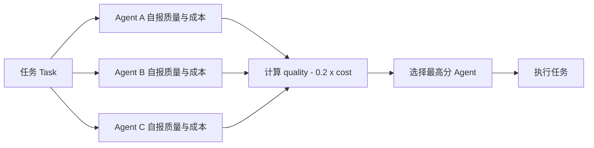
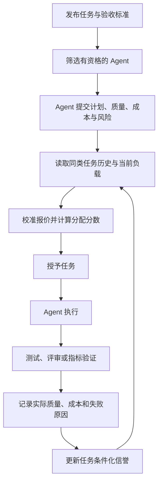
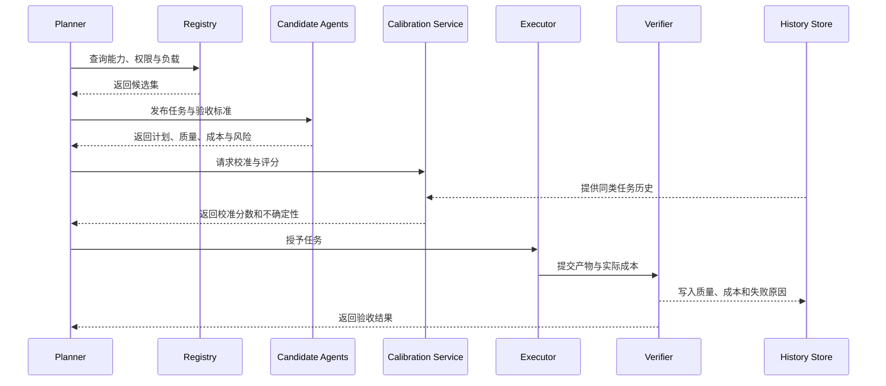

# 专题：多智能体任务拍卖与市场式分配

> 本专题从“质量减成本”的简单评分函数出发，逐步回答三个问题：Agent 会不会夸大能力，质量与成本怎样校准，历史表现应不应该进入分配规则。重点不是把所有路由都包装成拍卖，而是看清启发式评分、信誉路由和激励相容机制之间的边界。

## 学习准备：先认清本页术语

| 英文术语 | 中文说法 | 在本页中的含义 |
|---|---|---|
| Market-based allocation | 市场式分配 | 让多个候选执行者提交报价，再根据明确规则分配任务。 |
| Bid | 报价 | Agent 对任务提交的能力、计划、成本或完成时间声明。 |
| Reverse auction | 反向拍卖 | 多个执行者竞争承接任务，通常由请求方选择成本和质量更合适的执行者。 |
| Mechanism design | 机制设计 | 通过分配规则、支付和反馈，让参与者在追求自身利益时仍产生期望的系统结果。 |
| Incentive compatibility | 激励相容 | 让诚实报告成为参与者的最优或至少不劣策略。 |
| DSIC | 占优策略激励相容 | 无论其他参与者怎样行动，诚实报告都是最优策略。 |
| Reputation | 信誉 | 根据已完成任务的真实结果形成的历史能力估计。 |
| Calibration | 校准 | 让“预计质量 0.8”在长期统计上接近约 80% 的真实成功概率。 |
| UCB | 置信上界 | 在选择高表现 Agent 的同时，为样本较少的新 Agent 保留探索机会。 |

<!-- learning-path:start -->
<div class="learning-path">
<div class="learning-path-title">本页怎么学</div>
<div class="learning-path-step"><span>1</span><div>先判断原来的评分函数究竟是拍卖，还是只有拍卖外形的路由器。</div></div>
<div class="learning-path-step"><span>2</span><div>再分别处理能力虚报、质量成本校准和历史信誉三个问题。</div></div>
<div class="learning-path-step"><span>3</span><div>最后把近期论文中的机制组合成可验证、可审计的工程流程。</div></div>
</div>
<!-- learning-path:end -->

---

## 1. 先定位原代码：它是启发式评分，不是完整拍卖

<p>这段代码已经完成了什么，还缺少哪些条件才可以称为真正的任务拍卖？</p>
</div>

原始示例把候选 Agent 的预期质量和预期成本压成一个效用分数：

```python
class Bid(BaseModel):
    agent: str
    expected_quality: float
    expected_cost: float
    reason: str

def allocate(task, bids: list[Bid]) -> str:
    def utility(bid: Bid):
        return bid.expected_quality - 0.2 * bid.expected_cost
    return max(bids, key=utility).agent
```

<div class="code-explanation">
<div class="code-explanation-title">Python 代码说明</div>
<p><strong>用途：</strong>用一个可解释的质量—成本函数，从多个候选中选出执行者。<strong>执行过程：</strong>每个 <code>Bid</code> 提交预期质量和成本，<code>allocate()</code> 计算分数并选择最大值。<strong>关键点：</strong><code>task</code> 没有参与计算，报价也没有经过验证，因此它属于启发式路由基线，而不是能够约束策略性虚报的完整拍卖。</p>
</div>

### 图文对照：当前评分函数实际做了什么



读图时重点看：任务本身、历史表现和执行后的验证都没有进入评分闭环。

它已经具备两个有价值的教学元素：

- Agent 不是由固定规则直接指定，而是先提交候选信息。
- 分配规则显式表达质量与成本之间的取舍。

但它缺少完整市场机制通常需要的环节：

| 缺少的环节 | 当前后果 |
|---|---|
| 任务—能力匹配 | 同一个 Agent 对代码、研究和安全任务会得到同样的质量分。 |
| 报价校验 | Agent 可以误报或高估质量，低报成本。 |
| 履约验证 | 任务完成后没有测试或评审判断报价是否兑现。 |
| 历史更新 | 一次失败不会影响下一次中标概率。 |
| 容量与负载 | 已经繁忙的 Agent 仍可能继续中标。 |
| 支付或惩罚规则 | 诚实报告不一定比夸大报告更有利。 |

因此，更准确的名称是：**基于报价字段的效用路由器（bid-informed utility router）**。

---

## 2. 完整的任务市场要形成闭环

<p>一个任务从发布到完成，哪些信息必须被记录，才能让下一次分配比这一次更可靠？</p>
</div>

市场式分配的基础可以追溯到 Reid G. Smith 在 1980 年提出的 [Contract Net Protocol（合同网协议）](https://doi.org/10.1109/TC.1980.1675516)。它把任务分配写成协商过程：管理者发布任务，潜在执行者提交投标，管理者授予合同，执行者完成任务并返回结果。

放到 LLM 多智能体系统中，可以扩展成七步：

1. **发布任务**：声明能力要求、截止时间、预算和验收标准。
2. **形成候选集**：只邀请权限、工具和上下文范围匹配的 Agent。
3. **提交报价**：报价不仅包含数字，还包含计划、预计成本和风险。
4. **校准报价**：用历史表现、当前负载和任务相似度修正自报值。
5. **分配任务**：按效用、约束或拍卖规则选出执行者。
6. **验证履约**：通过测试、评审或环境指标判断实际质量与成本。
7. **更新信誉**：把预测误差和真实结果写回下一轮分配模型。

### 图文对照：从一次报价到下一次更可靠的报价



读图时重点看：真正的市场分配不是在“选出 Agent”时结束，而是在真实结果回写信誉后才闭环。

---

## 3. 问题一：Agent 会不会夸大自己能力

<p>怎样区分“为了中标而策略性虚报”和“模型本身没有校准好造成的过度自信”？</p>
</div>

答案是：**会，但要区分两种原因。**

### 3.1 策略性虚报

如果 Agent 的目标是尽量获得任务或奖励，而中标概率随 <code>expected_quality</code> 上升，那么它有动机把质量报高、成本报低。当前代码没有惩罚未兑现报价，因此夸大是一个占优的短期策略。

这属于机制设计问题。近期的 [STAR：Truthful and Cost-Minimizing Model Routing in Graph-Based Agentic Workflows](https://openreview.net/forum?id=SHuTHWYwp7) 把模型路由建模为依赖图上的反向拍卖，并以 DSIC 为目标处理真实报价和上下文转移成本。该页面目前标注为 ACL ARR 2026 投稿，适合作为前沿机制参考，不应写成已经成为行业标准。

### 3.2 非策略性高估

即使所有 Agent 都合作，LLM 也可能因为任务理解不足、上下文缺失或自信度未校准而高估成功概率。此时没有“欺骗意图”，但分配结果同样会变差。

[Self-Resource Allocation in Multi-Agent LLM Systems](https://arxiv.org/abs/2504.02051) 的结果说明，向 Planner 提供显式 Worker 能力信息，尤其在存在较弱 Worker 时，能够改善分配。这支持一个工程原则：**不要让 Agent 只靠一句自然语言自我介绍能力。**

### 3.3 三层防线

| 防线 | 解决什么问题 | 示例 |
|---|---|---|
| 执行前校准 | 修正自报质量和成本 | 同类任务成功率、实际 token、当前队列长度 |
| 执行后验证 | 判断报价是否兑现 | 单元测试、引用核验、安全评审、延迟记录 |
| 机制约束 | 降低策略性虚报收益 | 反向拍卖、支付规则、信誉损失、保证金或惩罚 |

其中前两层适合普通协作型 Agent；只有当 Agent 具有独立收益、跨组织交易或真实付款时，才需要进一步讨论严格激励相容。

---

## 4. 问题二：质量和成本怎样校准

<p>什么样的质量与成本字段能够被真实结果验证，而不是停留在 Agent 的主观判断？</p>
</div>

第一步不是调整权重，而是让任务和 Agent 都有可比较的数据结构。下面代码是**基于论文问题设置写出的教学实现，不是任何论文仓库的原始代码**。

```python
from pydantic import BaseModel, Field

class TaskProfile(BaseModel):
    task_id: str
    task_type: str
    required_capabilities: set[str]
    quality_target: float = Field(ge=0.0, le=1.0)
    budget_usd: float = Field(gt=0.0)
    deadline_seconds: int = Field(gt=0)

class AgentProfile(BaseModel):
    agent_id: str
    capabilities: set[str]
    active_tasks: int
    max_parallel_tasks: int

class CalibratedBid(BaseModel):
    agent_id: str
    proposed_plan: str
    reported_quality: float = Field(ge=0.0, le=1.0)
    reported_cost_usd: float = Field(gt=0.0)
    historical_quality: float = Field(ge=0.0, le=1.0)
    cost_error_ratio: float = Field(ge=0.0)
    evidence_count: int = Field(ge=0)
```

<div class="code-explanation">
<div class="code-explanation-title">Python 代码说明</div>
<p><strong>用途：</strong>把任务要求、Agent 容量和报价证据分开保存。<strong>执行过程：</strong><code>TaskProfile</code> 定义任务约束，<code>AgentProfile</code> 表示能力与负载，<code>CalibratedBid</code> 同时保留自报值和历史观测。<strong>关键点：</strong>这是教学实现；字段设计综合了能力感知分配、信誉和成本校准问题，不声称直接复制自某篇论文。</p>
</div>

### 4.1 质量必须由任务类型决定

不能给一个 Agent 只有一个全局质量分。更合理的是维护条件化估计：

| 任务类型 | 可验证质量信号 |
|---|---|
| 代码修复 | 测试通过率、回归缺陷、评审阻塞项 |
| 资料研究 | 有效引用率、事实核验通过率、覆盖度 |
| 安全评审 | 高风险问题召回率、误报率、人工复核结果 |
| 数据分析 | 指标重算一致性、统计检验正确性、结论可复现性 |

因此应该估计 <code>P(success | task_type, agent, context)</code>，而不是只保存 <code>agent.quality = 0.8</code>。

### 4.2 成本使用实测值

成本至少包括：

- 模型输入与输出 token 费用。
- 工具调用费用和执行时间。
- 失败重试成本。
- Agent 交接产生的上下文转移成本。
- 并行占用和等待造成的延迟。

STAR 特别把图工作流中的上下文转移外部性纳入成本，这提醒我们：换一个便宜模型不一定真的便宜，如果它需要重新读取大量上下文。

### 4.3 一个可解释的校准评分

```python
def allocation_score(task: TaskProfile, agent: AgentProfile, bid: CalibratedBid) -> float:
    if not task.required_capabilities <= agent.capabilities:
        return float("-inf")
    if agent.active_tasks >= agent.max_parallel_tasks:
        return float("-inf")

    confidence = min(1.0, bid.evidence_count / 20)
    calibrated_quality = (
        confidence * bid.historical_quality
        + (1 - confidence) * bid.reported_quality
    )
    expected_cost = bid.reported_cost_usd * (1 + bid.cost_error_ratio)
    budget_ratio = expected_cost / task.budget_usd

    return 0.65 * calibrated_quality - 0.25 * budget_ratio - 0.10 * bid.cost_error_ratio
```

<div class="code-explanation">
<div class="code-explanation-title">Python 代码说明</div>
<p><strong>用途：</strong>在原始质量减成本公式上加入能力门槛、容量门槛、历史证据和成本误差。<strong>执行过程：</strong>缺少必要能力或已经满载的 Agent 先被排除；历史样本越多，质量估计越依赖真实表现；经常低报成本的 Agent 会被提高预计成本并额外扣分。<strong>关键点：</strong>0.65、0.25、0.10 都是教学权重，必须通过离线评测和真实运行数据校准，不能直接作为通用生产参数。</p>
</div>

[Scaling Small Agents Through Strategy Auctions（SALE）](https://openreview.net/forum?id=elXuA5wTWV)与这里最接近：Agent 用解决计划作为 Bid，由中央机制评估成本与预期价值，并通过共享拍卖记忆改进后续判断。该页面目前是 ICML 2026 公开投稿，因此引用时应写“提出/报告”，不要写成已经被广泛验证的定论。

---

## 5. 问题三：历史表现是否应该成为权重

<p>怎样使用历史表现，又不让旧 Agent 永久垄断任务、新 Agent 永远得不到机会？</p>
</div>

答案是：**应该使用，但必须同时保存任务范围、时间和不确定性。**

历史信誉至少需要四个维度：

| 维度 | 原因 |
|---|---|
| 按任务类型分桶 | 会写代码不等于会做安全审查。 |
| 时间衰减 | 模型版本、工具和知识都会变化。 |
| 样本数量 | 1 次成功的 100% 与 100 次成功的 90% 可信度不同。 |
| 预测误差 | 经常低估成本或高估质量应降低报价可信度。 |

[DRF: LLM-AGENT Dynamic Reputation Filtering Framework](https://arxiv.org/abs/2509.05764)提出动态信誉过滤，用交互评分估计 Agent 的诚实度和能力，并结合 UCB 进行选择。它不是拍卖机制，但直接适合回答“历史表现怎样进入候选筛选”。

下面仍是教学实现，用 Beta 后验均值表示成功率，用 UCB 奖励表示不确定性探索：

```python
from dataclasses import dataclass
from math import log, sqrt

@dataclass
class PerformanceStats:
    successes: int = 0
    failures: int = 0

    @property
    def trials(self) -> int:
        return self.successes + self.failures

    def posterior_mean(self) -> float:
        return (self.successes + 1) / (self.trials + 2)

    def exploration_bonus(self, total_trials: int) -> float:
        if self.trials == 0:
            return 1.0
        return sqrt(2 * log(max(2, total_trials)) / self.trials)

def reputation_score(stats: PerformanceStats, total_trials: int, beta: float = 0.15) -> float:
    return stats.posterior_mean() + beta * stats.exploration_bonus(total_trials)
```

<div class="code-explanation">
<div class="code-explanation-title">Python 代码说明</div>
<p><strong>用途：</strong>让历史成功率和新 Agent 的探索机会同时影响分配。<strong>执行过程：</strong><code>posterior_mean()</code> 避免少量样本直接得到 0 或 1 的极端信誉，<code>exploration_bonus()</code> 给样本较少者更大的探索加分。<strong>关键点：</strong>这是说明 Beta 平滑与 UCB 思想的教学代码；真实系统还需按任务类型分桶、加入时间衰减，并把质量从单一成功/失败扩展为多维指标。</p>
</div>

### 5.1 为什么不能只看历史平均值

只看平均成功率会出现三个问题：

- **冷启动锁死**：新 Agent 没有历史，只能得到默认低分。
- **强者垄断**：早期领先者获得更多任务，数据越来越多，其他 Agent 无法证明自己。
- **任务漂移**：Agent 在旧版本、旧工具和旧任务上的成绩被错误用于当前环境。

因此，历史表现应当是“带范围和不确定性的证据”，不是固定等级。

### 5.2 近期市场平台怎样处理历史信息

[Agent Exchange（AEX）](https://openreview.net/forum?id=2on6M4DRey)在 ICLR 2026 Workshop 页面中提出 Agent-Side Platform，用于能力表示和表现追踪，并由中央拍卖引擎进行多级竞争选择。这可以作为“能力注册—历史追踪—竞价分配”的系统架构参考。

[Towards Transparent and Incentive-Compatible Collaboration in Decentralized LLM Multi-Agent Systems](https://arxiv.org/abs/2509.16736)把信誉、能力匹配和工作负载一起用于任务分配，并用智能合约记录动态信誉。它适合研究开放式、跨组织 Agent 市场，但区块链不是普通企业内部路由的必要条件。

---

## 6. 近期论文与本节问题的对应关系

<p>哪些资料直接研究任务分配，哪些只提供信誉或机制设计背景？</p>
</div>

| 资料 | 时间与状态 | 直接回答的问题 | 使用时的边界 |
|---|---|---|---|
| [Self-Resource Allocation in Multi-Agent LLM Systems](https://arxiv.org/abs/2504.02051) | 2025，arXiv；另有 ICLR 2026 投稿页 | 能力信息怎样改善任务分配 | 重点是 Planner/Orchestrator 与资源分配，不是严格拍卖 |
| [DRF: Dynamic Reputation Filtering](https://arxiv.org/abs/2509.05764) | 2025，arXiv | 历史表现、诚实度和能力怎样进入选择 | 是信誉过滤和 UCB 选择，不是支付机制 |
| [Scaling Small Agents Through Strategy Auctions](https://openreview.net/forum?id=elXuA5wTWV) | 2026，ICML 公开投稿 | 计划如何作为 Bid，怎样用成本—价值与共享记忆分配 | 结果来自公开投稿，应注明状态 |
| [Agent Exchange](https://openreview.net/forum?id=2on6M4DRey) | 2026，ICLR Workshop | Agent 市场需要哪些平台组件与表现追踪 | 工作坊论文，偏平台架构与实证 |
| [STAR](https://openreview.net/forum?id=SHuTHWYwp7) | 2026，ACL ARR 投稿 | 反向拍卖、真实报价和上下文转移成本 | 前沿投稿，不应表述为已成熟标准 |
| [Mechanism Design for Large Language Models](https://arxiv.org/abs/2310.10826) | 2023 预印本，论文发表于 WWW 2024 | 怎样讨论激励相容、单调性和二价规则 | 研究多个偏好方影响生成内容，不是任务承包分配 |
| [Contract Net Protocol](https://doi.org/10.1109/TC.1980.1675516) | 1980，IEEE Transactions on Computers | 任务发布、协商、投标和授予的基础结构 | 不是 LLM 论文，但仍是任务市场的概念源头 |

### 6.1 最适合当前章节的阅读顺序

1. 先读 Contract Net，理解任务市场的最小协议。
2. 再读 Self-Resource Allocation，理解能力信息为什么要进入分配。
3. 接着读 DRF，理解历史信誉和探索。
4. 再读 SALE 与 AEX，理解计划报价、拍卖记忆和市场平台。
5. 最后读 STAR 与 Mechanism Design for LLMs，进入激励相容和支付规则。

---

## 7. 从启发式评分升级到生产流程

<p>如果暂时不实现复杂支付机制，最小可用的工程升级顺序是什么？</p>
</div>

### 图文对照：生产级任务分配的组件关系



读图时重点看：Agent Registry（注册表）、Calibration Service（校准服务）和 Verifier（验证器）分别承担候选筛选、报价修正和履约验证，不能全部交给竞标 Agent 自己完成。

推荐按下面四级逐步实现：

| 级别 | 实现内容 | 何时足够 |
|---|---|---|
| L0 启发式 | 自报质量减成本 | 封闭、合作、低风险教学环境 |
| L1 能力感知 | 任务类型、工具权限、容量门槛 | 企业内部固定 Agent 团队 |
| L2 信誉校准 | 历史质量、成本误差、时间衰减、探索 | 长期运行且 Agent 表现不同的系统 |
| L3 机制设计 | 反向拍卖、支付、惩罚、DSIC | 跨组织交易或 Agent 有独立经济利益 |

不要一开始就实现 L3。多数内部多 Agent 系统先把 L1、L2 和履约验证做好，收益通常比设计复杂付款规则更直接。

---

## 8. 实现与评测清单

<p>怎样证明新的市场式分配真的优于固定路由，而不是只让系统变得更复杂？</p>
</div>

### 输入与协议

- 任务是否声明类型、能力需求、预算、截止时间和验收标准？
- Bid 是否包含计划、预计质量、成本、风险和依据？
- 是否保留未校准的原始报价，便于审计预测误差？

### 分配与安全

- 能力和权限不匹配的 Agent 是否在评分前被排除？
- 当前负载和最大并发是否进入候选筛选？
- 高风险任务是否可以绕过市场直接转人工或专门角色？

### 履约与信誉

- 是否记录预计质量与实际质量的差值？
- 是否记录预计成本与实际成本的差值？
- 历史是否按任务类型、模型版本和时间范围分桶？
- 是否为新 Agent 保留有限探索机会？

### 对照评测

至少比较四个基线：

1. 固定分配给最强 Agent。
2. 轮询分配。
3. 只看自报质量减成本。
4. 能力过滤加历史校准。

指标至少包括任务成功率、每次成功成本、P95 延迟、路由错误率、报价校准误差和高风险误分配次数。

---

<!-- chapter-check:start -->
## 专题自检

<div class="chapter-check">
<div class="chapter-check-title">不看正文，尝试回答</div>
<ul>
<li>为什么原来的 <code>quality - 0.2 * cost</code> 只能称为启发式分配，而不能保证诚实报价？</li>
<li>怎样分别测量代码、研究和安全任务的真实质量？</li>
<li>为什么历史信誉必须带任务范围、时间和样本不确定性？</li>
<li>SALE、DRF、STAR 分别主要解决计划报价、信誉选择和激励相容中的哪一部分？</li>
<li>在封闭企业团队中，为什么通常应该先实现能力过滤、履约验证和信誉校准？</li>
</ul>
</div>
<!-- chapter-check:end -->

---

## 9. 一句话收束

市场式任务分配的关键不是让 Agent “报一个价”，而是让**任务要求、报价、历史证据、分配规则、实际结果和信誉更新形成可验证闭环**。当 Agent 具有独立经济利益时，再进一步使用反向拍卖和激励相容机制约束策略性虚报。
