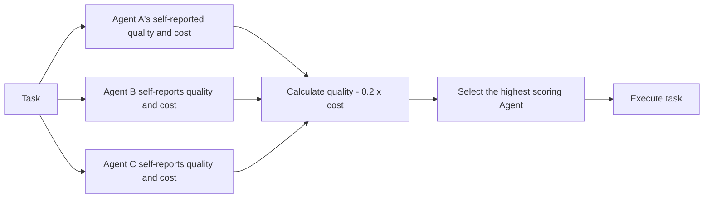
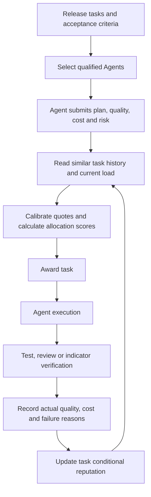
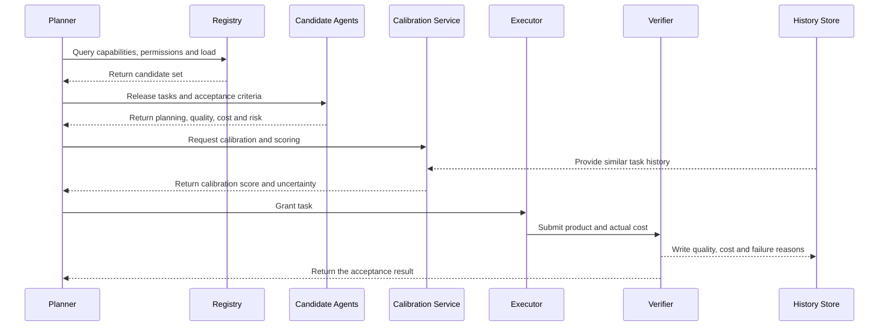

# Special topic: Multi-agent task auction and market-based allocation

> This topic starts from the simple scoring function of "quality minus cost" and gradually answers three questions: will the agent exaggerate its capabilities, how to calibrate quality and cost, and whether historical performance should enter the allocation rules. The point is not to wrap all routing into auctions, but to see the boundaries between heuristic scoring, reputation routing, and incentive compatibility mechanisms.

## Study preparation: First understand the terms on this page

| English terms | Chinese terms | Meaning on this page |
|---|---|---|
| Market-based allocation | Market-based allocation | Let multiple candidate executors submit quotations, and then allocate tasks according to clear rules. |
| Bid | Quote | Agent's statement of capability, schedule, cost, or completion time for a task submission. |
| Reverse auction | Reverse auction | Multiple executors compete to undertake the task, and the requester usually chooses the executor with more suitable cost and quality. |
| Mechanism design | Mechanism design | Through allocation rules, payments and feedback, participants can still produce desired system results while pursuing their own interests. |
| Incentive compatibility | Make honest reporting the optimal or at least non-inferior strategy for participants. |
| DSIC | Dominant Strategy Incentive Compatibility | No matter how other players act, honest reporting is the optimal strategy. |
| Reputation | Reputation | A historical estimate of capability based on real results from completed tasks. |
| Calibration | Calibration | Makes Expected Mass 0.8 statistically close to a true probability of success of about 80% over the long term. |
| UCB | Upper Confidence Bound | While selecting high-performing Agents, retain exploration opportunities for new Agents with fewer samples. |

<!-- learning-path:start -->
<div class="learning-path">
<div class="learning-path-title">How to learn on this page</div>
<div class="learning-path-step"><span>1</span><div> First determine whether the original scoring function is an auction or only an auction-shaped router. </div></div>
<div class="learning-path-step"><span>2</span><div> will then deal with the three issues of capacity false reporting, quality cost calibration and historical reputation respectively. </div></div>
<div class="learning-path-step"><span>3</span><div>Finally combine the mechanisms from recent papers into a verifiable and auditable engineering process. </div></div>
</div>
<!-- learning-path:end -->

---

## 1. Locate the original code first: it is heuristic scoring, not a complete auction

<p> What has this code accomplished, and what conditions are still missing for it to be called a real task auction? </p>
</div>

The original example collapses the expected quality and expected cost of the candidate agent into a utility score:

```python
class Bid(BaseModel):
    agent: str
    expected_quality: float
    expected_cost: float
    reason: str

def allocate(task, bids: list[Bid]) -> str:
    def utility(bid: Bid):
        return bid.expected_quality - 0.2 * bid.expected_cost
    return max(bids, key=utility).agent
```

<div class="code-explanation">
<div class="code-explanation-title">Python code description</div>
<p><strong> Purpose: </strong> Use an interpretable quality-cost function to select executors from multiple candidates. <strong> Execution process: </strong> Each <code>Bid</code> submits the expected quality and cost, <code>allocate()</code> calculates the score and selects the maximum value. <strong>Key points: </strong><code>task</code> does not participate in the calculation and the bid is not verified, so it belongs to the heuristic routing baseline rather than a full auction capable of constraining strategic falsehoods. </p>
</div>

### Picture and text comparison: What the current scoring function actually does



When reading the picture, pay attention to: the task itself, historical performance and post-execution verification do not enter the scoring closed loop.

It already has two valuable teaching elements:

- Agent is not directly specified by fixed rules, but candidate information is submitted first.
- Allocation rules explicitly express the trade-off between quality and cost.

But it lacks the links that a complete market mechanism usually requires:

| Missing Link | Current Consequences |
|---|---|
| Task-Capability Matching | The same Agent will receive the same quality score for code, research, and security tasks. |
| Quotation verification | Agent can misreport or overestimate the quality and underestimate the cost. |
| Performance Verification | There is no testing or review after the task is completed to determine whether the quotation has been fulfilled. |
| History update | One failure will not affect the probability of winning the next bid. |
| Capacity and load | Agents that are already busy may continue to win bids. |
| PAYMENT OR PENALTY RULES | Honest reporting is not necessarily more beneficial than exaggerated reporting. |

Therefore, a more accurate name would be: bid-informed utility router.

---

## 2. A complete task market must form a closed loop

<p> From release to completion of a task, what information must be recorded to make the next assignment more reliable than this one? </p>
</div>

The foundation of market-based allocation can be traced back to [Contract Net Protocol](https://doi.org/10.1109/TC.1980.1675516) proposed by Reid G. Smith in 1980. It writes task allocation as a negotiation process: managers issue tasks, potential performers submit bids, managers award contracts, performers complete tasks and return results.

Put into the LLM multi-agent system, it can be extended to seven steps:

1. **Release Task**: State capability requirements, deadlines, budget, and acceptance criteria.
2. **Form candidate set**: Only invite Agents with matching permissions, tools, and context scopes.
3. **Submit a Quote**: Quotes include not only numbers, but also plans, estimated costs, and risks.
4. **Calibrated Quote**: Correct the self-reported value using historical performance, current load and task similarity.
5. **Assign tasks**: Select executors based on utility, constraints or auction rules.
6. **Verify performance**: Judge actual quality and cost through testing, review or environmental indicators.
7. **Update reputation**: Write the prediction error and true results back to the next round of allocation model.

### Picture and text comparison: From one quotation to the next more reliable quotation



When reading the picture, pay attention to this: the real market allocation does not end when "agent is selected", but the loop is closed after the real results write back the reputation.

---

## 3. Question 1: Will the Agent exaggerate his abilities?

<p>How to distinguish between "strategic false reporting in order to win the bid" and "overconfidence caused by the model itself not being calibrated well"? </p>
</div>

The answer is: **Yes, but two reasons must be distinguished. **

### 3.1 Strategic false alarm

If the Agent's goal is to obtain tasks or rewards as much as possible, and the probability of winning the bid increases with <code>expected_quality</code>, then it has an incentive to report high quality and low cost. The current code does not penalize unfulfilled offers, so exaggeration is a dominant short-term strategy.

This is a mechanism design issue. The recent [STAR: Truthful and Cost-Minimizing Model Routing in Graph-Based Agentic Workflows](https://openreview.net/forum?id=SHuTHWYwp7) models model routing as a reverse auction on a dependency graph and targets DSIC to handle true bids and context transfer costs. This page is currently marked as a submission for ACL ARR 2026. It is suitable as a reference for cutting-edge mechanisms and should not be written as having become an industry standard.

### 3.2 Non-strategic overestimation

Even if all agents cooperate, LLM may overestimate the probability of success due to insufficient task understanding, missing context, or miscalibrated confidence. There is no "deceptive intention" at this time, but the distribution results will still be worse.

The results of [Self-Resource Allocation in Multi-Agent LLM Systems](https://arxiv.org/abs/2504.02051) show that providing explicit worker capability information to the Planner can improve allocation, especially in the presence of weaker workers. This supports an engineering principle: **Don’t let the Agent rely solely on the ability to introduce itself in natural language. **

### 3.3 Three layers of defense

| Line of defense | What problem to solve | Example |
|---|---|---|
| Pre-execution calibration | Corrected self-reported quality and cost | Similar task success rate, actual token, current queue length |
| Post-execution verification | Determine whether the quotation has been honored | Unit testing, reference verification, security review, delay record |
| Mechanism constraints | Reduce strategic misstatement of returns | Reverse auctions, payment rules, reputation losses, margins or penalties |

The first two layers are suitable for ordinary collaborative agents; only when the agent has independent benefits, cross-organization transactions or real payments, further discussion of strict incentive compatibility is needed.

---

## 4. Question 2: How to calibrate quality and cost

<p>What kind of quality and cost fields can be verified by real results instead of remaining in the subjective judgment of the Agent? </p>
</div>

The first step is not to adjust the weights, but to have comparable data structures for both tasks and agents. The following code is a teaching implementation written based on the thesis problem setting, and is not the original code of any thesis repository**.

```python
from pydantic import BaseModel, Field

class TaskProfile(BaseModel):
    task_id: str
    task_type: str
    required_capabilities: set[str]
    quality_target: float = Field(ge=0.0, le=1.0)
    budget_usd: float = Field(gt=0.0)
    deadline_seconds: int = Field(gt=0)

class AgentProfile(BaseModel):
    agent_id: str
    capabilities: set[str]
    active_tasks: int
    max_parallel_tasks: int

class CalibratedBid(BaseModel):
    agent_id: str
    proposed_plan: str
    reported_quality: float = Field(ge=0.0, le=1.0)
    reported_cost_usd: float = Field(gt=0.0)
    historical_quality: float = Field(ge=0.0, le=1.0)
    cost_error_ratio: float = Field(ge=0.0)
    evidence_count: int = Field(ge=0)
```

<div class="code-explanation">
<div class="code-explanation-title">Python code description</div>
<p><strong>Purpose: </strong>Save task requirements, Agent capacity and quotation evidence separately. <strong> Execution process: </strong><code>TaskProfile</code> Define task constraints, <code>AgentProfile</code> Represents capacity and load, <code>CalibratedBid</code> simultaneously retains self-reported values and historical observations. <strong>Key Points: </strong>This is a teaching implementation; the field design incorporates competency-aware assignment, credibility, and cost calibration issues and does not claim to be copied directly from a paper. </p>
</div>

### 4.1 Quality must be determined by task type

You cannot give an Agent only one global quality score. It is more reasonable to maintain conditional estimates:

| Task Type | Verifiable Quality Signal |
|---|---|
| Code repair | Test pass rate, regression defects, review blocking items |
| Data research | Effective citation rate, fact-checking pass rate, coverage |
| Security review | High-risk issue recall rate, false alarm rate, manual review results |
| Data analysis | Consistency of indicator recalculation, correctness of statistical tests, and reproducibility of conclusions |

So <code>P(success | task_type, agent, context)</code> should be estimated instead of just saving <code>agent.quality = 0.8</code>.

### 4.2 Cost uses actual measured values

Costs include at least:

- Model input and output token fees.
- Tool call costs and execution time.
- Cost of failed retry.
-Context transfer cost incurred by Agent handover.
- Delays caused by parallel occupancy and waiting.

STAR specifically factors in the cost of context transfer externalities in graph workflows, which reminds us: switching to a cheaper model is not necessarily cheaper if it requires re-reading a lot of context.

### 4.3 An interpretable calibration score

```python
def allocation_score(task: TaskProfile, agent: AgentProfile, bid: CalibratedBid) -> float:
    if not task.required_capabilities <= agent.capabilities:
        return float("-inf")
    if agent.active_tasks >= agent.max_parallel_tasks:
        return float("-inf")

    confidence = min(1.0, bid.evidence_count / 20)
    calibrated_quality = (
        confidence * bid.historical_quality
        + (1 - confidence) * bid.reported_quality
    )
    expected_cost = bid.reported_cost_usd * (1 + bid.cost_error_ratio)
    budget_ratio = expected_cost / task.budget_usd

    return 0.65 * calibrated_quality - 0.25 * budget_ratio - 0.10 * bid.cost_error_ratio
```

<div class="code-explanation">
<div class="code-explanation-title">Python code description</div>
<p><strong> Purpose: </strong> Adds capability threshold, capacity threshold, historical evidence and cost error to the original quality minus cost formula. <strong>Execution process: </strong> Agents that lack necessary capabilities or are already fully loaded are excluded first; the more historical samples there are, the more the quality estimate depends on the real performance; Agents that often underreport their costs will have their estimated costs increased and additional points deducted. <strong>Key points: </strong>0.65, 0.25, 0.10 are all teaching weights, which must be calibrated through offline evaluation and real operating data, and cannot be directly used as general production parameters. </p>
</div>

[Scaling Small Agents Through Strategy Auctions (SALE)](https://openreview.net/forum?id=elXuA5wTWV) is closest to this: Agent uses the solution plan as a Bid, a central mechanism evaluates the cost and expected value, and improves subsequent judgments through shared auction memory. This page is currently an open submission for ICML 2026, so the citation should be written as "proposed/reported" and should not be written as a conclusion that has been widely verified.

---

## 5. Question 3: Should historical performance be the weight?

<p>How to use historical performance without letting old Agents permanently monopolize tasks and new Agents never get a chance? </p>
</div>

The answer is: ** should be used, but task scope, time and uncertainty must be preserved at the same time. **

Historical credibility requires at least four dimensions:

| Dimension | Reason |
|---|---|
| Bucketing by task type | Being able to write code does not mean being able to do security reviews. |
| Time Decay | Model versions, tools, and knowledge change. |
| Sample size | 100% confidence in 1 success is not the same as 90% confidence in 100 successes. |
| Forecast Error | Frequently underestimating cost or overestimating quality should reduce the credibility of a quote. |

[DRF: LLM-AGENT Dynamic Reputation Filtering Framework](https://arxiv.org/abs/2509.05764) proposes dynamic reputation filtering, uses interaction scoring to estimate the honesty and ability of the Agent, and combines it with UCB for selection. It is not an auction mechanism, but it is directly suitable for answering "how historical performance enters candidate screening".

The following is still the teaching implementation, using Beta posterior mean to represent the success rate and UCB reward to represent uncertainty exploration:

```python
from dataclasses import dataclass
from math import log, sqrt

@dataclass
class PerformanceStats:
    successes: int = 0
    failures: int = 0

    @property
    def trials(self) -> int:
        return self.successes + self.failures

    def posterior_mean(self) -> float:
        return (self.successes + 1) / (self.trials + 2)

    def exploration_bonus(self, total_trials: int) -> float:
        if self.trials == 0:
            return 1.0
        return sqrt(2 * log(max(2, total_trials)) / self.trials)

def reputation_score(stats: PerformanceStats, total_trials: int, beta: float = 0.15) -> float:
    return stats.posterior_mean() + beta * stats.exploration_bonus(total_trials)
```

<div class="code-explanation">
<div class="code-explanation-title">Python code description</div>
<p><strong> Purpose: </strong> Let historical success rates and new Agent exploration opportunities affect allocation simultaneously. <strong> Execution process: </strong><code>posterior_mean()</code> To avoid a small number of samples directly getting extreme credibility of 0 or 1, <code>exploration_bonus()</code> Bonus points for greater exploration with smaller samples. <strong> Key points: </strong> This is a teaching code that illustrates the ideas of Beta smoothing and UCB; the real system also needs to bucket by task type, add time decay, and expand quality from a single success/failure to a multi-dimensional indicator. </p>
</div>

### 5.1 Why can’t we just look at historical averages?

Three problems arise when looking only at the average success rate:

- **Cold Start Lockdown**: New Agents have no history and can only get a default low score.
- **Monopoly of the Strong**: Early leaders get more tasks and more and more data, and other Agents cannot prove themselves.
- **Task Drift**: Agent scores on old versions, old tools, and old tasks are incorrectly used for the current environment.

Therefore, historical performance should be “evidence with range and uncertainty” rather than a fixed grade.

### 5.2 How does the recent market platform process historical information?

[Agent Exchange (AEX)](https://openreview.net/forum?id=2on6M4DRey) proposed the Agent-Side Platform in the ICLR 2026 Workshop page for capability representation and performance tracking, with multi-level competitive selection by a central auction engine. This can be used as a system architecture reference for "capability registration-history tracking-bidding allocation".

[Towards Transparent and Incentive-Compatible Collaboration in Decentralized LLM Multi-Agent Systems](https://arxiv.org/abs/2509.16736) uses reputation, capability matching and workload together for task allocation, and uses smart contracts to record dynamic reputation. It is suitable for studying open, cross-organizational agent markets, but blockchain is not a necessary condition for internal routing of ordinary enterprises.

---

## 6. Correspondence between recent papers and the questions in this section

<p>Which information directly studies task assignments, and which only provides reputation or mechanism design background? </p>
</div>

| Information | Time and Status | Direct Answers | Boundaries of Use |
|---|---|---|---|
| [Self-Resource Allocation in Multi-Agent LLM Systems](https://arxiv.org/abs/2504.02051) | 2025, arXiv; also ICLR 2026 submission page | How capability information improves task allocation | The focus is on Planner/Orchestrator and resource allocation, not strict auction |
| [DRF: Dynamic Reputation Filtering](https://arxiv.org/abs/2509.05764) | 2025, arXiv | How historical performance, honesty and ability enter the selection | It is reputation filtering and UCB selection, not the payment mechanism |
| [Scaling Small Agents Through Strategy Auctions](https://openreview.net/forum?id=elXuA5wTWV) | 2026, ICML public submission | How to plan as a Bid, how to use cost-value and shared memory allocation | The results are from public submission, the status should be indicated |
| [Agent Exchange](https://openreview.net/forum?id=2on6M4DRey) | 2026, ICLR Workshop | What platform components and performance tracking does the Agent market need | Workshop paper, partial platform architecture and empirical evidence |
| [STAR](https://openreview.net/forum?id=SHuTHWYwp7) | 2026, ACL ARR contribution | Reverse auctions, true bids, and context transfer costs | Frontier contribution, should not be represented as a mature standard |
| [Mechanism Design for Large Language Models](https://arxiv.org/abs/2310.10826) | 2023 preprint, paper published in WWW 2024 | How to discuss incentive compatibility, monotonicity and bivalent rules | Study the influence of multiple preference parties on generated content, not task contracting allocation |
| [Contract Net Protocol](https://doi.org/10.1109/TC.1980.1675516) | 1980, IEEE Transactions on Computers | Infrastructure for task posting, negotiation, bidding, and awarding | Not an LLM paper, but still the conceptual origin of task markets |

### 6.1 The reading order that best suits the current chapter

1. Read Contract Net first to understand the minimum agreement of the task market.
2. Read Self-Resource Allocation again and understand why capability information needs to be allocated.
3. Next read DRF to understand historical credibility and exploration.
4. Read SALE and AEX again to understand the planned quotation, auction memory and market platform.
5. Finally read STAR and Mechanism Design for LLMs and enter incentive compatibility and payment rules.

---

## 7. Upgrade from heuristic scoring to production process

<p> If the complex payment mechanism is not implemented temporarily, what is the minimum available project upgrade sequence? </p>
</div>

### Picture and text comparison: Component relationships of production-level task allocation



When reading the picture, pay attention to: Agent Registry (registry), Calibration Service (calibration service) and Verifier (verifier) are respectively responsible for candidate screening, quotation modification and contract performance verification, and cannot be left to the bidding agent to complete it themselves.

It is recommended to implement it step by step according to the following four levels:

| Level | What to implement | When is enough |
|---|---|---|
| L0 heuristic | Self-reported quality minus cost | Closed, cooperative, low-risk teaching environment |
| L1 capability awareness | Task types, tool permissions, capacity thresholds | Fixed agent team within the enterprise |
| L2 reputation calibration | Historical quality, cost error, time decay, exploration | Long-term running system with different Agent performance |
| L3 mechanism design | Reverse auction, payment, penalty, DSIC | Cross-organizational transactions or Agent has independent economic interests |

Don't implement L3 right from the start. Most internal multi-agent systems complete L1, L2 and performance verification first, and the benefits are usually more direct than designing complex payment rules.

---

## 8. Implementation and evaluation checklist

<p>How to prove that the new market-style allocation is really better than fixed routing, rather than just making the system more complex? </p>
</div>

### Input and protocol

- Does the task state the type, capability requirements, budget, deadline and acceptance criteria?
- Does the bid include plans, projected quality, costs, risks and justification?
- Are the original uncalibrated quotes retained to facilitate auditing of forecast errors?

### Distribution and Security

- Are Agents with mismatched capabilities and permissions excluded before scoring?
- Are the current load and maximum concurrency entered into candidate screening?
- Can high-risk tasks be transferred directly to manual or specialized roles, bypassing the market?

### Performance and Reputation

- Is the difference between expected and actual mass recorded?
- Are differences between estimated and actual costs recorded?
- Is history bucketed by task type, model version and time range?
- Are limited exploration opportunities reserved for new Agents?

### Comparative evaluation

Compare at least four baselines:

1. Fixed allocation to the strongest Agent.
2. Poll allocation.
3. Only look at self-reported quality minus cost.
4. Capability filtering plus historical calibration.

Metrics include at least task success rate, cost per success, P95 latency, routing error rate, quote calibration error, and number of high-risk misallocations.

---

<!-- chapter-check:start -->
## Special topic self-examination

<div class="chapter-check">
<div class="chapter-check-title"> Without reading the text, try to answer </div>
<ul>
<li>Why the original <code>quality - 0.2 * cost</code> can only be called a heuristic allocation and not a guaranteed honest quote? </li>
<li>How to measure the true quality of code, research, and security tasks respectively? </li>
<li> Why must historical credibility come with scope, time, and sample uncertainty? </li>
<li>SALE, DRF, and STAR respectively mainly solve which part of plan quotation, credit selection and incentive compatibility? </li>
<li> In a closed enterprise team, why should capability filtering, performance verification, and reputation calibration typically be implemented first? </li>
</ul>
</div>
<!-- chapter-check:end -->

---

## 9. End with one sentence

The key to market-style task allocation is not to let the Agent "quote a price", but to form a verifiable closed loop** of task requirements, quotations, historical evidence, allocation rules, actual results and reputation updates. When the Agent has independent economic interests, reverse auction and incentive compatibility mechanisms are further used to constrain strategic false reporting.
