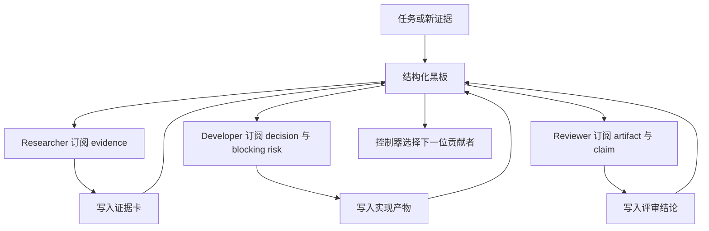
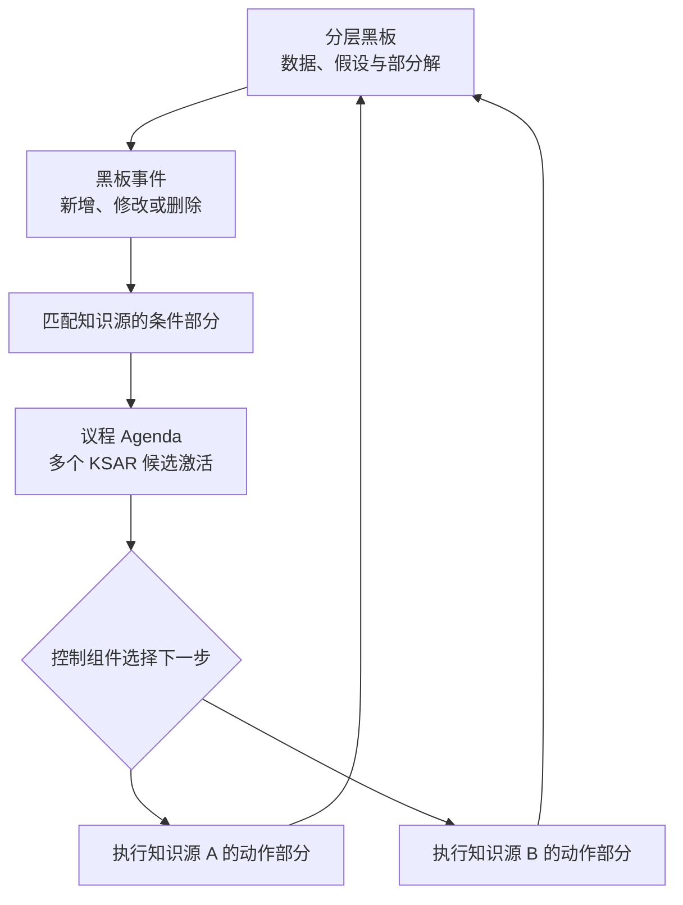
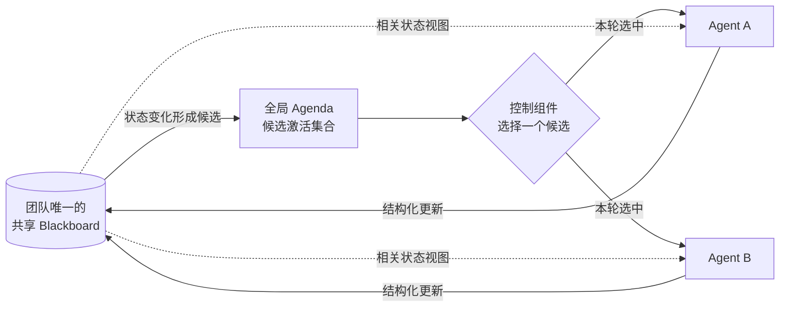
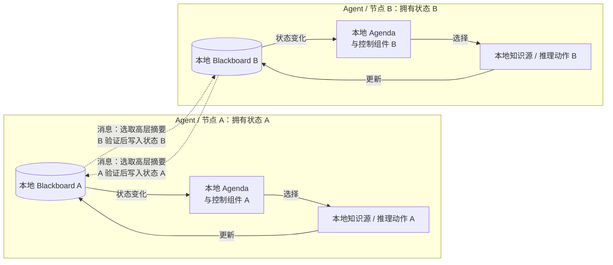
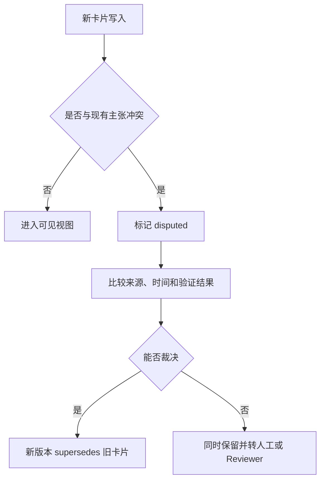

# 专题：Blackboard 黑板拓扑与共享工作空间

> Blackboard（黑板）让多个知识源通过共享问题状态间接协作。理解它只需要沿着一条主线：**黑板发生变化 → 产生可执行的知识源激活 → 控制组件选择下一步 → 知识源更新黑板**。本页先讲清这个传统闭环，再用经典论文核验，最后才把它映射成多 Agent 工程；来源追踪、权限和持久化都属于映射后的扩展。

## 学习准备：先认清本页术语

| 英文术语 | 中文说法 | 含义 |
|---|---|---|
| Blackboard | 黑板 | 按问题求解层级组织的共享状态；保存部分解、假设和中间结果。 |
| Knowledge source | 知识源 | 带条件部分和动作部分的独立知识模块；条件满足时可以修改黑板。 |
| Opportunistic control | 机会式控制 | 不按固定顺序，而是根据当前黑板状态选择最有价值的下一步。 |
| Control component | 控制组件 | 监视黑板变化，形成候选激活并决定下一步执行哪个知识源。 |
| Agenda / KSAR | 议程 / 知识源激活记录 | 保存当前可执行的知识源实例及其触发上下文，供控制策略比较。 |
| Provenance | 来源追踪 | 工程扩展：记录谁、何时、基于什么来源写入一条信息。 |
| Materialized view | 物化视图 | 工程扩展：根据角色权限和任务需求生成的黑板子集。 |

前五项属于理解传统 Blackboard 必须掌握的构件；来源追踪和角色视图是本页为现代多 Agent 系统补充的工程机制，不应反过来冒充经典架构的定义。

<!-- learning-path:start -->
<div class="learning-path"><div class="learning-path-title">本页怎么学</div>
<div class="learning-path-step"><span>1</span><div>先用群聊和共享数据库作反例，判断什么结构才算 Blackboard。</div></div>
<div class="learning-path-step"><span>2</span><div>再掌握“黑板—激活议程—控制选择—知识源更新”的传统运行闭环。</div></div>
<div class="learning-path-step"><span>3</span><div>然后用 DVMT、Partial Global Planning、负荷预测和 Temporal Blackboard 等经典工作观察真实多 Agent 结构。</div></div>
<div class="learning-path-step"><span>4</span><div>最后比较三种现代 LLM 中央 Blackboard 实现，再进入结构化卡片、权限、持久化与冲突。</div></div>
</div>
<!-- learning-path:end -->

---

## 1. 黑板不是群聊记录




读图时重点看：Agent 读取的是与角色相关的黑板视图，写回的是可寻址卡片，而不是无边界聊天全文。

群聊强调“谁对谁说了什么”；黑板强调“系统目前知道什么、哪些事实冲突、有哪些未完成动作”。黑板应成为任务状态的事实源，而消息只是修改事实源的事件。

但“有共享状态”仍不足以构成传统 Blackboard。如果所有 Agent 只是定时读取同一个数据库，或者由固定 Pipeline 依次调用，它们没有形成状态驱动的候选激活和控制选择。上图展示的是本页最终要得到的多 Agent 形态；下一节先把角色视图、权限和卡片字段拿掉，只看传统架构的骨架。

---

## 2. 传统 Blackboard 的运行闭环




读图时重点看：黑板不是主动调用专家，知识源也不是随意抢占。黑板变化先触发条件匹配，得到具体的候选激活记录；控制组件从议程中选择一个，再让它修改黑板，形成下一轮。

| 构件 | 保存什么 | 在闭环中的职责 |
|---|---|---|
| 分层黑板 | 不同抽象层级的输入、候选假设、部分解和最终解 | 让不同知识源围绕同一问题状态工作 |
| 知识源（KS） | 条件部分与动作部分 | 条件判断自己现在是否能贡献，动作产生新的部分解或修正 |
| 激活记录（KSAR） | 某个知识源在某个具体上下文中的一次可执行候选 | 把“这个模块可能有用”变成控制器可比较的对象 |
| 控制组件 | 选择规则、优先级和资源约束 | 决定下一步执行哪个候选，而不是预先写死完整顺序 |

以 DVMT 的一个车辆监测 Agent 为例，它的本地黑板保存从传感器信号到车辆类型和局部轨迹的多层假设，不同知识源分别处理信号、关联、跟踪和解释。当新信号出现时，多个知识源可能同时满足条件，但本地控制器只把计算资源给当前最有希望的候选。这就是节点内部的“机会式”；多个节点之间还要交换高层轨迹假设和局部计划，才能形成多 Agent 协调。

因此，传统 Blackboard 的判断标准可以压缩成一句话：**是否存在共享的分层问题状态、独立的条件—动作知识源，以及基于当前状态选择知识源激活的控制过程。**

---

## 3. 与多 Agent 直接相关的经典 Blackboard 论文


下面只保留论文中明确存在多个问题求解节点或 Agent，并且 Blackboard 直接参与协作或通信的工作。Hearsay-II、Hayes-Roth 和 Nii 可以作为 Blackboard 背景资料，但不再放进本节充当多 Agent 证据。

| 论文 | 多 Agent 设置 | Blackboard 在系统中的作用 | 为什么值得读 |
|---|---|---|---|
| Lesser & Corkill, [The Distributed Vehicle Monitoring Testbed: A Tool for Investigating Distributed Problem Solving Networks](https://doi.org/10.1609/aimag.v4i3.401), 1983 | 多个地理分布的半自治车辆监测节点，各自只接收局部传感器数据，共同形成全局车辆轨迹 | 每个节点是带知识源和抽象层级的本地 Blackboard problem solver；节点交换高层部分假设，而不是共享全部内部状态 | 这是“多个 Blackboard Agent 组成协作网络”的经典实验平台，适合建立分布式而非单中央黑板的概念 |
| Durfee & Lesser, [Predictability Versus Responsiveness: Coordinating Problem Solvers in Dynamic Domains](https://cdn.aaai.org/AAAI/1988/AAAI88-012.pdf), AAAI 1988 | DVMT 中的多个黑板节点一边形成局部解释，一边交换局部计划和高层假设 | Blackboard 负责节点内部机会式求解；Partial Global Planning 协调节点之间何时交换结果、避免重复劳动并响应计划偏差 | 直接展示本地 Blackboard 与多 Agent 计划协调怎样分层结合，并给出实验对照 |
| Tsai & Chen, [A Distributed Problem Solving System for Short-Term Load Forecasting](https://doi.org/10.1016/0378-7796(93)90016-8), 1993 | 多个能够自主计算并合作形成负荷预测的处理 Agent | 系统明确由 Blackboard module、Knowledge Sources 和 control mechanism 组成，不同预测知识封装在领域知识源中 | 是一个已实现并使用实际数据测试的多 Agent Blackboard 应用，而非纯概念说明 |
| Botti et al., [A Temporal Blackboard for a Multi-Agent Environment](https://doi.org/10.1016/0169-023X(95)00007-F), 1995 | 多个合作 Agent 通过共享介质交换带时间语义的信息 | Blackboard 直接作为 Agent 通信框架，并处理多路访问、一致性和时间信息 | 说明当知识源真正替换为软件 Agent 后，共享黑板必须面对并发、一致性和时态语义 |
| Nwana, Lee & Jennings, [Co-ordination in Software Agent Systems](https://eprints.soton.ac.uk/252109/1/bttj96.pdf), 1996 | 综述软件多 Agent 的组织、合同网、规划和协商机制 | 明确描述 Blackboard negotiation：Agent 取代知识源读写公共黑板；同时用 DVMT 说明 peer agents 也可以采用 Blackboard | 用于比较中央调度式共享黑板与同伴式分布式黑板，并理解瓶颈、共同语义和集中控制风险 |

这组论文给出两条不同的多 Agent Blackboard 路线：

- **分布式本地黑板**：DVMT 中每个 Agent/节点内部都有自己的 Blackboard、知识源和控制机制；节点之间只交换高层假设或局部计划。
- **中央共享黑板**：负荷预测、Temporal Blackboard 和 Blackboard negotiation 让多个 Agent 直接读写公共黑板，另设控制或调度机制管理选择与访问。

二者都与多 Agent 有关，但不能混写。第一种把 Blackboard 当作 **Agent 内部问题求解架构**，再增加跨 Agent 协调；第二种把 Blackboard 当作 **Agent 之间的协调介质**。下一节先选择这两种部署形态，再讨论卡片和代码。

---

## 4. 先选择中央共享黑板还是分布式本地黑板


两种方案最关键的区别是 **权威问题状态存放在哪里**。为了避免把消息通道误认为另一块共享黑板，下面分成两张图。

### 4.1 中央共享黑板：一份团队状态，一个全局选择点



读图时重点看：团队只有一份权威 Blackboard。状态变化先形成全局候选集合，控制组件再明确选择一个候选；被选中的 Agent 读取相关视图并把结果写回同一份黑板。Agent A 和 B 是决策节点的互斥可能分支，不表示二者必然同时执行。

### 4.2 分布式本地黑板：每个节点独立求解，节点间只传消息



读图时重点看：A 和 B 各有一套完整的本地 Blackboard 闭环，不存在隐藏的中央共享状态。两条虚线代表消息复制，不代表共同读写；发送方挑选高层摘要，接收方验证后写入自己的本地黑板，因此 A 与 B 的状态可以暂时不同。

不要用“是否经过网络”区分两种方案：中央共享黑板也可以部署在远程数据库上，分布式节点也可以运行在同一台机器上。真正的判断问题是：**团队是否共同修改同一份权威问题状态，还是每个 Agent 拥有自己的权威本地状态？**

| 设计问题 | 中央共享黑板 | 分布式本地黑板 |
|---|---|---|
| 状态位置 | 团队共享一份 Blackboard | 每个 Agent 有独立 Blackboard |
| Agent 怎样协作 | 通过公共条目间接协作 | 通过消息交换高层假设、局部计划或承诺 |
| 控制方式 | 统一 scheduler 从全局候选中选择 | 每个 Agent 本地控制，并用分布式规划或协议协调 |
| 优点 | 状态一致、实现直观、容易统一审计 | 保留局部自主性，避免所有内部状态集中，适合数据天然分布的任务 |
| 主要风险 | 中央瓶颈、单点故障、全局语义和权限压力 | 视图不一致、通信延迟、重复劳动和协调开销 |
| 经典对应 | Temporal Blackboard、Blackboard negotiation、负荷预测系统 | DVMT 与 Partial Global Planning |

本页后续代码选择 **中央共享黑板** 作为最小教学实现，因为它更容易在一个页面内看清写入、读取和调度。下一节先看现代 LLM 系统怎样采用这种形态，再定义教学代码中的状态单元。

如果实现 DVMT 式分布式方案，同一个 `BoardCard` 结构仍可作为跨 Agent 交换的高层假设，但每个 Agent 应维护自己的本地卡片集合、版本和控制循环；不能把所有本地状态偷偷合并成一份中央数据库后仍称为分布式本地黑板。

---

## 5. 现代 LLM 中央 Blackboard：两篇论文与一个项目


以下三个工作都满足“团队围绕一份共享 Blackboard 协作”，但不能因此认为它们具有相同的控制策略。

| 工作 | 中央 Blackboard 保存什么 | Agent 怎样被触发或选择 | 结果怎样返回闭环 |
|---|---|---|---|
| Han & Zhang, [Exploring Advanced LLM Multi-Agent Systems Based on Blackboard Architecture](https://arxiv.org/abs/2507.01701), 2025 | 不同角色产生的信息和消息都进入同一共享黑板 | 控制单元根据当前黑板内容选择下一位行动 Agent | Agent 执行后更新黑板，系统重复选择—执行，直到黑板上形成共识 |
| Salemi et al., [LLM-based Multi-Agent Blackboard System for Information Discovery in Data Science](https://arxiv.org/abs/2510.01285), 2025 | Main Agent 发布的帮助请求，以及文件 Agent、搜索 Agent 写回的响应 | Helper Agent 根据自身能力、可用性和成本自主决定是否响应；Main Agent 不直接点名派工 | 响应挂到对应请求下，Main Agent 决定采用或忽略，再继续数据发现与程序生成 |
| [Flock](https://github.com/whiteducksoftware/flock)（[Blackboard Guide](https://whiteducksoftware.github.io/flock/guides/blackboard/)） | 经过类型契约验证的共享 Artifact | Agent 声明自己消费和发布的数据类型；新 Artifact 出现后自动触发所有匹配订阅者 | Agent 输出再次作为类型化 Artifact 发布，继续触发下游订阅者 |

三者的共同点是：**Agent 不需要直接调用彼此，正式输入与输出都经过同一份共享状态。** 差别在控制权：Han & Zhang 使用基于黑板状态的中央选择；Salemi 等人把是否响应交给 Helper Agent；Flock 使用类型订阅，可能同时触发多个匹配 Agent。

因此，“中央 Blackboard”只说明状态和间接通信集中，不代表调度一定集中。它们可以分别概括为：

- **中央状态 + 中央选择**：Han & Zhang。
- **中央状态 + 自主志愿响应**：Salemi et al.。
- **中央状态 + 类型订阅触发**：Flock。

本页教学代码不照抄其中任何一个完整系统，而是提取共同底座：`BoardCard` 表示公共黑板上的状态单元，`board_view()` 控制每个 Agent 读取什么，调度层再选择中央控制、志愿响应或订阅触发中的一种。

---

## 6. 用结构化卡片表示黑板状态


传统论文允许不同层级采用适合领域的表示。面向 LLM Agent 时，可以用结构化卡片保存任务、证据、主张、决策、产物和风险，并额外记录来源与生命周期。下面代码只实现黑板上的状态表示：

```python
from datetime import datetime
from pydantic import BaseModel, Field
from typing import Literal

class BoardCard(BaseModel):
    id: str
    kind: Literal["task", "evidence", "claim", "decision", "artifact", "risk"]
    owner: str
    content: str
    source_refs: list[str] = Field(default_factory=list)
    tags: set[str] = Field(default_factory=set)
    version: int = 1
    supersedes: str | None = None
    visibility: set[str] = Field(default_factory=lambda: {"team"})
    created_at: datetime = Field(default_factory=datetime.utcnow)
    expires_at: datetime | None = None
```

<div class="code-explanation"><div class="code-explanation-title">Python 代码说明</div><p><strong>用途：</strong>把黑板内容从任意字典升级为可追踪、可版本化卡片。<strong>执行过程：</strong>卡片声明类型、所有者、来源、标签、版本、替代关系、可见范围和过期时间。<strong>关键点：</strong>这是教学实现；生产系统应使用带时区时间、不可变事件日志和独立授权服务，不能只相信卡片中的 <code>visibility</code> 字段。</p></div>

---

## 7. 分开理解读取路径与调度路径


### 7.1 读取路径：为 Agent 生成相关视图

```python
def board_view(cards: list[BoardCard], role: str, tags: set[str]) -> list[BoardCard]:
    now = datetime.utcnow()
    visible = [
        card for card in cards
        if ("team" in card.visibility or role in card.visibility)
        and (card.expires_at is None or card.expires_at > now)
        and (not tags or card.tags & tags)
    ]
    latest: dict[str, BoardCard] = {}
    for card in visible:
        key = card.supersedes or card.id
        if key not in latest or card.version > latest[key].version:
            latest[key] = card
    return sorted(latest.values(), key=lambda card: card.created_at)[-20:]
```

<div class="code-explanation"><div class="code-explanation-title">Python 代码说明</div><p><strong>用途：</strong>为不同角色生成小而相关的黑板视图。<strong>执行过程：</strong>函数先按权限、有效期和标签过滤，再按版本保留最新卡片，最后只返回最近二十项。<strong>关键点：</strong>教学代码没有实现语义检索、冲突合并和数据库并发；真实系统应让完整历史进入审计存储，视图只进入 Agent 上下文。</p></div>

`board_view()` 只回答“某个 Agent 此刻能看到哪些状态”，并没有决定谁执行下一步。限制视图是现代上下文与权限治理，不能用它代替传统控制组件。

### 7.2 调度路径：形成候选并选择下一步

当新任务卡或证据卡写入时，系统先检查各 Agent 的触发条件，把满足条件的具体调用放入议程。例如，出现 `blocking security risk` 时，Developer 的“修复实现”与 Reviewer 的“复核风险”都可能成为候选。控制器再按能力匹配、依赖、预计贡献、成本和负载选择下一步，执行结果回写黑板并重新触发匹配。

这一步才是传统机会式控制的多 Agent 映射。它与 Supervisor 的差别在于：Supervisor 通常直接决定派谁做什么；Blackboard 控制器主要根据共享状态暴露出来的候选机会进行选择，不需要预先写死完整工作顺序。

---

## 8. 写入策略：黑板保存状态，不回收全部对话


黑板条目应该是可复用、可寻址的任务状态。临时推测、重复转述和完整工具输出不应直接进入所有角色都会检索的工作区。写入前至少检查：类型、来源、生命周期、敏感级别以及是否与现有卡片重复或冲突。

例如，安全 Reviewer 可以写入一条阻塞风险：

```python
oauth_risk = BoardCard(
    id="risk-auth-001",
    kind="risk",
    owner="security_reviewer",
    content="OAuth callback lacks state parameter validation.",
    source_refs=["design_doc#callback"],
    tags={"oauth", "security", "blocking"},
    visibility={"developer", "reviewer"},
)
```

<div class="code-explanation"><div class="code-explanation-title">阻塞风险卡片说明</div><p><strong>用途：</strong>把安全评审结论变成下游可订阅的正式状态。<strong>执行过程：</strong>稳定 ID 支持更新与引用，来源指向设计文档，标签支持按任务检索，可见范围限制接收角色。<strong>关键点：</strong>Developer 可以读取 blocking 风险，而不必接收整个安全评审对话。</p></div>

任务黑板与长期知识库也要分开。下面的策略只决定卡片是否值得在任务结束后继续保留：

```python
def should_persist(card: BoardCard) -> bool:
    if card.kind in {"decision", "risk"}:
        return True
    if "stable" in card.tags and card.source_refs:
        return True
    if "temporary" in card.tags or card.expires_at is not None:
        return False
    return False
```

<div class="code-explanation"><div class="code-explanation-title">黑板持久化策略说明</div><p><strong>用途：</strong>避免把每条任务卡都升级为长期记忆。<strong>执行过程：</strong>决策和风险默认保留；稳定且有来源的卡片可保留；临时或明确过期的卡片拒绝持久化。<strong>关键点：</strong>这是白名单式教学策略，生产系统还要处理敏感数据、删除请求、项目范围和人工确认。</p></div>

按角色读取时，应复用上一节的 `board_view()` 生成物化视图，而不是做全局 top-k：Developer 关注 implementation 与 blocking，Reviewer 关注 design、artifact、claim 与 risk。完整历史留在事件或审计存储，只有当前决定所需的小视图进入 Prompt。写入完成后，系统必须返回第 7.2 节的调度路径，重新形成候选；否则黑板会退化成只写不驱动工作的档案库。

---

## 9. 黑板最常见的四类失败


| 失败 | 表现 | 护栏 |
|---|---|---|
| 状态膨胀 | 每个 Agent 重复读取大量旧卡片 | 标签、检索、版本、归档和角色视图 |
| 冲突事实 | 两条卡片同时声称不同结论 | 来源、置信度、有效期和冲突状态 |
| 权限泄漏 | 私有材料进入所有 Agent 上下文 | 读写策略、最小权限和审计 |
| 提示注入扩散 | 恶意网页内容被写成长期事实 | 不可信标记、事实抽取、验证和来源隔离 |

传统论文没有替现代系统解决权限隔离和提示注入问题，但它留下了一条重要边界：知识源只通过受控的黑板表示交互，而不是直接读取其他知识源的全部内部状态。角色视图、来源追踪和授权策略是在这条边界上增加的工程护栏。

### 图文对照：冲突卡片的处理路径



读图时重点看：冲突不应被简单覆盖；无法裁决时，“仍有分歧”本身就是必须保留的状态。

---

## 10. 如何评测黑板是否值得使用


对照 Supervisor 和全量群聊，记录任务成功率、数据发现召回率、每个 Agent 实际读取 token、重复卡片率、过期事实使用率、冲突解决时间和越权读取次数。黑板的价值通常出现在多源证据、开放专家池和长任务；固定短流程往往使用 Pipeline 更简单。

对于现代中央 Blackboard，还应在相同任务和调用预算下比较三种控制方式：中央选择、Agent 志愿响应和类型订阅触发。额外记录无效激活数、重复响应数、从卡片写入到首次有效响应的延迟，以及最终答案实际采用了多少黑板贡献，才能判断控制策略是否真正利用了共享状态。

---

<!-- chapter-check:start -->
## 专题自检
<div class="chapter-check"><div class="chapter-check-title">不看正文，尝试回答</div><ul>
<li>黑板与群聊记录的状态语义有什么区别？</li>
<li>传统 Blackboard 的一次运行闭环包含哪五步？</li>
<li>为什么只有共享数据库而没有议程与控制选择，还不能算完整 Blackboard？</li>
<li>Knowledge Source、KSAR 和控制组件分别映射到多 Agent 系统中的什么？</li>
<li>Han & Zhang、Salemi et al. 和 Flock 分别把行动控制交给谁或什么机制？</li>
<li>为什么每张卡片都需要来源、版本和有效期？</li>
<li>哪些卡片应留在任务黑板，哪些值得持久化？</li>
<li>角色视图怎样同时降低 token 和权限风险？</li>
<li>为什么冲突卡片不能只按自报置信度强行覆盖？</li>
<li>什么情况下应选择 Blackboard 而不是 Supervisor？</li>
</ul></div>
<!-- chapter-check:end -->
