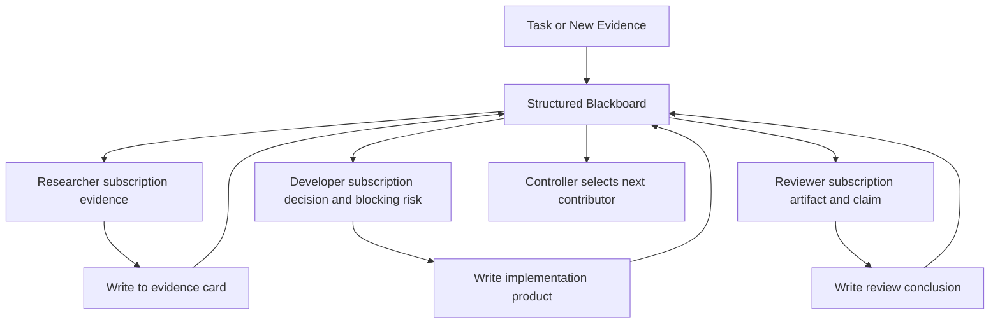
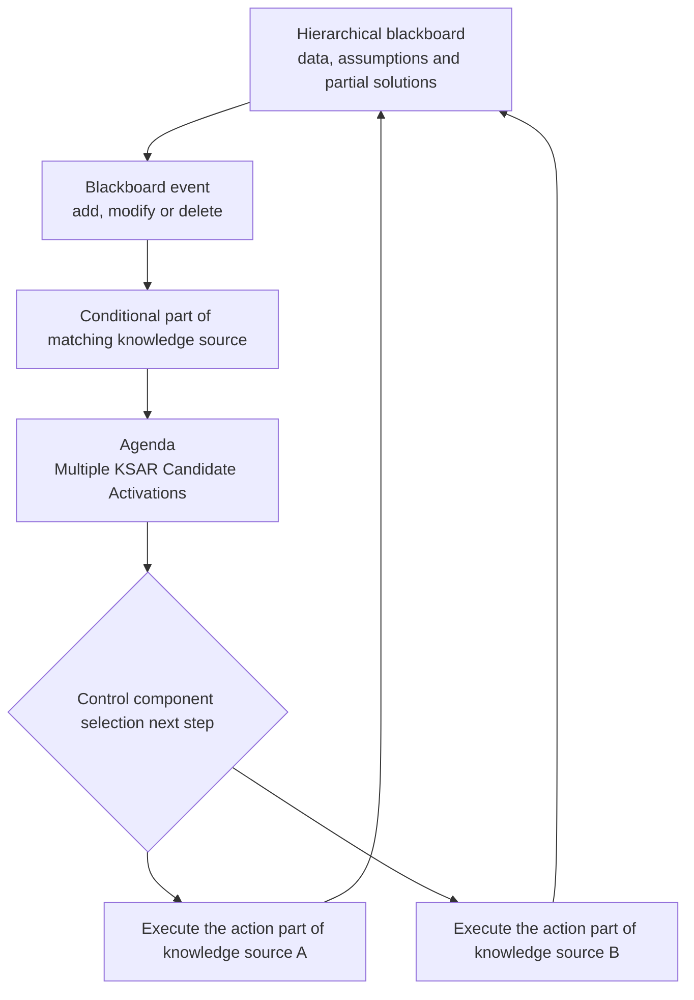
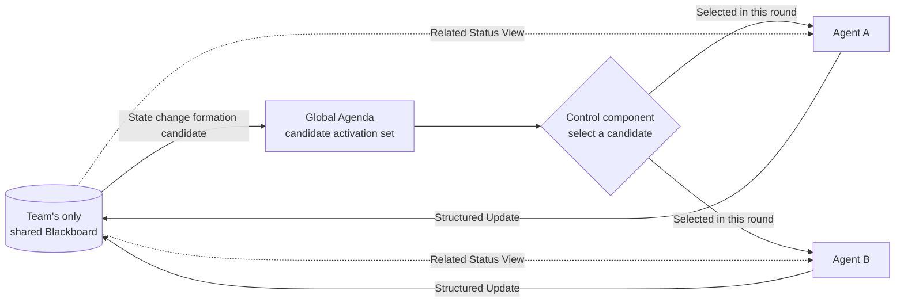
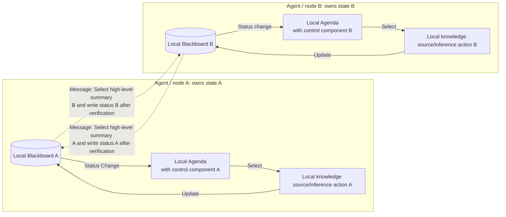
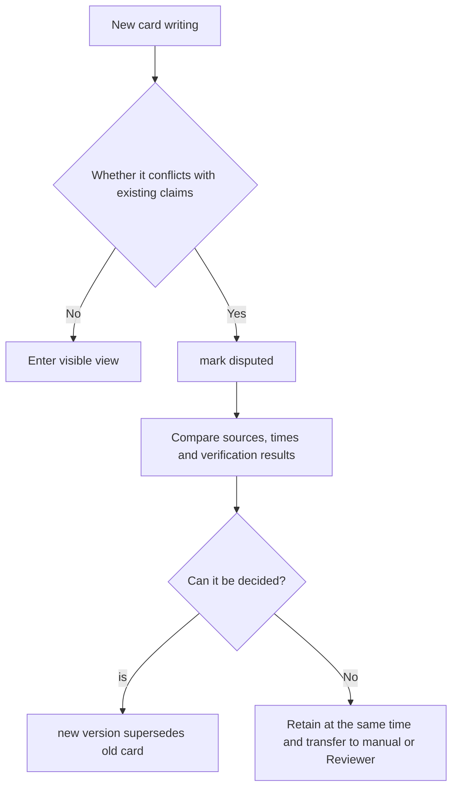

# Topic: Blackboard topology and shared workspace

> Blackboard allows multiple knowledge sources to collaborate indirectly by sharing problem status. To understand it, you only need to follow one main line: **The blackboard changes → generates executable knowledge source activation → control component selects the next step → the knowledge source updates the blackboard**. This page first explains this traditional closed loop, then verifies it with classic papers, and finally maps it into a multi-agent project; source tracking, permissions, and persistence are all mapped extensions.

## Study preparation: First understand the terms on this page

| Term | Working definition | Meaning |
|---|---|---|
| Blackboard | Blackboard | Shared state organized by problem solution hierarchy; saves partial solutions, hypotheses, and intermediate results. |
| Knowledge source | Knowledge source | An independent knowledge module with a conditional part and an action part; the blackboard can be modified when the conditions are met. |
| Opportunistic control | Opportunistic control | Instead of following a fixed sequence, select the most valuable next step based on the current blackboard status. |
| Control component | Control component | Monitors blackboard changes, forms candidate activations and decides which knowledge source to execute next. |
| Agenda / KSAR | Agenda / Knowledge source activation record | Save the currently executable knowledge source instance and its trigger context for control strategy comparison. |
| Provenance | Provenance Tracking | Engineering Extensions: Record who wrote a message, when, and from what source. |
| Materialized view | Materialized view | Project extension: A subset of the blackboard generated based on role permissions and task requirements. |

The first five items belong to the building blocks that must be mastered to understand traditional Blackboard; source tracking and role views are engineering mechanisms that supplement modern multi-agent systems on this page, and should not in turn pretend to be the definition of classic architecture.

<!-- learning-path:start -->
<div class="learning-path"><div class="learning-path-title">How to learn on this page</div>
<div class="learning-path-step"><span>1</span><div> First use group chat and shared database as counterexamples to determine what structure counts as Blackboard. </div></div>
<div class="learning-path-step"><span>2</span><div> Then master the traditional operation closed loop of "blackboard-activate agenda-control selection-knowledge source update". </div></div>
<div class="learning-path-step"><span>3</span><div>Then observe real multi-agent structures using classic jobs like DVMT, Partial Global Planning, Load Forecasting, and Temporal Blackboard. </div></div>
<div class="learning-path-step"><span>4</span><div>Finally compares three modern LLM central Blackboard implementations, before getting into structured cards, permissions, persistence and conflicts. </div></div>
</div>
<!-- learning-path:end -->

---

## 1. Blackboard is not a group chat record




Pay attention when reading the picture: Agent reads the blackboard view related to the role, and writes back addressable cards instead of the full text of the borderless chat.

The group chat emphasizes "who said what to whom"; the blackboard emphasizes "what the system currently knows, which facts conflict, and what unfinished actions there are." The blackboard should be the source of truth for the task state, and messages are simply events that modify the source of truth.

But "having a shared state" is still not enough to constitute a traditional Blackboard. If all Agents only read the same database regularly, or are called sequentially by a fixed Pipeline, they do not form state-driven candidate activation and control selection. The picture above shows the multi-Agent form that this page will eventually get; in the next section, we will first remove the role view, permissions and card fields, and only look at the skeleton of the traditional architecture.

---

## 2. Traditional Blackboard operation closed loop




When reading the picture, pay attention to: The blackboard does not actively call experts, nor does it randomly seize knowledge sources. Blackboard changes first trigger condition matching to obtain specific candidate activation records; the control component selects one from the agenda and then lets it modify the blackboard to form the next round.

| Components | What to save | Responsibilities in the closed loop |
|---|---|---|
| Hierarchical blackboard | Inputs, candidate hypotheses, partial solutions, and final solutions at different levels of abstraction | Let different knowledge sources work around the same problem state |
| Knowledge source (KS) | Conditional part and action part | The condition determines whether it can contribute now, and the action generates a new partial solution or correction |
| Activation record (KSAR) | An executable candidate of a knowledge source in a specific context | Turn "this module may be useful" into a comparable object for the controller |
| Control components | Selection rules, priorities and resource constraints | Decide which candidate to execute next rather than hard-coding the complete sequence in advance |

Taking a vehicle monitoring agent of DVMT as an example, its local blackboard saves multi-layered hypotheses from sensor signals to vehicle types and local trajectories. Different knowledge sources handle signals, correlation, tracking and interpretation respectively. When a new signal appears, multiple knowledge sources may satisfy the conditions simultaneously, but the local controller only gives computing resources to the current most promising candidate. This is the "opportunistic" within the node; multiple nodes must exchange high-level trajectory assumptions and local plans to form multi-agent coordination.

Therefore, the traditional Blackboard judgment criteria can be compressed into one sentence: **Whether there is a shared hierarchical problem state, an independent condition-action knowledge source, and a control process for selecting knowledge source activation based on the current state. **

---

## 3. Classic Blackboard papers directly related to multi-Agent


Only work in which there are clearly multiple problem-solving nodes or agents in the paper and where Blackboard is directly involved in collaboration or communication will be retained below. Hearsay-II, Hayes-Roth, and Nii can be used as Blackboard background information, but are no longer included in this section to serve as multi-agent evidence.

| Paper | Multi-Agent Setup | The role of Blackboard in the system | Why it’s worth reading |
|---|---|---|---|
| Lesser & Corkill, [The Distributed Vehicle Monitoring Testbed: A Tool for Investigating Distributed Problem Solving Networks](https://doi.org/10.1609/aimag.v4i3.401), 1983 | Multiple geographically distributed semi-autonomous vehicle monitoring nodes, each receiving only local sensor data, together forming a global vehicle trajectory | Each node is a local Blackboard problem solver with knowledge sources and abstraction levels; nodes exchange high-level partial assumptions instead of sharing all internal states | This is "multiple Blackboard Agents" A classic experimental platform that forms a collaborative network, suitable for establishing a distributed rather than a single central blackboard concept |
| Durfee & Lesser, [Predictability Versus Responsiveness: Coordinating Problem Solvers in Dynamic Domains](https://cdn.aaai.org/AAAI/1988/AAAI88-012.pdf), AAAI 1988 | Multiple blackboard nodes in DVMT form local explanations while exchanging local plans and high-level assumptions | Blackboard is responsible for opportunistic solving within nodes; Partial Global Planning coordinates when to exchange results between nodes, avoid duplication of work, and respond to plan deviations | Directly display local Blackboard How to coordinate and combine with multi-agent plans hierarchically, and give experimental controls |
| Tsai & Chen, [A Distributed Problem Solving System for Short-Term Load Forecasting](https://doi.org/10.1016/0378-7796(93)90016-8), 1993 | Multiple processing Agents that can calculate independently and cooperate to form load forecasting | The system is clearly composed of Blackboard module, Knowledge Sources and control mechanism, and different forecasting knowledge is encapsulated in domain knowledge sources | It is a multi-Agent Blackboard application that has been implemented and tested with actual data, rather than a pure concept description |
| Botti et al., [A Temporal Blackboard for a Multi-Agent Environment](https://doi.org/10.1016/0169-023X(95)00007-F), 1995 | Multiple cooperating Agents exchange information with time semantics through the shared medium | Blackboard directly serves as the Agent communication framework and handles multiple access, consistency and time information | Explain that when the knowledge source is truly replaced by a software Agent, the shared blackboard must face concurrency, consistency and temporal semantics |
| Nwana, Lee & Jennings, [Co-ordination in Software Agent Systems](https://eprints.soton.ac.uk/252109/1/bttj96.pdf), 1996 | Overview of the organization, contract network, planning and negotiation mechanism of software multi-Agent | Clearly describe Blackboard negotiation: Agent replaces the knowledge source to read and write the public blackboard; at the same time, use DVMT to explain that peer agents can also use Blackboard | Used to compare centrally dispatched shared blackboards to peer distributed blackboards and understand bottlenecks, common semantics, and centralized control risks |

This set of papers gives two different routes to multi-agent Blackboard:

- **Distributed local blackboard**: Each Agent/node in DVMT has its own Blackboard, knowledge source and control mechanism; only high-level assumptions or local plans are exchanged between nodes.
- **Central Shared Blackboard**: Load forecasting, Temporal Blackboard and Blackboard negotiation allow multiple Agents to directly read and write the public blackboard, and a control or scheduling mechanism is set up to manage selection and access.

Both are related to multiple agents, but they cannot be mixed. The first one treats Blackboard as **Agent's internal problem-solving architecture**, and then adds cross-Agent coordination; the second one uses Blackboard as **the coordination medium between Agents**. In the next section, we will first select these two deployment forms, and then discuss cards and codes.

---

## 4. Choose central shared blackboard or distributed local blackboard first


The most critical difference between the two solutions is **where the authoritative question status is stored**. In order to avoid mistaking the message channel for another shared blackboard, the following is divided into two pictures.

### 4.1 Central shared blackboard: a team status, a global selection point



When reading the picture, pay attention to this: The team only has one authoritative Blackboard. The state changes first form a global candidate set, and then the control component explicitly selects a candidate; the selected Agent reads the relevant views and writes the results back to the same blackboard. Agent A and B are mutually exclusive possible branches of the decision node, which does not mean that they must be executed at the same time.

### 4.2 Distributed local blackboard: Each node solves independently, and only messages are transmitted between nodes



When reading the picture, pay attention to: A and B each have a complete set of local Blackboard closed loops, and there is no hidden central shared state. The two dotted lines represent message replication, not joint reading and writing; the sender selects a high-level summary, and the receiver writes it to its local blackboard after verification, so the status of A and B can be temporarily different.

Don't use "whether through the network" to distinguish between the two solutions: the central shared blackboard can also be deployed on a remote database, and distributed nodes can also run on the same machine. The real judgment question is: Does the team jointly modify the same authoritative issue state, or does each Agent have its own authoritative local state? **

| Design Issues | Central Shared Blackboard | Distributed Local Blackboard |
|---|---|---|
| Status location | The team shares a Blackboard | Each Agent has an independent Blackboard |
| How agents collaborate | Collaborate indirectly through common entries | Exchange high-level assumptions, partial plans, or commitments through messages |
| Control method | Unified scheduler selects from global candidates | Each Agent is controlled locally and coordinated with distributed planning or protocols |
| Advantages | Consistent status, intuitive implementation, and easy unified auditing | Retains local autonomy, avoids the concentration of all internal states, and is suitable for tasks where data is naturally distributed |
| Key risks | Central bottlenecks, single points of failure, global semantics and permission pressure | Inconsistent views, communication delays, duplication of effort and coordination overhead |
| Classic correspondence | Temporal Blackboard, Blackboard negotiation, load forecasting system | DVMT and Partial Global Planning |

The following code on this page chose **Central Shared Blackboard** as the minimal teaching implementation because it is easier to see writing, reading, and scheduling within a single page. The next section first looks at how modern LLM systems adopt this form, and then defines the state units in the teaching code.

If a DVMT-style distributed solution is implemented, the same `BoardCard` structure can still be used as a high-level assumption for cross-Agent exchange, but each Agent should maintain its own local card collection, version and control loop; all local states cannot be secretly merged into a central database and still be called a distributed local blackboard.

---

## 5. Modern LLM Central Blackboard: Two Papers and a Project


The following three jobs all qualify as "Teams collaborate around a shared Blackboard", but they cannot therefore be considered to have the same control policy.

| Work | What is saved in the central Blackboard | How Agents are triggered or selected | How results are returned to the closed loop |
|---|---|---|---|
| Han & Zhang, [Exploring Advanced LLM Multi-Agent Systems Based on Blackboard Architecture](https://arxiv.org/abs/2507.01701), 2025 | Information and messages generated by different roles enter the same shared blackboard | The control unit selects the next action Agent based on the current blackboard content | After the Agent is executed, the blackboard is updated, and the system repeats selection-execution until a consensus is formed on the blackboard |
| Salemi et al., [LLM-based Multi-Agent Blackboard System for Information Discovery in Data Science](https://arxiv.org/abs/2510.01285), 2025 | Help requests issued by the Main Agent, and responses written back by the File Agent and Search Agent | The Helper Agent independently decides whether to respond based on its own capabilities, availability and cost; the Main Agent does not directly dispatch workers by name | The response is linked to the corresponding request, and the Main Agent decides to adopt or ignore it, and then continues data discovery and program generation |
| [Flock](https://github.com/whiteducksoftware/flock)（[Blackboard Guide](https://whiteducksoftware.github.io/flock/guides/blackboard/)） | Shared Artifact verified by type contract | Agent declares the data types it consumes and publishes; all matching subscribers are automatically triggered when a new Artifact appears | Agent output is published again as a typed Artifact and continues to trigger downstream subscribers |

What the three have in common is: **Agents do not need to call each other directly, and formal input and output go through the same shared state. ** The difference lies in control: Han & Zhang use a central selection based on the blackboard status; Salemi and others leave the response to the Helper Agent; Flock uses type subscriptions, which may trigger multiple matching Agents at the same time.

Therefore, "central Blackboard" only indicates that status and indirect communication are centralized, but does not mean that scheduling must be centralized. They can be summarized as:

- **Central Status + Central Selection**: Han & Zhang.
- **Central State + Autonomous Volunteer Response**: Salemi et al.
- **Central State + Type Subscription Trigger**: Flock.

The teaching code on this page does not copy any of the complete systems, but extracts a common base: `BoardCard` represents the state unit on the public blackboard, `board_view()` controls what each Agent reads, and the scheduling layer selects one of central control, voluntary response, or subscription triggering.

---

## 6. Use structured cards to represent blackboard status


Traditional papers allow different levels to adopt domain-appropriate representations. When targeting LLM Agents, structured cards can be used to save tasks, evidence, claims, decisions, products, and risks, and additionally record sources and lifecycles. The following code only implements the status representation on the blackboard:

```python
from datetime import datetime
from pydantic import BaseModel, Field
from typing import Literal

class BoardCard(BaseModel):
    id: str
    kind: Literal["task", "evidence", "claim", "decision", "artifact", "risk"]
    owner: str
    content: str
    source_refs: list[str] = Field(default_factory=list)
    tags: set[str] = Field(default_factory=set)
    version: int = 1
    supersedes: str | None = None
    visibility: set[str] = Field(default_factory=lambda: {"team"})
    created_at: datetime = Field(default_factory=datetime.utcnow)
    expires_at: datetime | None = None
```

<div class="code-explanation"><div class="code-explanation-title">Python code description</div><p><strong>Purpose: </strong>Upgrade blackboard content from any dictionary to trackable and versionable cards. <strong>Execution process: </strong>Card declaration type, owner, source, label, version, substitution relationship, visible range and expiration time. <strong> Key Points: </strong> This is a tutorial implementation; production systems should use time zoned time, immutable event logs, and independent authorization services, and cannot just trust the <code>visibility</code> field in the card. </p></div>

---

## 7. Understand the reading path and scheduling path separately


### 7.1 Reading path: Generate related views for Agent

```python
def board_view(cards: list[BoardCard], role: str, tags: set[str]) -> list[BoardCard]:
    now = datetime.utcnow()
    visible = [
        card for card in cards
        if ("team" in card.visibility or role in card.visibility)
        and (card.expires_at is None or card.expires_at > now)
        and (not tags or card.tags & tags)
    ]
    latest: dict[str, BoardCard] = {}
    for card in visible:
        key = card.supersedes or card.id
        if key not in latest or card.version > latest[key].version:
            latest[key] = card
    return sorted(latest.values(), key=lambda card: card.created_at)[-20:]
```

<div class="code-explanation"><div class="code-explanation-title">Python Code Description</div><p><strong>Purpose: </strong>Generate small but relevant blackboard views for different roles. <strong> execution process: </strong> function first filters by permissions, validity period and tags, then retains the latest cards by version, and finally returns only the latest twenty items. <strong> Key points: </strong> The tutorial code does not implement semantic retrieval, conflict merging, and database concurrency; real systems should let the complete history go into the audit store, and the views only go into the Agent context. </p></div>

`board_view()` only answers "what states an Agent can see at this moment" and does not decide who will perform the next step. Restricted views are modern context and permissions governance and cannot be used to replace traditional control components.

### 7.2 Scheduling Path: Forming Candidates and Selecting Next Steps

When a new task card or evidence card is written, the system first checks the trigger conditions of each Agent and puts specific calls that meet the conditions into the agenda. For example, when `blocking security risk` occurs, both Developer's "Repair Implementation" and Reviewer's "Review Risk" may be candidates. The controller then selects the next step based on capacity matching, dependency, expected contribution, cost and load, writes the execution results back to the blackboard and re-triggers matching.

This step is the multi-Agent mapping of traditional opportunistic control. The difference between it and the Supervisor is that the Supervisor usually directly decides who to send to do what; the Blackboard controller mainly makes selections based on the candidate opportunities exposed by the shared state, and does not need to write the complete work sequence in advance.

---

## 8. Writing strategy: Blackboard saves state and does not recycle all conversations


Blackboard entries should be reusable, addressable task states. Ad hoc speculation, paraphrasing, and complete tool output should not go directly into the workspace where all roles will retrieve it. Before writing, check at least: type, source, life cycle, sensitivity level and whether it duplicates or conflicts with existing cards.

For example, a security reviewer could write a blocking risk:

```python
oauth_risk = BoardCard(
    id="risk-auth-001",
    kind="risk",
    owner="security_reviewer",
    content="OAuth callback lacks state parameter validation.",
    source_refs=["design_doc#callback"],
    tags={"oauth", "security", "blocking"},
    visibility={"developer", "reviewer"},
)
```

<div class="code-explanation"><div class="code-explanation-title">Blocking risk card description</div><p><strong>Purpose: </strong> Turn the safety review conclusion into a formal status that can be subscribed by downstream. <strong> Execution process: </strong> Stable ID supports updating and referencing, the source points to the design document, the label supports retrieval by task, and the visible range limits the receiving role. <strong>Key Point: </strong>Developer can read blocking risks without receiving the entire security review conversation. </p></div>

The task blackboard and long-term knowledge base should also be separated. The following strategy only determines whether a card is worth keeping after the mission is over:

```python
def should_persist(card: BoardCard) -> bool:
    if card.kind in {"decision", "risk"}:
        return True
    if "stable" in card.tags and card.source_refs:
        return True
    if "temporary" in card.tags or card.expires_at is not None:
        return False
    return False
```

<div class="code-explanation"><div class="code-explanation-title">Blackboard persistence strategy description</div><p><strong>Purpose: </strong>Avoid upgrading each task card to long-term memory. <strong> Execution process: </strong> Decisions and risks are retained by default; stable and sourced cards can be retained; temporary or explicitly expired cards refuse to be persisted. <strong> Key Points: </strong> This is a whitelist teaching strategy, and the production system also handles sensitive data, deletion requests, project scope, and manual confirmations. </p></div>

When reading by role, you should reuse `board_view()` from the previous section to generate materialized views instead of doing global top-k: Developer focuses on implementation and blocking, and Reviewer focuses on design, artifact, claim, and risk. The full history remains in the event or audit store, and only the small view required for the current decision goes into Prompt. After the writing is completed, the system must return to the scheduling path in Section 7.2 to re-form candidates; otherwise the blackboard will degenerate into an archive that only writes and does not drive work.

---

## 9. The four most common types of blackboard failures


| Failure | Performance | Guardrails |
|---|---|---|
| State bloat | Each Agent repeatedly reads large amounts of old cards | Tags, retrievals, versions, archives and role views |
| Conflicting facts | Two cards claiming different conclusions at the same time | Source, confidence level, validity period and conflict status |
| Privilege leaks | Private material entering all Agent contexts | Read-write policies, least privileges and auditing |
| Prompt injection proliferation | Malicious web content written as long-term facts | Untrusted marking, fact extraction, verification and source isolation |

The traditional paper does not solve the problem of permission isolation and hint injection for modern systems, but it leaves an important boundary: knowledge sources only interact through controlled blackboard representation, rather than directly reading all internal states of other knowledge sources. Role views, provenance tracking, and authorization policies are added engineering guardrails on this boundary.

### Picture and text comparison: processing path of conflict cards



When reading the picture, pay attention to: Conflicts should not be simply covered; when it cannot be adjudicated, "there are still differences" itself is a state that must be retained.

---

## 10. How to evaluate whether Blackboard is worth using?


Compare Supervisor and full group chat to record task success rate, data discovery recall rate, actual token reading by each Agent, duplicate card rate, expired fact usage rate, conflict resolution time, and number of unauthorized reads. The value of blackboard usually appears in multi-source evidence, open expert pool and long tasks; fixed short processes are often simpler to use Pipeline.

For a modern central Blackboard, three control methods should also be compared under the same task and call budget: central selection, agent volunteer response, and type subscription triggering. Additional recording of the number of invalid activations, the number of duplicate responses, the delay from card write to the first valid response, and how many blackboard contributions were actually used in the final answer can determine whether the control strategy truly takes advantage of shared state.

---

<!-- chapter-check:start -->
## Special topic self-examination
<div class="chapter-check"><div class="chapter-check-title"> Without reading the text, try to answer </div><ul>
<li>What is the difference between the status semantics of blackboard and group chat records? </li>
<li>What are the five steps included in a traditional Blackboard run closed loop? </li>
<li> Why isn’t Blackboard complete with a shared database but no agenda and control options? </li>
<li>What do Knowledge Source, KSAR, and Control Components map to in a multi-agent system? </li>
<li>To whom or what mechanism do Han & Zhang, Salemi et al., and Flock hand over action control respectively? </li>
<li> Why does every card need source, version and expiry date? </li>
<li>Which cards should stay on the task board, and which ones are worth persisting? </li>
<li>How does role view reduce token and permission risks at the same time? </li>
<li>Why can't conflicting cards be forcibly overwritten based only on self-reported confidence? </li>
<li>When should you choose Blackboard over Supervisor? </li>
</ul></div>
<!-- chapter-check:end -->
