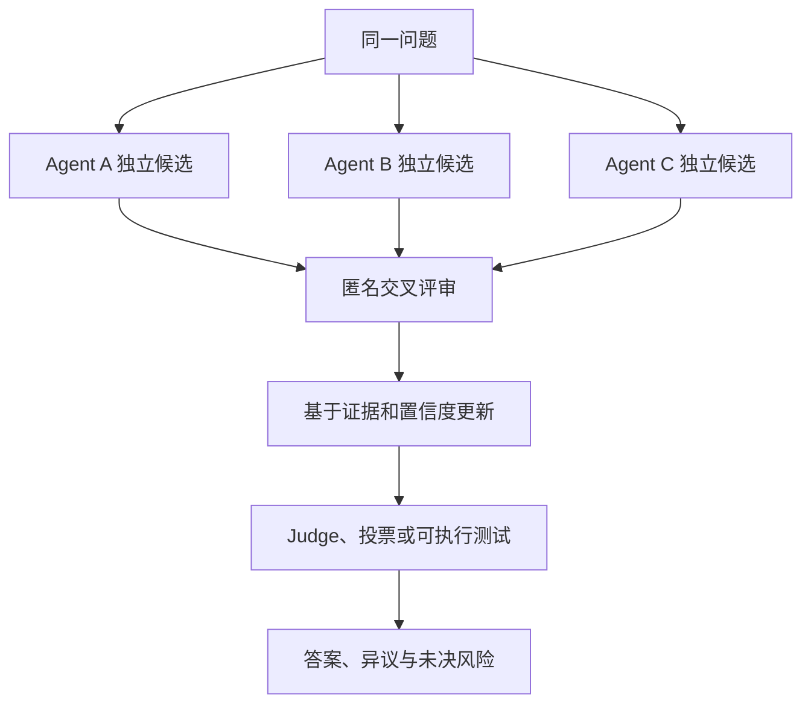
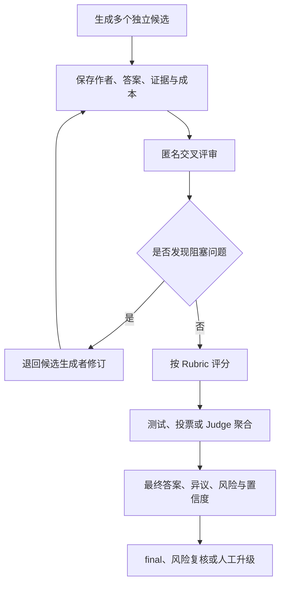
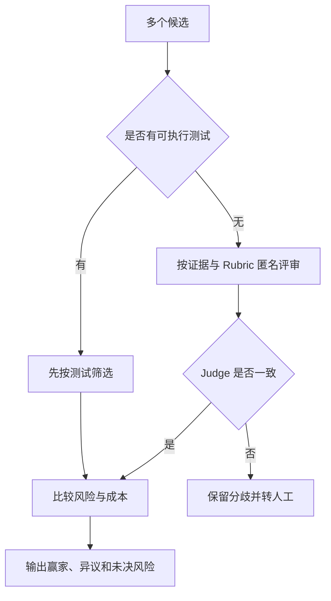

# 专题：Debate 辩论拓扑、置信度与裁判可靠性

> Debate（辩论）不是让多个 Agent 多说几轮。最新研究正在修正早期的乐观认识：同质 Agent 的普通辩论可能比多数投票更贵却不更准；真正有价值的环节是独立候选、多样性、显式置信度、证据核验和可靠裁判。

## 学习准备：先认清本页术语

| 英文术语 | 中文说法 | 含义 |
|---|---|---|
| Multi-agent debate | 多智能体辩论 | 多个 Agent 提出、批评和修正候选结论的协作结构。 |
| Critique | 评审 / 批评 | 独立检查候选答案中的事实、逻辑、证据或风险。 |
| Rubric | 评分规则 | 用明确维度与权重评估候选结果。 |
| Consensus | 共识 | 在证据和规则约束下形成的最终结论，不代表没有异议。 |
| Diversity | 多样性 | 候选在模型、提示、证据或推理路径上的差异。 |
| Calibrated confidence | 校准置信度 | 数值置信度与真实正确概率在统计上相符。 |
| Judge | 裁判 | 按 Rubric、证据或测试选择、合并候选的组件。 |
| Belief update | 信念更新 | Agent 读取他人论证后调整答案与置信度。 |

<!-- learning-path:start -->
<div class="learning-path"><div class="learning-path-title">本页怎么学</div>
<div class="learning-path-step"><span>1</span><div>先拆开候选生成、交叉批评、信念更新与裁判四个阶段。</div></div>
<div class="learning-path-step"><span>2</span><div>再阅读 2024–2026 年关于多样性、置信度和 Judge 偏差的新结果。</div></div>
<div class="learning-path-step"><span>3</span><div>最后设计带独立初始化、证据和停止条件的可评测辩论。</div></div>
</div>
<!-- learning-path:end -->

---

## 1. 辩论拓扑的最小闭环




读图时重点看：如果三个候选一开始就高度相同，后续轮次通常只是在重复共同错误。

辩论的有效信息来源包括不同证据、不同模型、不同工具结果和不同评价目标。仅改变角色名称，不会自动产生独立性。

---

## 2. 最新结论：普通辩论并不稳定优于投票


| 工作 | 时间与状态 | 最新启示 |
|---|---|---|
| [Encouraging Divergent Thinking through Multi-Agent Debate](https://aclanthology.org/2024.emnlp-main.992/) | EMNLP 2024 | 把辩论用于鼓励发散候选，而不只是趋同 |
| [Auto-Arena](https://aclanthology.org/2025.acl-long.223/) | ACL 2025 | 候选模型进行多轮对战，再由 Judge 委员会讨论决定，用于自动模型评测 |
| [DebUnc](https://aclanthology.org/2025.findings-emnlp.1265/) | Findings of EMNLP 2025 | 显式传递不确定性，缓解错误但自信的 Agent 误导同伴 |
| [Debatable Intelligence](https://aclanthology.org/2025.emnlp-main.953/) | EMNLP 2025 | LLM Judge 在辩论演讲评估上与人类判断既有接近也有系统差异 |
| [Demystifying Multi-Agent Debate](https://aclanthology.org/2026.findings-acl.1694/) | Findings of ACL 2026 | 普通 MAD 可能低于多数票；初始多样性与校准置信度是关键机制 |

这些结果意味着：辩论不是默认增强器。应先建立“独立候选 + 多数票”基线，再证明额外讨论确实提高了质量。

---

## 3. 一个带独立性和置信度的教学协议


```python
from pydantic import BaseModel, Field

class DebateClaim(BaseModel):
    agent: str
    answer: str
    evidence_refs: list[str] = Field(default_factory=list)
    assumptions: list[str] = Field(default_factory=list)
    confidence: float = Field(ge=0.0, le=1.0)

class Review(BaseModel):
    candidate_id: str
    factual_errors: list[str]
    unsupported_claims: list[str]
    strongest_point: str
    revised_confidence: float = Field(ge=0.0, le=1.0)
```

<div class="code-explanation"><div class="code-explanation-title">Python 代码说明</div><p><strong>用途：</strong>把答案、证据、假设和置信度分开，避免裁判只比较表达流畅度。<strong>执行过程：</strong>候选先声明证据与假设，评审者再记录事实错误、弱证据、优点和修正置信度。<strong>关键点：</strong>这是教学协议；置信度必须通过历史正确率校准，不能直接把模型自报数字当真。</p></div>

候选生成阶段应彼此隔离；交叉评审阶段可隐藏作者和模型名称；只有需要反驳时才共享相关论证，而不是把所有历史拼给每个 Agent。

---

## 4. 从独立候选到共识结果的完整工程流程


Debate 只是质量链路中的一个环节。完整流程应先独立保存候选与证据，再交叉评审；阻塞问题退回修订；满足门槛后才进入测试、投票或 Judge，并把裁决理由、异议和风险一起交给后续路由。



读图时重点看：最终对象不只有赢家；异议、未解决风险和置信度都会改变下一跳。

以数据库选型为例，PostgreSQL、MongoDB、SQLite 三个方案不应互相比“谁说得更像专家”，而要分别暴露硬性需求、证据、风险、迁移成本和回滚代价。Critic 负责挑战假设，Judge 负责按 Rubric 裁决，两者不能混成同一个无约束角色。

### 4.1 独立生成多个候选

```python
def generate_candidates(question: str, agents: list) -> list[dict]:
    return [
        {
            "agent": agent.name,
            "answer": agent.solve(question),
        }
        for agent in agents
    ]
```

<div class="code-explanation"><div class="code-explanation-title">多候选生成代码说明</div><p><strong>用途：</strong>让多个 Agent 对同一问题分别生成候选。<strong>执行过程：</strong>函数逐一调用 <code>solve()</code>，并把作者名称和答案绑定。<strong>关键点：</strong>候选生成前不要共享彼此的推理轨迹；真实系统还要保存模型版本、证据引用、Prompt 版本和成本。</p></div>

候选多样性可以来自不同角色视角、检索来源、模型或采样设置，但所有候选应遵守同一输出 Schema，才能可靠评审。简单确定性问题应优先使用工具，而不是为了“多样性”重复调用模型。

### 4.2 用 Rubric 固定裁决标准

```python
class RubricScore(BaseModel):
    correctness: int
    evidence: int
    completeness: int
    safety: int
    clarity: int
    comments: str

def total_score(s: RubricScore) -> int:
    return (
        3 * s.correctness
        + 2 * s.evidence
        + 2 * s.completeness
        + 2 * s.safety
        + s.clarity
    )
```

<div class="code-explanation"><div class="code-explanation-title">Rubric 代码说明</div><p><strong>用途：</strong>把正确性、证据、完整性、安全和清晰度拆成显式评分维度。<strong>执行过程：</strong>示例按风险偏好设置权重后求总分。<strong>关键点：</strong>每个分值必须配锚点样例；没有评分定义时，不同 Reviewer 给出的数字不可比较。</p></div>

Rubric 不是固定模板。代码任务应提高测试与安全权重，研究报告应提高证据与覆盖度权重。Judge 只能在看见规则后评分，不能临时发明标准。

### 4.3 交叉评审并禁止自评

```python
def cross_review(candidates, reviewers):
    reviews = []
    for candidate in candidates:
        for reviewer in reviewers:
            if reviewer.name == candidate["agent"]:
                continue
            reviews.append({
                "candidate": candidate["agent"],
                "reviewer": reviewer.name,
                "review": reviewer.review(candidate["answer"]),
            })
    return reviews
```

<div class="code-explanation"><div class="code-explanation-title">交叉评审代码说明</div><p><strong>用途：</strong>让候选作者之外的 Reviewer 检查结果。<strong>执行过程：</strong>双层循环遍历候选与评审者，跳过同名自评，并保存评审责任。<strong>关键点：</strong>成本会按候选数乘评审数增长，可先用便宜规则筛选，再对少数候选深评。</p></div>

评审输出应包含问题位置、严重度、证据和修复建议，而不是笼统评价。隐藏候选作者和模型名称，可以降低品牌与角色偏差。

### 4.4 投票、Judge 与可执行测试

多数投票只能作为独立候选的简单基线：

```python
from collections import Counter

def majority_vote(answers):
    return Counter(answers).most_common(1)[0]
```

<div class="code-explanation"><div class="code-explanation-title">多数投票代码说明</div><p><strong>用途：</strong>统计最常出现的答案。<strong>执行过程：</strong><code>Counter</code> 返回最高频答案及票数。<strong>关键点：</strong>它没有处理答案归一化、平票和成员相关性；同质 Agent 的多数票可能只是重复共同偏差。</p></div>

有多个 Reviewer 时，可以先汇总候选平均分：

```python
def judge_select(candidates, scores):
    by_candidate = {}
    for score in scores:
        by_candidate.setdefault(score["candidate"], []).append(score["total"])
    avg = {k: sum(v) / len(v) for k, v in by_candidate.items()}
    winner = max(avg.items(), key=lambda x: x[1])[0]
    return next(c for c in candidates if c["agent"] == winner)
```

<div class="code-explanation"><div class="code-explanation-title">评分裁判代码说明</div><p><strong>用途：</strong>按多个评审的平均分选择候选。<strong>执行过程：</strong>函数先按候选归集分数，再求平均并返回赢家对象。<strong>关键点：</strong>平均值不能自动消除异常值、Judge 偏差或缺失评分，生产实现需要校准和拒绝路径。</p></div>

对代码、查询和计算结果，可执行测试优先于语言裁判：

```python
def select_by_tests(candidates):
    passing = [c for c in candidates if c["tests_passed"]]
    if passing:
        return min(passing, key=lambda c: c["risk_score"])
    return max(candidates, key=lambda c: c["partial_score"])
```

<div class="code-explanation"><div class="code-explanation-title">测试优先代码说明</div><p><strong>用途：</strong>先用可执行结果筛选候选。<strong>执行过程：</strong>存在通过测试的候选时选择风险最低者；全部失败时才比较部分得分。<strong>关键点：</strong>测试覆盖不足时“通过”仍不等于完全正确，还要结合需求和安全检查。</p></div>

### 4.5 共识必须保留少数意见

```python
class ConsensusResult(BaseModel):
    final_answer: str
    winning_candidate: str
    dissenting_opinions: list[str]
    unresolved_risks: list[str]
    confidence: float
```

<div class="code-explanation"><div class="code-explanation-title">共识结果代码说明</div><p><strong>用途：</strong>让聚合结果同时保留赢家、少数意见、风险和置信度。<strong>执行过程：</strong>这些字段随最终答案一起交给后续路由或人工审批。<strong>关键点：</strong>共识不等于全体一致；高风险场景中，被多数忽略的边界条件可能正是事故来源。</p></div>

### 4.6 置信度必须改变下一跳

```python
def route_after_consensus(result: ConsensusResult):
    if result.confidence < 0.65:
        return "ask_human"
    if result.unresolved_risks:
        return "risk_review"
    return "final"
```

<div class="code-explanation"><div class="code-explanation-title">置信度路由代码说明</div><p><strong>用途：</strong>把共识质量转成明确控制流。<strong>执行过程：</strong>低置信度先转人工，有未解决风险则转风险复核，只有其余情况才能结束。<strong>关键点：</strong>0.65 是教学阈值，应从历史正确率校准；同一模型的相关投票不能简单累加成更高置信度。</p></div>

置信度可以综合候选一致程度、测试通过率、证据质量和 Reviewer 分数方差。它如果不影响路由、审批或停止条件，就只是装饰数字。

---

## 5. 停止辩论比开始辩论更重要


```python
def should_continue_debate(round_id: int, claims: list[DebateClaim], new_evidence: int) -> bool:
    if round_id >= 3:
        return False
    answers = {claim.answer for claim in claims}
    confidence_gap = max(c.confidence for c in claims) - min(c.confidence for c in claims)
    if len(answers) == 1 and confidence_gap < 0.1:
        return False
    if new_evidence == 0 and round_id >= 1:
        return False
    return True
```

<div class="code-explanation"><div class="code-explanation-title">Python 代码说明</div><p><strong>用途：</strong>用轮数、答案差异、置信度差异和新证据判断继续讨论是否有价值。<strong>执行过程：</strong>到达三轮、答案已趋同或一轮后没有新证据时停止，否则继续。<strong>关键点：</strong>这是教学启发式；生产阈值要通过数据校准，并保留“表面一致但共同错误”的外部验证路径。</p></div>

---

## 6. Judge 是独立风险源


Judge 可能偏好更长、更自信、与自己模型风格相近的答案。降低风险的方法包括：固定 Rubric、匿名候选、证据定位、可执行测试优先、多个 Judge 委员会、保留少数意见和人工抽检。

### 图文对照：裁决优先级



读图时重点看：能用测试验证的内容不应只交给语言裁判；无法消除的分歧也不应被隐藏。

---

## 7. 如何评测辩论的真实增益


必须比较单 Agent、独立多候选多数票、一次交叉评审、多轮辩论四种设置，并控制总 token 或总调用数。指标包括正确率、校准误差、新证据率、观点多样性、Judge 与人类一致率、每次成功成本和达到稳定结论的轮数。

---

<!-- chapter-check:start -->
## 专题自检
<div class="chapter-check"><div class="chapter-check-title">不看正文，尝试回答</div><ul>
<li>为什么同质 Agent 的多轮辩论可能不如简单多数票？</li>
<li>能否区分候选生成、评审、聚合和最终路由四个阶段？</li>
<li>多数票、Judge 和可执行测试各自可能错在哪里？</li>
<li>为什么共识对象必须保留少数意见与未解决风险？</li>
<li>多样性和校准置信度分别解决什么问题？</li>
<li>Judge 为什么必须接受独立评测？</li>
<li>什么信号表明下一轮讨论不会再产生新信息？</li>
</ul></div>
<!-- chapter-check:end -->
