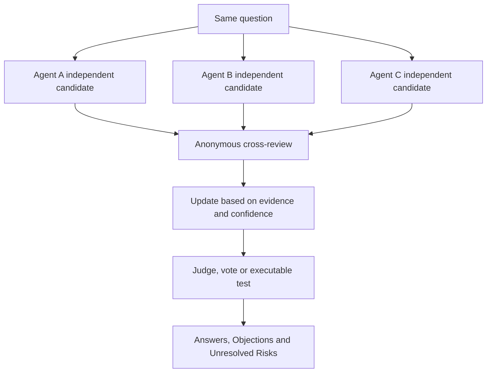
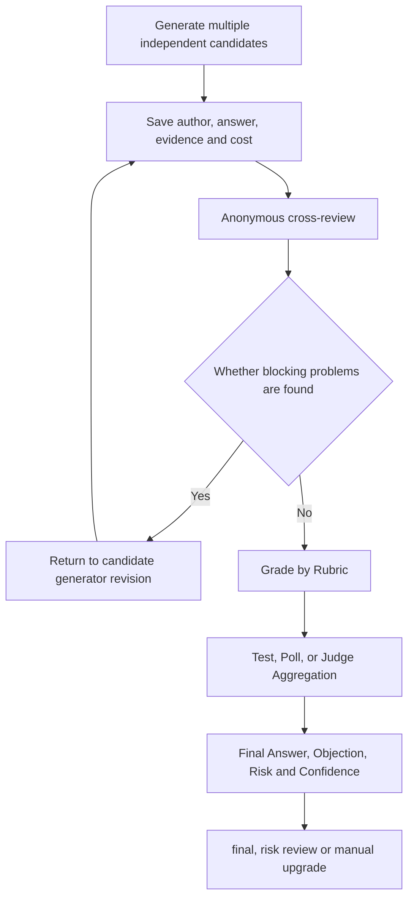
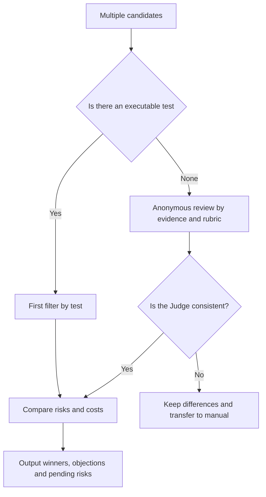

# Topic: Debate debate topology, confidence and referee reliability

> Debate is not about letting multiple Agents speak for more rounds. The latest research is revising the early optimistic understanding: ordinary debate among homogeneous agents may be more expensive but not more accurate than majority voting; the truly valuable links are independent candidates, diversity, explicit confidence, evidence verification and reliable referees.

## Study preparation: First understand the terms on this page

| Term | Working definition | Meaning |
|---|---|---|
| Multi-agent debate | Multi-agent debate | A collaborative structure in which multiple agents propose, criticize, and revise candidate conclusions. |
| Critique | Review/Criticism | Independent examination of facts, logic, evidence, or risks in candidate answers. |
| Rubric | Scoring rules | Evaluate candidates using explicit dimensions and weights. |
| Consensus | Consensus | The final conclusion formed under the constraints of evidence and rules does not mean that there are no objections. |
| Diversity | Diversity | Differences between candidates in models, hints, evidence, or reasoning paths. |
| Calibrated confidence | Calibrated confidence | Numerical confidence that is statistically consistent with the true probability of being correct. |
| Judge | Judge | Select and merge candidate components by rubric, evidence, or test. |
| Belief update | Belief update | Agent adjusts answers and confidence after reading other people's arguments. |

<!-- learning-path:start -->
<div class="learning-path"><div class="learning-path-title">How to learn on this page</div>
<div class="learning-path-step"><span>1</span><div> First separate the four stages of candidate generation, cross-criticism, belief updating and judging. </div></div>
<div class="learning-path-step"><span>2</span><div>Read again 2024–2026 New results on diversity, confidence, and Judge bias. </div></div>
<div class="learning-path-step"><span>3</span><div> Finally, design an evaluable argument with independent initialization, evidence, and stopping conditions. </div></div>
</div>
<!-- learning-path:end -->

---

## 1. Debate the minimum closed loop of topology




When reading the picture, pay attention to this: If the three candidates are highly identical at the beginning, subsequent rounds will usually just repeat the common mistakes.

Valid sources of information for debate include different evidence, different models, different tool results, and different evaluation objectives. Merely changing a character's name does not automatically create independence.

---

## 2. Latest conclusion: Ordinary debate is not more stable than voting


| Work | Time and Status | Latest Inspiration |
|---|---|---|
| [Encouraging Divergent Thinking through Multi-Agent Debate](https://aclanthology.org/2024.emnlp-main.992/) | EMNLP 2024 | Use debate to encourage divergent candidates, not just convergence |
| [Auto-Arena](https://aclanthology.org/2025.acl-long.223/) | ACL 2025 | Candidate models compete in multiple rounds, and then are discussed and decided by the Judge Committee for automatic model evaluation |
| [DebUnc](https://aclanthology.org/2025.findings-emnlp.1265/) | Findings of EMNLP 2025 | Explicitly conveying uncertainty to mitigate erroneous but confident Agents from misleading peers |
| [Debatable Intelligence](https://aclanthology.org/2025.emnlp-main.953/) | EMNLP 2025 | LLM Judge is both close to and systematically different from human judgment in debate speech evaluation |
| [Demystifying Multi-Agent Debate](https://aclanthology.org/2026.findings-acl.1694/) | Findings of ACL 2026 | Ordinary MAD may be lower than majority vote; initial diversity and calibration confidence are key mechanisms |

What these results mean: Debate is not a default enhancer. A baseline of "independent candidates + majority vote" should be established before additional discussion can be shown to improve quality.

---

## 3. A teaching protocol with independence and confidence


```python
from pydantic import BaseModel, Field

class DebateClaim(BaseModel):
    agent: str
    answer: str
    evidence_refs: list[str] = Field(default_factory=list)
    assumptions: list[str] = Field(default_factory=list)
    confidence: float = Field(ge=0.0, le=1.0)

class Review(BaseModel):
    candidate_id: str
    factual_errors: list[str]
    unsupported_claims: list[str]
    strongest_point: str
    revised_confidence: float = Field(ge=0.0, le=1.0)
```

<div class="code-explanation"><div class="code-explanation-title">Python code description</div><p><strong>Purpose: </strong>Separate answers, evidence, assumptions and confidence to avoid referees only comparing expression fluency. <strong>Execution process:</strong>The candidate first states the evidence and hypothesis, and the reviewer then records factual errors, weak evidence, strengths, and revised confidence. <strong>Key points: </strong>This is a teaching protocol; the confidence level must be calibrated by historical accuracy, and the self-reported numbers of the model cannot be taken seriously. </p></div>

The candidate generation stages should be isolated from each other; the cross-review stage can hide author and model names; only share relevant arguments when refutation is needed, rather than assigning all history to each Agent.

---

## 4. Complete engineering process from independent candidates to consensus results


Debate is just one link in the quality chain. The complete process should first independently save candidates and evidence, and then cross-review; blocking issues should be returned for revision; only enter testing, voting or judge after meeting the threshold, and hand over the ruling reasons, objections and risks to subsequent routing.



When reading the diagram, pay attention to this: there is more than just a winner in the end; objections, unresolved risks, and confidence levels all change the next hop.

Taking database selection as an example, the three solutions of PostgreSQL, MongoDB, and SQLite should not compete with each other on "who is more expert", but should expose the hard requirements, evidence, risks, migration costs, and rollback costs respectively. Critic is responsible for challenging assumptions, and Judge is responsible for ruling according to rubric. The two cannot be mixed into the same unconstrained role.

### 4.1 Independently generate multiple candidates

```python
def generate_candidates(question: str, agents: list) -> list[dict]:
    return [
        {
            "agent": agent.name,
            "answer": agent.solve(question),
        }
        for agent in agents
    ]
```

<div class="code-explanation"><div class="code-explanation-title">Multiple candidate generation code description</div><p><strong>Purpose: </strong>Let multiple Agents generate candidates for the same problem. <strong> execution process: </strong> function calls <code>solve()</code> one by one, and binds the author's name to the answer. <strong>Key points: </strong>Do not share each other’s reasoning trajectories before candidate generation; real systems also need to save model versions, evidence references, Prompt versions, and costs. </p></div>

Candidate diversity can come from different actor perspectives, search sources, models, or sampling settings, but all candidates should adhere to the same output schema for reliable review. Simple deterministic problems should give priority to using tools rather than repeatedly invoking models for the sake of "diversity".

### 4.2 Use Rubric to Fix Judgment Criteria

```python
class RubricScore(BaseModel):
    correctness: int
    evidence: int
    completeness: int
    safety: int
    clarity: int
    comments: str

def total_score(s: RubricScore) -> int:
    return (
        3 * s.correctness
        + 2 * s.evidence
        + 2 * s.completeness
        + 2 * s.safety
        + s.clarity
    )
```

<div class="code-explanation"><div class="code-explanation-title">Rubric Code Description</div><p><strong>Purpose: </strong>Split correctness, evidence, completeness, security, and clarity into explicit scoring dimensions. <strong> Execution process: </strong> Example: Set the weight according to risk preference and find the total score. <strong>Key points: </strong>Each score must be equipped with an anchor point sample; when there is no score definition, the numbers given by different Reviewers are not comparable. </p></div>

Rubrics are not fixed templates. Code tasks should be given a higher weight on testing and security, and research reports should be given a higher weight on evidence and coverage. The Judge can only score after seeing the rules and cannot invent standards on the fly.

### 4.3 Cross-evaluation and self-evaluation prohibited

```python
def cross_review(candidates, reviewers):
    reviews = []
    for candidate in candidates:
        for reviewer in reviewers:
            if reviewer.name == candidate["agent"]:
                continue
            reviews.append({
                "candidate": candidate["agent"],
                "reviewer": reviewer.name,
                "review": reviewer.review(candidate["answer"]),
            })
    return reviews
```

<div class="code-explanation"><div class="code-explanation-title">Cross-review code description</div><p><strong>Purpose: </strong>Let a reviewer other than the candidate author check the results. <strong> Execution process: </strong> Double-layer loop traverses candidates and reviewers, skips self-evaluation with the same name, and saves review responsibilities. <strong> Key points: </strong> The cost will increase according to the number of candidates multiplied by the number of reviews. You can use cheap rules to screen first, and then evaluate a few candidates in depth. </p></div>

Review output should include problem location, severity, evidence, and recommendations for remediation rather than a general evaluation. Hiding candidate author and model names can reduce brand and role bias.

### 4.4 Voting, Judge and Executable Testing

Majority voting only serves as a simple baseline for independent candidates:

```python
from collections import Counter

def majority_vote(answers):
    return Counter(answers).most_common(1)[0]
```

<div class="code-explanation"><div class="code-explanation-title">Majority Voting Code Description</div><p><strong>Purpose: </strong> Counts the most frequently occurring answers. <strong> Execution process: </strong><code>Counter</code> Returns the most frequent answers and votes. <strong>Key Points: </strong>It does not handle answer normalization, tie votes, and member correlation; majority votes of homogeneous Agents may simply repeat common deviations. </p></div>

When there are multiple Reviewers, you can first summarize the candidate average scores:

```python
def judge_select(candidates, scores):
    by_candidate = {}
    for score in scores:
        by_candidate.setdefault(score["candidate"], []).append(score["total"])
    avg = {k: sum(v) / len(v) for k, v in by_candidate.items()}
    winner = max(avg.items(), key=lambda x: x[1])[0]
    return next(c for c in candidates if c["agent"] == winner)
```

<div class="code-explanation"><div class="code-explanation-title">Scoring judge code description</div><p><strong>Purpose: </strong>Select candidates based on the average score of multiple judges. <strong> execution process: </strong> function first collects scores according to candidates, then averages and returns the winner object. <strong> Key Points: </strong> Average does not automatically eliminate outliers, judge bias, or missing scores, and production implementation requires calibration and rejection paths. </p></div>

For code, queries, and calculation results, executable testing takes precedence over language review:

```python
def select_by_tests(candidates):
    passing = [c for c in candidates if c["tests_passed"]]
    if passing:
        return min(passing, key=lambda c: c["risk_score"])
    return max(candidates, key=lambda c: c["partial_score"])
```

<div class="code-explanation"><div class="code-explanation-title">Test priority code description</div><p><strong>Purpose: </strong>First filter candidates with executable results. <strong>Execution process: </strong>When there are candidates that pass the test, the one with the lowest risk is selected; partial scores are compared only when all candidates fail. <strong> Key points: </strong> When the test coverage is insufficient, "passing" still does not mean that it is completely correct, and it must be combined with requirements and security checks. </p></div>

### 4.5 Consensus must retain minority opinions

```python
class ConsensusResult(BaseModel):
    final_answer: str
    winning_candidate: str
    dissenting_opinions: list[str]
    unresolved_risks: list[str]
    confidence: float
```

<div class="code-explanation"><div class="code-explanation-title">Consensus result code description</div><p><strong>Purpose: </strong> Let the aggregated results preserve the winner, minority opinion, risk and confidence simultaneously. <strong> Execution process: </strong> These fields are handed over to subsequent routing or manual approval along with the final answer. <strong> Key points: </strong> Consensus does not mean unanimous agreement; in high-risk scenarios, boundary conditions ignored by most may be the source of accidents. </p></div>

### 4.6 Confidence must change next hop

```python
def route_after_consensus(result: ConsensusResult):
    if result.confidence < 0.65:
        return "ask_human"
    if result.unresolved_risks:
        return "risk_review"
    return "final"
```

<div class="code-explanation"><div class="code-explanation-title">Confidence routing code description</div><p><strong>Purpose: </strong>Convert consensus quality into explicit control flow. <strong> Execution process: </strong> If the confidence level is low, it will be transferred to manual first. If there are unresolved risks, it will be transferred to risk review. Only in other cases can it be ended. <strong>Key points: </strong>0.65 is a teaching threshold and should be calibrated from historical accuracy; related votes for the same model cannot simply be accumulated into a higher confidence level. </p></div>

Confidence combines candidate agreement, test pass rate, evidence quality, and Reviewer score variance. It is just a decorative number if it does not affect routing, approval, or stopping conditions.

---

## 5. Stopping a debate is more important than starting it


```python
def should_continue_debate(round_id: int, claims: list[DebateClaim], new_evidence: int) -> bool:
    if round_id >= 3:
        return False
    answers = {claim.answer for claim in claims}
    confidence_gap = max(c.confidence for c in claims) - min(c.confidence for c in claims)
    if len(answers) == 1 and confidence_gap < 0.1:
        return False
    if new_evidence == 0 and round_id >= 1:
        return False
    return True
```

<div class="code-explanation"><div class="code-explanation-title">Python code description</div><p><strong>Purpose: </strong> Use the number of rounds, answer differences, confidence differences, and new evidence to determine whether there is value in continuing the discussion. <strong> Execution process: </strong> Stop when three rounds are reached, the answers have converged, or there is no new evidence after one round, otherwise continue. <strong> Key Points: </strong> This is a teaching heuristic; production thresholds are calibrated with data and an external validation path remains for "ostensibly consistent but common errors". </p></div>

---

## 6. Judge is an independent source of risk


The Judge may prefer answers that are longer, more confident, and similar in style to his own model. Methods to reduce risk include: fixed rubrics, anonymous candidates, evidence location, prioritizing executable tests, multiple Judge committees, retaining minority opinions, and manual sampling.

### Picture and text comparison: Judgment priority



When reading the picture, pay attention to: content that can be verified by testing should not be handed over to language referees alone; differences that cannot be eliminated should not be hidden.

---

## 7. How to evaluate the real gain of debate


It is necessary to compare the four settings of single agent, independent multi-candidate majority vote, one cross-review, and multiple rounds of debate, and control the total token or total number of calls. Metrics include accuracy rate, calibration error, new evidence rate, viewpoint diversity, Judge-human agreement rate, cost per success, and number of rounds to reach a stable conclusion.

---

<!-- chapter-check:start -->
## Special topic self-examination
<div class="chapter-check"><div class="chapter-check-title"> Without reading the text, try to answer </div><ul>
<li> Why might multi-round debate with homogeneous agents be inferior to simple majority voting? </li>
<li> Can you distinguish between the four stages of candidate generation, review, aggregation and final routing? </li>
<li>What might each be wrong with Majority, Judge, and Executable tests? </li>
<li> Why must consensus objects retain minority opinions and unresolved risks? </li>
<li>What problems do diversity and calibration confidence solve respectively? </li>
<li>Judge Why must I be independently evaluated? </li>
<li>What signal indicates that the next round of discussion will not yield new information? </li>
</ul></div>
<!-- chapter-check:end -->
