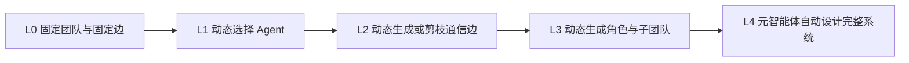
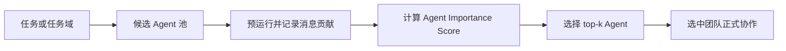
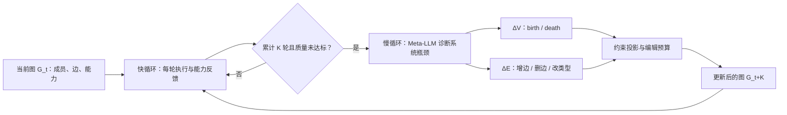

# 专题：Dynamic Topology 动态拓扑与自动团队设计

> Dynamic Topology（动态拓扑）允许系统根据任务和运行状态选择 Agent、生成通信边、剪除冗余连接或重组子团队。它不是“运行时随便创建角色”：最新研究正在把动态设计形式化为图生成、团队选择、通信剪枝和自动 Agentic System 搜索，同时也放大了成本、复现、安全和治理问题。

## 学习准备：先认清本页术语

| 英文术语 | 中文说法 | 含义 |
|---|---|---|
| Dynamic topology | 动态拓扑 | Agent 集合或通信关系随任务、状态和反馈发生变化。 |
| Team selection | 团队选择 | 从候选池中挑选与当前任务最匹配的 Agent。 |
| Topology generation | 拓扑生成 | 根据任务直接产生通信图，而不是套用固定模板。 |
| Communication pruning | 通信剪枝 | 删除低价值、重复或危险的消息边。 |
| Meta-agent | 元智能体 | 负责设计、修改或评估其他 Agent 系统的上层 Agent。 |

<!-- learning-path:start -->
<div class="learning-path"><div class="learning-path-title">本页怎么学</div>
<div class="learning-path-step"><span>1</span><div>先区分团队选择、边生成、通信剪枝和全系统自动设计四种动态程度。</div></div>
<div class="learning-path-step"><span>2</span><div>再追踪 DyLAN、G-Designer、ARG-Designer、GoAgent 与 ADAS 的演进。</div></div>
<div class="learning-path-step"><span>3</span><div>最后为动态变更加入预算、权限、验证和可重放快照。</div></div>
</div>
<!-- learning-path:end -->

---

## 1. 动态拓扑有四个不同层级




读图时重点看：动态程度越高，搜索空间和治理成本越大；没有评测器与预算时，不应直接跳到 L4。

很多项目把“根据任务选择三个预定义角色”也称为动态拓扑。它属于 L1，和自动产生新角色、新边、循环及工具配置的 L3/L4 有本质差异。

---

## 2. 2023–2026 的研究演进


| 工作 | 时间与状态 | 动态设计对象 |
|---|---|---|
| [DyLAN](https://arxiv.org/abs/2310.02170) | 2023，arXiv | 先按 Agent Importance Score 选择团队，再让选中 Agent 动态协作 |
| [G-Designer](https://arxiv.org/abs/2410.11782) | 2024，arXiv | 用任务虚拟节点与图模型生成任务自适应通信拓扑 |
| [AgentPrune](https://arxiv.org/abs/2410.02506) | ICLR 2025 会议论文 | 在时空消息图上一次性剪除冗余或恶意通信 |
| [Automated Design of Agentic Systems](https://openreview.net/forum?id=t9U3LW7JVX) | ICLR 2025 会议论文 | Meta Agent Search 以代码发现新的 Agentic System 设计 |
| [ARG-Designer](https://arxiv.org/abs/2507.18224) | 2025，arXiv，公开代码 | 自回归决定 Agent 数量、角色和通信边，从头构造协作图 |
| [Dynamic Generation with Graph Diffusion Models](https://arxiv.org/abs/2510.07799) | 2025，arXiv | 将多 Agent 通信拓扑生成建模为图扩散问题 |
| [GoAgent](https://arxiv.org/abs/2603.19677) | 2026，arXiv 预印本 | 以协作小组为生成原子，联合建模组内凝聚和组间协调 |

从 G-Designer 到 ARG-Designer、GoAgent，研究单位从“单个 Agent 节点”进一步扩展到“角色、边和协作小组共同生成”。这些是前沿结果，应保留预印本状态说明。

---

## 3. L1：动态选择 Agent，团队候选与通信模板不变


L1 改变的是**本次任务启用哪些 Agent**。系统先准备一个候选池，角色提示、工具和基本通信模板都已经存在；选择器只输出候选池的子集。它不创造新角色，也不重新设计所有通信边。

### L1 的工作原理

1. 让候选 Agent 在一批代表性任务或一次预运行中协作。
2. 从最终有效答案向前追踪贡献：末轮给产生正确答案的活跃节点分配权重，再沿消息边把重要性传回上游。
3. 按角色或 Agent 汇总分数，在固定预算下选择 top-k。
4. 使用选中团队执行正式任务；若任务分布改变，应重新估计分数，不能把一次排名永久固化。



读图时重点看：L1 的输出是 Agent 子集，不是新的角色描述或通信图；预运行与正式执行是两个阶段。

### 真实案例：DyLAN

[DyLAN 论文](https://openreview.net/forum?id=XII0Wp1XA9)发表于 COLM 2024。它把流程拆成 Team Optimization 与 Task Solving：先用无监督的 Agent Importance Score 衡量候选 Agent 对结果的贡献，再让选中团队处理任务。官方 [DyLAN 仓库](https://github.com/SALT-NLP/DyLAN)提供 MATH、MMLU、HumanEval 和任意查询 demo。

下面是仓库提交 [`006e440`](https://github.com/SALT-NLP/DyLAN/tree/006e440a519f7cf21e2826f3b8033d84ae9bf07c) 中 [`code/demo/LLMLP.py`](https://github.com/SALT-NLP/DyLAN/blob/006e440a519f7cf21e2826f3b8033d84ae9bf07c/code/demo/LLMLP.py#L174-L181) 的真实代码节选：

```python
for idx in range(self.agents*rid, self.agents*(rid+1)):
    self.nodes[idx].importance = 0
    if self.nodes[idx].active:
        for edge in self.nodes[idx].to_edges:
            self.nodes[idx].importance += edge.weight * edge.a2.importance

return [node.importance for node in self.nodes]
```

<div class="code-explanation"><div class="code-explanation-title">DyLAN 源码说明</div><p><strong>用途：</strong>把下游节点的重要性沿真实通信边传回上游节点。<strong>执行过程：</strong>每个活跃节点累加“边权重 × 下游重要性”，最终返回所有节点的 importance。<strong>关键点：</strong>这是 Agent Importance Score 的反向贡献传播，不是模型凭角色名称主观打分。</p></div>

仓库的 [`run_DyLAN.py`](https://github.com/SALT-NLP/DyLAN/blob/006e440a519f7cf21e2826f3b8033d84ae9bf07c/code/demo/run_DyLAN.py#L39-L57)调用 `forward()`、`backward()` 并打印各 Agent 分数。不过这个 demo 的 `ROLES` 仍由用户显式填写，**没有在同一个脚本中展示自动 top-k 后重新实例化团队的完整运行链**。因此它能直接证明分数怎样计算，团队选择的整体效果还应结合论文实验和仓库中的任务配置理解。

L1 上线时至少要保存候选池版本、评分任务集、每个 Agent 的聚合分数和最终选择结果。否则无法解释“为什么这次启用 A 而没有启用 B”。

---

## 4. L2：动态生成或剪除通信边，Agent 集合不变


L2 固定 Agent 节点及其角色，改变的是**谁能把信息传给谁**。边可以在任务开始前由任务特征生成，也可以在运行中根据消息价值剪除。与 L1 相比，参与者可能完全相同，但执行顺序、可见上下文和通信成本都会变化。

### L2 的工作原理

以任务条件化的图生成器为例：

1. 把任务文本和每个 Agent 的角色描述编码成节点特征，并加入任务信息。
2. 图模型根据角色关系传播特征，得到每个节点的任务条件表示。
3. 用节点表示两两计算边分数，将分数转成概率或阈值判断。
4. 只实例化被选中的边，检查环与连通性，再按拓扑顺序执行 Agent。
5. 用任务质量与通信成本共同训练或筛选图；只优化正确率容易退化成全连接。


读图时重点看：任务不会直接生成自然语言流程，而是先改变节点表示，再改变边概率；真正执行前仍需做确定性的图合法性检查。

### 真实案例：G-Designer

[G-Designer 论文](https://openreview.net/forum?id=Jov79pGXc6)发表于 ICLR 2025 Foundation Models in the Wild Workshop。它使用任务虚拟信息、Agent profile 和图神经网络设计任务自适应通信拓扑。官方 [GDesigner 仓库](https://github.com/yanweiyue/GDesigner)提供 MMLU、HumanEval、GSM8K 的训练与评测入口。

下面是仓库提交 [`a6efcfa`](https://github.com/yanweiyue/GDesigner/tree/a6efcfa3b40bb4d9cbf46f883a95d62020bd8251) 中 [`GDesigner/graph/graph.py`](https://github.com/yanweiyue/GDesigner/blob/a6efcfa3b40bb4d9cbf46f883a95d62020bd8251/GDesigner/graph/graph.py#L311-L323) 的真实代码节选：

```python
new_features = self.construct_new_features(input['task'])
logits = self.gcn(new_features,self.role_adj_matrix)
logits = self.mlp(logits)
self.spatial_logits = logits @ logits.t()
self.spatial_logits = min_max_norm(torch.flatten(self.spatial_logits))

for round in range(num_rounds):
    log_probs += self.construct_spatial_connection()
```

<div class="code-explanation"><div class="code-explanation-title">G-Designer 源码说明</div><p><strong>用途：</strong>根据当前任务为固定 Agent 集合计算通信边。<strong>执行过程：</strong><code>construct_new_features()</code>加入任务特征，GCN 与 MLP 得到节点表示，表示矩阵与其转置相乘形成两两边分数，随后 <code>construct_spatial_connection()</code>实例化空间通信边。<strong>关键点：</strong>这里变化的是 <code>spatial_logits</code> 和实际连接，不是 Agent 角色列表。</p></div>

同一文件的 [`construct_spatial_connection()`](https://github.com/yanweiyue/GDesigner/blob/a6efcfa3b40bb4d9cbf46f883a95d62020bd8251/GDesigner/graph/graph.py#L216-L242)会对边分数做 sigmoid，并按概率或阈值添加边，同时用 `check_cycle()` 阻止空间图形成环。随后 `arun()` 按入度为零的节点队列执行 Agent。这一调用链完整展示了“任务条件化边分数 → 真实连接 → 图执行”。

工程上必须额外记录任务特征版本、边分数、采样随机种子、最终邻接矩阵和 token 成本。另需注意：核验提交中没有发现 LICENSE 文件；代码可以公开阅读和复现实验，但进一步复制或再发布前应确认授权条件。

---

## 5. L3：推理时增删 Agent、重连拓扑并共同演化能力


L3 不只在任务开始前挑选成员或生成边，而是允许**同一个任务的执行过程**改变 Agent 集合、角色实例和通信拓扑。这里采用 [TacoMAS 论文](https://arxiv.org/pdf/2605.09539)的定义：系统状态写成随轮次变化的 Agent 图 `G_t = (T_t, Φ_t)`，其中 `T_t = (V_t, E_t)` 是成员和通信边，`Φ_t` 是每个 Agent 的角色提示、上下文记忆和工具能力状态。

核心难点不是“能否修改”，而是两类修改不能同速发生：

- **快能力循环**：每一轮都根据 Agent 轨迹、工具结果和贡献评分，更新其工作流提示与上下文记忆。
- **慢拓扑循环**：每隔 `K` 轮才检查一次系统瓶颈，执行 Agent birth/death、边增加、边删除或边类型变更。
- **编辑预算**：一次慢更新最多修改 `B_V` 个 Agent 和 `B_E` 条边，避免局部改进刚生效，协作结构就被大幅改写。

### L3 的工作原理

1. Meta-LLM 从固定角色池初始化 Agent 图；论文实验设置初始 Agent 数为 5。
2. 每个快轮次按当前图执行 Agent，Meta-Judge 评估每个 Agent 的贡献，Meta-LLM 生成下一轮的具体改进建议并写回能力状态。
3. 快轮次累计到 `K`，且答案尚未达到阈值时，慢循环读取多轮轨迹与贡献趋势。
4. 慢循环输出结构增量 `ΔT = (ΔV, ΔE)`：新增或移除 Agent，或者修复信息流边。
5. 运行时把提案投影到允许空间，检查人口上下限、关键角色、受保护节点、最大度、连通性以及 Agent/边编辑预算，然后才执行。
6. 答案达到质量阈值、到达最大轮次 `R`，或 Meta-LLM 判断已经收敛时停止。



读图时重点看：能力更新先在相对稳定的拓扑中连续运行，拓扑修改只周期性发生。若两者每轮同时大改，Agent 刚形成的证据来源和协作策略会立即失效。

### 真实案例：TacoMAS

[TacoMAS: Test-Time Co-Evolution of Topology and Capability in LLM-based Multi-Agent Systems](https://arxiv.org/pdf/2605.09539)是 2026-05-10 发布的 arXiv v1 预印本。论文在金融分析、Web 检索、Minecraft 风格规划和工作任务执行四类基准上评测，并报告相对最强基线平均提升 13.3%。论文给出的官方代码是 [chenxu2-gif/TacoMAS-MultiAgent](https://github.com/chenxu2-gif/TacoMAS-MultiAgent)。

下面是仓库提交 [`6f0d545`](https://github.com/chenxu2-gif/TacoMAS-MultiAgent/tree/6f0d545f2493cf95d2eb6a325d1a6686acf658eb) 中 [`tacomas/meta_evolution/mas_runtime.py`](https://github.com/chenxu2-gif/TacoMAS-MultiAgent/blob/6f0d545f2493cf95d2eb6a325d1a6686acf658eb/tacomas/meta_evolution/mas_runtime.py#L4029-L4052) 的真实代码节选：

```python
def run_until_stable(self) -> Dict[str, Any]:
    """Run fast/slow loop until meta decides to stop or max rounds reached."""
    while True:
        answer_quality = self.run_fast_round()
        self.controller.step_fast_time()

        decision = None
        if self.controller.should_trigger_slow_update():
            if self._in_conservative_mode():
                deferred = self._defer_slow_update_for_conservative_mode()
                logger.info(
                    "Conservative mode active at round %s: deferring slow update by %s fast steps (best=%.3f current=%.3f)",
                    self.round_idx,
                    deferred,
                    self.best_answer_quality,
                    self.current_answer_quality,
                )
            else:
                graph_before_slow = self._snapshot_graph()
                slow_ret = self.controller.execute_slow_update(
                    task_description=self._task_description_for_meta(),
                    current_answer_quality=answer_quality,
                    protected_graph_paths=self._protected_graph_paths(),
                )
```

<div class="code-explanation"><div class="code-explanation-title">TacoMAS 快慢循环源码说明</div><p><strong>用途：</strong>让能力执行与拓扑更新工作在不同时间尺度。<strong>执行过程：</strong>运行时每次循环先执行一个 fast round，再推进快时间；只有控制器认为到达慢更新时点，且系统不处于保守模式时，才调用 <code>execute_slow_update()</code>。<strong>关键点：</strong>慢更新读取当前答案质量和受保护的高分路径，不是固定每轮重建整张图。</p></div>

慢循环产生结构决策后，`ConstraintProjector` 先检查约束，`EvolutionExecutor` 才执行。下面是同一提交中 [`tacomas/meta_evolution/executor.py`](https://github.com/chenxu2-gif/TacoMAS-MultiAgent/blob/6f0d545f2493cf95d2eb6a325d1a6686acf658eb/tacomas/meta_evolution/executor.py#L557-L572) 的真实 pure-birth 代码：

```python
if birth_only and not death_only:
    logger.info(
        f"Pure-Birth: parent={pair.parent_id}, reason={pair.birth_reason}"
    )
    child_id = self.population.spawn_child(
        pair.parent_id,
        "",           # no death target — spawn_child uses target only for HYBRID
        pair.child_plan,
        current_time,
    )
    child_agent = self.population.get_agent(child_id)
    self.graph.add_node(child_id, child_agent.role)
    self._register_graph_edit_aliases(pair, child_id, child_agent.role)
    if self.graph.get_edge_type(pair.parent_id, child_id) is None:
        self.graph.add_edge(pair.parent_id, child_id, edge_type=EdgeType.DIRECTED)
```

<div class="code-explanation"><div class="code-explanation-title">TacoMAS Agent birth 源码说明</div><p><strong>用途：</strong>在推理过程中新增一个能力变体 Agent，并把它接入当前通信图。<strong>执行过程：</strong>运行时从父 Agent 和 <code>child_plan</code>生成子 Agent，将角色节点加入图，登记 Meta-LLM 使用的临时别名，再至少建立一条父节点到子节点的有向边。<strong>关键点：</strong>新增的不是一段孤立提示词，而是带继承计划、真实节点标识和可达通信边的运行时成员。</p></div>

同一执行器的 [`execute_decision()`](https://github.com/chenxu2-gif/TacoMAS-MultiAgent/blob/6f0d545f2493cf95d2eb6a325d1a6686acf658eb/tacomas/meta_evolution/executor.py#L504-L523)分别触发 birth/death 与 graph rewire；[`_execute_graph_edit()`](https://github.com/chenxu2-gif/TacoMAS-MultiAgent/blob/6f0d545f2493cf95d2eb6a325d1a6686acf658eb/tacomas/meta_evolution/executor.py#L693-L735)执行边删除和边增加。仓库还提供论文对应的四个数据集、运行脚本、fast/slow 日志以及最终图快照，因此这里引用的是可运行的研究代码，不是教学伪代码。

使用边界也必须写清楚：TacoMAS 的角色池、工具套件和评分 rubric 需要按领域适配；论文当前是预印本。核验提交中没有发现 LICENSE 文件，复用或再发布代码前应确认授权。生产环境还应把 Meta-LLM 提案视为待审核结构增量，限制新 Agent 的工具权限，并保存修改前后的图、能力状态和贡献依据。

---

<!-- chapter-check:start -->
## 专题自检
<div class="chapter-check"><div class="chapter-check-title">不看正文，尝试回答</div><ul>
<li>L1 为什么只改变 Agent 子集，而不改变角色定义和通信图生成方式？</li>
<li>DyLAN 的 Agent Importance Score 怎样沿消息边反向传播贡献？公开 demo 没有展示哪一步？</li>
<li>G-Designer 怎样把任务特征转换成空间通信边？</li>
<li>TacoMAS 为什么让能力每轮更新，却只让拓扑每隔 K 轮更新？</li>
<li>Agent birth、Agent death 和 edge edit 分别会改变图中的什么？</li>
<li>为什么 L3 的结构增量执行前必须经过人口、关键角色、连通性和编辑预算检查？</li>
</ul></div>
<!-- chapter-check:end -->
