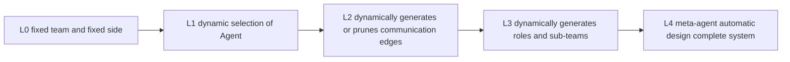
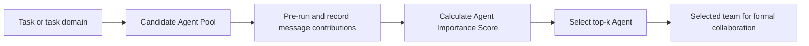
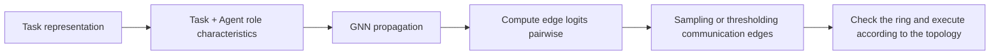
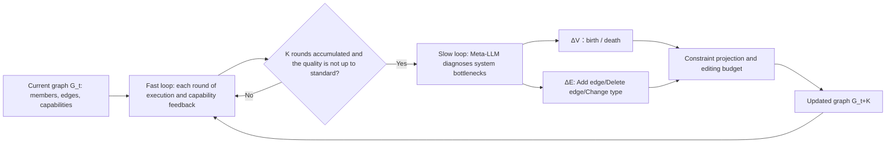

# Topic: Dynamic Topology Dynamic topology and automatic team design

> Dynamic Topology allows the system to select Agents, generate communication edges, prune redundant connections or reorganize sub-teams based on tasks and running status. It's not "just create roles at runtime": the latest research is formalizing dynamic design into graph generation, team selection, communication pruning, and automated agentic system searches, while also amplifying cost, replication, security, and governance issues.

## Study preparation: First understand the terms on this page

| Term | Working definition | Meaning |
|---|---|---|
| Dynamic topology | Dynamic topology | Agent collections or communication relationships change with tasks, status, and feedback. |
| Team selection | Team selection | Select the Agent that best matches the current task from the candidate pool. |
| Topology generation | Topology generation | Directly generate communication diagrams based on tasks instead of applying fixed templates. |
| Communication pruning | Communication pruning | Remove low-value, duplicate or dangerous message edges. |
| Meta-agent | Meta-agent | The upper-level Agent responsible for designing, modifying, or evaluating other Agent systems. |

<!-- learning-path:start -->
<div class="learning-path"><div class="learning-path-title">How to learn on this page</div>
<div class="learning-path-step"><span>1</span><div> First distinguish four dynamic levels: team selection, edge generation, communication pruning and full-system automatic design. </div></div>
<div class="learning-path-step"><span>2</span><div> Then track the evolution of DyLAN, G-Designer, ARG-Designer, GoAgent and ADAS. </div></div>
<div class="learning-path-step"><span>3</span><div>Finally add budgets, permissions, verification and replayable snapshots for dynamic changes. </div></div>
</div>
<!-- learning-path:end -->

---

## 1. Dynamic topology has four different levels




When reading the picture, pay attention to: the higher the degree of dynamics, the greater the search space and management cost; when there is no evaluator and budget, you should not jump directly to L4.

Many projects refer to "selecting three predefined roles based on tasks" as dynamic topology. It belongs to L1 and is essentially different from L3/L4 which automatically generates new roles, new edges, loops and tool configurations.

---

## 2. Research evolution 2023–2026


| Work | Time and Status | Dynamic Design Objects |
|---|---|---|
| [DyLAN](https://arxiv.org/abs/2310.02170) | 2023, arXiv | First select the team by Agent Importance Score, and then select the Agent for dynamic collaboration |
| [G-Designer](https://arxiv.org/abs/2410.11782) | 2024, arXiv | Generate task adaptive communication topology using task virtual nodes and graph models |
| [AgentPrune](https://arxiv.org/abs/2410.02506) | ICLR 2025 Conference Paper | One-shot pruning of redundant or malicious communications on spatio-temporal message graphs |
| [Automated Design of Agentic Systems](https://openreview.net/forum?id=t9U3LW7JVX) | ICLR 2025 Conference Paper | Meta Agent Search discovers new Agentic System designs with code |
| [ARG-Designer](https://arxiv.org/abs/2507.18224) | 2025, arXiv, public code | Autoregressively determine the number of Agents, roles and communication edges, and construct the collaboration graph from scratch |
| [Dynamic Generation with Graph Diffusion Models](https://arxiv.org/abs/2510.07799) | 2025, arXiv | Modeling multi-agent communication topology generation as a graph diffusion problem |
| [GoAgent](https://arxiv.org/abs/2603.19677) | 2026, arXiv preprint | Using collaborative groups as generating atoms to jointly model intra-group cohesion and inter-group coordination |

From G-Designer to ARG-Designer and GoAgent, the research unit has further expanded from "single Agent node" to "co-generation of roles, edges and collaborative groups". These are cutting-edge results and a preprint status statement should be retained.

---

## 3. L1: Dynamically select Agent, team candidates and communication template remain unchanged


What L1 changes is **which Agents are enabled for this task**. The system first prepares a candidate pool, where role prompts, tools, and basic communication templates already exist; the selector only outputs a subset of the candidate pool. It does not create new roles, nor does it redesign all communication edges.

### How L1 works

1. Have candidate agents collaborate on a representative batch of tasks or a pre-run.
2. Track contributions forward from the final valid answer: the last round assigns weights to the active nodes that produced the correct answers, and then transmits the importance back to the upstream along the message edge.
3. Aggregate scores by role or agent, select top-k under fixed budget.
4. Use the selected team to perform formal tasks; if the task distribution changes, the scores should be re-estimated and the ranking cannot be permanently fixed.



When reading the diagram, pay attention to: The output of L1 is a subset of Agents, not a new role description or communication diagram; pre-operation and formal execution are two stages.

### Real case: DyLAN

[DyLAN paper](https://openreview.net/forum?id=XII0Wp1XA9) published at COLM 2024. It splits the process into Team Optimization and Task Solving: it first uses unsupervised Agent Importance Score to measure the contribution of candidate Agents to the results, and then lets the selected team handle the task. The official [DyLAN repository](https://github.com/SALT-NLP/DyLAN) provides MATH, MMLU, HumanEval and arbitrary query demos.

The following is an excerpt of the real code for [`code/demo/LLMLP.py`](https://github.com/SALT-NLP/DyLAN/blob/006e440a519f7cf21e2826f3b8033d84ae9bf07c/code/demo/LLMLP.py#L174-L181) in the warehouse commit [`006e440`](https://github.com/SALT-NLP/DyLAN/tree/006e440a519f7cf21e2826f3b8033d84ae9bf07c):

```python
for idx in range(self.agents*rid, self.agents*(rid+1)):
    self.nodes[idx].importance = 0
    if self.nodes[idx].active:
        for edge in self.nodes[idx].to_edges:
            self.nodes[idx].importance += edge.weight * edge.a2.importance

return [node.importance for node in self.nodes]
```

<div class="code-explanation"><div class="code-explanation-title">DyLAN source code description</div><p><strong>Purpose: </strong>Transmits the importance of downstream nodes back to upstream nodes along the real communication edge. <strong>Execution process: </strong>Each active node accumulates "edge weight × downstream importance", and finally returns the importance of all nodes. <strong> Key points: </strong> This is the reverse contribution propagation of Agent Importance Score, not the model’s subjective scoring based on the role name. </p></div>

The warehouse's [`run_DyLAN.py`](https://github.com/SALT-NLP/DyLAN/blob/006e440a519f7cf21e2826f3b8033d84ae9bf07c/code/demo/run_DyLAN.py#L39-L57) calls `forward()`, `backward()` and prints each Agent score. However, the `ROLES` of this demo is still filled in explicitly by the user, and the complete running chain of re-instantiating the team after automatic top-k is not shown in the same script. Therefore it can directly demonstrate how the scores are calculated, and the overall effect of team selection should also be understood in conjunction with the paper experiments and task configurations in the warehouse.

When L1 goes online, it must at least save the candidate pool version, the scoring task set, the aggregate score of each Agent, and the final selection result. Otherwise there is no way to explain "why A is enabled this time but not B".

---

## 4. L2: Dynamically generate or prune communication edges, and the Agent set remains unchanged.


L2 fixes the Agent node and its role, but changes who can send information to whom. Edges can be generated from task features before the task starts, or they can be pruned at runtime based on message value. Compared to the L1, the actors may be exactly the same, but the order of execution, visible context, and communication costs will all change.

### How L2 works

Take the task-conditioned graph generator as an example:

1. Encode the task text and each Agent's role description into node features, and add task information.
2. The graph model propagates features according to role relationships to obtain the task condition representation of each node.
3. Use node representations to calculate edge scores in pairs, and convert the scores into probability or threshold judgments.
4. Instantiate only the selected edges, check loops and connectivity, and then execute Agent in topological order.
5. Use task quality and communication cost to jointly train or filter the graph; only optimizing the accuracy will easily degenerate into full connection.



When reading the graph, pay attention to: the task will not directly generate the natural language process, but first change the node representation, and then change the edge probability; a deterministic graph legality check still needs to be done before actual execution.

### Real case: G-Designer

[G-Designer paper](https://openreview.net/forum?id=Jov79pGXc6) was published in ICLR 2025 Foundation Models in the Wild Workshop. It designs task-adaptive communication topology using task virtual information, Agent profile and graph neural network. The official [GDesigner repository](https://github.com/yanweiyue/GDesigner) provides training and evaluation entrances for MMLU, HumanEval, and GSM8K.

The following is an excerpt of the real code for [`GDesigner/graph/graph.py`](https://github.com/yanweiyue/GDesigner/blob/a6efcfa3b40bb4d9cbf46f883a95d62020bd8251/GDesigner/graph/graph.py#L311-L323) in the warehouse commit [`a6efcfa`](https://github.com/yanweiyue/GDesigner/tree/a6efcfa3b40bb4d9cbf46f883a95d62020bd8251):

```python
new_features = self.construct_new_features(input['task'])
logits = self.gcn(new_features,self.role_adj_matrix)
logits = self.mlp(logits)
self.spatial_logits = logits @ logits.t()
self.spatial_logits = min_max_norm(torch.flatten(self.spatial_logits))

for round in range(num_rounds):
    log_probs += self.construct_spatial_connection()
```

<div class="code-explanation"><div class="code-explanation-title">G-Designer source code description</div><p><strong>Purpose: </strong>Calculate communication edges for a fixed Agent set based on the current task. <strong>Execution process: </strong><code>construct_new_features()</code> Add task features, GCN and MLP obtain node representation, and multiply the representation matrix and its transpose to form two-sided fractions, and then <code>construct_spatial_connection()</code> instantiates the spatial communication edge. <strong>Key points: </strong> What changes here is <code>spatial_logits</code> and the actual connection, not the Agent role list. </p></div>

[`construct_spatial_connection()`](https://github.com/yanweiyue/GDesigner/blob/a6efcfa3b40bb4d9cbf46f883a95d62020bd8251/GDesigner/graph/graph.py#L216-L242) of the same file does a sigmoid on the edge scores and adds edges by probability or threshold, while using `check_cycle()` to prevent the spatial graph from forming rings. Then `arun()` executes the Agent according to the node queue with degree zero. This call chain fully demonstrates "Task Conditioned Edge Score → Real Connection → Graph Execution".

The project must additionally record the task feature version, edge score, sampling random seed, final adjacency matrix and token cost. Also note: No LICENSE file was found in the verification submission; the code can be publicly read and reproduced, but the authorization conditions should be confirmed before further copying or redistribution.

---

## 5. L3: Ability to add and delete Agents, reconnect topology and co-evolve during reasoning


L3 does not just select members or generate edges before a task starts, but allows the Agent set, role instances, and communication topology to change during the execution of the same task. The definition of [TacoMAS paper](https://arxiv.org/pdf/2605.09539) is used here: the system state is written as an Agent graph that changes with rounds `G_t = (T_t, Φ_t)`, where `T_t = (V_t, E_t)` is the member and communication edge, and `Φ_t` is the role prompt, context memory and tool capability status of each Agent.

The core difficulty is not "can it be modified", but that the two types of modifications cannot occur at the same speed:

- **Fast Capability Loop**: Each round updates its workflow prompts and contextual memory based on Agent trajectories, tool results, and contribution scores.
- **Slow Topology Loop**: Check system bottlenecks every `K` turn to perform Agent birth/death, edge addition, edge deletion, or edge type change.
- **Editing budget**: A slow update can modify up to `B_V` Agents and `B_E` edges to prevent the collaboration structure from being significantly rewritten as soon as local improvements take effect.

### How L3 works

1. Meta-LLM initializes the Agent graph from a fixed role pool; the paper experiment sets the initial number of Agents to 5.
2. Each fast round executes Agent according to the current graph, Meta-Judge evaluates the contribution of each Agent, and Meta-LLM generates specific improvement suggestions for the next round and writes back the capability status.
3. When the fast rounds accumulate to `K` and the answer has not yet reached the threshold, the slow loop reads the trajectories and contribution trends of multiple rounds.
4. Slow loop output structure increment `ΔT = (ΔV, ΔE)`: Add or remove Agent, or repair information flow edge.
5. Project the proposal to the allowed space at runtime, checking population upper and lower bounds, key roles, protected nodes, maximum degree, connectivity, and Agent/edge editing budget before execution.
6. Stop when the answer reaches the quality threshold, reaches the maximum round `R`, or Meta-LLM determines that it has converged.



When reading the diagram, focus on the following: Capability updates first run continuously in a relatively stable topology, and topology modifications only occur periodically. If both are significantly modified at the same time in each round, the Agent's newly formed evidence sources and collaboration strategies will immediately become invalid.

### Real case: TacoMAS

[TacoMAS: Test-Time Co-Evolution of Topology and Capability in LLM-based Multi-Agent Systems](https://arxiv.org/pdf/2605.09539) is an arXiv v1 preprint released on 2026-05-10. The paper is evaluated on four benchmarks: financial analysis, web retrieval, Minecraft style planning and task execution, and reports an average improvement of 13.3% relative to the strongest baseline. The official code given in the paper is [chenxu2-gif/TacoMAS-MultiAgent](https://github.com/chenxu2-gif/TacoMAS-MultiAgent).

The following is an excerpt of the real code for [`tacomas/meta_evolution/mas_runtime.py`](https://github.com/chenxu2-gif/TacoMAS-MultiAgent/blob/6f0d545f2493cf95d2eb6a325d1a6686acf658eb/tacomas/meta_evolution/mas_runtime.py#L4029-L4052) in the warehouse commit [`6f0d545`](https://github.com/chenxu2-gif/TacoMAS-MultiAgent/tree/6f0d545f2493cf95d2eb6a325d1a6686acf658eb):

```python
def run_until_stable(self) -> Dict[str, Any]:
    """Run fast/slow loop until meta decides to stop or max rounds reached."""
    while True:
        answer_quality = self.run_fast_round()
        self.controller.step_fast_time()

        decision = None
        if self.controller.should_trigger_slow_update():
            if self._in_conservative_mode():
                deferred = self._defer_slow_update_for_conservative_mode()
                logger.info(
                    "Conservative mode active at round %s: deferring slow update by %s fast steps (best=%.3f current=%.3f)",
                    self.round_idx,
                    deferred,
                    self.best_answer_quality,
                    self.current_answer_quality,
                )
            else:
                graph_before_slow = self._snapshot_graph()
                slow_ret = self.controller.execute_slow_update(
                    task_description=self._task_description_for_meta(),
                    current_answer_quality=answer_quality,
                    protected_graph_paths=self._protected_graph_paths(),
                )
```

<div class="code-explanation"><div class="code-explanation-title">TacoMAS fast and slow loop source code description</div><p><strong>Purpose: </strong> Let capability execution and topology update work at different time scales. <strong> Execution process: </strong> When running, each cycle first executes a fast round, and then advances the fast time; only when the controller believes that the slow update time point has been reached and the system is not in conservative mode, <code>execute_slow_update()</code> is called. <strong>Key points: </strong>Slow update reads the current answer quality and protected high score path, instead of rebuilding the entire graph in each round. </p></div>

After the slow loop makes a structural decision, `ConstraintProjector` first checks the constraints and then executes `EvolutionExecutor`. Here's the real pure-birth code for [`tacomas/meta_evolution/executor.py`](https://github.com/chenxu2-gif/TacoMAS-MultiAgent/blob/6f0d545f2493cf95d2eb6a325d1a6686acf658eb/tacomas/meta_evolution/executor.py#L557-L572) from the same commit:

```python
if birth_only and not death_only:
    logger.info(
        f"Pure-Birth: parent={pair.parent_id}, reason={pair.birth_reason}"
    )
    child_id = self.population.spawn_child(
        pair.parent_id,
        "",           # no death target — spawn_child uses target only for HYBRID
        pair.child_plan,
        current_time,
    )
    child_agent = self.population.get_agent(child_id)
    self.graph.add_node(child_id, child_agent.role)
    self._register_graph_edit_aliases(pair, child_id, child_agent.role)
    if self.graph.get_edge_type(pair.parent_id, child_id) is None:
        self.graph.add_edge(pair.parent_id, child_id, edge_type=EdgeType.DIRECTED)
```

<div class="code-explanation"><div class="code-explanation-title">TacoMAS Agent birth Source code description</div><p><strong>Purpose: </strong>Add a capability variant Agent during the reasoning process and connect it to the current communication graph. <strong> execution process: </strong> generates child Agents from the parent Agent and <code>child_plan</code> during runtime, adds the role node to the graph, registers the temporary alias used by Meta-LLM, and establishes at least one directed edge from the parent node to the child node. <strong> Key points: </strong> What is added is not an isolated prompt word, but a runtime member with an inheritance plan, real node identification and reachable communication edges. </p></div>

[`execute_decision()`](https://github.com/chenxu2-gif/TacoMAS-MultiAgent/blob/6f0d545f2493cf95d2eb6a325d1a6686acf658eb/tacomas/meta_evolution/executor.py#L504-L523) of the same executor triggers birth/death and graph rewire respectively; [`_execute_graph_edit()`](https://github.com/chenxu2-gif/TacoMAS-MultiAgent/blob/6f0d545f2493cf95d2eb6a325d1a6686acf658eb/tacomas/meta_evolution/executor.py#L693-L735) performs edge deletion and edge addition. The warehouse also provides four data sets corresponding to the paper, running scripts, fast/slow logs, and final graph snapshots, so what is quoted here is the runnable research code, not the teaching pseudocode.

Usage boundaries must also be clearly written: TacoMAS's role pool, tool suite, and scoring rubric need to be adapted by domain; the paper is currently a preprint. Verify that no LICENSE file is found in the submission. Authorization should be confirmed before reusing or redistributing the code. The production environment should also treat the Meta-LLM proposal as a structural increment to be reviewed, limit the tool permissions of the new Agent, and save the diagram, capability status, and contribution basis before and after modification.

---

<!-- chapter-check:start -->
## Special topic self-examination
<div class="chapter-check"><div class="chapter-check-title"> Without reading the text, try to answer </div><ul>
<li>L1 Why only change the Agent subset without changing the role definition and communication diagram generation method? </li>
<li>DyLAN’s Agent Importance Score How to backpropagate contributions along message edges? Which step is not shown in the public demo? </li>
<li>G-Designer How to convert task features into spatial communication edges? </li>
<li>TacoMAS Why does TacoMAS let the capabilities be updated every round, but only let the topology be updated every K rounds? </li>
<li>Agent birth, Agent death and edge edit will change what in the figure? </li>
<li> Why do structural increments of L3 have to go through demographic, key role, connectivity, and editorial budget checks before execution? </li>
</ul></div>
<!-- chapter-check:end -->
