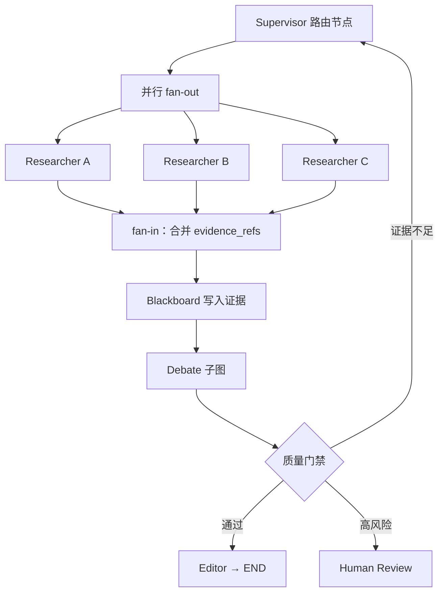

# 专题：Graph 作为通用可执行拓扑

> 第四章介绍的是 Pipeline、Supervisor、Blackboard、Debate、Market 等常见组织形状。本专题不再重复它们的用途，而是解释一个更深的问题：这些模式都可以表示成图，那么 Graph 作为独立的工程方法，究竟比“画一张拓扑图”多了什么？

本页的核心结论是：**其他拓扑通常是带有强假设的受限图模板；Graph 则把节点、边、状态、合并规则和执行位置全部变成一等对象。** 因此它能够组合多个模板，并精确定义条件分支、并行汇合、循环终止、检查点恢复和结构优化。

## 学习准备：先认清本页术语

在进入专题前，先区分三种经常被统称为“图”的对象：

| 名称 | 含义 | 是否足以直接执行 |
|---|---|---|
| 拓扑示意图 | 用箭头画出 Agent 之间大致怎样协作 | 否，通常没有状态、边条件和合并规则 |
| 通信图 | 节点表示 Agent，边表示允许的信息传递关系 | 不一定，只说明谁能和谁通信 |
| 可执行状态图 | 节点是运算，边是控制流，结构化状态沿图更新 | 是，还需运行器、检查点和错误策略 |

本专题所说的 Graph，主要指第三种。仅仅把 Supervisor 或 Pipeline 画成节点和箭头，并没有获得 Graph 的执行语义。

<!-- learning-path:start -->

本页怎么学

1
先把其他拓扑看成“受限图模板”，找出它们固定了哪些结构假设。

2
再学习一般 Graph 新增的状态合并、fan-out/fan-in、循环和子图组合语义。

3
最后理解为什么显式图适合检查点恢复与节点/边优化，以及何时不值得使用。

<!-- learning-path:end -->

---

## 1. 其他拓扑是一般 Graph 的受限模板

| 拓扑模板 | 对应的受限图结构 | 模板预设的强假设 | 一般 Graph 放开的部分 |
|---|---|---|---|
| Pipeline | 有向路径图 `A → B → C` | 每个阶段通常只有一个固定后继 | 一个节点可有多条条件边、回退边和跳过边 |
| Supervisor | 以主管为中心的有向星型图 | 任务和结果通常经过中心节点 | 可加入专家直连、局部子图和确定性旁路 |
| Blackboard | 多个 Agent 连接同一共享状态中心 | 信息共享是一等对象，执行顺序可能隐式 | 可把“谁在什么状态下行动”写成显式控制边 |
| Debate | 分层图或有限循环图 | 候选、批评、聚合的轮次结构预先固定 | 可嵌入任意阶段，并与测试、返工和人工门禁连接 |
| Market | 发布、报价、选择、履约组成的协议子图 | 重点是分配 Worker | 可继续表示分配前后的完整任务生命周期 |
| Dynamic topology | 随时间变化的图 `G(t)` | 节点或边允许在运行时改变 | 与 Graph 执行语义正交；固定 Graph 也可有复杂路径 |

这里的差异不是“谁更高级”。受限模板的优势恰恰是简单：Pipeline 不必处理任意出边，Supervisor 不必让每个专家维护全局控制流。只有当这些限制与真实任务冲突时，才需要一般 Graph。

从图论角度看，Pipeline 和 Supervisor 本来就是图；从工程角度看，它们通常没有完整规定节点读写哪些状态、并行结果怎样合并、循环何时终止、进程中断后从哪个执行位置恢复。一般 Graph 要把这些缺失部分补齐。

---

## 2. Graph 的第一项区别：可以组合多种拓扑语义

真实工作流往往在不同阶段使用不同组织方式。例如研究报告任务可以同时包含：Supervisor 路由、多个 Researcher 并行检索、Blackboard 共享证据、Debate 评审候选结论、Pipeline 完成编辑与发布。

读图时重点看：Supervisor、Blackboard 和 Debate 没有消失，而是分别成为节点或子图；一般 Graph 负责定义它们之间的输入输出、并行汇合、返工边和结束条件。

这正是 Graph 与单一拓扑模板的核心区别：它不是另一种固定组织形状，而是**组合组织形状的执行表示**。一个节点甚至可以包含内部 Graph，形成父图与子图的层次结构。

组合并不意味着越复杂越好。每加入一个子图，都要明确它接收哪些状态字段、返回哪些字段、失败如何向父图传播，以及内部检查点是否需要独立命名空间。

---

## 3. Graph 的第二项区别：状态更新和合并规则是一等对象

拓扑示意图通常只画“Researcher A/B/C 最后汇总”，却没有说明三条并行分支同时写状态时怎样处理。可执行 Graph 必须为每个字段定义更新语义。

假设三个 Researcher 都返回 `evidence_refs`：

| 合并方式 | 结果 | 适用字段 |
|---|---|---|
| 覆盖 | 最后一次写入替换旧值 | 单一 owner 的 `current_plan` |
| 追加 | 三个列表合并 | `evidence_refs`、事件日志 |
| 集合并集 | 合并并去重 | 标签、已完成任务 ID |
| 最大/最小 | 保留最高风险或最小预算 | `risk_level`、`budget_remaining` |
| 自定义 reducer | 按版本、来源或置信度解决冲突 | 决策、主张和候选产物 |

若没有 reducer，两条并行分支可能互相覆盖；若所有内容都用追加，状态会无限膨胀。Graph 要求设计者明确“谁可以写、多个写入怎样合并、冲突时是否拒绝”。这比单纯选择一种拓扑形状更接近数据库和分布式系统问题。

[LangGraph 的状态说明](https://langchain-ai.github.io/langgraph/how-tos/state-reducers/)把 reducer 作为节点部分更新写入共享 State 的关键机制。一个节点只返回自己负责的增量，运行时按字段 reducer 生成新状态，而不是让节点任意重写整个共享对象。

Graph 状态也不同于 Blackboard。Blackboard 关注长期共享的任务、证据和产物；Graph 状态关注当前执行需要的控制字段和引用。常见组合是把完整证据保存在 Blackboard 或 Artifact Store，Graph 状态只携带 `evidence_refs`、`review_status` 和下一步所需摘要。

---

## 4. Graph 的第三项区别：并行汇合具有明确执行语义

一般 Graph 不只支持分叉，还必须定义汇合：

1. fan-out 节点在同一执行阶段调度多个分支。
2. 每个分支读取同一版本的输入状态或各自的受限视图。
3. 分支完成后产生部分状态更新。
4. reducer 合并并行写入。
5. join 条件满足后，下游节点才被调度。

不同任务的 join 规则可能不同：

- **all-of**：三个研究分支全部完成才综合。
- **any-of**：任一快速检查发现高风险就立即转人工。
- **quorum**：至少两个独立 Reviewer 给出有效结果才聚合。
- **deadline join**：到截止时间后合并已经完成的分支，并标记缺失项。

Pipeline 没有 fan-in 冲突；Supervisor 常由主管在自然语言上下文中自行判断“材料是否齐了”；Graph 则要求把汇合条件和合并函数写成运行时语义。这样才能测试慢分支、失败分支和部分完成时系统怎样行动。

在 Pregel 风格运行时中，一组当前可运行节点可以在同一个 super-step 执行，然后在边界处提交合并状态。理解 super-step 很重要，因为检查点和恢复通常也围绕这些边界组织。

---

## 5. Graph 的第四项区别：循环必须有状态不变量和终止条件

Debate 和 Reviewer 返工都可能形成循环，但可执行 Graph 不能只画一条回边。每个循环至少要定义：

| 必需项 | 示例 |
|---|---|
| 进入条件 | `review_decision=needs_changes` |
| 每轮必须变化的状态 | 新 `patch_ref` 或新的证据版本 |
| 进度不变量 | 未解决 blocking findings 数量不能增加 |
| 最大轮次 | `revision_count < 2` |
| 预算条件 | `budget_remaining > minimum_step_cost` |
| 安全出口 | 转人工、降级 Pipeline 或保留当前最佳结果 |

Supervisor 也能说“再改一次”，但如果循环规则只存在于主管 Prompt 中，就难以证明它不会无限返工。Graph 把返工次数、预算和质量门禁写进状态与边条件，使循环能够被枚举、测试和审计。

这里也能看出 Graph 与 Dynamic Topology 的区别：沿已定义回边循环仍然是固定 Graph；只有运行时创建新节点、删除旧边或重写子图，结构才真正动态变化。

---

## 6. Graph 的第五项区别：执行位置可以持久化

任何拓扑都能保存数据。Graph 的差异是它能同时保存两类信息：

- **业务状态**：计划、产物引用、测试结果、评审决定和预算。
- **控制状态**：刚完成哪些节点、下一 super-step 要运行哪些节点、位于哪个子图和图版本。

例如三个并行 Researcher 中两个成功、一个失败。如果只保存聊天历史，恢复时很难判断是否要重跑全部分支。显式图运行时可以保留已成功节点的写入，只重试失败任务，然后在同一 join 处继续。

[LangGraph 持久化文档](https://docs.langchain.com/oss/python/langgraph/persistence)说明其检查点按 thread 和 super-step 保存状态，并保留并行阶段中成功任务的 pending writes；恢复时不必重新执行已经成功的节点。检查点还支持人工中断、状态历史、回放和从旧状态分叉。

这比简单 Pipeline 的“记录当前阶段编号”更细，因为复杂 Graph 可能同时存在多个待执行节点、子图命名空间和部分完成分支。代价是必须管理 `schema_version`、图版本、Artifact 有效性和副作用幂等。

---

## 7. Graph 的第六项区别：节点和边可以成为优化变量

受限拓扑通常把结构当作设计前提：Pipeline 顺序固定，Supervisor 中心固定，Debate 轮次固定。一般 Graph 把结构本身暴露出来，因此优化器可以提出：修改某个节点 Prompt、增加验证节点、删除冗余边、改变汇合方式或替换整个子图。

| 优化层 | 被修改的对象 | 代表工作 | 与其他拓扑的关系 |
|---|---|---|---|
| 节点优化 | Prompt、工具或节点运算 | [GPTSwarm](https://arxiv.org/abs/2402.16823) | 可优化 Supervisor、Reviewer 等任意节点内部 |
| 边优化 | 信息流和连接关系 | GPTSwarm、[AgentPrune](https://arxiv.org/abs/2410.02506) | 可把星型稀疏化或删除 Debate 冗余通信 |
| 工作流搜索 | 节点与控制结构的代码组合 | [AFlow](https://arxiv.org/abs/2410.10762) | 可搜索 Pipeline、并行、评审和循环的组合 |
| 系统结构搜索 | 完整 Agentic System | [Automated Design of Agentic Systems](https://openreview.net/forum?id=t9U3LW7JVX) | 组织模式本身也是候选结构 |
| 执行计划优化 | 已确定图的调度与数据流 | [AAFLOW](https://arxiv.org/abs/2605.02162) | 不改变业务拓扑，优化底层怎样运行 |

[Language Agents as Optimizable Graphs](https://arxiv.org/abs/2402.16823)明确区分节点 Prompt 优化和图连接优化；[AFlow](https://arxiv.org/abs/2410.10762)则把代码表示的工作流优化建模为搜索问题。两者都依赖“工作流结构是显式对象”这一前提。

优化并不意味着运行时任意改图。候选 Graph 仍要通过状态 Schema、边完备性、循环上限、权限、预算和故障恢复测试，之后才能替换生产版本。

---

## 8. 一个 Graph 节点不等于一个 Agent

通信拓扑常用“一个 Agent = 一个节点”。可执行 Graph 的节点更细或更粗：

- 一个 Agent 可以对应多个节点，例如 Planner 的“生成计划”和“修订计划”。
- 一个节点可以是确定性函数，例如 Schema 校验、预算检查或 reducer。
- 一个节点可以封装多个 Agent，例如 Debate 子图。
- 一个节点可以是人工审批、外部队列或长时间等待事件。
- 一条边表达控制依赖，不一定表示两个 Agent 直接发送消息。

因此，Graph 不是把 Agent 关系重新画一次，而是把**模型调用、工具、规则、人工和子团队**统一放入一个执行模型。这也是它能组合其他拓扑、保存精确执行位置并做结构优化的原因。

如果页面上的每个节点都只是一个 Agent 名字，边上没有条件，状态没有 Schema，汇合没有 reducer，那么它仍然只是通信拓扑图，不是完整的 Graph 工作流。

---

## 9. 什么时候应使用受限模板，什么时候需要一般 Graph

| 任务特征 | 更合适的选择 | 原因 |
|---|---|---|
| 固定阶段、单一路径、失败即停止 | Pipeline | 不需要 reducer、循环和复杂恢复位置 |
| 主要难点是模糊任务分诊 | Supervisor | 语义路由比显式状态组合更关键 |
| 主要难点是开放式共享知识 | Blackboard | 信息发布、订阅和冲突治理更关键 |
| 只在一个阶段需要多候选评审 | Debate 子流程 | 不必把整个系统升级为通用 Graph |
| 需要选择大量候选 Worker | Market 子流程 | 核心是能力、成本与信誉校准 |
| 多模式组合、并行汇合、有限循环、人工中断和精确恢复 | 一般 Graph | 受限模板已经无法完整表达执行语义 |

选择 Graph 的证据不应只是“流程看起来复杂”，而应至少包含一项具体需求：并行写入需要 reducer；多个分支需要 join；返工需要硬终止条件；子图需要独立状态边界；中断后必须恢复待执行节点；结构本身需要测量或优化。

若这些需求都不存在，受限模板更容易教学、测试和维护。一般 Graph 的代价包括状态组合爆炸、边条件完备性、并行冲突、图和 Schema 版本迁移，以及更复杂的调试工具。

---

## 10. 专题收束：Graph 真正增加了什么

与其他拓扑相比，Graph 真正增加的不是“更多连线”，而是六类可执行语义：

1. 多种受限拓扑可以作为节点或子图组合。
2. 状态字段拥有显式写入和 reducer 合并规则。
3. fan-out、fan-in 与 join 条件成为运行时对象。
4. 循环拥有进度不变量、预算和安全出口。
5. 检查点保存业务状态与精确控制位置。
6. 节点、边、子图和执行计划可以分别测量与优化。

这六项都不需要时，继续使用 Pipeline、Supervisor 等受限模板；其中多项同时出现时，一般 Graph 才成为合理的主执行模型。

---

<!-- chapter-check:start -->
## 专题自检

不看正文，尝试回答
<ul>
<li>为什么 Pipeline、Supervisor 和 Debate 都可以视为受限图模板，但不自动等于可执行 Graph？</li>
<li>一般 Graph 怎样把 Supervisor、Blackboard 和 Debate 组合进同一工作流？</li>
<li>并行分支汇合时为什么需要 reducer 和 join 条件？</li>
<li>固定 Graph 的循环与动态拓扑改变结构有什么区别？</li>
<li>Graph 检查点为什么要同时保存业务状态和控制状态？</li>
<li>GPTSwarm、AFlow、AgentPrune 与 AAFLOW 分别在优化图的哪一层？</li>
</ul>

<!-- chapter-check:end -->
