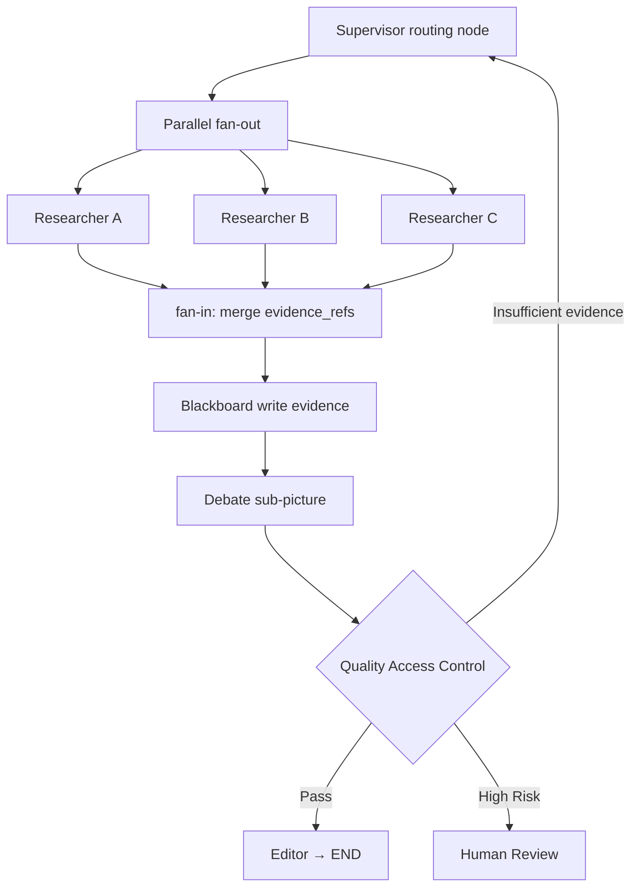

# Special topic: Graph as a universal executable topology

> Chapter 4 introduces common organizational shapes such as Pipeline, Supervisor, Blackboard, Debate, and Market. This topic will not repeat their uses, but explain a deeper question: These patterns can all be expressed as graphs, so as an independent engineering method, what does Graph have more to do than "drawing a topological diagram"?

The core conclusion of this page is: **Other topologies are usually restricted graph templates with strong assumptions; Graph turns nodes, edges, states, merge rules, and execution locations all into first-class objects. ** It is therefore able to combine multiple templates and precisely define conditional branches, parallel merges, loop termination, checkpoint recovery and structural optimization.

## Study preparation: First understand the terms on this page

Before getting into the topic, let’s distinguish three types of objects that are often collectively referred to as “graphs”:

| name | meaning | whether sufficient for direct execution |
|---|---|---|
| Topology diagram | Use arrows to draw roughly how agents cooperate | No, usually there are no states, side conditions and merge rules |
| Communication graph | Nodes represent Agents, and edges represent allowed information transfer relationships | Not necessarily, it only shows who can communicate with whom |
| Executable state diagram | Nodes are operations, edges are control flow, and structured states are updated along the graph | Yes, runner, checkpoint and error strategy are also required |

The Graph mentioned in this topic mainly refers to the third type. Merely drawing Supervisor or Pipeline as nodes and arrows does not obtain the execution semantics of Graph.

<!-- learning-path:start -->

How to learn on this page

1
 First consider other topologies as "restricted graph templates" and find out what structural assumptions they fix. 

2
Relearn the new state merging, fan-out/fan-in, loop and subgraph combination semantics of general Graph. 

3
Finally understand why explicit graphs are suitable for checkpoint recovery versus node/edge optimization, and when they are not worth using. 

<!-- learning-path:end -->

---

## 1. Other topologies are restricted templates of general Graph

| Topological template | Corresponding restricted graph structure | Strong assumptions preset by the template | General Graph relaxed parts |
|---|---|---|---|
| Pipeline | Directed path graph `A → B → C` | Each stage usually has only one fixed successor | A node can have multiple conditional edges, fallback edges and skip edges |
| Supervisor | Supervisor-centered directed star graph | Tasks and results usually pass through central nodes | Expert direct connections, local subgraphs and deterministic bypasses can be added |
| Blackboard | Multiple Agents connect to the same shared state center | Information sharing is a first-class object, and the execution order may be implicit | "Who acts in what state" can be written as an explicit control edge |
| Debate | Hierarchical graph or finite cycle graph | Pre-fixed round structure for candidate, critic, aggregation | Can be embedded in any stage and connected with testing, rework and manual gatekeeping |
| Market | Agreement subgraph consisting of release, quotation, selection, and fulfillment | The focus is on allocation Worker | Can continue to represent the complete task life cycle before and after allocation |
| Dynamic topology | Time-varying graph `G(t)` | Nodes or edges allowed to change at runtime | Orthogonal to Graph execution semantics; fixed Graph can also have complex paths |

The difference here is not "who is more advanced". The advantage of restricted templates is precisely simplicity: the Pipeline does not have to deal with arbitrary outgoing edges, and the Supervisor does not have to have each expert maintain the global control flow. A general Graph is only needed when these constraints conflict with the real task.

From a graph theory perspective, Pipeline and Supervisor are inherently graphs; from an engineering perspective, they usually do not fully specify which states are read and written by nodes, how parallel results are merged, when loops are terminated, and from which execution position the process is resumed after interruption. Generally, Graph needs to fill in these missing parts.

---

## 2. The first difference of Graph: it can combine multiple topological semantics

Real workflows often use different organizational methods at different stages. For example, a research report task can include: Supervisor routing, multiple Researcher parallel searches, Blackboard sharing evidence, Debate review candidate conclusions, and Pipeline editing and publishing.

When reading the graph, pay attention to: Supervisor, Blackboard and Debate do not disappear, but become nodes or subgraphs respectively; generally Graph is responsible for defining the input and output, parallel convergence, rework edges and end conditions between them.

This is the core difference between Graph and a single topological template: it is not another fixed tissue shape, but an executable representation of a combined tissue shape. A node can even contain internal Graphs, forming a hierarchy of parent and child graphs.

Combination does not mean more complex is better. Each time you add a subgraph, you need to clarify which status fields it receives, which fields it returns, how failures are propagated to the parent graph, and whether internal checkpoints require independent namespaces.

---

## 3. The second difference of Graph: state update and merge rules are first-class objects

Topology diagrams usually only draw "Researcher A/B/C final summary", but do not explain how to handle three parallel branches writing status at the same time. The executable Graph must define update semantics for each field.

Assume that all three Researchers return `evidence_refs`:

| Merge method | Result | Applicable fields |
|---|---|---|
| Overwrite | Last write replaces old value | `current_plan` for single owner |
| Append | Merge three lists | `evidence_refs`, event log |
| Set union | Merge and remove duplicates | Tags, completed task IDs |
| Max/Min | Keep highest risk or smallest budget | `risk_level`, `budget_remaining` |
| Custom reducer | Resolve conflicts by version, source or confidence | Decisions, claims and candidates |

Without reducers, two parallel branches may cover each other; if everything is appended, the state will expand infinitely. Graph requires designers to clarify "who can write, how to merge multiple writes, and whether to reject conflicts." This is closer to database and distributed systems problems than simply choosing a topology shape.

[LangGraph's state description](https://langchain-ai.github.io/langgraph/how-tos/state-reducers/) uses the reducer as the key mechanism for node partial updates to be written to the shared State. A node only returns the increment it is responsible for, and the runtime reducer generates new state by field, rather than letting the node arbitrarily rewrite the entire shared object.

Graph state is also different from Blackboard. Blackboard focuses on long-term shared tasks, evidence, and products; Graph state focuses on control fields and references required for current execution. A common combination is to keep the full proof in Blackboard or Artifact Store, and the Graph state only carries `evidence_refs`, `review_status` and the summary required for the next step.

---

## 4. The third difference of Graph: parallel merging has explicit execution semantics

Generally, Graph not only supports bifurcation, but also must define merging:

1. Fan-out nodes schedule multiple branches in the same execution phase.
2. Each branch reads the same version of the input state or its own restricted view.
3. Partial status updates are generated after the branch is completed.
4. reducer merges parallel writes.
5. After the join conditions are met, the downstream nodes are scheduled.

The join rules for different tasks may be different:

- **all-of**: Comprehensive only after all three research branches are completed.
- **any-of**: If any quick check finds a high risk, it will be transferred to manual work immediately.
- **quorum**: Aggregation is required when at least two independent Reviewers give valid results.
- **deadline join**: Merge completed branches after the deadline and mark missing items.

Pipeline has no fan-in conflicts; Supervisor often leaves it to the supervisor to judge “whether the materials are complete” in a natural language context; Graph requires that the convergence conditions and merge functions be written as runtime semantics. This allows you to test how the system behaves when slow branches, failed branches, and partial completions occur.

In a Pregel-style runtime, a set of currently runnable nodes can be executed in the same super-step and then commit the merged state at the boundary. Understanding super-steps is important because checkpoints and recovery are often organized around these boundaries as well.

---

## 5. The fourth difference of Graph: the loop must have state invariants and termination conditions

Both Debate and Reviewer rework may form loops, but the executable Graph cannot draw only one return edge. Each loop must define at least:

| Required | Example |
|---|---|
| Entry conditions | `review_decision=needs_changes` |
| State that must change every round | New `patch_ref` or new proof version |
| Progress invariant | Unresolved blocking findings number cannot be increased |
| Maximum rounds | `revision_count < 2` |
| Budget Conditions | `budget_remaining > minimum_step_cost` |
| Safe exit | Switch to manual, downgrade Pipeline or keep the current best result |

Supervisor can also say "change it again", but if the loop rule only exists in the supervisor prompt, it is difficult to prove that it will not rework infinitely. Graph writes rework counts, budgets, and quality gates into states and side conditions, allowing loops to be enumerated, tested, and audited.

The difference between Graph and Dynamic Topology can also be seen here: the loop along the defined back edge is still a fixed Graph; only when new nodes are created, old edges are deleted, or subgraphs are rewritten at runtime, the structure is truly dynamic.

---

## 6. The fifth difference of Graph: the execution location can be persisted

Any topology can save data. The difference with Graph is that it can store two types of information at the same time:

- **Business status**: plan, product references, test results, review decisions and budget.
- **Control status**: Which nodes have just been completed, which nodes will be run in the next super-step, which subgraph and graph version are located.

For example, two of three parallel Researchers succeed and one fails. If you only save the chat history, it will be difficult to judge whether to rerun all branches when restoring. An explicit graph runtime can preserve writes to successful nodes, only retry failed tasks, and continue at the same join.

[LangGraph persistence documentation](https://docs.langchain.com/oss/python/langgraph/persistence) explains that its checkpoint saves state by thread and super-step, and retains pending writes of successful tasks in the parallel phase; it is not necessary to re-execute nodes that have succeeded when recovering. Checkpoints also support manual interruption, state history, replay, and forking from old states.

This is more granular than the "record the current stage number" of a simple Pipeline, because a complex Graph may have multiple pending execution nodes, subgraph namespaces, and partially completed branches at the same time. The price is having to manage `schema_version`, graph versions, artifact validity, and side effects idempotence.

---

## 7. The sixth difference of Graph: nodes and edges can become optimization variables

Restricted topology usually takes the structure as the design premise: the Pipeline order is fixed, the Supervisor center is fixed, and the Debate rounds are fixed. Generally, Graph exposes the structure itself, so the optimizer can propose: modify a node Prompt, add verification nodes, delete redundant edges, change the merging method, or replace the entire subgraph.

| Optimization layer | Objects that are modified | Represent work | Relationship to other topologies |
|---|---|---|---|
| Node optimization | Prompt, tool or node operation | [GPTSwarm](https://arxiv.org/abs/2402.16823) | Can optimize the inside of any node such as Supervisor and Reviewer |
| Edge optimization | Information flow and connection relationships | GPTSwarm, [AgentPrune](https://arxiv.org/abs/2410.02506) | Stars can be sparsified or deleted Debate redundant communication |
| Workflow search | Code combinations of nodes and control structures | [AFlow](https://arxiv.org/abs/2410.10762) | Searchable combinations of Pipeline, Parallel, Review and Loop |
| System structure search | Complete Agentic System | [Automated Design of Agentic Systems](https://openreview.net/forum?id=t9U3LW7JVX) | The organizational model itself is also a candidate structure |
| Execution plan optimization | Scheduling and data flow of determined graph | [AAFLOW](https://arxiv.org/abs/2605.02162) | Optimize how the bottom layer runs without changing the business topology |

[Language Agents as Optimizable Graphs](https://arxiv.org/abs/2402.16823) clearly distinguishes node prompt optimization and graph connection optimization; [AFlow](https://arxiv.org/abs/2410.10762) models the workflow optimization represented by code as a search problem. Both rely on the premise that workflow structures are explicit objects.

Optimization does not mean arbitrarily changing the graph during runtime. Candidate Graphs still need to pass state schema, edge completeness, loop bounds, permissions, budget, and failure recovery tests before they can be replaced with production versions.

---

## 8. A Graph node is not equal to an Agent

Communication topology commonly uses "one Agent = one node". The nodes of an executable Graph are thinner or thicker:

- An Agent can correspond to multiple nodes, such as Planner's "Generate Plan" and "Revise Plan".
- A node can be a deterministic function such as a Schema validator, a budget check, or a reducer.
- One node can encapsulate multiple Agents, such as the Debate subgraph.
- A node can be a manual approval, an external queue or a long waiting event.
- An edge expresses control dependence and does not necessarily mean that two Agents send messages directly.

Therefore, Graph does not redraw the Agent relationship, but unifies model calls, tools, rules, labor and sub-teams into an execution model. This is why it can combine other topologies, save precise execution locations, and perform structural optimizations.

If each node on the page is just an Agent name, there are no conditions on the edges, no Schema on the state, and no reducer on the convergence, then it is still just a communication topology diagram, not a complete Graph workflow.

---

## 9. When should you use restricted templates and when do you need a general Graph?

| Mission Characteristics | A More Suitable Choice | Reason |
|---|---|---|
| Fixed stages, single path, stop on failure | Pipeline | No need for reducers, loops and complex recovery locations |
| The main difficulty is fuzzy task triage | Supervisor | Semantic routing is more critical than explicit state combination |
| The main difficulty is open sharing of knowledge | Blackboard | Information publishing, subscription and conflict management are more critical |
| Multiple candidate reviews are only required in one stage | Debate sub-process | No need to upgrade the entire system to a common Graph |
| A large number of candidate Workers need to be selected | Market sub-process | The core is capability, cost and reputation calibration |
| Multi-mode combination, parallel merging, finite loops, artificial interruption and precise recovery | General Graph | Restricted templates can no longer fully express execution semantics |

The evidence for choosing Graph shouldn't just be "the process looks complicated" but should include at least one specific requirement: parallel writes require reducers; multiple branches require joins; rework requires hard termination conditions; subgraphs require independent state boundaries; pending nodes must be restored after interruption; and the structure itself requires measurement or optimization.

If these requirements do not exist, restricted templates are easier to teach, test, and maintain. Typical Graph costs include state combinatorial explosion, edge condition completeness, parallel conflicts, graph and schema version migration, and more complex debugging tools.

---

## 10. Conclusion of the topic: What does Graph really add?

Compared with other topologies, what Graph really adds is not "more connections", but six types of executable semantics:

1. Multiple restricted topologies can be combined as nodes or subgraphs.
2. Status fields have explicit write and reducer merging rules.
3. Fan-out, fan-in and join conditions become runtime objects.
4. The loop has progress invariants, budgets, and safe exits.
5. Checkpoints save business status and precise control locations.
6. Nodes, edges, subgraphs and execution plans can be measured and optimized separately.

When none of these six items are needed, continue to use restricted templates such as Pipeline and Supervisor; when multiple of them appear at the same time, generally Graph becomes a reasonable main execution model.

---

<!-- chapter-check:start -->
## Special topic self-examination

 Without reading the text, try to answer 
<ul>
<li>Why are Pipeline, Supervisor and Debate all considered restricted graph templates but not automatically equivalent to executable Graphs? </li>
<li>General Graph How to combine Supervisor, Blackboard and Debate into the same workflow? </li>
<li> Why are reducer and join conditions needed when parallel branches merge? </li>
<li> What is the difference between fixed Graph loops and dynamic topology changing structures? </li>
<li>Graph Why does the checkpoint save both business status and control status? </li>
<li>GPTSwarm, AFlow, AgentPrune and AAFLOW are at which layer of the optimization graph respectively? </li>
</ul>

<!-- chapter-check:end -->
