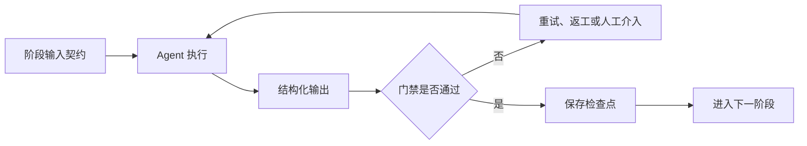
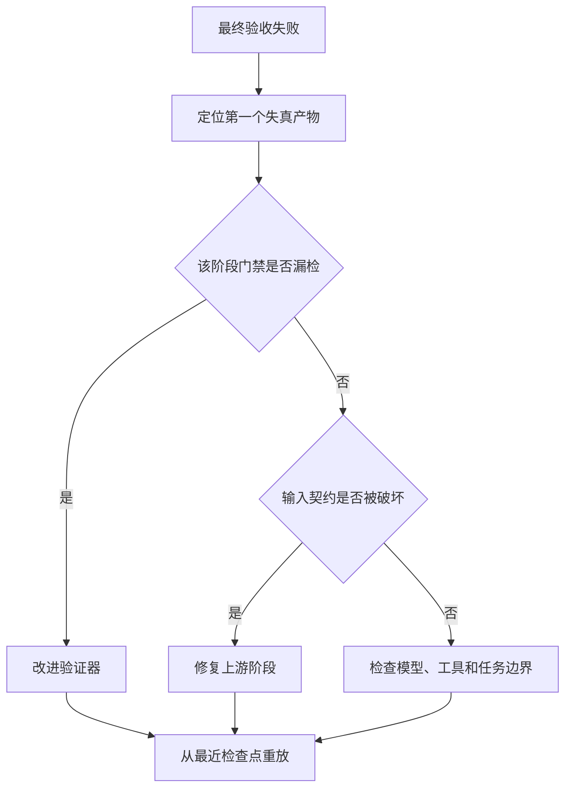

# 专题：Pipeline 流水线拓扑的现代实现

> Pipeline（流水线）不是简单地把多个 Agent 排成一行。一个可用于长期运行的流水线还需要类型化产物、阶段门禁、检查点、失败恢复、背压和可观测性。本页重点整理 2024–2026 年 Agent Workflow（智能体工作流）的自动生成、优化和分布式运行进展。

## 学习准备：先认清本页术语

| 英文术语 | 中文说法 | 含义 |
|---|---|---|
| Pipeline | 流水线 | 任务按预定阶段依次处理，每一阶段消费上游产物并产生下游产物。 |
| Stage gate | 阶段门禁 | 只有输出满足验收条件，流程才进入下一阶段。 |
| Checkpoint | 检查点 | 持久化阶段状态，使失败后可以从最近完成处恢复。 |
| Backpressure | 背压 | 下游处理不过来时限制上游继续产生任务。 |
| Workflow search | 工作流搜索 | 自动修改节点、边或提示词，通过执行反馈寻找更好的流程。 |

<!-- learning-path:start -->
<div class="learning-path">
<div class="learning-path-title">本页怎么学</div>
<div class="learning-path-step"><span>1</span><div>先区分“顺序函数调用”和具备契约、门禁与恢复能力的流水线。</div></div>
<div class="learning-path-step"><span>2</span><div>再理解 2024–2026 年工作流自动生成、搜索优化与高性能运行的新进展。</div></div>
<div class="learning-path-step"><span>3</span><div>最后用代码把阶段结果、检查点和失败策略连成可测试流程。</div></div>
</div>
<!-- learning-path:end -->

---

## 1. 从线性调用升级为阶段协议


最小流水线只有一条固定顺序：需求分析 → 设计 → 实现 → 测试 → 评审。现代实现把每个箭头变成可校验协议：



读图时重点看：阶段完成不是 Agent 自己说“完成了”，而是输出经过独立门禁并保存检查点。

一个阶段至少声明：输入类型、输出类型、执行角色、验收器、超时、重试策略和失败去向。这样上游错误会在当前阶段暴露，而不是一路传到最终交付。

---

## 2. 2024–2026：流水线正在从人工编排走向自动优化


| 工作 | 时间与状态 | 对 Pipeline 的新贡献 | 使用边界 |
|---|---|---|---|
| [AutoFlow](https://arxiv.org/abs/2407.12821) | 2024，arXiv，公开代码 | 用自然语言程序表示工作流，并以微调或上下文方式生成、迭代优化 | 自动生成后仍需验收与沙箱 |
| [AFlow](https://arxiv.org/abs/2410.10762) | 2024，arXiv，MetaGPT 代码生态 | 把代码化工作流优化转成搜索问题，用蒙特卡洛树搜索与执行反馈修改流程 | 搜索成本和评测器质量决定结果 |
| [Automated Design of Agentic Systems](https://openreview.net/forum?id=t9U3LW7JVX) | ICLR 2025 会议论文 | Meta Agent Search 自动编写和积累新的 Agentic System 设计 | 自动设计扩大了安全与验证范围 |
| [AAFLOW](https://arxiv.org/abs/2605.02162) | 2026，arXiv 预印本 | 用算子抽象、零拷贝数据面、确定性调度和异步批处理提高流水线规模与复现性 | 重点是数据与运行时效率，不是推理正确性 |

这些工作形成两条路线：一条优化“流程长什么样”，另一条优化“流程怎样高效、稳定地运行”。二者不能互相替代。

---

## 3. 一个带契约和检查点的教学实现


下面代码是教学实现，不是上述论文仓库的原始代码。

```python
from dataclasses import dataclass
from typing import Any, Callable

@dataclass
class StageResult:
    stage: str
    artifact: dict[str, Any]
    passed: bool
    reason: str = ""

@dataclass
class Stage:
    name: str
    run: Callable[[dict[str, Any]], dict[str, Any]]
    validate: Callable[[dict[str, Any]], tuple[bool, str]]
    max_attempts: int = 2

class CheckpointPipeline:
    def __init__(self, stages: list[Stage], checkpoint_store):
        self.stages = stages
        self.checkpoint_store = checkpoint_store

    def execute(self, initial: dict[str, Any]) -> StageResult:
        artifact = initial
        for stage in self.stages:
            for attempt in range(stage.max_attempts):
                artifact = stage.run(artifact)
                passed, reason = stage.validate(artifact)
                self.checkpoint_store.save(stage.name, artifact, passed, reason)
                if passed:
                    break
            else:
                return StageResult(stage.name, artifact, False, reason)
        return StageResult("complete", artifact, True)
```

<div class="code-explanation"><div class="code-explanation-title">Python 代码说明</div><p><strong>用途：</strong>把执行、验收、重试和检查点变成流水线的一等结构。<strong>执行过程：</strong>每个阶段产生新产物后立即校验并持久化；在最大尝试次数内通过才进入下一阶段，否则返回失败阶段。<strong>关键点：</strong>这是教学实现；生产系统还要处理幂等、并发、版本、补偿事务和检查点安全。</p></div>

---

## 4. 什么时候仍然应该使用固定流水线


固定 Pipeline 适合步骤稳定、合规要求清楚、产物可以逐阶段验收的任务，例如软件发布、数据报表、文档审批和批量内容处理。它的优势不是“更聪明”，而是执行路径可预测、可回放、可比较。

不应使用纯流水线的信号：任务类型变化很大、需要频繁探索、多个阶段可并行、下游经常要求回到不同上游，或无法提前定义阶段门禁。此时应升级为 Graph，或者在 Pipeline 外加 Supervisor。

---

## 5. 评测流水线，而不是只评测最终答案


至少记录：阶段通过率、首次通过率、平均重试数、阶段成本、P95 延迟、返工来源、检查点恢复成功率，以及移除该阶段后的端到端质量变化。A/B 测试时应比较“固定流水线、自动优化工作流、单 Agent”三类基线。

### 图文对照：流水线故障定位



读图时重点看：调试应寻找“第一个产生错误状态的阶段”，而不是只看最后一个 Agent 的输出。

---

<!-- chapter-check:start -->
## 专题自检
<div class="chapter-check"><div class="chapter-check-title">不看正文，尝试回答</div><ul>
<li>为什么顺序调用五个 Agent 还不能算生产级流水线？</li>
<li>AFlow 与 AAFLOW 分别更关注流程设计还是运行时执行？</li>
<li>阶段门禁与检查点怎样共同缩小失败后的返工范围？</li>
<li>什么时候应该从 Pipeline 升级到 Graph 或 Supervisor？</li>
</ul></div>
<!-- chapter-check:end -->
