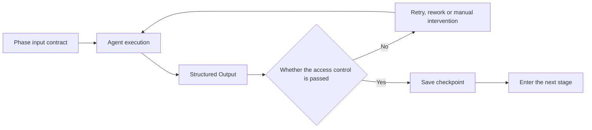
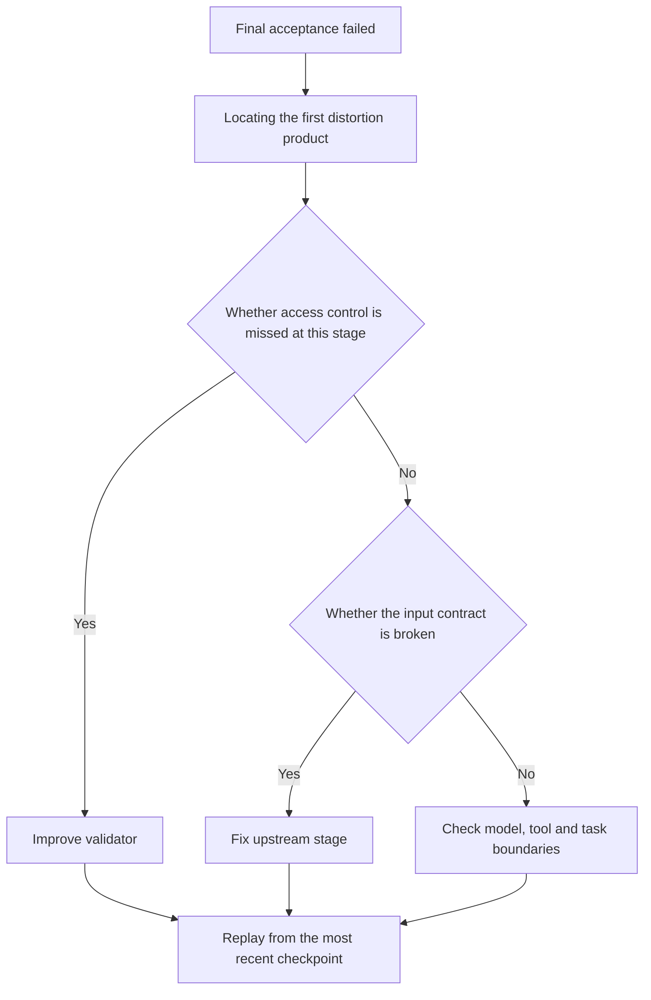

# Special topic: Modern implementation of Pipeline pipeline topology

> Pipeline is not simply lining up multiple Agents in a line. A long-running pipeline also requires typed artifacts, stage gating, checkpointing, failure recovery, backpressure, and observability. This page focuses on organizing the progress of automatic generation, optimization and distributed operation of Agent Workflow from 2024 to 2026.

## Study preparation: First understand the terms on this page

| Term | Working definition | Meaning |
|---|---|---|
| Pipeline | Pipeline | Tasks are processed in sequence according to predetermined stages. Each stage consumes upstream products and produces downstream products. |
| Stage gate | Stage gate | Only when the output meets the acceptance conditions will the process enter the next stage. |
| Checkpoint | Checkpoint | Persistence phase state so that you can recover from the most recent completion after failure. |
| Backpressure | Backpressure | Restricts the upstream from continuing to generate tasks when the downstream cannot process it. |
| Workflow search | Workflow search | Automatically modify nodes, edges or prompt words to find better processes through execution feedback. |

<!-- learning-path:start -->
<div class="learning-path">
<div class="learning-path-title">How to learn on this page</div>
<div class="learning-path-step"><span>1</span><div> First distinguish between "sequential function calls" and pipelines with contract, access control and recovery capabilities. </div></div>
<div class="learning-path-step"><span>2</span><div>Reunderstanding the new advances in workflow automatic generation, search optimization and high-performance operation in 2024–2026. </div></div>
<div class="learning-path-step"><span>3</span><div>Finally, use code to connect the stage results, checkpoints and failure strategies into a testable process. </div></div>
</div>
<!-- learning-path:end -->

---

## 1. Upgrade from linear call to stage protocol


The minimum pipeline has only one fixed sequence: requirements analysis → design → implementation → testing → review. Modern implementations turn each arrow into a verifiable protocol:



When reading the picture, pay attention to this: when the stage is completed, it is not that the Agent itself says "completed", but that the output passes through independent access control and saves the checkpoint.

A stage declares at least: input type, output type, execution role, acceptor, timeout, retry strategy and failure destination. This way upstream errors are exposed at the current stage rather than being propagated all the way to final delivery.

---

## 2. 2024–2026: The pipeline is moving from manual orchestration to automatic optimization


| Work | Time and Status | New Contributions to Pipeline | Working with Boundaries |
|---|---|---|---|
| [AutoFlow](https://arxiv.org/abs/2407.12821) | 2024, arXiv, open code | Use natural language programs to represent workflows, and generate and iteratively optimize in a fine-tuning or contextual manner | Acceptance and sandboxing are still required after automatic generation |
| [AFlow](https://arxiv.org/abs/2410.10762) | 2024, arXiv, MetaGPT code ecology | Convert coded workflow optimization into a search problem, use Monte Carlo tree search and execution feedback modification process | Search cost and evaluator quality determine the results |
| [Automated Design of Agentic Systems](https://openreview.net/forum?id=t9U3LW7JVX) | ICLR 2025 Conference Paper | Meta Agent Search automatically writes and accumulates new Agentic System designs | Automated design expands security and verification scope |
| [AAFLOW](https://arxiv.org/abs/2605.02162) | 2026, arXiv preprint | Use operator abstraction, zero-copy data plane, deterministic scheduling and asynchronous batch processing to improve pipeline scale and reproducibility | The focus is on data and runtime efficiency, not on inference correctness |

These tasks form two routes: one optimizes "what the process looks like" and the other optimizes "how the process runs efficiently and stably." The two cannot be substituted for each other.

---

## 3. A teaching implementation with contracts and checkpoints


The following code is a teaching implementation, not the original code of the above paper warehouse.

```python
from dataclasses import dataclass
from typing import Any, Callable

@dataclass
class StageResult:
    stage: str
    artifact: dict[str, Any]
    passed: bool
    reason: str = ""

@dataclass
class Stage:
    name: str
    run: Callable[[dict[str, Any]], dict[str, Any]]
    validate: Callable[[dict[str, Any]], tuple[bool, str]]
    max_attempts: int = 2

class CheckpointPipeline:
    def __init__(self, stages: list[Stage], checkpoint_store):
        self.stages = stages
        self.checkpoint_store = checkpoint_store

    def execute(self, initial: dict[str, Any]) -> StageResult:
        artifact = initial
        for stage in self.stages:
            for attempt in range(stage.max_attempts):
                artifact = stage.run(artifact)
                passed, reason = stage.validate(artifact)
                self.checkpoint_store.save(stage.name, artifact, passed, reason)
                if passed:
                    break
            else:
                return StageResult(stage.name, artifact, False, reason)
        return StageResult("complete", artifact, True)
```

<div class="code-explanation"><div class="code-explanation-title">Python code description</div><p><strong>Purpose: </strong> Turn execution, acceptance, retry and checkpoint into first-class structures of the pipeline. <strong> Execution process: </strong> After each stage generates a new product, it is immediately verified and persisted; it must pass within the maximum number of attempts to enter the next stage, otherwise it will return to the failure stage. <strong> Key Points: </strong> This is a tutorial implementation; production systems also deal with idempotence, concurrency, versioning, compensating transactions, and checkpoint safety. </p></div>

---

## 4. When should you still use fixed pipelines?


Fixed Pipeline is suitable for tasks with stable steps, clear compliance requirements, and products that can be accepted step by step, such as software release, data reporting, document approval, and batch content processing. Its advantage is not that it is "smarter", but that its execution paths are predictable, replayable, and comparable.

Purely pipelined signals should not be used: task types vary greatly, require frequent exploration, multiple stages can be parallelized, downstream often requires returning to different upstreams, or stage gates cannot be defined in advance. At this time, you should upgrade to Graph, or add Supervisor to Pipeline.

---

## 5. Evaluate the pipeline, not just the final answer


At a minimum, record: stage pass rate, first time pass rate, average number of retries, stage cost, P95 latency, sources of rework, checkpoint recovery success rate, and the end-to-end quality change after removing the stage. During A/B testing, three types of baselines should be compared: "fixed pipeline, automatic optimization workflow, and single agent".

### Picture and text comparison: Assembly line fault location



When reading the picture, pay attention to: debugging should look for "the first stage that generates an error state" instead of just looking at the output of the last Agent.

---

<!-- chapter-check:start -->
## Special topic self-examination
<div class="chapter-check"><div class="chapter-check-title"> Without reading the text, try to answer </div><ul>
<li>Why is calling five Agents in sequence not considered a production-level pipeline? </li>
<li> AFlow and AAFLOW respectively focus more on process design or runtime execution? </li>
<li>How do stage access control and checkpoints work together to reduce the scope of rework after failure? </li>
<li>When should you upgrade from Pipeline to Graph or Supervisor? </li>
</ul></div>
<!-- chapter-check:end -->
