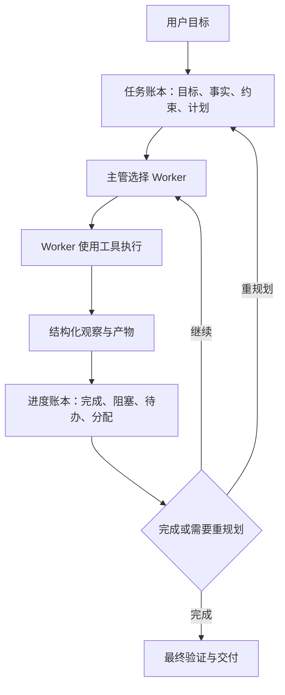
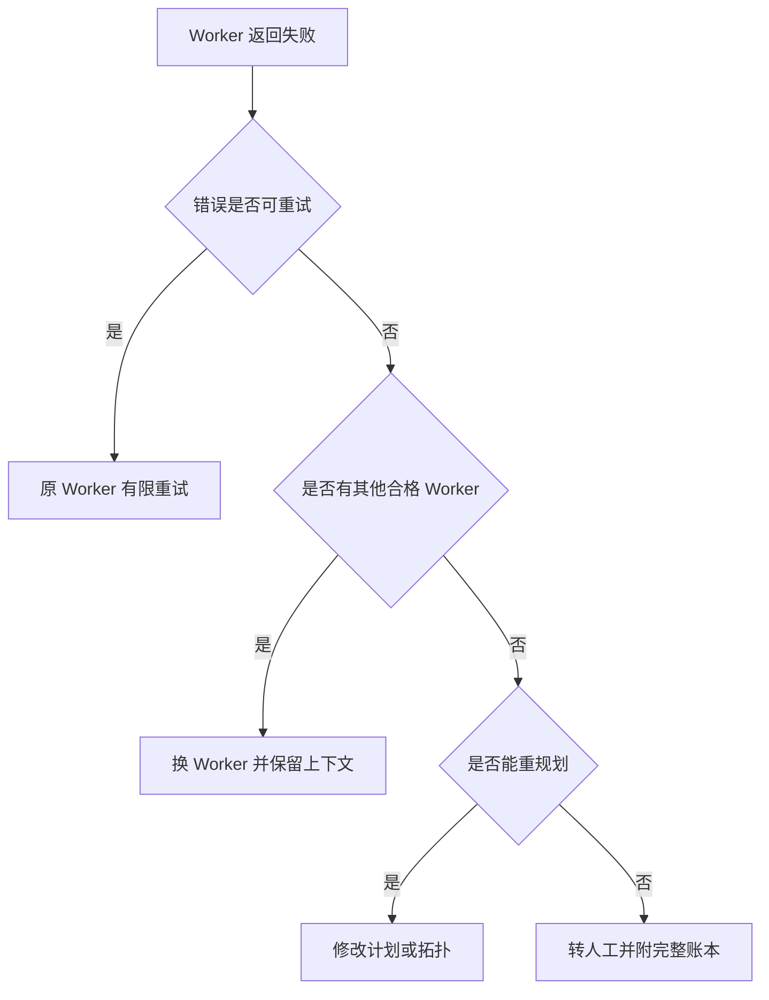

# 专题：Supervisor 主管制拓扑与现代编排器

> Supervisor（主管）不是一个更长的系统提示词，而是持有任务状态、选择 Worker、验证结果并在失败后重规划的控制层。2024–2026 年的重点变化，是从“每轮问模型下一步给谁”转向任务账本、进度账本、能力注册、预算约束和可恢复调度。

## 学习准备：先认清本页术语

| 英文术语 | 中文说法 | 含义 |
|---|---|---|
| Supervisor / Orchestrator | 主管 / 编排器 | 负责规划、分派、追踪、重规划与结束判定的控制角色。 |
| Worker | 执行智能体 | 具有特定工具或专业能力、完成被分配任务的 Agent。 |
| Task ledger | 任务账本 | 保存目标、事实、约束和任务计划的稳定状态。 |
| Progress ledger | 进度账本 | 保存当前完成项、待办、阻塞和角色分配的动态状态。 |
| Replanning | 重规划 | 观察执行结果后更新任务分解、角色分配或终止条件。 |

<!-- learning-path:start -->
<div class="learning-path"><div class="learning-path-title">本页怎么学</div>
<div class="learning-path-step"><span>1</span><div>先看主管怎样用账本连接计划、分派、观察和重规划。</div></div>
<div class="learning-path-step"><span>2</span><div>再核对 Magentic-One、资源分配研究和当前框架状态。</div></div>
<div class="learning-path-step"><span>3</span><div>最后实现带能力过滤、预算和升级路径的最小编排器。</div></div>
</div>
<!-- learning-path:end -->

---

## 1. 主管制真正控制什么




读图时重点看：主管不是转发消息，而是在两个账本之间持续维护“计划”和“执行现实”的差异。

主管负责控制权，不应复制 Worker 的专业能力。Coder 负责写代码，WebSurfer 负责浏览器，主管只决定谁在何时做什么、结果是否足以继续。

---

## 2. Magentic-One：主管制的可核验实例


[Magentic-One](https://arxiv.org/abs/2411.04468)在 2024 年提出由 Orchestrator 领导的通用多 Agent 系统：主管规划、跟踪进度并重规划，专业 Agent 负责网页、文件和代码任务。Microsoft Research 的[架构说明](https://www.microsoft.com/en-us/research/articles/magentic-one-a-generalist-multi-agent-system-for-solving-complex-tasks/)明确展示外层任务账本与内层进度账本。

[官方 AutoGen 仓库](https://github.com/microsoft/autogen)目前说明 AutoGen 已进入维护模式，新项目被建议转向 Microsoft Agent Framework；Magentic-One 仍可通过 AgentChat 中的 MagenticOneGroupChat 使用。专题引用因此同时保留论文结构和当前项目状态，避免把 2024 年实现当成 2026 年唯一推荐入口。

---

## 3. 主管选择 Worker 时不能只看名字


[Self-Resource Allocation in Multi-Agent LLM Systems](https://arxiv.org/abs/2504.02051)研究 Planner 与 Orchestrator 的任务分配，并报告显式 Worker 能力信息有助于处理能力较弱的 Worker。这说明主管至少需要一个能力注册表。

下面代码是教学实现：

```python
from dataclasses import dataclass, field

@dataclass
class WorkerProfile:
    name: str
    capabilities: set[str]
    permissions: set[str]
    active_tasks: int = 0
    success_by_task: dict[str, float] = field(default_factory=dict)

def eligible_workers(task: dict, workers: list[WorkerProfile]) -> list[WorkerProfile]:
    required = set(task["capabilities"])
    permission = task["required_permission"]
    return [
        worker for worker in workers
        if required <= worker.capabilities
        and permission in worker.permissions
        and worker.active_tasks < task.get("max_worker_load", 3)
    ]
```

<div class="code-explanation"><div class="code-explanation-title">Python 代码说明</div><p><strong>用途：</strong>在模型路由前用硬条件筛选有资格的 Worker。<strong>执行过程：</strong>函数同时检查任务能力集合、所需权限和当前负载，只把合法候选交给主管继续排序。<strong>关键点：</strong>这是教学实现；不可见的 Worker 仍需在执行端再次授权，历史成功率也应按任务类型校准。</p></div>

---

## 4. 带账本、预算和升级路径的最小主管


```python
@dataclass
class SupervisorState:
    objective: str
    plan: list[str]
    completed: list[str] = field(default_factory=list)
    blockers: list[str] = field(default_factory=list)
    attempts: dict[str, int] = field(default_factory=dict)
    spent_usd: float = 0.0
    budget_usd: float = 5.0

def next_control_action(state: SupervisorState) -> str:
    if state.spent_usd >= state.budget_usd:
        return "ask_human"
    if any("permission" in blocker.lower() for blocker in state.blockers):
        return "ask_human"
    remaining = [step for step in state.plan if step not in state.completed]
    if not remaining:
        return "verify_final"
    step = remaining[0]
    if state.attempts.get(step, 0) >= 2:
        return "replan"
    return "dispatch"
```

<div class="code-explanation"><div class="code-explanation-title">Python 代码说明</div><p><strong>用途：</strong>把预算、权限阻塞、完成判定和重规划写成主管外部的控制规则。<strong>执行过程：</strong>预算或权限问题转人工，无剩余任务进入最终验证，同一步失败两次触发重规划，其余情况才继续分派。<strong>关键点：</strong>主管模型可以提出建议，但这些停止和升级条件应由确定性运行时执行。</p></div>

---

## 5. 主管制的最新工程重点


| 重点 | 现代做法 |
|---|---|
| 状态漂移 | 把事实、计划、进度和阻塞写进结构化账本 |
| 单点瓶颈 | 硬规则预筛选、并行 Worker、分层主管或局部自治 |
| 错误恢复 | 明确重试、换 Worker、重规划、转人工四种路径 |
| 能力路由 | 结合工具、权限、历史成功率、负载和任务类型 |
| 可观测性 | 记录每次路由依据、账本差异、成本和最终归因 |

Agent-E 的[公开研究页](https://openreview.net/forum?id=7PQnFTbizU)也采用层级架构与变化观察处理长程网页任务，可作为“高层规划者 + 专业执行者”的相邻参考，但它主要是 Web Agent，而不是通用多 Agent 主管基准。

---

## 6. 何时不该使用单一主管


如果所有 Worker 都必须把完整结果回传主管，任务规模增长后会出现上下文瓶颈。多源证据发现可使用 Blackboard；稳定阶段可降级为 Pipeline；复杂条件和恢复路径可使用 Graph；规模更大时可采用分层主管，但必须明确每层拥有的状态和裁决权。

### 图文对照：主管故障的升级路径



读图时重点看：失败处理是有限状态机，不是把同一错误重新发给同一主管模型。

---

<!-- chapter-check:start -->
## 专题自检
<div class="chapter-check"><div class="chapter-check-title">不看正文，尝试回答</div><ul>
<li>任务账本和进度账本分别保存什么？</li>
<li>为什么 Worker 筛选必须先做能力和权限硬检查？</li>
<li>Magentic-One 的主管为什么不等于普通路由函数？</li>
<li>什么时候应改用 Blackboard、Pipeline 或 Graph？</li>
</ul></div>
<!-- chapter-check:end -->
