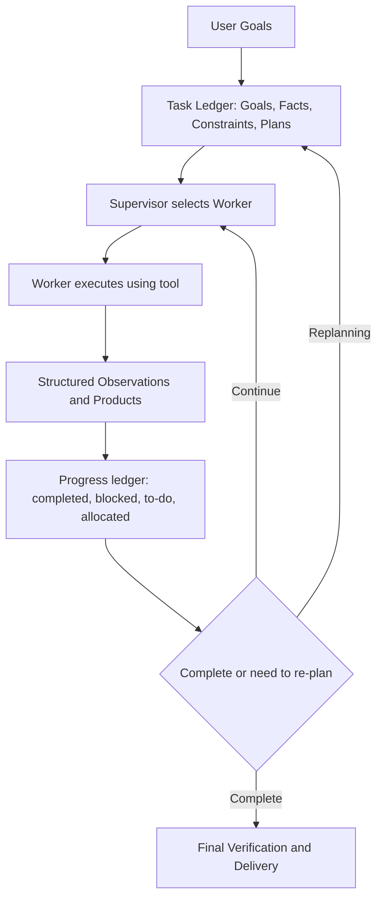
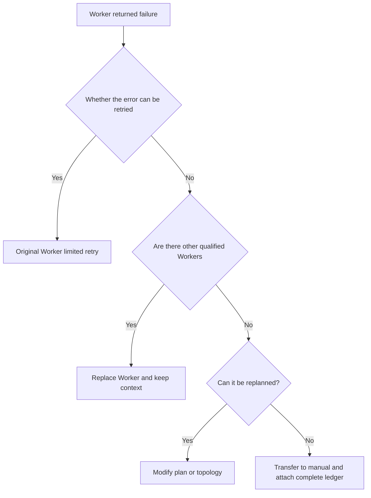

# Special Topic: Supervisor Supervisor Topology and Modern Orchestrators

> Supervisor is not a longer system prompt word, but a control layer that holds task status, selects workers, verifies results, and reschedules after failure. The key change in 2024–2026 is from "asking the model who to give next in each round" to task ledger, progress ledger, capacity registration, budget constraints and recoverable scheduling.

## Study preparation: First understand the terms on this page

| Term | Working definition | Meaning |
|---|---|---|
| Supervisor / Orchestrator | Supervisor / Orchestrator | Control role responsible for planning, dispatching, tracking, re-planning and closing decisions. |
| Worker | Execution agent | Agent with specific tools or professional abilities to complete assigned tasks. |
| Task ledger | Task ledger | Saves a stable state of goals, facts, constraints, and task plans. |
| Progress ledger | Progress ledger | Saves the dynamic status of currently completed items, to-dos, blocks, and role assignments. |
| Replanning | Replanning | Update task decomposition, role assignment, or termination conditions after observing the execution results. |

<!-- learning-path:start -->
<div class="learning-path"><div class="learning-path-title">How to learn on this page</div>
<div class="learning-path-step"><span>1</span><div> Let’s first see how the supervisor uses the ledger to connect planning, allocation, observation and re-planning. </div></div>
<div class="learning-path-step"><span>2</span><div>Recheck Magentic-One, resource allocation studies, and current framework status. </div></div>
<div class="learning-path-step"><span>3</span><div>Finally implement a minimal orchestrator with capability filtering, budgeting and upgrade paths. </div></div>
</div>
<!-- learning-path:end -->

---

## 1. What does supervisory control really control?




When reading the picture, focus on this: The supervisor does not forward the message, but continuously maintains the difference between the "plan" and "execution reality" between the two ledgers.

The supervisor is in control and should not replicate the worker's professional abilities. Coder is responsible for writing the code, WebSurfer is responsible for the browser, and the supervisor only decides who does what when and whether the results are sufficient to continue.

---

## 2. Magentic-One: A verifiable example of supervisory control


[Magentic-One](https://arxiv.org/abs/2411.04468) proposed a general multi-Agent system led by Orchestrator in 2024: Supervisor planning, tracking progress and focusing on planning, professional Agents are responsible for web pages, files and code tasks. Microsoft Research's [Architecture Description](https://www.microsoft.com/en-us/research/articles/magentic-one-a-generalist-multi-agent-system-for-solving-complex-tasks/) clearly displays the outer task ledger and the inner progress ledger.

[Official AutoGen Repository](https://github.com/microsoft/autogen) Currently states that AutoGen has entered maintenance mode, and new projects are recommended to move to Microsoft Agent Framework; Magentic-One can still be used through MagenticOneGroupChat in AgentChat. Topic citations therefore preserve both the paper structure and the current project status, avoiding the 2024 implementation as the only recommended entry point in 2026.

---

## 3. When selecting a Worker, the supervisor cannot just look at the name.


[Self-Resource Allocation in Multi-Agent LLM Systems](https://arxiv.org/abs/2504.02051) Study the task allocation between Planner and Orchestrator, and report explicit Worker capability information to help deal with less capable Workers. This suggests that supervisors need at least a competency registry.

The following code is the teaching implementation:

```python
from dataclasses import dataclass, field

@dataclass
class WorkerProfile:
    name: str
    capabilities: set[str]
    permissions: set[str]
    active_tasks: int = 0
    success_by_task: dict[str, float] = field(default_factory=dict)

def eligible_workers(task: dict, workers: list[WorkerProfile]) -> list[WorkerProfile]:
    required = set(task["capabilities"])
    permission = task["required_permission"]
    return [
        worker for worker in workers
        if required <= worker.capabilities
        and permission in worker.permissions
        and worker.active_tasks < task.get("max_worker_load", 3)
    ]
```

<div class="code-explanation"><div class="code-explanation-title">Python code description</div><p><strong>Purpose: </strong> Use hard conditions to filter qualified Workers before model routing. <strong> execution process: </strong> function simultaneously checks the task capability set, required permissions and current load, and only hands legal candidates to the supervisor to continue sorting. <strong>Key points: </strong>This is a teaching implementation; invisible Workers still need to be authorized again on the execution side, and the historical success rate should also be calibrated by task type. </p></div>

---

## 4. Minimum supervisor with ledger, budget and upgrade path


```python
@dataclass
class SupervisorState:
    objective: str
    plan: list[str]
    completed: list[str] = field(default_factory=list)
    blockers: list[str] = field(default_factory=list)
    attempts: dict[str, int] = field(default_factory=dict)
    spent_usd: float = 0.0
    budget_usd: float = 5.0

def next_control_action(state: SupervisorState) -> str:
    if state.spent_usd >= state.budget_usd:
        return "ask_human"
    if any("permission" in blocker.lower() for blocker in state.blockers):
        return "ask_human"
    remaining = [step for step in state.plan if step not in state.completed]
    if not remaining:
        return "verify_final"
    step = remaining[0]
    if state.attempts.get(step, 0) >= 2:
        return "replan"
    return "dispatch"
```

<div class="code-explanation"><div class="code-explanation-title">Python code description</div><p><strong>Purpose: </strong>Write budget, permission blocking, completion judgment and replanning as external control rules. <strong>Execution process: </strong>Budget or authority issues are transferred to manual work, no remaining tasks enter final verification, two failures in the same step trigger re-planning, and the remaining tasks continue to be dispatched. <strong> Key Point: </strong> The supervisor model can make recommendations, but these stop and upgrade conditions should be enforced by the deterministic runtime. </p></div>

---

## 5. The latest project focus of the supervisory system


| Focus | Modern approach |
|---|---|
| State drift | Write facts, plans, progress and blockages into structured ledgers |
| Single point bottleneck | Hard rule pre-screening, parallel workers, hierarchical supervisors or local autonomy |
| Error recovery | Clarify the four paths of retrying, changing workers, re-planning, and switching to manual |
| Capability routing | Combining tools, permissions, historical success rates, workloads, and task types |
| Observability | Record every routing basis, ledger discrepancy, cost and final attribution |

Agent-E's [Public Research Page](https://openreview.net/forum?id=7PQnFTbizU) also uses a hierarchical architecture and change observation to handle long-range web tasks, and can be used as an adjacent reference for "high-level planners + professional executors", but it is mainly a Web Agent rather than a general multi-agent supervisor benchmark.

---

## 6. When not to use a single supervisor


If all workers must send complete results back to the supervisor, context bottlenecks will occur as the task size grows. Multi-source evidence discovery can use Blackboard; the stable stage can be downgraded to Pipeline; complex conditions and recovery paths can use Graph; when the scale is larger, hierarchical supervisors can be used, but the status and decision rights of each layer must be clear.

### Picture and text comparison: Upgrade path for supervisor failure



When reading the picture, pay attention to this: Failure handling is a finite state machine, and it does not resend the same error to the same supervisor model.

---

<!-- chapter-check:start -->
## Special topic self-examination
<div class="chapter-check"><div class="chapter-check-title"> Without reading the text, try to answer </div><ul>
<li>What are saved in the task ledger and progress ledger respectively? </li>
<li>Why does Worker screening require a hard check on capabilities and permissions first? </li>
<li>Why is Magentic-One's supervisor not equal to the normal routing function? </li>
<li>When should you switch to Blackboard, Pipeline, or Graph? </li>
</ul></div>
<!-- chapter-check:end -->
